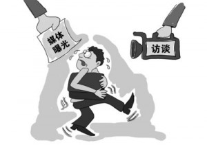

# ＜七星视点＞第三十期——人家的小三，关侬啥事体？：公众人物和他们的私生活

 

# 人家的小三，关侬啥事体？：

# 公众人物和他们的私生活

## 

 

这是一个香艳的网络时代。

几个月前，韩寒被爆美满家庭背后实有第三者，之后又发文希望妻子与小三和平相处，引起了社会热议；接着，万科老总王石的婚变又让网民们热闹了一番。香艳的高潮也许出现于重庆北碚区委书记雷政富12秒的不雅视频上。这段视频不仅使他被革去职务，还令自己遭受了数万网友尖刻的嘲讽和恶搞。

几年来，随着微博在中国的红火，媒体给我们带来了公共话题讨论的便利。然而，现在它似乎已经将讨论范围伸向了“成年人在自己房间里的事务”。我们真的可以热热闹闹地谈论着他人的婚姻问题、甚至男人的尊严问题吗？这是不是对个人隐私的侵犯？我们可以这样曝光身边的普通人吗？如果不能，那么曝光普通人和曝光公众人物有什么区别？在这些问题上，人们似乎分为了旗帜鲜明的两方。本期七星视点中，我们搜集了双方具有代表性的一些观点，希望通过观点的比较，您能找到自己的答案。

 

### 观点辩论

 **正方：认为公众人物应该被曝光并接受监督** **反方：认为公众人物的隐私应该受到保护** 

#### **辩论角度一：当事人的身份**

 正方一辩：[@宫本陶子](http://weibo.com/u/1496137185)：作为名人作为以后想出名当明星的人就要经得住各种曝光爆料考验，那么多明星的穿着家庭一举一动都被媒体和各类杂志曝光，别人怎么没有出来这样指责，作为公众人物一举一动都会被关注，媒体不曝光就没新闻，要出名就只有承受各种压力。 队友补充：[@大夫山人围脖](http://weibo.com/dfsr)：你既然是作为公众人物的名人，在收获社会地位与关注的同时，就必须做好个人隐私被曝光的准备！世间的事哪有两头得利，样样都占便宜的？！ 反方一辩：[@从容吕俊](http://weibo.com/u/2183798914)：媒体炒作王石的私人生活是不是有点过界了？他不是政府官员，也无义务充当社会道德楷模。曝光他的婚姻和财产是否践踏了他的人权？如果每个人都不去尊重别人的权利，为了小利就轻易地利用自己的强势地位去侵犯别人，最终每个人都会成为这种丛林法则的牺牲品。 

曝光私生活是否合理，取决于被曝光人的身份吗？这是争论双方的第一个争论点。从经验来看，媒体曝光的目标大致集中于两类人物上：一是政府官员，二是公众人物。对政府官员的舆论监督已经获得普遍的认同，那么，对公众人物，同等程度的监督又是否适当呢？

我们可以把公众人物分为两类：一是由于自身的职业、地位等在社会具有广大影响力；二是因卷入某一热点事件中而被人们关注。一般认为，前一种公众人物因其相比于普通人来说，由于其可以更方便地利用媒体、社会平台对自己的行为进行解释、辩驳，因此他们应该适当承受更多的公众批评。

但从道义上讲，他们是否应该承受私生活的曝光呢？也许影响社会价值判断的法律判决可以告诉我们一些东西。在范志毅诉《东方体育日报》案的判决书中有这样一段话：

_“媒体行使舆论监督过程中，公众人物对于可能的轻微损害应当予以忍受。明星私事属于社会公众利益的一部分。新闻媒体行使报道与舆论监督的权利并无不当。”_

这段判决告诉我们，公众人物的生活状态由于有着很大的外部性（比如具有一定的示范效应），不论是否心甘情愿，在某种意义上它已经成为了公众利益，需要得到监督。这种监督的确带有不公平性和伤害性，但当事人需要牺牲一些利益来“忍耐”，从而维护社会利益；同时，这种曝光带来的个人损害，也要限制在一定的限度内。

#### **辩论角度二：何为言论自由？**

 反方二辩：[@劉傑精神病想要当学霸](http://weibo.com/u/2605150532)：针对这几天的王石婚变，我只想说，那是人家的私事，任何人不应该去评价。至于各种联想，纯属吃饱了没事做，闲扯淡，尤其是最先曝光的人，最无耻。王石虽是公众人物，但终究是人，有自己的隐私。中国的网民有时确实利用网络做了好事，但很多情况下，却是一种愚昧，往往成为谣言的滥觞，被人利用而不知。 队友补充：[@王利芬](http://login.sina.com.cn/sso/login.php?url=http%3A%2F%2Fweibo.com%2Fwanglifen&_rand=1354943671.8593&gateway=1&service=miniblog&entry=miniblog&useticket=1&returntype=META)：一个尊重他人尊重别人隐私的习惯是一个人文明水准的试金石，如果微博成了隐私揭发地，道德评判的至高点，受害的都是自已。没有哪个人的隐私敢说经得起大众百般考量。让微博这个不易之物为民众的公共利益、为弱者的声音发出、为域外新鲜空气的呈现谋利吧，哪怕成为公司营销平台、调侃的场所也不错。 正方二辩：刘枭：我们为什么可以批评一位公众人物的私生活方式？1、公众人物的私生活并不完全是“私”的，它具有一定的社会影响力，需要社会舆论来制衡；2、个人的批评与公权力的强制有本质区别，批评不等于审判，不具有强制力；3、社会舆论的批评是形成社会价值观的重要方式，各种声音都应当有表达的平台；4、这也是多远与开放社会的重要特征。 

面对具有争议的话题，最为合理的态度是，允许批评，并允许对批评进行反批评，而不是一看到有人批评，立马急红了眼，大声骂“傻逼”，这是一种自爆其短的行为。在多元开放的社会中，允许各种批评，也允许对批评进行反制，大家在舆论上一较高下，而非以“这是私生活，不容其他人置喙”为由，禁止与阻止批评的声音。

对他人私生活的曝光是言论自由吗？我们有权批评他人的生活方式吗？在正反方不同的观点中，实质体现出了一个问题：何为真正的言论自由？

维护言论自由，重要目的之一是使人们发现真相。“真理只有在言论市场中才能得到检验”，因此，我们需要保护不同的声音。但与此同时，很多被社会认为过激、带有攻击性的言论不可避免地诞生了。我们无法排除它们：由于思想带有深深的时代性，一个时期被人们视作过激、不当的言论，在下一时期可能就成为共识；不同人对于对错标准也有不同的看法。因此，为了使可能正确的言论不被不恰当地牺牲，我们不得不放宽标准，最大限度地保护它们。

然而，批评、监督的权利虽然是公民权利，但公众人物作为一个人，同样也有不可侵犯的隐私权和名誉权。在这两种权利冲突的时候，如何寻找一个平衡点，就是媒体和公众所面临的一个难题。在《纽约时报》诉沙利文案中，媒体获得了最终的胜利。最高法院的大法官们在判决书中写到:

_“政府官员名誉受损，并不意味着我们要以压制自由言论为代价进行救济。”_

_“对公共事务的讨论应当不受抑制、充满活力并广泛公开，它很可能包含了对政府或官员的激烈、刻薄，甚至尖锐的攻击。”_

但是，在“沙利文”案后，起诉媒体诽谤的案件仍越来越多，标的额也越来越大，媒体对公众人物的报道越发不留情面，谩骂、攻击屡见不鲜。而面对质疑，很多媒体却用“言论自由”将自己裹得严严实实。同时，媒体的声誉开始逐渐下滑，人们不满媒体胡编乱造、夸大事实：滥用保护伞，也使得媒体陷入指责之中。

言论自由不是免费的晚餐。它不但要靠每个人的争取，从某种程度上，还更需要每个人小心翼翼地呵护。滥用自由只会给自由带来更大的威胁。“若自由无限制，则自由无意义”。很多人口中反复着谈着“要自由要自由”，但殊不知，自由的精髓在于如何合理控制自由。只有懂得小心翼翼地驾驭才能长久地拥有。

但从另一个角度来看，容忍异己的言论也是社会成熟的重要标志。如果未来“有幸”出现一个喧嚣纷杂、哗众取宠的媒体界，我们就将其当作一个社会成长所必经的过程吧。就像胡适曾说的，“宽容比自由更重要”。

不同方式曝光方式：媒体自由的两种产物

#### **其他观点**

观众发言一：[@郭君平](http://login.sina.com.cn/sso/login.php?url=http%3A%2F%2Fweibo.com%2Fguojunping1975&_rand=1354943712.0208&gateway=1&service=miniblog&entry=miniblog&useticket=1&returntype=META)：事情越说越玄了，不过我觉得，作为公众人物，还是气量大一点好。不像我们升斗小民，有隐私也无人理睬。名人平常享受着普通人难以享受到的心理优越感，到了隐私曝光的时候，不如学学王石，堵不如疏。 观众发言二[@feifeifeifeiisalone](http://weibo.com/u/2439216040):评价一个企业家……首先我们看他有没有最大化股东权益，进一步有没有最大化stakeholders权益。至于他结婚离婚，和我们有什么关系呢？ 观众发言三：[@岳小困](http://weibo.com/yw1224)：从毛时代开始，我们这个社会就热衷于制造偶像并将其塑造为神一般的存在，让大众都忘记了偶像也只是个普通人。这次韩寒小三事件，众多少女的玻璃心又碎了一地，殊不知偶像就是拿来毁的。这世上本就没有什么完美。真正成熟的人，才能学会接受不完美中的完美。 

人家的小三，到底关不关你的事儿？你找到答案了吗？

 

（编辑：李靖恒，刘迎；责编：张舸）

 
