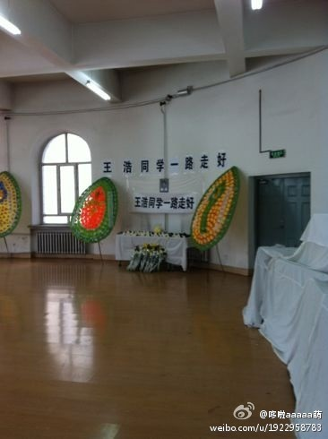
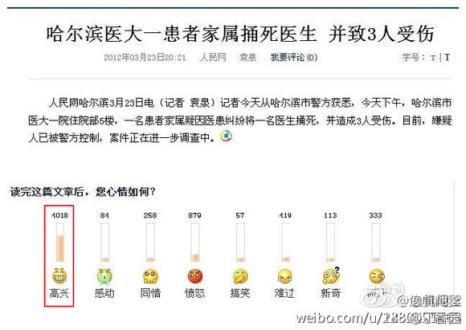
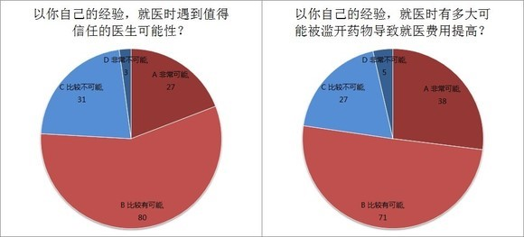
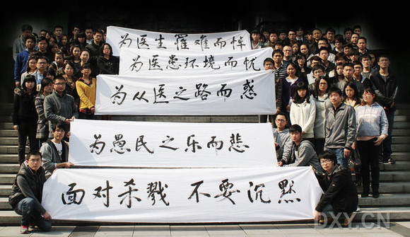

# ＜七星视点＞第二十一期-----惯看白衣染血时:体制里的冤魂

**2012年3月23日,哈尔滨医科大学附属第一医院患者刺杀医生事件震惊全国，本应该互相信任的医患关系在中国已至如斯地步，于是我们今天必须要问，究竟是什么原因，使一个人在寻求医疗的时候，不把面前的医生看成可以托付生命的人，甚至不看成活生生的人，而是看成与自己敌对的一种利益集团的象征物呢？**  

# ＜七星视点＞第二十一期

## 惯看白衣染血时:体制里的冤魂

 

#### “对不起，不能当你的伴郎了“

2012年3月23日16时30分左右，一名男子闯入哈尔滨医科大学附属第一医院风湿免疫科医生办公室，持水果刀刺伤办公室内4名医生后逃跑。伤者中，哈医大2009级硕士研究生王浩被刺中甲状软骨上方，导致失血性休克，因抢救无效不幸遇难，医生郑一宁、王宇、于惠铭正在医院救治，已无生命危险。目前，犯罪嫌疑人李梦南已被警方控制。

据报道，犯罪嫌疑人李梦南因患强直性脊柱炎，于23日9时到哈医大一院就诊。因其同时患有肺结核，治疗强直性脊柱炎会对肺部造成影响，医生建议他先治好肺结核后再治疗强直性脊柱炎。李梦南对此心生不满，于案发当日16时许，购买一把水果刀，来到医生办公室将4名医务人员捅伤后逃跑，在医院急诊室被赶来的民警抓获。

 [@Mickey-Liu](http://rrurl.cn/h0pRkg)（遇害医生王浩同学）：关于王浩，我们并没有太多时间交流，就是这样一起摸爬滚打基础，临床，几十门考试下来，只是吃过一些饭，在一起自习过，但医学生之间的友谊往往超越距离，年代，一句你是几期生就足够让我们温暖，试问这样在你生命中最珍贵的时光一起度过的兄弟，一瞬间就无法在睁开双眼，是什么样的感觉？ 

在三名幸免于难的医生中，受伤最严重的是风湿免疫科医生王宇，刀从右眼角刺入，造成眼球外伤，颅内血肿，经抢救，所幸保全眼球。

 [@记得要锁门啊](http://rrurl.cn/eAA0ck)（受害医生同学）：刀从右眼角刺入，颅内血肿。一名年轻优秀的医生正躺在手术台上。眼科、脑外、骨科、整形科，手术间里气氛凝重！……这个年轻的生命可能，再也没有勇气穿上白服了。做自己喜欢的职业，却换来冰冷的一刀。 @bigeyesdong（哈医大一院外科住院总医师）：一路转诊，喘不过气来。他们科里的医生、研究生，大都是弱不禁风的女子，我故作镇定，装着一切尽在掌控，实际已经毫无信心。直到抬到手术台上，他还苦笑着对我说：“对不起，不能当你的伴郎了”。心如刀绞，就是这样的感觉。等到麻醉妥当，接到同寝室兄弟的电话，眼泪终于决堤一般，哽咽着说不出地址…… 

#### “不要在办公室背对门坐”

从何时开始，医生变成了一个高危职业？

据卫生部统计，2002年全国发生严重扰乱医疗秩序事件5093件，打伤医务人员2604人，医院财产损失6709万元，而到2006年，此类事件增加到9831件，打伤医务人员5519人，医院财产损失达2亿多元。

中华医院管理学会的调查指出，2007年全国内地有73.33%的医院出现暴力医闹殴打、威胁、辱骂医务人员；59.63%的医院发生过因病人对治疗结果不满意，聚众在医院内围攻、威胁院长人身安全；35.56%的医院发生过病人因对治疗结果不满意，聚众到医务人员或院长家中威胁人身安全；76.67%的医院发生过患者在诊疗结束后拒绝出院，且不交纳住院费用；61.48%的医院发生过医闹在院内摆花圈、设灵堂、烧冥纸等。

而较之以往种种，这次的事件更为令人震惊的是，**患者在还没有接受任何治疗的时候，仅仅出于对医生治疗建议的不满，便大开杀戒，况且针对的是整个科室的医生，不管他们之前与患者有无接触。这甚至都算不上“医患纠纷”，因为连纠纷都没有。**

 [@丁香园](http://rrurl.cn/5D4QjN)：据悉，王浩医生未对凶手进行过任何诊疗，只是因为正好坐在门口，被割到颈动脉当初身亡。还有谁说“不要在办公室背对门坐”这样的指南是狗皮膏药？ [@咄咄劈人李清晨](http://rrurl.cn/djpN8i)：天堂里没有医闹……活着的，在国内当医生的，仍要继续坚韧地活着，不努力发声争取权益，改善这个大环境，下一个倒霉的，又将是谁？ [@咄咄劈人李清晨](http://rrurl.cn/djpN8i)：哥哥以前总劝你学成归国，归他妈的蛋！永远不要回来！ 

#### ** “如果还有历史的话”**

当天，在这样一条新闻——一条并未涉及事情的前因后果，而仅仅是一句话的新闻——下面，出现了如此的心情。

[@丁香园](http://rrurl.cn/p0ck13)：这幅图一定会载入中国历史，如果还有历史的话。 

而这样的声音，又何止于此？

 @***(匿名网友，下同）：在医院横怎么啦？医生就了不起啦。如果要是我的话，管我要钱，和我装爷爷。我打的他妈都不认识他！ @***：那证明人民眼睛是雪亮的，知道什么人该杀，什么人不该杀！哈哈！ @***：我和老人做胃镜，护士因为3倍价格差极力推荐全麻胃镜，开始后我用手机搜索，发现60岁以上因安全问题不推荐全麻，当时如果有意外，我必杀那几个医护人员。这样说并非我对他们仇恨，而是体制使然。 @***：只能说现在的医生太黑了，没办法才拼命啊！ @***：事实上，做医生的，尤其是在东北地区做医生的诸位，你们自己扪心自问一下，你们做的怎么样？先不说红包药品回扣这些，就你们对普通百姓病人的那副嘴脸，你们照过镜子没？ 

如果还有历史的话。

所幸，在一片叫好之中，也有不同的声音。

 [@王志安](http://rrurl.cn/8yxA5Q)：人病了，医生或可治，社会病了，医生没办法。 [@张泉灵](http://rrurl.cn/j3tp6k)：哈医大发生砍杀医生事件，让人唏嘘。他们从事的是高风险职业，他们每天面对在承受病痛的不快乐的人，他们是有问题的医疗医保体制的替罪羊，他们的灰色收入话题被放大到遮盖住他们的敬业付出的努力。如果偶尔出现的偏执狂，还是他们需要面对的风险，但此时的叫好声就是他们不能承受之痛了。 [@勺子大全](http://rrurl.cn/22MDq0)：我父亲现在胃癌晚期，去年手术时我曾给个两个红包，最后都被医生缴费了，我很信任他们，虽然现在他们建议我父亲不用做化疗了。我相信医生加油。最后，对发生这样的事，我很难过，希望他的家人朋友能节哀，如果可能，请帮我转达。 [@咄咄劈人李清晨](http://rrurl.cn/djpN8i)：8250人表态，4908人表示高兴，占58%。我们没有必要因为这个就迁怒于整个患者群体，从我们日常的工作来看，患者绝大多数是通情达理的，要是患者中真有58%的混蛋，那我们早就干不下去了，部分网民可以丧失理性，我们不可以，我今晚门诊夜班，会一样兢兢业业。 

#### **谁对谁的战争**

人们还信任医生吗？在寻求医疗的时候，病人会不会把面前的人作为可以托付生命的人？

就此事，七星视点编辑组在人人网上发起了题为《哈医大流血事件》的问卷调查，截至4月1日晚，共收到了有效答卷141份。（关于问卷详情，请戳：[哈医大流血事件 调查问卷](http://rrurl.cn/kPxA75)）

在我们进行的问卷调查中，**认为就医时遇到的医生较为可能或很可能不可信的比例，仅占到总人数的24%，而认为就医时可能遭遇过度用药的，则占到了77%。**

看上去，前者并非一个很大的比例。这就是说，大部分病人还能够信任医生的专业水平和职业道德。甚至，在认为自己可能遭遇过度用药的人当中，仍有六成认为医生是可信的。

然而，这24%的比例在医生面前，可能并非一个小数目——这意味着，每接诊四个病人，就大概能遇上一个对自己的诊疗持有怀疑态度。

而后者更是一个并不小的比例。对医生使用的药物，大部分人会怀疑：这里面究竟哪些是真正对我有效而且必要的？又有哪些是医生为了提高收入而开出的？就算他们相信这些并非危及健康，但这种对医疗费用不必要提高的怀疑，似乎已足以触发矛盾。

医患矛盾，早已不再局限于“单个病人对单个医生”这样的模式。看病难、看病贵的现状，病人和医生这两个群体之间在专业知识上的巨大鸿沟，以及病人对医生先入为主式的不信任，造成的是一些人在就诊之初就怀着巨大的怀疑和敌对情绪。

在我们的问卷调查中，有64%的被调查者认为，这次事件是医患冲突的一次必然爆发，更有70%的被调查者认为医疗体制必须加以改革。

然而，对于这样一起凶杀案件来说，仅仅用“医疗体制”作为解释，实在是远远不够的。首先，嫌疑人的整个诊疗过程才刚刚开始，况且嫌疑人杀害的也并非当时为他诊治的医生。实际上，我们不得不认为这起事件并非通常的医患关系问题。那么，为什么人们在第一时刻就联想到医疗体制的问题？我们并没有能力对此作出解答。

**可是我们今天必须要问，究竟是什么原因，使一个人在寻求医疗的时候，不把面前的医生看成可以托付生命的人，甚至不看成活生生的人，而是看成与自己敌对的一种利益集团的象征物呢？**

关于制度，关于医疗体制，我们已经谈论过许多次。然而这一次，用药并不贵（每支2000元，患者本人要求使用），诊疗时间并不长（当天就诊，医生建议先进行六个月抗结核治疗），但患者就是不相信医嘱，为什么？

我们现在还无从得知犯罪嫌疑人的精神状况。然而，这种怀疑并不是个别的例子。前文中，有人难道不是因为“手机搜索”的结果就动了杀心了么？这已经不再限于对个别人的怀疑了，这是对整个中国现代医疗体系的怀疑。对医疗常识的匮乏，加上对专业知识和专业能力的轻蔑，不能不说是导致对抗强化的原因之一。

 [@医生哥波子](http://rrurl.cn/fw9Clm)（广东省卫生厅副厅长廖新波）：说话得理性！成见是理解的障碍！医生认为患者目前的状况不能服药，这难道是制度使这位医生这样做吗？这是医学常理！不是制度！遵循医学常理就得杀？！遵循医学常理不是看“脸色”行事，因为违反了就得死人！人们理解的错误往往就在把制度的“罪”与本次刑事案联系一起，因而“幸灾乐祸”，悲呀！ [龙匡夔](http://rrurl.cn/eQkg8j)：我觉得学习成绩差又想学医的可以考虑学中医，首先这个行业录取分数线低得多。其次这个行业是真心骗人的，但是大多数患者不认为这个行业是骗人的。再次，真正有脑子的患者不会找你来看病，所以你很容易忽悠你的患者，你跟他说治不好啦这是命，他就会高高兴兴地给自己安排后事，而不是拿刀冲进你的办公室给你安排后事 [@医生哥波子](http://rrurl.cn/fw9Clm)：医疗领域的问题很复杂，但也不要什么都往＂医疗纠纷＂上扯，如果医生合理用药也硬要医院反省，这不是很牵强吗？我们不要回避问题和转移问题的实质，如果社会的问题要医院来负责，要医院来反省，这不是很幽默和搞笑吗？如果你儿子给人无辜地杀害了，你是否要反省呢？反省什么？反省他不该来到人世间？！ 

#### **也只是普普通通**

就算，就算这个体制是如此恶劣，这难道就意味着责任应该由面对患者的医生承担？是否有人想过医生们也同样在水深火热的体制中挣扎？

在我们的调查中，有一个值得注意的结果是，即使在信任医生诊疗的人群中，仍然有六成认为自己可能遭遇过度用药。这意味着，“以药养医”几乎成为了人们的普遍认识。

姑且不论这种过度用药的情况有多少，纵然是所谓的“以药养医”“以药养院”，人们可曾想过，医生又能够从中得利几何呢？财政支出就那么多，医疗机构除了要养活自己，还要养活上级的卫生行政部门，医生本人的收入能有多少？根据国家统计局的数据，工作三年以内的医生平均月收入，只有3000左右。而由于医学生培养周期长，工作三年的医生已经年近30，正是需要支撑起家庭的时候。

**会有人因为粮食蔬菜价格上涨而责骂农民吗？**

**会有人因为房价居高不下而仇恨建筑工人吗？**

**那么，为什么面对医生，情况就不一样了？**

**他们也只是普通人，他们不是天使，在这个触目可及的世界上也不存在天使。**

2007年卫生部的一项调查显示：90%的医护人员感到工作压力大，23%的医护人员有消极情绪，50%的医护人员有时有消极情绪，而73%的医护人员在工作时有情绪消极的情况出现。

2009年，在中国医师协会的医师执业状况调查中，认为当前医师执业环境“较差”和“极为恶劣”的分别达到39.57%和24.04%，即63.61%的医师对当前的医疗执业环境不满意；医师愿意子女报考医学院校的占11.90%，而不愿意的则为62.49%；有44.82%的人曾经想放弃医师职业。

沉重的工作压力，与能力和知识不能相匹配的待遇，如果还要让他们为制度的不公负责，这并不是公平的。

假以时日，对“医生”这个职业的神圣化幻想，最终只会带来深刻的误解和敌对。除非人们能够认识到对面医生的普通，除非政策制定者不再把他们的付出当作理所应当，否则，这个行业最终将被这个社会最出色的青年人才视作畏途。

[@藍楓楓](http://rrurl.cn/j4QV2i)：在哈医大一院这样残酷的血案发生后，对医护人员应进行及时的心理干预。其实，医护人员也是血肉之躯。这份特殊的工作，让每一个医护人员都承担着巨大的身心压力。我们需要更有效的沟通，让全社会都能更好地去理解白色巨塔下，那沉重而真实的生活。 [@箫汲](http://rrurl.cn/iSR234)：谢谢你认为我是好医生。但是我告诉你，老子不干了。曾经踌躇满志，现在心彻底冷了。有些本事的医生更加倾向于离开。留下的，平均水平只会越来越差。 a href="http://rrurl.cn/5z0Qrg">@冯唐：过去班上三十人几个高考状元，现在多少大医生愿意自己孩子学医？果实、枝叶不畅顺后，根必渐渐腐烂。根烂后，短期很难扭转。十年、二十年之后，等现在这拨残存的高智商医生老去，我们必然落到二流医生手上。 [@急诊科女超人于莺](http://rrurl.cn/iTM65T)：今天在我微博里和大家讨论到底复诊要不要挂号就是多余！面对消逝的年轻生命，多少颗年轻医生的心日渐冰冷，多少名正直壮年的医生琢磨着改行。不是我危言耸听，现在优秀的年轻医生越来越少了，一线的质量明显在滑坡。不知道这样下去，十年？二十年？中国的医疗会差到何种程度！所有人必须觉醒了！！！ @bigeyesdong：大家祈祷着，他们能够挺过重创，重新站起来，回到我们中间。可是，我们的心，还能像以前一样坚定么？而他们的心，还有力气和从前一样善良么？ 

#### 结语：并未结束的结束

文章到这里，就告一段落了。面对血腥的事件，我们深深地感受到，要在第一时间做到深入而理性的分析，是何其困难——一切的抽象化事件的尝试，都与对生命的尊重、对暴行的愤慨相冲突。况且，医患关系，这是我们多少次谈及的话题，却始终未曾找到指向改善的方向。我们不愿意止步于哀悼，而更希望能让惨剧不再重演。然而我们也知道，这个目标是何其艰难。事在草野，责在庙堂，除了记住这一天，我们还能做什么呢？

 [@急诊科女超人于莺](http://rrurl.cn/iTM65T)：今天是王浩去世一周时间。这一周，天翻地覆，我想绝大多数医护人员都会思考。医患关系到目前这个地步，医患双方努力消除隔阂并不是重点了，需要的是融合剂，也就是政府有所作为，从政策上去兼顾两者利益，牺牲任一方的决策都必失败。 [@张强医生](http://rrurl.cn/42Bdik)：沉痛倡议3.23为“中国医学生日”。中国需要优秀青年投身于医学事业，中国需要给未来医学人才以信心，中国老百姓的健康要托付给有尊严感的医护人员！没有理由不记住这个日子：323。 [@咄咄劈人李清晨](http://rrurl.cn/djpN8i)：惯看白衣染血时，杏林悲声又一春。同仁血案心犹痛，哈医惨剧更伤神。庙堂有责倡医改，英才何辜化冤魂。尚黑莫急放河蟹，且容屁民哭新坟。 

最后，我们愿意用协和急诊科女大夫于莺微博里的一段话作为结束，与医者共勉：“昨夜愤懑失眠，现在返床重睡，以备今晚夜班。不管怎样，行医一天就要对得起自己的职业操守一天。医疗这个特殊行业，可以表示不满，可以寄予希望，也可以失望改行，甚至远渡重洋。但是绝不能全体罢工，哪怕只是一两个小时。”

**“但是绝不能全体罢工，哪怕只是一两个小时。”**

 

### 附录

#### 三年以来恶性医患冲突事件不完全统计

[http://happy.dxy.cn/bbs/topic/22543067](http://rrurl.cn/2jpWdP) 

#### **2012年**

**[西安兵器工业部521医院，59岁男子砍伤9人， 因与妻子冲突失控](http://rrurl.cn/uPlosx)** 2012年03月22日，因提出转院被妻子拒绝，导致情绪失控，遂持刀行凶，将其妻子及现场医院工作人员、正在看病的其他病人共计9人砍伤。 **[广东佛山南海区第二人民医院恶性医闹事件](http://rrurl.cn/1l876D)** 2012年02月22日，一49岁男子在南海二院就诊后突然感到胸口疼痛然后昏迷，经抢救无效后死亡，家属索赔100万元。协商无果后，家属纠结20多人，扣住医院领导长时间围攻漫骂，并殴打领导及工作人员，造成7人不同程度受伤，三人需住院治疗。警方介入。 

#### 2011年

**[广东潮州男科医院发生砍杀事件，已造成一名负责人死亡](http://rrurl.cn/a4oJhm)** 2011-11-04，因前列腺炎久治不愈。潮州男科医院1名负责人死亡，两人受伤 **[武汉协和医院爆严重医患冲突， 网友称数十人带刀棍](http://rrurl.cn/sjgpl3)** 2011年09月21日，入院3天的心血管内科病人70岁的陈秀兰经抢救无效死亡，家属归罪于死前一晚的15分钟停电而爆发冲突，多人受伤。 **[北京同仁医院医生被砍事件调查](http://rrurl.cn/vkYPty)** 2011年09月17日，因喉癌术后效果不理想持刀行凶，耳鼻喉科主任徐文被砍伤。 **[南昌市第一医院疑因医患纠纷发生数百人械斗](http://rrurl.cn/myo5tw)** 2011年08月23日，事件起因是一名农村患者“颅脑出血”在神经内科治疗，后病情加重经抢救无效死亡。患者家属纠结近100人与院方50多名手腕上扎了红布、手持木棍的人员发生冲突。导致院方2人、患者家属13人不同程度受伤，家属方面3辆面包车受损。 **[东莞长安医院病人砍杀医生，致1人死亡1人重伤](http://rrurl.cn/5Ppg5m)** 2011年08月16日，东莞长安镇长安医院，神经内科。因为面肌痉挛未治愈。医生刘某（死）、尹某（伤）。 **[南昌大学第一附属医院暴力事件](http://rrurl.cn/p4gm8D)** 2011年6月28日，一多年血液病患者因化疗反应就诊过程中在急诊室死亡，几天后患者家属与医院引发冲突。 **[武汉市省级三甲医院变相绑架事件](http://rrurl.cn/aDAzmh)** 2011年6月25日，因小孩发烧在输液室行输液治疗后发现头上打针的地方有点外渗，4名男人强行带走一个护士。 **[江西省上饶市人民医院儿科副主任医生被医闹打断双腿，生殖器被打烂](http://rrurl.cn/jTsF7A)** 2011年05月30日，15岁先天性心脏病患者，在上海做完手术后效果不佳，返回上饶抢救无效死亡。患者之父突然纠集近百人封堵围攻医院，儿科副主任王荣军等多人被打伤。事后，上饶市人民医院100余名医护人员集体到市政府信访局，要求惩处医闹。 **[上海新华医院“暴力伤医”调查](http://rrurl.cn/9nA3bh)** 2011年02月18日，上海交大医学院附属新华医院心胸外科。心脏换瓣术后人财两空，归罪于走穴医生。10名医生受伤6人重伤住院。 

#### **2010年**

[**5岁儿童输液时腹痛抢救无效死亡，江苏省张家港市第一人民医院陷"挂水门" ** ](http://rrurl.cn/swhqni) 2010年12月05日，一名5岁男童在输液治疗中突发意外，抢救无效死亡（据说是该院10天内第二次发生输液意外事件）；一周后，近千人围聚医院举行祭奠活动。当地出动警力现场维持稳定，更从苏州、常州等地调遣大批的特警。 **[齐鲁医院发生连环凶杀案，医生护士接连遭毒手](http://rrurl.cn/bQsljC)** 2010年06月11日，齐鲁医院肿瘤科，因十年前纠纷，连续刺杀一名女医生（死）、一名护士（伤）  

### 参考资料：

 **科学松鼠会：323哈医大一院事件背景知识—从强直性脊柱炎与肺结核说起** [http://songshuhui.net/archives/65511](http://rrurl.cn/u0J0em)  **科学松鼠会：当医生的心灵受伤时** [http://songshuhui.net/archives/65507](http://rrurl.cn/q2ojn6)  **丁香园：涉事医生伤情抢救直击** [http://6d.dxy.cn/article/2012/03/24/20469](http://rrurl.cn/uwcJjw)  **丁香园：警方公布哈医大附一院杀人案最新调查结果** [http://6d.dxy.cn/article/2012/03/24/20479](http://rrurl.cn/5isD2l)

（编辑：张舸 曾洲 责编：高琦琛）

 
