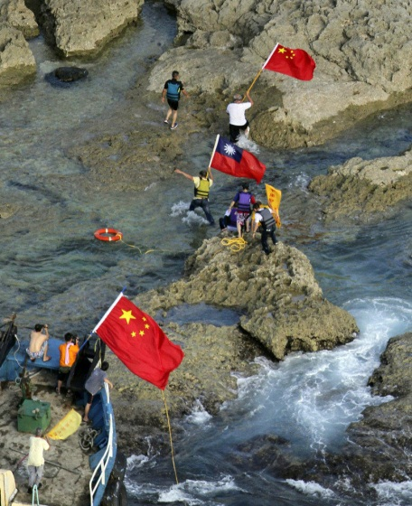
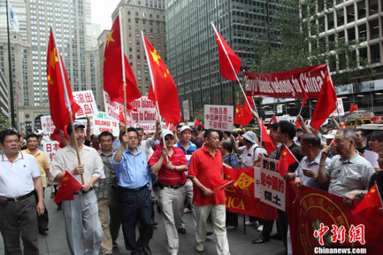
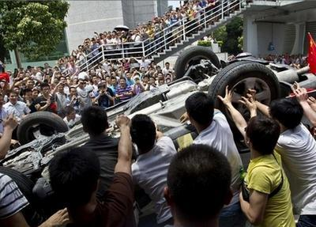

# ＜七星视点＞第二十七期——让我们失控的那个岛

 

# 让我们失控的那个岛

## 

 

#### **在岛上，在陆上**

不久之前，我国14名保钓人士登上钓鱼岛，却被日方扣押。这一事件在国内引发了广泛的不满，全国各地纷纷爆发反日游行。然而，在一些地方，本来强烈的爱国情怀却在不理智的群体行为中发展为恶劣的打砸事件，使无辜的国人蒙受巨大损失。回顾中国群众游行示威的爱国史，就会发现类似不理智爱国事件比比皆是。那么是什么导致了某些国人屡屡在“爱国”的同时伤害自己的国家呢？我们不禁要问：是什么导致了这种群体事件往往会在自我发展中失控？这是放之四海而皆存在的情况吗？在社会化特征越来越明显的当代，这种群体的“无意识失控”状态又该如何解决呢？本期七星视点，将带您以钓鱼岛事件为例，放眼全球，追溯历史，同您一起探讨。

2012年8月12日，14名保钓人士乘坐“启丰二号”从香港出发，计划登上钓鱼岛宣示中国主权，在国内引来一片叫好之声。15日，保钓人士突破日方的重重阻拦，成功登岛，并把国旗插上了钓鱼岛。而日方以“非法入境”为由扣押了这14名保钓人士及其船只，并将其移送冲绳本岛进行审查。审查期间，保钓人士收到不公正对待，人身权利受到侵害，登时为国内群情激奋的保钓反日情绪又添了一把火。

#### **抵制你的东西！**

[_杨永新V_](http://weibo.10086.cn/_L154625969?sid=0010001400001): 抵制日货！转//@詹海玉 :#[抵制日货](http://weibo.10086.cn/t/detail.php?k=%E6%8A%B5%E5%88%B6%E6%97%A5%E8%B4%A7)#日本对中国依赖程度现在很重,特别对中国市场依赖,如中国人一个月不买日货,日本将有数千家企业面临破产,如6个月不买日货,日本将有一半人失业,如一年不买日货,日本经济将面临崩溃.抵制日货考验的就是你那爱国心.近日台海局势严峻,小日本还不断插手.愿意就转发,不愿意就无语看看就行.

[_张静_](http://weibo.10086.cn/_L6967182?sid=0010001400001): 用我们的实际行动#[抵制日货](http://weibo.10086.cn/t/detail.php?k=%E6%8A%B5%E5%88%B6%E6%97%A5%E8%B4%A7)#吧，索尼、松下、佳能、三洋、夏普、东芝、本田、丰田、三菱、马自达、日产、铃木、富士通、奥林巴斯、富士、卡西欧、尼康、理光、味千拉面、三得利啤酒等等，把你知道的日货写下来，一块转，一块抵制！

[_林久飞_](http://weibo.10086.cn/_M199590406?sid=0010001400001): #[抵制日货](http://weibo.10086.cn/t/detail.php?k=%E6%8A%B5%E5%88%B6%E6%97%A5%E8%B4%A7)#早就应该抵制日货了，如果你认为自己还算是一个炎黄子孙的话请拒绝日货，因为你每花100元人民币买日货就是等于给日本人送去4颗打我们的子弹或者是十几张窜改历史的纸！那我们还下贱要去买日货吗?只要每个中国人一两年不买日货，我敢保证所有的日本人就要过来跪下求我们了否则就要饿死。

随着微博战火的燃烧和国际形势的紧张，国内的保钓行动不断升级，全国各地爆发群体游行示威保钓运动，就在深圳，数千群众走上街头反对日本人扣押保钓人士。一些群众难以控制情绪，竟然打砸同胞开的日系车，甚至冲进日系店面进行打砸，本来“爱国”的行为，却导致了无辜群众的重大人身财产损失。

在街头上，被民族情绪冲昏了头脑的人们忘记了打砸他人合法财产是有违道德和法律的，忘记了这些挂着日本牌子的东西也是同胞用辛勤工作换来的，忘记了在浓烈的爱国情感之外那个叫做“理性”的东西。

在网络上，一些人们“用脑子爱国”的理性呼吁也被淹没在一片群情激奋的叫嚣声中，一些有理有据提醒大家要冷静思考的文章亦是收效甚微。人们一夜之间对于一切与那个东洋岛国沾边的东西都深恶痛绝，仿佛对日货的唾弃就发泄出了那股不能马上拿起武器保卫钓鱼岛的憋闷。

#### **这是我们所在的群体**

保钓游行中的打砸事件的发生，既有群体运动的本身特征，也有当代中国的现实特点。法国的著名心理学家同时也是群体心理学开山鼻祖的勒庞曾在《乌合之众》（_The Crowd_）里如此描述群体的特征：“不论什么个人，仅仅因为进入群体本身，就无一例外得表现出无异议、情绪化和低智商。”

也就是说，群体并不是个人的简单加总，群体具有它的每个成员都不具备的特征，而这种特征往往在低级别进化形态的种群中常见，比如：原始人、儿童、老人甚至是野兽。任何聪明、文明、理性的人可能仅仅因为进入了一个群体，就表现出异于往常的群体性特质。群体可以让人极端野蛮，比如向来以礼貌谦和文明的大和民族进入群体后变得嗜杀；群体亦可以让人变得高尚，比如革命群体中人可以为了一句口号慷慨赴死。

那么，群体的什么本质特征对钓鱼岛游行打砸事件起到了影响呢？

 **·群体的无异议**

单一的个人可以接受矛盾，进行批判思考，但是群体并没有批判思考的能力，群体只能接受极端的观点：完全支持，或是完全反对。

群体的无异议特征使得此次游行运动出现了极端的现象—全盘否定日本。理性的个体会进行批判思考，知道钓鱼岛事件是国家之间利益博弈的行为，其本身牵扯的道德成分并不大，且钓鱼岛事件也是日本政府的指向性行为。但是国人在置身于一个群体环境中而自然产生的无异议特质则导致了要否定就全盘否定的激进情绪——许多反对者甚至辱骂侮辱日本普通国民，贬低日本国民素质，全然不顾日本的国民素质一向是受到广泛认可的。

 **·群体的情绪化**

不论多么理智的个人，一旦进入群体就会呈现出低级进化形态的特征——情绪化。形成群体的个人会感觉到势不可挡的力量，使他敢于发泄自己的原始欲望，而作为个人时，他却不得不对这些欲望做出克制。

这就解释了为什么单个的个人即使也对日本扣押保钓人士的行为很不满，但是他们不会去做出打砸这种事情，因为人作为理性能力相对较高的物种，具有克制自己的能力。但是人到了群体中时，就会丧失这种能力，从而使群体事件往往向极端情绪化的方向发展，而“法不责众”的特点又加剧了这种情绪。因此，当那些打砸的人静下来回到家时，其实也会觉得不应该打砸，因为他们又变成了理性的个人。

其他几乎所有的群体事件都表现出类似的特征，比如前段时间的海南嬉水节性骚扰事件（[http://news.163.com/12/0823/14/89JMKJGF00014JB5_2.html](http://news.163.com/12/0823/14/89JMKJGF00014JB5_2.html)），一群本来可能文质彬彬的人成了群体后变得丝毫没有克制能力。

 **·群体的低智商**

单个人的智力水平有高有低，但是不论什么人，一旦进入群体，都会表现出低智商的特点。这种特点往往表现为群体只能进行最简单的推理，只把表面上相似的事情联系起来。比如打砸丰田车和打日本其实只有表面上的联系（都含有“日本”这个符号），并没有任何的内在关联，打砸丰田车反而是对国人造成损失。这种只把表面特征联系起来的特点也出现在一切低进化形态的种类中，比如原始部落中人们杀了骁勇的敌人就要把他的心脏吃掉，他们认为吃掉了骁勇的人的心脏也就具备了骁勇的能力。

在打砸事件中，其实群众打击的不是日本人的利益，反对的也并不是日本产品，他们打击的只不过是一种代表着“日本”的符号，但是因为群体的低智商特点，就无法分辨这种区别。

以上所叙述的群体特征并不是仅限于钓鱼岛游行示威的群体，而是一切的群体都有这样的特征—不论是平民群体还是高智力社会精英组成的群体，都难免表现出低级别进化形态的特征。

因此，很多人呼吁游行示威、爱国的群体要“理性爱国”、“冷静客观”是几乎不具备实现可能性的——如果一个群体能够理性了，那么它就不是群体了。

#### **这是我们所站立的中国**

那么既然群体无一例外得表现出不理性的特征，是不是所有国家的爱国运动都像当前中国那样夹杂着打砸等害国行为呢？是不是中国不同的历史时期也是这样呢？是不是爱国行为就无法有序合理了呢？

通过和其他国家以及历史其他时期对比，我们发现，群体的不理性是可以合理引导的也是可以预测的，群体行为在合理得引导下可以表现得有效有序：

 **·对比：美国占领华尔街运动，民众并无暴力行为**

2011年9月17日，上千名示威者来到纽约曼哈顿，试图占领华尔街，有人甚至带了帐篷，并打算长期坚持。他们通过互联网组织起来，意图是要反对美国政治的权钱交易、两党政争以及社会不公正。

然而这些示威者并没有出现冲进银行、打砸银行家车辆的行为，他们自始至终都坚持非暴力的原则，意图用合理抗争来得到政府支持。

 **·对比：甘地领导的“非暴力不合作”运动，成功抵制了英国殖民统治**

甘地为了争取民族独立，摆脱殖民统治，并没有采取起义等暴力流血的方式，而是通过领导民众进行合理的抗争，以最低的代价，争取民族独立。甘地有效发挥了群体不理性特点的优势—能够被灌输信仰，因此这些群众具备了强烈的信仰，并得到合理得引导，最终形成了成功的抵制。

 **·对比：100年前国人抵制日货运动，和今天相似**

在新中国成立前，中国也发生过多次抵制运动，其行为表现与今天的群体运动有相似之处，把对于国外人的仇恨转嫁给国人。比如鲁迅先生曾经写到：“我们现在所要使人愤恨的是外敌，和国人不相干，无从受害。可是这转移是极容易的，虽曰国人，要借以泄愤的时候，只要给与一种特异的名称，即可放心剚刃。先前则有异端，妖人，奸党，逆徒等类名目，现在就可用国贼，汉奸，二毛子，洋狗或洋奴。”

那么为什么国外有些抵制运动要不取得了成功，要不就并没有发生伤害国人的事情，而中国的某些群体运动却往往以纯粹发泄群体情绪为目的，结果不但达不到效果，反而有损国人利益呢？

这既有当前中国社会群众组织现状的原因，也有事件本身的原因。

 **·中国缺乏民间领袖和完善的民间组织系统，难以有效组织群体运动**

当代中国的各项制度限制了民间组织的发展，也限制了民间领袖的出现，因此我们常常可以看到“群众自发走上街头抗议”这样的字眼。但是实际上不论什么什么运动，自发状态是很难成功的，缺乏组织的群体运动往往靠一时的冲动引导，这就注定了难以坚持和成功—有些人打了别人的丰田车，再用自己的索尼相机拍照留念等，回家后还是继续买日货；同时也注定了群体的无序性增大，演变成暴力等恶劣事件的可能性增大。而反观其他成功的群体运动，无不是有明确的组织甚至是精神领袖，包括甘地、马丁路德金等，甚至是香港的抵制国情教育运动，也有明确的社会团体来进行组织。

 **·中国普遍缺乏坚定的原则和信仰，崇尚“相机而动”，这就加剧了群体运动的混乱、无序和冲动**

相比于西方人，中国人往往考虑利弊、权宜而不是原则和信仰，而利弊、权宜等情况是随时改变的，以利弊、权宜等为中心就难免加剧我们的冲动、多变、不坚定等特点，从而使我们的群体运动表现出不利特点：受一时冲动影响较大，容易失控；无坚定信仰支持，“相机而动”的心理让群众运动难以持久如一。

反观西方成功的群体运动，往往有一个单一的坚定信仰作为支撑和凭借一切行动的原则，比如马丁路德金时的“平等”的信仰。

 **·国内群体运动直接作用对象是国内，群体运动要有明确的目的：要国内的谁去做什么**

群体运动很难直接作用于国外，即使是旨在对于国外势力的运动，也是间接通过国内势力来作用。比如马丁路德金时的群体运动目的是要挟国内政府努力实现黑人白人平等，甘地的运动是要求国内殖民者给予独立和自由，五四运动时要求国内政府抓汉奸、拒签二十一条，香港抵制国情教育是要求当地政府给予思想自由等等。

而对比之下，我们的保钓游行运动口号是要求日本离开钓鱼岛，而这样的口号不论多么响亮，跨越500多公里的大洋之后传到日本，声音也小了很多。也就是说，不论我们怎么闹，只要政府不出面，日本几乎很难受到威胁。我们作为普通民众，最好的针对外国的方式是向本国政府施压，因为民众并没有外交权和外交能力。

因此，群众的诉求在得不到诉求方（日本）的积极响应情况下，就把这种仇恨转嫁给了国内，做出了伤害国人的事情。

#### **总结：什么样的未来**

自由和民主是世界大势，群体运动也会越来越频繁，那么在当代中国，我们怎么才能进行更加合理的群体运动呢？对于上述的中国某些群体运动失败的原因，我们该怎么办呢？

我们认为，中国当局应该清晰认识到群体运动在历史担任重要角色的作用，综合采取多种方法，积极引导：

**·不要一味采取说教的方式倡导“理性爱国”，群体如果理性了，就不是群体了，应该着力于更加有效和关键的解决方案。** **·对待激烈的群众运动要通过采取引导的方式来解决，而不是以暴制暴，用强力制止。暴力不能解决问题，只会带来更多问题，正如甘地所说， “以眼还眼，世界只会更盲目”。** **·更加注重民间组织的发展，民间组织要去行政化，注重培养具有社会责任感的民间领袖。政府不论具有多么庞大的规模，始终是触角有限，而如果发挥民间组织的积极力量，很多群体运动都可以得到合理的引导，以避免好事变坏事。** **·应该更加注重信仰以及原则体系，使中国人讲原则。胡适曾经说过：“一个肮脏的国家，如果人人讲规则而不是谈道德，最终会变成一个有人味儿的正常国家，道德自然会逐渐回归；一个干净的国家，如果人人都不讲规则却大谈道德，谈高尚，天天没事儿就谈道德规范，人人大公无私，最终这个国家会堕落成为一个伪君子遍布的肮脏国家。”因此，注重民众原则感和普遍信仰的建立，推行普世价值的观念，方是解决当前越来越失控的群众问题的根本之道。**  

（编辑：李靖 责编：高琦琛）

 
