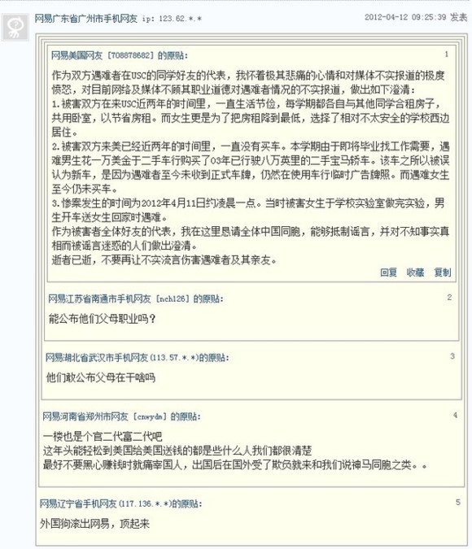
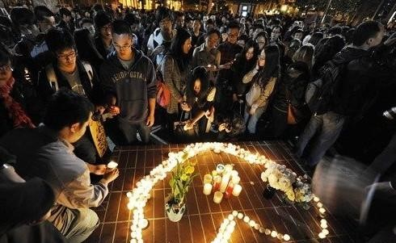
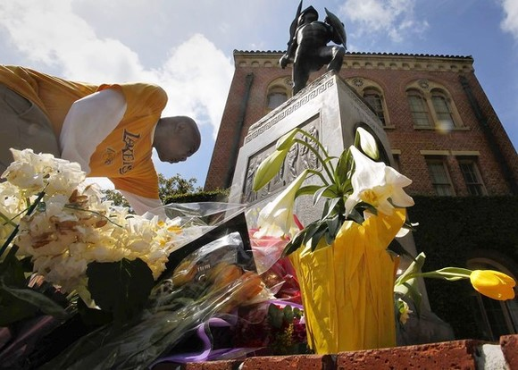

# ＜七星视点＞第二十二期——大洋彼岸的枪声

**对于精英群体，甚至“看上去像精英”的群体，这些猜测，实非一日之寒。不管是新闻，是切身经历，还是市井传言，都在呈现着这样一个现状：精英阶层的上升通道，离“透明”这个形容词，有着相当遥远的一段距离。** **既然如此，在信息有限，真相晦暗不明的时候，似乎这部分精英的不正当得利手段，也就同时污染了这个阶层的所有人，使他们的地位、财富和立场沾染上了一层阴影。**  

# ＜七星视点＞第二十二期

## 大洋彼岸的枪声

 

#### 远方的枪声

日前，一则新闻在网上被广泛关注和引发热议：

 中新社洛杉矶4月11日电 位于美国洛杉矶南郊的南加州大学校园附近11日凌晨发生一起枪击案，一男一女两名中国留学生被枪杀。 

同很多引发争论的话题一样，这则新闻也有着一些刺人眼球的标签，如宝马、枪杀、留学生、美国等，在被这几个已然被妖魔化的词汇先声夺人后，一些网民首先想到了“富二代”这个词，继而就是横眉冷竖地质问“他们哪来的钱买宝马”，甚至粗暴地想到“他们死得活该，因为他们的父母在国内取财无道、为富不仁”。也同很多牵扯到年轻人和名牌跑车的热点事件一样，舆论的风向在短时间内瞬间发酵成了一种对“富人”，尤其是对富二代的讨伐，而在很多人吐槽富人时，却忽视了事实的真相。然而时候，真相却和我们的想象相去甚远。

也许是因为这个时代的节奏很快，容不得人们停下来看一看和想一想；也许是生活的压力和对现实的不满让越来越多的人失去了理智和耐心，很多人已经形成了一种标签化的惯性思维来判断是非曲直。与此同时，一些媒体和事件传播者为了追求短时间内爆发出惊人影响力的传播效果而将一些事情简单的标签化，这也进一步强化了很多人心中的“标签思维”。比如本身中性的“富二代”这个词，如今已经演变成了一个绝对贬义、甚至遭人唾弃的词汇。但这种短时间内、通过“贴标”来判断问题的思考方式不可避免地会在很多时候和事实有所偏差，一如当年被大众妖魔化的药家鑫们。

其实，在任何一个事件中，我们每个人都可能只看到了其中的一面，如果仅仅因此就盖棺定论，不单是对当事人的不公，也是对自己的一种不负责任。因此，在这期七星视点的开头，我们认为有必要梳理一下此次事件的发展顺序。

4月11 日凌晨，南加州大学（USC）附近发生一起枪击案，一男一女两名中国留学生在车内被枪杀。

大部分网民在最初看到这个消息时，因同胞被枪杀，不由自主会产生关心和祝福等心态，也会发出些诸如“出国真不容易”的感叹。（http://www.tianya.cn/publicforum/content/funinfo/1/3255442.shtml）

但也是伴着这种关心和留学生话题本身的吸引力，越来越多信息被找到。其中，导致很多网民情绪发生转折的消息是：根据一位美国新闻网记者的报道，两人死在一辆newer model gray BMW里（http://abclocal.go.com/kabc/story?section=news/local/los_angeles&id=8616638）。这辆宝马的出现迅速刺激了很多人脑中关于“富二代”的印象，很多人开始幸灾乐祸，网上出现了诸如“有钱人啊，不抢他们抢谁啊”、“命丧宝马内，无需证明了，不是官贵家的就是富二代，死了死吧”、“大晚上的凌晨一两点，谁知道一男一女在宝马里做什么啊”之类的言论。

但事实很快证明，那位美国新闻网的记者在报道中夸大其词，这辆宝马只是一辆03年出产、已经行驶八万英里的二手车，是遇难男生为了找工作花1W美金买的，这种车打打工、做做实验很容易就可以买；而遇害女生至今没有买车。两人同为就读于USC电子工程专业的研究生，平时生活节俭，家境一般，那晚两人在实验室工作至深夜然后在结伴回家的路上遇害。面对扑面而来的误解和无端指责，很多留学生开始利用微博、人人等平台进行还击，还原事情的真相。

随着越来越多的人开始发出理性的声音，公众开始纷纷指责媒体报道的不负责任，称是媒体的推波助澜误导了大家。之后越来越多的人，选择祝福遇害者，希望逝者安息，并呼吁相关各方重视起来，让凶手早日伏法。

然而最近网上又爆出一则消息，称被害女生的父亲是某市公安局的大队长。这一点，又引起了网友小范围的争议。

#### 想象、真实、疑问、和反驳

留学生、宝马、枪击，这些关键词，无疑是能够抓住人的眼球的。至于这些关键词，会在人们的脑海里形成什么样的印象，自然也是可以推测的了。网民们最初的反应，正是基于这种印象带来的结果。

而即使在海外的留学生们开始解释真相的时候，仍然有人对他们的解释，抱着不屑的态度。

部分网民的疑问集中在：去美国留学的人，怎么可能不是二代？

看到这样的疑问，身在海外的留学生，开始感到寒心了。不管是针对网民，还是针对媒体，甚至针对这个国家。

 _[刘小少](http://rrurl.cn/aNVE17) _: 我要是哪天也被歹徒劫车打死，国内新闻会一致报道：【富二代官二代学二代刘某在美国被劫杀，警方拖走新车价值14万美元的奔驰予以鉴定】，新闻下面留言跟贴会清一色的：死得好！让他们喝百姓的血！活该！我想想就不寒而栗。。。 _[刘小少](http://rrurl.cn/aNVE17) _: 总有人以阴谋论的口气说去美国留学的家里都是有点底子的，我只能对你们说，你们就是大大的白痴。美国一般读博士奖学金每年2万多美元，家里贫困靠自身努力去的凤凰男凤凰女省吃俭用一年省下5000美元以上给家里寄去的比比皆是，再看看你们自己，读个硕士博士还要家里出钱，毕业了连房子都买不起，你们有什么脸面说别人！ _[陈丁](http://rrurl.cn/1y0Zi2)_ : 为什么国内的媒体非要把宝马二字放在标题上，引导不明真相的人们去产生超出这个个体事件之外的联想？事实是这是一辆03年售价1万多由受害男生勤工俭学买来的二手宝马车。但即便车价值十万美金又如何？在这样扭曲的报道和评论中，我看到的并非纯粹的是国内严重的仇富心态，更令人担忧的是在一个人权意识薄弱的国度，生命真的不值几个钱。 _[風致會社 Fancci Society](http://rrurl.cn/4h4Hrg) _: 國內許多媒體故意以「一男一女」「寶馬車」等關鍵詞，利用民眾的「仇富心態」來刻意誤導大家對於這次留學生遇害案的看法。遇害者皆為電子工程專業研究生，學習都很認真，車是價值一萬的二手車。當晚男生是送做完實驗的女生回家，結果就遭遇了不幸。可你們這些無良媒體卻幸災樂禍地歪曲炒作此事，上次對OU的歪曲還不夠嗎，這次竟然拿USC兩位同學的生命來炒作。你們不去為死難者哀悼，不提醒留學生們注意安全，不去指責美國大學周邊的安保問題，反而用有色的眼光刻意歪曲報導。你們還是人嗎？算了，你們本來就不是人。 

然而，对于他们对媒体的指责，同样也有人提出了有力的反驳：

 _[刘小翔](http://rrurl.cn/uCZuk3) _: 提几个建议：网媒没有采编权，但影响力很大，所以希望了解真相的同学或者罹难者的朋友主动跟各大平媒联系，或者主动联系网媒采用“洗稿”的方式，发布最新最准确的资料。现在市场化媒体都在抢新闻，自己不去主动联系澄清，就知道窝在校内喷无良媒体，不但于事无补反而窝气。 _佚名 _: 有些人的逻辑很奇怪，那两个留学生确确实实是在宝马车内被枪杀的，一些媒体如实报道，怎么反而就成了“没节操”呢？难道要刻意回避事实，甚至伪造某些人想看到的事实才是有节操吗？只要是如实报道，不管民众如何解读，那媒体都无可指摘。至于很多民众为什么要如此偏激地去解读，为什么民间的仇富情绪如此普遍且如此易燃，这已经是另外一个问题了。但也是更值得思考、更迫切需要解决的问题。 _佚名 _: 有一伙人看到“宝马车”三字，瞬间如打了鸡血一般：“宝马车，非富即贵，肯定是为富不仁吸取民脂民膏者的孩子。死得好！死得妙……” 另一伙人看到“宝马车”三字，也瞬间如打了鸡血：“宝马车？媒体肯定在暗示非富即贵，肯定在暗示死者是为富不仁吸取民脂民膏者的孩子，肯定是想让人欢呼‘死得好！死得妙！’ 媒体没节操！” ——两伙人的心态也许不同，但思维方式一样。都是在捕风捉影，都是在无根据地诛心，都是在用天马行空的臆想对“宝马车”做无限的解读。可“宝马车”三字哪来这么多含义？阴谋论看多了吧？ 

#### 活在印象中

相隔万里，不管是国内网民对国外留学生，还是国外留学生对国内网民，对于彼此，都是所知甚少。网民们能够看到的，大概只有新闻里，一些家庭背景不凡的留学生，在富饶的彼方夜夜笙歌，却并不知道他们当中的多数，是在远方艰苦奋斗的、家境普通的小孩。而留学生们能够看到的，也许就是评论中网民们的猜疑、谩骂和诅咒，同样也忘记了他们当中的多数，正是曾经生活在自己身边的人。

“不了解”，不管是留学生的生活方式，不管是宝马车的价格，不管是被害者的家庭，也不管是究竟有多少人幸灾乐祸。

不论是网民，还是留学生，他们都生活在彼此的印象中。而两方面的争执，似乎波长并没有相合。

 _[葛晟](http://rrurl.cn/n6I9hi) _: 看着各种网络暴民的回复我都快瞎了。这么多人的逻辑居然是富二代&官二代=该死，还在评论里叫好。何况这次的遇难者都是本本分分的好学生。我们辛辛苦苦出国求学为了以后更好地报效祖国，却被人贴上各种二代标签，被各种有色眼镜看待。且不说网易报道失真，这些愤世嫉俗，仇官仇富的心态实在是可怕。 _佚名_: 刻板印象很容易闹笑话，今天发生的一切就是活生生的例证。一些仇富者对富人的刻板印象是为富不仁，对宝马车和留学生的刻板印象是非富即贵，于是留学生在宝马车内被杀后，就有了一群仇富者丑恶的狂欢。还有一些人对媒体的刻板印象是“爱炒作，爱抢眼球，爱迎合读者口味”，于是当看到仇富者狂欢后，他们就跳出来捕风捉影地指责媒体用“宝马车”煽动仇富情绪。劝君少一些刻板印象，多一些理性思考，不然这种闹剧还会重演的。 _[龚知宇](http://rrurl.cn/nBBJ1B)_ : 不分析，不思考，不去寻找一些群体行为背后的深层原因，只要看到是对自己的指责，就跳起来破口大骂，指责人家是暴民，指责人家有支性——这样的人，本身就是暴民，本身就有支性。【不好意思，又要得罪我的一些朋友了】 

也许，不管通信和传播的技术多么发达，人与人之间的障壁，都是非经由自身的努力不能突破的。

然而，我们也不得不考虑到，他们的刻板印象，为什么是指向如此的方向？又为什么达到了如此的强度？以至于，在两条鲜活生命逝去的时候，这种印象，仍然能够压倒对同胞无辜受难的同情心？

#### 海有多宽

在这起事件发生前的一个星期，4月5日，伯明翰城市大学的一名中国学生在绿灯时通过人行横道，被一辆警车撞飞20多米，经8小时抢救后，不治身亡。肇事警车的驾驶者是一位便衣警察，但当时并非在执行公务。目前，事件正在调查中。

虽然是几乎同时发生的案件，这位英国留学生遇难的事件远没有USC遇难的两位学生引发的反响大，同样都是留学生，二者最显著的差别在于前者很难被贴上什么标签，而后者则理所应当被贴上了“宝马”的标签，并燃起众怒。

引发愤怒的，并不是留学生被害事件本身，而是人们心中关于宝马的那种印象，是很多人对当今中国富裕者的普遍不满。而这种根深蒂固的不满，说到底还是来源于对现行分配体制不公的愤恨。

三千年来对商人的贬抑，以及三十年改革开放过程中，一些“先富”在原始积累中的斑斑劣迹，加上“待富”们对未来前景的渺茫，无不使得人们在看到一些代表着金钱的符号的时候，思维发散到最为阴暗的角落。而这种态度的常态化，反过来又让每一起事件的当事方“不惮以最大的恶意”来揣测在网络的对面发表评论的群体，误解也在一次次的重复中变成越来越深的堆栈。

对于精英群体，甚至“看上去像精英”的群体，这些猜测，实非一日之寒。不管是新闻，是切身经历，还是市井传言，都在呈现着这样一个现状：精英阶层的上升通道，离“透明”这个形容词，有着相当遥远的一段距离。

既然如此，在信息有限，真相晦暗不明的时候，似乎这部分精英的不正当得利手段，也就同时污染了这个阶层的所有人，使他们的地位、财富和立场沾染上了一层阴影。

而网民们的不满，也从来不是针对某个素不相识的个人，而是针对这个人所从属的——或者，他们认为这个人所从属的阶层。在他们的眼中，这个高高在上难以触及的阶层是那么的不透明，于是这个阶层的成员上升进入阶层的过程就理所应当伴随着罪恶。那么，我们又如何期待持这样观点的人对他们所认为的罪人的遭遇表示同情？

而至于“罪人”们真实的生活状态，他们也许并不觉得有必要去了解。毕竟，这是离他们太遥远的东西。

这是他们的过错吗？

当然是的。他们本可以了解更多的真相，本可以不去使用如此恶毒的言论来伤害无辜的同胞，本可以为在异国受难的人寄予更多的同情。毕竟这些受害者并没有从他们手中夺取什么他们本应拥有的东西。

然而也不是。真正应该负责的，难道不是使他们落入现在境地的人？如果凭借诚实的劳动可以弥合阶层之间的鸿沟，如果阶层之间升降的通道不是被遮盖在重重迷雾中，我们就无从想象，这样的仇恨心理如何能够产生。他们是被剥夺了的，虽然他们所敌视的，并非这件事的实际责任者。

“绥拉菲摩维支在《铁流》里，写农民杀掉了一个贵人的小女儿，那母亲哭得很凄惨，他却诧异道，哭什么呢，我们死掉多少小孩子，一点也没哭过。”

这种非理性的狂欢与漠然，并不是毫无缘由的。当隔开阶层的海比太平洋更宽的时候，人心之间的隔膜不会比海更窄。

#### 结语：怀着善意，去弥合

 _[徐英夕](http://rrurl.cn/sxQmen) _: 我总觉得很多人反应过激了。网络上一直有些人什么都骂，官二富二官一富一明星作家……但是这些人不能代表所有网民，网民也不能代表所有中国人。看到许多留学生朋友动不动就“国内”如何如何“国人”如何如何，我觉得这比仇富更可怕。几个整天骂人的喷子成不了大气候，但国家的未来在你们手上。你们回国后要如何正视那些没出过国也从来没有像你们一样努力奋斗过的普通老百姓呢？留学固然辛苦，但找个由头就集体大倒苦水加强烈反击只能让人看到一群脆弱的受害者。还是写写怀念逝者的文章，并且多注意安全吧。 

错误的认知、无端的猜测、刻板的印象，这些，都是可以用语言化解的。然而，深远的鸿沟、暗色的现实，却并非仅仅通过一篇文章就可以消除。自然，导致这些的因素是明确的，然而解决方案何在？恐怕这仍旧是一个难以回答的问题。

可是，至少双方可以怀着最大的善意，尽其所能去相互谅解相互沟通吧。毕竟，误会不是不经努力就能够消除的，裂痕也不是放任自流就自会弥合的。如果，我们的心中不愿意与人达成和睦，那么纵然有朝一日那些客观存在的阻隔消失了，也许旧有的敌视和憎恶仍然会存在。

总有一天外在的因素都会好起来。如果在这一天之前我们就可以携起手，或许也能够加速这一天的到来。

（编辑：张舸 / 张正；责编：高琦琛）

 
