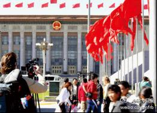

# ＜七星视点＞第二十八期——“围观者”：当我们喜迎十八大

 

# “围观者”：当我们喜迎十八大

## 

 

### 人人喜迎十八大？

2012年10月29日，当大学生们结束了一天的课程，打开电脑登陆人人网，一片耀眼的正红与金黄赫然出现在屏幕上。人民大会堂庄严的背景衬托着学生们的转发、段子、自拍照，显得有些不搭调。

这是人人网为了跟随十八大的潮流特意设置的主页皮肤。反应快速的用户们立即发状态吐槽：新闻联播没有错，说了人人喜迎十八大，人人真的就喜迎十八大了。

事实上，“喜迎”的潮流已经进行了很长一段时间。从传统的各地大大小小的文艺汇演、媒体的专题报道、各种评选活动和无处不在的标语和横幅，到新颖的摆多米诺骨牌、叠被子……官方媒体以一种迎接重大节日的态度，不遗余力地调动着人们对执政党的热情和感恩之心。

然而，当我们把目光转向网络，看一看普通人最喜欢发表意见的平台微博和人人网，就会发现人们的想法似乎并不与官方相协调。

@陈骁：坐火车禁止携带菜刀与剪刀，机场安检摸裤裆，打出租车去长安街要填表，封死出租车后窗，大型演唱会活动延期，，大场面电影拍摄延期，禁放气球，禁娱乐性飞行，五环内外地禁行货车，购买遥控飞机要实名，学校不得组织秋游，足底店单间不准关门。——北京喜迎十八大。

@范锋：读懂中国真不容易。有时候公众最关心的大事，官方的新闻可能吝啬到只有一句话；很多大的事件，我们能看到新闻不是事情演化的来龙去脉，而只是一个声色俱厉的官方声明；网络上各种传言和各种辟谣让人都真伪难辨；三五朋友聚会交流最多的话题，网民们称为“斯巴达”。 ....大家都在打着各种哑谜...

@蒲蒲壳陈思羽：斯巴达的调查范围又扩大了//@高晓松：最近歌曲审查空前严格起来，大电视台播出的歌曲不能带有“死”“下”等各种不吉利字眼。刚眼看着一歌手翻唱＜死了都要爱＞被毙，提醒下同行。

除了抱怨之外，更多的普通网友则仿佛起哄一样，以略带调侃的方式，将“喜迎十八大”变成了一个百搭的后缀：

人人网：莫言获奖了！天啊，诺贝尔奖也推出十八大献礼了！

@5唐精：中央气象台的消息来自扭腰的一股寒流已经来到中国……我们期盼着降温喜迎党的2*9大，我们期待降温让扭腰寒流来的更猛烈些吧。

@我是西蒙周V：【你我的斯巴达】会议期间避免负面，要遵守“三大纪律八项注意”：A 一、关键时刻捍卫老板；二、尖峰时刻包容跟班；三、微妙时刻善待小三。B 一、救灾不露笑脸；二、会议不抽名烟；三、采访不戴名表；四、飞行不惹麻烦；五、上班不会红颜；六、约会不搞群欢；七、消费不留帐单；八、同事之间不能闹翻。

值得注意的是，尽管耳濡目染，仍然有很多人、甚至单位，不明白十八大的真实含义，更不想花费时间去了解十八大的主题、任务和意义。这一次，人们仍然延续了对政治话题惯有的回避风格。对他们来说，十八大也许就是一句响亮又遥远的口号。

无论是抱怨、调侃还是弄错对象，普通人对于这个影响国家政治的重大事件的态度，就好像在大街上围观一场露天表演一样：从众、看热闹、居身事外，看了一会儿想起还要上班，转身就走。

柴米油盐，一个会议似乎与普通人没有什么关系,尤其对于党外的人来说。大部分人不太会去关心一个与自己无关的话题：学生们有绩点和即将来临的光棍节；白领们有高高在上的油价和房价；就是那些较为关注公共事件的人们，也难以从PX事件和虐童新闻中分身出来。人们普遍感到的，是一种现实的压力与无助。专注于脚下是明智的，抬头探路不是自己的分内事。与此形成对比的是，很多人似乎美国的大选更感兴趣，大家表达着对两个候选人老是拿中国问题说事的不满情绪，却忘了另一个即将开始的活动不但要拿中国说事，还要决定它未来十年将要发生的那些事儿。

哈维尔曾讲过一个故事：在苏联统治时期的捷克，一个果蔬店经理在洋葱、胡萝卜的陈列橱窗上贴了一幅标语：“全世界无产者，联合起来!”。他问道：“他这样做目的何在?他究竟要向人们传送什么信息?他是否对全世界无产者的大联合真的十分热衷?他当真觉得他的热情促使他非得让公众都来了解他的理想不可?他是否真的想过，这个大联合该怎么实现，实现了又怎么样?”对此，哈维尔自己给出的答案是：“我敢断言，大多数商店经理们对于橱窗上标语的意义从来是不会过问的。他们也不会用那样的标语来表达自己真实的意见。”标语和现实、官方和民间，在十八大的话题上，相离得如此遥远。

同一件事情，主旋律的正面渲染、网络的肆意戏谑、现实的极度冷漠形成了鲜明的对比。感觉像一个精神分裂倾向的人，在极度扭曲地表达着自己的情感，有夸张、有荒诞、有哗众取宠……唯一没有的是真实与坦诚…..

我们为什么只是围观？

在《民主的细节》一书中刘瑜写道：

07年夏天《时代》杂志曾经发表一篇文章“Me Generation”，指出中国当代的年轻人大多注重个体生活，对公共事务漠不关心，此文曾经在网上引起一阵讨论，有些年轻人忿忿地指出：“我就是不关心政治怎么了！”我不想说这种在中国普遍存在的论调是“不道德的”，但我想说，它是“不自然的”。一家人在一起吃饭，妈妈买菜，爸爸洗菜，姐姐做饭，哥哥洗碗，妹妹扫地，但有一个弟弟却说：“我就是不关心做饭怎么了！”一件事情明明与每个人都有关系，但却非要说它跟自己没有任何关系。我只能说，在今天的中国，有太多的制度和文化障碍遮蔽了公共生活的自然状态。

那么，对于国家重大政治事件，人们为什么怀着围观者心态，而不是像一个参与者一样，积极了解、认真讨论？参考一些学者的观点和现实状况，我们似乎可以从以下四个方面解释：

参与意义何在？

事实上，政治参与热情降低的现象不是中国独有。在世界范围内，成熟的民主国家40年来投票率稳步下跌，基本只有50%~60%。主要原因，是不论哪个国内政党、领导人上台，基本的施政方针并不会出现特别大的变化，政策具有稳定性。尽管奥巴马和罗姆尼在电视机前辩论得泾渭分明，但这其中大部分只是为了赢得竞选而故意突显出的差异，一旦上台，只要政治经济形势不变、人们的认知水平和相关理论没有巨大变化，政策就很难有太大变化。选民们在经历过十几年的政治参与后，对此过程已然有一种“看破红尘”的味道。因此，民主选举越成熟，政治参与热情越低。可以说，这是一种基于投入产出分析后的理性选择。

但是，对于中国来说，尽管表现出的现象相同，根源却明显不同。当被问及为什么不关心十八大的时候，大多数人都会立刻反问一句：有什么意义吗？

@李诺言：昨夜和一美国人聊天，问到这次美国大选你支持谁？他回答到还是希望奥巴马继续执掌白宫，问及为什么？他又说奥巴马能带来就业率，美国人问我，中国大选，你支持谁？我说中国这不叫大选，这叫换届，中央电视台说是谁，咱们就喜迎欢迎谁！

领导人的提前内定、普通公民的参与无效，使得这场会议对大多数普通人来说，只是一场隔岸观火的演出。有人甚至给它起了个名字——“神仙会议”，意即会议属于高高在上不可触及的高层们。国家事务离我们似乎太遥远、太模糊，又有什么必要参与其中呢？

还有一类人群，尤其是我们的祖父母一辈，对于这个带领他们摆脱战争和贫困的政党怀着朴素又强烈的感情。尽管认识到社会上存有许多问题，他们仍然相信“上面的人”一定是清廉公明、能够为民做主的。因此他们参与“喜迎”、抒发感情，却同样不会真正关注和理解十八大。

参与动机何在？

1966年，在匈牙利事件十周年的日子里，匈牙利当局采取了草木皆兵的防范态度。然而，全国根本没有发生当局预料的群体事件。而在次年的匈牙利选举中，卡达尔甚至对弥漫的无动于衷的气氛感到失望。

匈牙利人不积极参加政治活动，一部分原因当然是十年前的教训还历历在目，而另一方面，随着从1959年开始的有限的经济开放政策，市场上的消费品供应变得充足，这就导致了“赶快发财”的实利主义风气在社会各阶层的弥漫。毫无疑问，长期的政治稳定，是“土豆烧牛肉社会主义”，及其进化版本“电冰箱社会主义”、“私人小轿车社会主义”和“度假别墅社会主义”的衍生物。

而同样的情况是否也适用于今日中国呢？改革开放三十年来，中国经济的发展和人民生活的变化，已经能够让很多人感到前所未有的满足。而上世纪80年代末改革历程的戛然而止，则成为了人们心中不可逾越的障碍。如果实践证明，不参与政治就能过上“幸福生活”，而参与政治却要面临风险，那么，参与的动机自然要大打折扣了。

参与人群何在？

中产阶级一直是政治参与的主要力量。托克维尔在对美国的观察时认为，“城市中的中产阶级，往往能够提出全面的政治改革要求，并有能力组织起来呼吁改革……中产阶级是民主和自由的主要拥护者和支持者。”

然而在中国当代社会，中产阶级还远没有形成一股稳定而具影响力的力量。有学者通过实证研究指出，中国大城市的中产阶级身上，“强政治取向”和“弱政治参与”并存。一方面，这个群体受益于上世纪80年代末以来的改革，获得了良好的教育和职业地位，因此对“稳定的社会环境”、“良好的国家发展前景”有强烈的期待；另一方面，这一群体对主流政治宣传话语表现出集体淡漠，对政治身份持“无所谓”态度。并且，高生活压力进一步压缩了中产阶级关注公共话题的精力与时间。

最后，我们还需要认识到的是，中产阶级在政治上的中坚作用，是针对民主社会而言的。在非民主国家，这一群体亦无法真正参与到政治活动及决策中去，他们所能发挥的作用大大降低。因此，一般社会中公共事务参与的主要人群，在中国被大大减少。

参与习惯何在？

政治参与的习惯是需要社会培养的，然而这种培养机制在中国并不存在，并且随着现代通讯技术的发展，进一步降低了人们对公共事务的参与认真度。“在古希腊和古罗马时代，城邦公民的住宅通常十分卑隘，而公共建筑则相当恢弘，人们在广场、剧院、街道上相互熟识，并在那里学会如何关心、参与和讨论城邦事务。与之相比，现代社会则出现了一个漫长的过程——桑内特称之为‘公共人的衰落’——人们渐渐退回到一个远离社会的个人生活圈子中，沉浸在一个关注自我的个人主义状态之中。这其中似乎有一种颇具讽刺意味的联系：现代人的住所越来越舒适，他们也就越来越倾向于在这里构筑起一个自己的世界，而不是去公共空间去寻找自我。”这是美国社会学家罗伯特·帕特南在他的著作《独自打保龄》中提到的观点。

有人说，当下流行的微博议政，不是说明了，即使人们躲到自己的个人空间里，还是可以、甚至更好的参与到公共话题中来吗？但我们应该看到的是，微博上的公共话题讨论，对于大部分人来说，只是休闲式的围观而不是认真严肃的参与：微博论政门槛较低，人们利用零碎空闲的排队时间刷刷新闻，随手转发，对于内容并没有怀着认真的态度，这也是网络是谣言时常兴起的原因之一。这种围观并不能代替真正的公共事务参与。当然，利用微博认真参与政治的不是没有，但显然不属于一般现象。

意义、动机、人群、习惯，这些的缺失使我们变成了外圈的围观者；而我们所围观的，却是自己的生活。

总结：向着公民社会

“公民社会有赖于人们的参与。如果人们逐渐变成懒散的消费者，而不是积极的公民，那么社会的基石就发生了动摇……对自由的最大威胁是来自不参与的人们，而不是参与的人们。”每个人所拥有的自由，不应该仅仅是选择不同牌子电冰箱、洗衣机的自由。

面对一个从某种程度上会决定未来国家走向的事件，无论是手捧鲜花、嘴唱赞歌，还是冷眼相望讽刺戏谑，都不是我们希望看到的公民反应。虽然我们知道，这样的现状已非一日之寒，但我们也并不是就无力改进。如果能有更多的人理性地参与到十八大及相关公共事务中去，认识现象、独立思考、积极传播，那么虽然是杯水车薪，也并不是全然没有价值的。天柱虽高，跬步以量。如果我们相信存在一个未来，那么我们就不需要再怀疑要不要为之努力。

 

（编辑：李靖恒 刘迎；责编：张舸）

 
