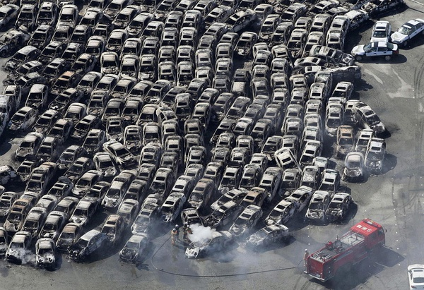
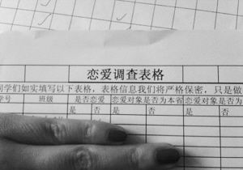
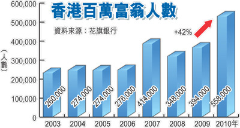

# ＜七星视点＞第八期：祈福！

# 七星视点

## 第八期：祈福！

### 1.祈福！

北京时间3月10日12：58，中国云南盈江县发生5.8级地震。截至2011年3月12日17时，本次地震造成受灾人口28.25万人；紧急转移安置12.71万人，共设置安置点11个。目前灾害遇难人数25人，受伤314人。灾区在开展搜救的同时，工作重心已转移到受灾群众转移安置、救灾帐篷搭建、排危除险等。 北京时间3月11日13：46，日本本州岛附近海域发生强烈地震，地震引发海啸。此次地震级数达到9级，或为日本有地震记录以来的最强地震。日方称受灾人数达到39万，2万人下落不明。目前遇难人数已达到2000人。日本政府正在开展紧急救援。中国国际救援队也于今晨赶赴日本参与救援。 然而我仍旧[不相信2012](/?p=6773！) 人类靠爱战胜灾难！爱也终究战胜仇恨！即使真的有2012，人类也不能放弃爱的光辉和人性的尊严！今天让我们来祈福，为了不论中国和日本的兄弟姐妹，为了每个无辜承受灾难的人！ **七星视点：** 本人满怀善意，希望和日本有缘的人士，能够给予帮助。力所不能及，或者不认同的，也请在善良面前，至少不要恶言相向。 本人认捐500元人民币。希望大家跟进。方法是通过给我的账户：①中国银行621661 0100000880811②工商银行 622200 0200120774153汇款。 我会详细记录，并适时公布捐款记录，希望匿名的也会匿名处理。时间为一周。一周之后无论所得善款多寡，本人都会亲自递交给日本驻华大使馆。 **By ****陆遥遥 ** [点此见详情，捐款名单实时更新中 ](http://blog.renren.com/blog/6182/716017379?from=6182#id1690461132) 我们会在上海组织一个日本地震祈福活动。活动的主旨一为祈福，还为化解恩怨消弭仇恨。在活动中我们也会募捐并通过日本的公益组织传递我们的关心。活动在紧锣密鼓的筹备中。了解详情和参与，请联系QQ172857614或手机13611613573。 **By ****林鹏** [详情见此 ](http://blog.renren.com/blog/255256857/716139618?from=255256857#id1690499564)

### 

### 

### 2.谁在热烈庆祝日本地震？

### 

日本大地震刚刚发生时，据说百度“热烈庆祝日本地震” 结果2510000条，改成“庆贺”是680000条，去掉热烈是8480000条。可是当现在小编去百度“热烈庆祝日本地震”时，获得的结果多是对“庆祝日本地震”这种行为的批评和反思的声音。于是又有人说，说中国愤青庆祝日本地震的都是谣传。批评与反批评，网民从 “谁在热烈庆祝日本地震”问题上引发了左愤右愤之争。 小编不愿意用愤青的这个帽子去扣任何人，但发现有的网友确实思想狭隘，言语偏激，逻辑混乱。当“热烈庆祝日本地震”的风潮过去以后，现在又有了“中国人为什么不关心云南地震却去关心日本地震”的言论风潮。[百度“不关心云南地震”](http://www.baidu.com/s?wd=%E4%B8%8D%E5%8E%BB%E5%85%B3%E5%BF%83%E4%BA%91%E5%8D%97%E5%9C%B0%E9%9C%87&ie=UTF-8&oe=UTF-8&bar=13&tn=ab365_cb) “云南地震了，日本地震了，日本侵略过中国，我该关心谁？”原来当这样一个问题摆在很多人面前时，他们是理不清思路的。而且很多人争论到最后，既没关心云南地震，也没关心日本地震，关心的只有怎么样用更暴戾的语气压倒自己的反对者。  **七星视点：** 面对重大灾难，想到受苦的都是和我们一样工作、学习、有家人的人们，他们也会承受着像汶川地震、玉树地震等大灾难的失去亲人的痛苦，心会隐隐作痛，因为我们都是人类，同在地球上生存的有思想有感情的生物，也许有人会说我们忘记了国耻，忘记了他们无法原谅的罪行，不，我们没有忘！我们只是处于同是生活在这个地球上同类的同情，我们都是人！没有一次地震应该值得人们开心。 **By Happymelon** 日本人犯下的是反人类罪，不是反中国罪。我们是反罪恶，不是反日本。我认为这个逻辑并不复杂，却很难被中国人所理解。 **By****乐佳军**  关于此次里氏9.0级日本东北部太平洋沿岸地震，虽然有网友一再告诫我们：“现在国际间的灾难救援完全是国际交往中的策略行为，把这个行为定为是对所谓‘人类同胞’的同情，完全是自欺欺人！” 虽然有网友一再嘱咐我们：“日本、美国就是我们中华民族的死敌。” 虽然有网友一再教导我们：“告诉有汉奸卖国贼倾向的人！父债子还，父仇子报，天经地义。人不报，天报。” 虽然有网友一再指示我们：“人，是划分为阶级的，是有民族和祖国的；不是抽象的人。” 虽然有网友甚至恫吓我们：“看来，目前国内主流媒体的汉奸洋奴倾向真是非常严重。” 但是我还是要顺着人性做些善事，所谓不忍人之心，所谓以直报怨。自古得道多助失道寡助，像你们那样为丛驱雀，早晚要被历史垃圾堆收容的。 **By ****陆遥遥**   

### 3.中国人民该咆哮了！

咆哮体现在很流行有没有！伤不起的人都在咆哮了有没有！网络要进入咆哮时代了有没有！ 学汉英法德西班牙柬浦寨语还有广东话的你都伤不起有没有！当公务员记者法医新东方老师的你都伤不起有没有！住在北京上海广州武汉还有内蒙古锡林郭勒的你都伤不起有没有！尼玛这也伤不起那也伤不起，七星视点的小编你才真的伤不起啊！在此省略三千字！每个在工作时候咆哮被领导看到的你都伤不起啊！ **七星视点：**** ** 咆哮有的是单纯抱怨吐槽但有的是有理由的。法语德语难学那没说的，咆哮完了自己好好用功。但是辛辛苦苦学了四年某个专业，还找不到工作，那不是自己的原因。有人该对此负责！本来好好的城市却这也挖那也堵树还都被砍光了生活得很不爽，也有人该对此负责！普通民众生活得这么艰难，也有人该对此负责！这些时候，咆哮不是抱怨，咆哮有理！ 中国伤不起的群体很多，但实际却都在受着伤！普通大众表达不满表达抱怨一直都没有体制化的途径！抱怨对谁说？媒体还是人大代表？民间的不满只能通过讽刺戏谑的方式传播，这是中国人的无奈。之前有草泥马之歌，如今有咆哮体。草泥马之歌汇成全网民的大合唱，还有更多的群体应该咆哮！结石宝宝的母亲早应该咆哮了！尘肺农民工早应该咆哮了！被强拆早应该咆哮了！物价高早应该咆哮了！ 在中国挣扎着活着的每个人你都伤不起啊！中国人早该全民咆哮了！让当权者听吧，中国人正在勇敢表达自己的诉求！如果咆哮再被忽略，那我们也不只会咆哮！ **By ****竺道生** 

### 4.财产尚未公示，恋爱怎能先行？

由于防范"学生失恋自杀"的事件，福州大学部分院系开始实行“情侣须登记，吵架要上报 ”、“谁恋爱，谁登记，谁表白，谁负责”的政策。按照校方的说法，这并不是严格说起来的实名制，只是调查表格而已。 **七星视点：**** ** 我们隐忍于学校的各种打着“为了学生好”旗号的管理制度已经很久了。例如没收违禁电器、晚归登记上报，某些学校甚至还每天查寝。而今越发过分搞了个恋爱实名制。阿姨非常好奇为什么学生们没有起义闹事，砸锅裸奔，罢课围观，于是就上网看了下报道：学生纷纷表示“理解学校这是为了学生好”。然而就人人网上的吐槽来看，貌似男生关心的是出轨怎么办，而女生关心更多的则是……方便出柜。 出于好奇，阿姨又登上了福州大学的bbs，发现论坛上一片和谐，讨论此热点的帖子竟然寥寥无几。终于在一篇[欲言又止的帖子](http://bbs.fzu.edu.cn/forum.php?mod=viewthread&tid=73019&extra=page%3D6)（请猛击）里阿姨发现了真相——之前所有吐槽贴全都被删光了。看来其实学校的管理手段不过是整个社会环境的一个缩影而已。 既然如此，阿姨觉得还是先进行官员财产公示、领导二奶实名制之后，再讨论学生恋爱实名制好了。我们这也是为了领导好啊，请领导们理解我们的一片苦心。 **By ****杜阿姨**

### 5.香港百万富翁急增 贫富差距扩大

花旗银行周二公布的调查报告显示，去年香港持有超过100万港元流动资产的成年人，比前年急增四成，达至超过55万人，创8年来的新高。换言之，在这个拥有7百万人口的城市里，每12名港人中有一名是百万富翁。 在过去一年，大部分人通过在股票、基金、人民币相关投资产品及外汇上的投资，而晋升到富翁级别。受惠于兴旺的楼市，29%的新晋富翁称他们通过出售物业使他们首次成为百万富翁。 去年市场的兴旺给香港带来新的16万百万富翁，可是，同年约13万人每个月挣得的工资低于3500港元。据社会服务局的统计数字，月薪低于3500港元的人口，在过去十年缓缓上升，由2001年的119万增至去年的126万。 **七星视点：** 除了房地产和金融，香港还剩下什么？赶上一轮房地产牛市，通过卖房致富，内地和香港的情况惊人地相似。而传统致富的手段的不再适用，以及面对高房价的难以承受，让香港人的生活陷入迷茫。是加入炒房炒股的行列，还是眼睁睁地做租房奴？于是全民炒股炒汇和炒房，更加加速了这种畸形的经济发展结构。成功的总是少数，失败的人就沦为贫困一族。即使致富出台6000港币藏富于民计划（见上期），也只能是杯水车薪，塌陷的M型社会难以被拯救。然而香港的弱政府又不能出台如北京政府一样的一揽子经济结构调整政策，所以在很长一段时间内，香港还是会以亚洲金融中心而存在。但作为一个特别行政区，他的产业结构略显单薄。这也是香港政府所面临的难题之一。香港政府如何加强与北京政府的沟通，借鉴伦敦、纽约、东京的发展经验，是他们不可绕过的课题。 ** By ****钱慕白** **小编注：因为篇幅关系，本期只刊登五条视点，省去了两条关于两会的视点。七星视点将在下周推出独立两会专题，敬请期待！**

（采编：钱思韵、杨再爽、刘一舟 责编：刘一舟）
