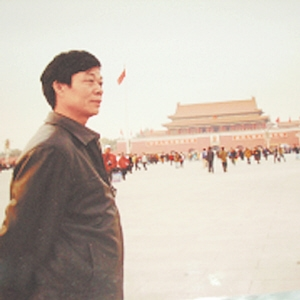
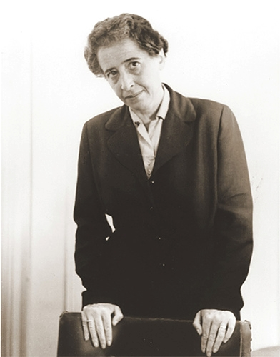

# ＜七星视点＞第十七期：从微博到炸弹——非暴力与暴力的两难抉择

# 七星视点****•****第十七期

## 从微博到炸弹：暴力与非暴力的两难抉择

### 本期热点

夏俊峰案的判决犹在耳畔回响，江西抚州的爆炸就又让我们灵魂战栗。从杨佳到胡文海，从夏俊峰到钱明奇，当生存的压力冲破了极限，当尊严被社会逼进墙角，用暴力来反击暴力，是否就成了他们唯一的选择？他们究竟是为民除害的悲情英雄，还是滥杀无辜的恐怖分子，抑或只是值得同情的可怜虫？谁该为平庸之恶承担责任？我们这个社会的希望还存于何方？观点交锋，思想碰撞，尽在本期七星视点。 

### 事件回放

2011年5月26日，江西抚州市检察院、抚州市临川区行政中心、东边区药监局旁边的马路先后发生三起爆炸，到目前为止，已造成3人死亡，5人受伤；死者中包括犯罪嫌疑人钱明奇。 

事件发生后，钱明奇生前的经历成为了舆论关注的焦点。从他留下的为数不多的资料来看，自2002年因京福高速公路临川段征地遭遇拆迁以来，钱明奇就一直致力于上访维权。他一度开通微博，企图引起公众的关注，但收效甚微。去年九月，他的上访团队也宣告解散。孤独和冤屈，迫使钱明奇走上了这样一条不归路。  **本期七星视点，将围绕四个论题，为您展现网络上关于抚州爆炸事件的各方意见。** 

### 论题之一：公务员该为体制承担多少罪责？

**在浏览各方的论点之前，请先看一则与论题相关的小故事吧~~** **小故事：艾希曼在耶路撒冷** 

** **

**艾希曼**

**汉娜·阿伦特**

阿道夫·艾希曼，纳粹德国的高官，也是二战中屠犹计划的主要负责人，被称为“死刑执行者”。艾希曼在战后被以色列特工机构摩萨德逮捕，并于1961年2月11日在耶路撒冷接受审判，1962年6月1日被处以绞刑。 对艾希曼的审判一度引起了广泛争议。有人觉得，他只是纳粹极权下的一个工具，其本人并没有对犹太人的刻骨仇恨，只是“忠于自己的职责”“行使希特勒的命令”；作为体制之下的一个牺牲品，他“甚至都不知道自己在做什么”。相反的观点认为，在极权制度下，任何一个平庸无奇的人都可能成为刽子手。“如果人们对邪恶不那么合作，不那么顺从，那么邪恶是不是还会这么畅行无阻？”设计者将罪责推脱给执行者，执行者推脱自己只是依令行事，罪行在推诿中被淡化，那么到底要去追究谁的责任？ 汉娜·阿伦特在其著作[《艾希曼在耶路撒冷》](http://wenku.baidu.com/view/3182b01252d380eb62946dec.html)中，首次提出了“平庸的邪恶”这一影响深远的概念。她认为，正是像艾希曼这样公事公办，在道德和政治上不思考、无判断的平常人，以平庸但罪恶的方式实现了纳粹极权的绝对邪恶。这种邪恶模糊了传统的善恶界线，也动摇了普通的加害／受害区分。 

#### 正方：

**钱西干：**强拆房子，领导一个个说我只是盖了个章说这里可以拆而已，我也没让下面去“强”拆啊，下面的说是上面要拆他没办法，开铲车的说他也有老婆孩子，拿棍子的说他三天没吃饭了，拿个棍子只是去站着撑场面拿点钱过日子。最后人家自焚了，熟了，你们一哄而散都是无辜的。 **[赵反](http://www.renren.com/profile.do?id=230901302) : **如果我路过钱明奇的爆炸案地点和官老爷一起被炸死，我不认为自己是无辜的，而只有耻辱感，为什么不是我了结了官老爷的狗命而被和它一锅端仿佛成了一路货色？ **杨隽：**在极权体制下，没有人能算真无辜。因为，恶法正是靠着每个人的默许而运转 

#### 反方：

**[张雪_Lyx](http://www.renren.com/profile.do?id=236314991) :**有个舍友的bf 是城管，舍友上次跟我说她bf 的一个同事就在小饭馆里吃饭，莫名其妙有人过来一顿暴打，你怎么看吧 **徐超**：公务员群体被符号化了，基层公务员大多是些普通人，就像你的父母、同学一样。将他们同少数作恶者捆绑起来符号化，就如同民族主义者们将日本人符号化后喊打喊杀一个样。**你可以谴责他们被体制驯服，但绝对没有正当的理由杀害他们。** **[李兰希♥tomorrow](http://www.renren.com/profile.do?id=255456996&ref=minifeed&sfet=502&fin=13&ff_id=255456996)** :喊着要清算要清洗旧制度与旧体系下的人的，先回家去跟你们爸妈清算吧，把他们抓起来吧，把他们头发剃光吧，把他们肋骨踢断吧，跟他们划清界限吧，你们——你们这新世界的主人，不过是四十年轮回后的又一波可怜虫罢了。 **[黄陀](http://www.renren.com/profile.do?id=241495620) **:“一厘米主权”的原理错误不在于“良心高于法律”，而在于1.回溯性刑罚是违宪的 2.**没有执行良心的责任并不意味着就应当受到法律惩罚 **3.用今天的道德标准约束以前的人也是不正确的 

### 论题之二：悲情英雄，还是恐怖分子？

#### 反方：

**林子恒 :**就像在爆炸中死去的那些公务员那样。死后大家还要盛赞钱是英雄并且对无辜的死者留下“贪官该死”的评语。在中国无论是贪官还是暴民都对自己同族的人最没有感情。在我看来这次爆炸与911有何差别 **[徐超](http://www.renren.com/profile.do?id=250619671) :**圈内基本上都是反对本拉登的，那么我无法理解那些认同钱明奇做法的人。**“冤有头债有主”的复仇跟无差别滥杀无辜的恐怖主义是有本质区别的。**恐怖主义是世界公敌，即使在极权国家也是这样。这就是为什么当年《V字仇杀队》在西方引起了很大的争议，一度被推迟上映 **[陈琮琪](http://www.renren.com/profile.do?id=322149412) :**这也是公民社会缺失的另一个注脚。他这种最后以他人生命换取关注的手段，无论怎么说都是欠妥的。我不希望他的精神广为传播，因为那样只会带来更多家庭的不幸 **[邱靖](http://www.renren.com/profile.do?id=121605549&ref=minifeed&sfet=502&fin=0&ff_id=121605549) : **钱明奇让我想起吴樾、喻培伦、彭家珍、汪兆铭。中国历史上曾有两个刺客活跃时代，一是春秋战国一是清末民国。若说豫让专诸要离荆轲是为了实践士为知己者死的人生价值，为私人承诺契约而行刺；那么吴喻彭汪则是为结束帝制而行刺。我不愿见到第三个刺客活跃时代就这样到来，**后刺客时代总是专制巅峰，嬴政和毛。** ** **

#### 正方：

**[张舸](http://www.renren.com/profile.do?id=250739405) :**豪辛格中将，科尔滕上将，勃兰特上校，贝格尔速记员。这几个人的全部罪过只不过是恰巧与元首一起开会。然而，从未有人因他们的死伤而指责施陶芬贝格。 **[张舒迟](http://www.renren.com/profile.do?id=274670309) :**当一个国家强行拆毁一个公民的房屋，对他的妻子施暴，让他的家人因得不到有效的救助而病死，剥夺宪法赋予他的各种权利，不给他任何申诉的机会，不提供任何有效的救济手段，他疾呼公正，没有回声，他恳求帮助，没人理睬，那么我认为，他与这个国家间的契约就已经破裂了，再也找不到什么立场去谴责他了。 **王虎：**没有人是无辜的。那一个个被逼上绝路奋起反抗的孤独的人，除了还在襁褓中的婴儿，每一个社会成员都对他们的绝望负有不可推卸的责任，既负有责任，当然要承担责任。**十四亿人选择了对他的漠视，就活该承受愤怒的炸弹。** ** **

#### 中间派：

**[慕容嗷嗷](http://www.renren.com/profile.do?id=235259438) :**@萧瀚：我不会将抚州爆炸案简单地贴个恐怖主义袭击标签。拉登及其基地是恐怖主义，那是因为他们针对普通平民血腥暴力袭击。而此次抚州爆炸，针对的是没有合法性的暴政政权，与通常的恐怖主义袭击并不完全相同。**我只从避免误伤无辜以及暴力的过度性质不支持，而对其中反暴政成分则支持。** **[齐速](http://www.renren.com/profile.do?id=240679248) : **在为某些暴力事件狂欢的时候，首先应该反醒，这样做，是否抑制了内心人性的阴暗面。否则，我们怎么保证自己杀完暴徒不杀平凡人，甚至将凡人和暴徒等同视之？ **[常遠](http://www.renren.com/profile.do?id=188752901) :**钱明奇的悲剧表明：杨佳“不给我一个说法，我就给你们一个说法”的声音始终回荡在这片土地上空。中国最严重的问题压根不是社会不公，“公平”对当下中国来说还是“发展需求”，奢侈品。**这个社会最可怕之处在于——它不把人当人看。不穿底裤的裸奔，全无底线。目光所及，没有一个有尊严活着的人类。** **[王倩茹](http://www.renren.com/profile.do?id=248657965) :**钱的故事越看越难过。用悲剧制造悲剧，用暴力抵抗暴力，除此之外别无他法，一个社会何以逼人至此？一方面，我们每个人都要为他的行为买单，可反过来，我们谁也说不清何时就会成为下一个他。 

### 论题之三：用暴力反抗暴力，这种行为是否正当？

 **又一则小故事：受害者和刽子手**

萨特和加缪都是20世纪名满天下的思想家、作家、社会活动家，还曾是非同一般的知交好友。然而，这段友谊最后却分崩离析。导致他们决裂的一个重要原因，是面对阿尔及利亚人民反法起义的不同态度。两人的主要分歧在于如何看待暴力和恐怖，以及是否需要在现实中保持干净的“道德之手”。 加缪一贯的道德立场是[“不当受害者，也不当刽子手。”](http://i.mtime.com/237924/blog/532572/) 1954年，阿尔及利亚民族武装阵线发动了反对法国殖民者的起义。加缪基于其反暴力原则，大力呼吁通过和平协商，在不分裂法国的前提下解决争端。 而萨特则坚决支持阿民族主义者的暴力行为，并嘲笑加缪是“软心肠的现实主义者”。萨特认为：“当你们投票选出的政府和你们的兄弟无怨无悔地参加军队，进行种族屠杀的时候，如果你不是受害者，那么你一定毫无疑问是一个刽子手。”他指出，暴力不仅是被压迫者的解放手段，而且更是具有普遍意义的弱者心理治疗方式。 最终，经过长期的暴力抗争，阿尔及利亚于1962年7月3日宣布独立，但一个民主、富强和正义的新秩序却并未如预期的那样被建立起来。新独立国家常见的专制政治、经济落后、社会腐败、甚至种族残杀，都没有能随着“民族解放”而得到解决。 

#### 反方：

**赵楚:**你可以为任何民众的抗争喝彩，表达无限的赞美和同情，可以最严厉地谴责造成暴力蔓延的治理和社会原因，但你不能为暴力本身喝彩，读书思考应该告诉你二者的界限所在。**暴力的浪潮一旦汹涌，必将吞噬一切，包括你赞美的正义。** **[刘枭](http://www.renren.com/profile.do?id=319239292&ref=minifeed&sfet=502&fin=13&ff_id=319239292) :** 暴力的结果，可从奥威尔《动物庄园》，以及毕瑟姆《官僚制》中寻找到答案，特别是后者，详细描述了无产阶级暴力革命是如何一步步退化的。 **[李兰希♥tomorrow](http://www.renren.com/profile.do?id=255456996&ref=minifeed&sfet=502&fin=15&ff_id=255456996) :** 愤怒对这个国家来说太廉价了，鲜血也是。真以为靠愤怒和鲜血能从本质上改变什么？你们不是这个国家历史上第一群这么想的人。这个国家从来就没有缺过死亡流血炸药和恐怖。 **[刘柯艾](http://www.renren.com/profile.do?id=232021512): **崇尚暴力的后果是什么？公交爆炸，地铁爆炸，大楼爆炸…… 就算炸的都是政府大楼，你就能肯定死的人都是有罪的么？那将是我们想要的生活么？**去炸的不是你，被炸的不是你，所以你才会欢呼。** ** **

#### 正方：

**[张汇泉](http://www.renren.com/profile.do?id=123305399&ref=minifeed&sfet=502&fin=4&ff_id=123305399) :**中国当前紧张的局面，作为整体的人民和作为整体的权贵资产阶级，道德责任属于哪一方不是很明白了么？如果权贵用强权扼杀了合法申诉的通道，用警察军队制止了正规起义的可能，受屈的百姓难道只有束手待毙？ **朱睿：暴力不是好东西，但有的时候，我们却不得不选择暴力**，在这一点上，先贤比我们更有血性一点，《孔子家语》这样说：子夏问于孔子曰：“居父母之仇如之何？”孔子曰：“寝苫枕干，不仕干楯弗与共天下也．遇于朝市，不返兵而斗”意思就是说，如果你跟某人有世仇，在街上碰到，手里有刀就用刀，有枪就用枪，干死丫挺的。 **[楊不悔](http://www.renren.com/profile.do?id=269516239) :**说到底是个底线问题。从前的法国人把皇帝送上断头台，把革命领袖送上断头台，动不动就暴力，现在他们领导人不会做些操蛋事出来，而他们的人民也不会再那么原始，这是互相调教出来的。现在某国羔羊对屠夫的反调教还没开始，就有羊在叫嚣滥用角顶人是有风险的了。 

### 论题之四：Evolution, or Revolution?

 **熊培云：**2011年5月26日。这一天发生了三件事，高层以最大阵容接见来访的金正日；若干青年才俊、网络意见领袖陆续表态有意竞选地方人大代表；江西钱明奇制造连环爆炸案，二死六伤，升腾起蘑菇云。中国向何处去？记住这历史的这一天，关于未来中国的三条道路，哪一条更有希望，诸位看到了吧。 

#### 温和派：

**[周雨霏Nicole†](http://www.renren.com/profile.do?id=286446217) :**＠王晓渔：公民参选人大代表和临川爆炸事件说明，竞选正在和暴力赛跑。究竟选择哪一个？这个问题不难给出答案。**如果对竞选进行压制，那等于在公开鼓励暴力。** **徐超：**改良不是一蹴而就的，需要体制内外的知识分子长期不懈地共同努力。国人之所以普遍悲观，很多时候是因为没有耐心，这也注定了改良要与炸弹赛跑。**人们过多地关注了知识分子批判当权者的责任，却忽视了他们抵制民粹暴力的责任。** **[吴尧泉Kant](http://www.renren.com/profile.do?id=229234566) :** 改变体制，先改理念，改理念重在教育长期的潜移默化。暴力革命不会有太好的结果，很有可能是倒退。体制内改革除非举国达成共识，或强人政治，不然几乎不可能。最好的方式是时间催化下的教育－也可能是唯一真正有效的方式。 **[朝夕](http://www.renren.com/profile.do?id=200486331) :**我同意变革从体制内部发生，也不反对体制外的各种方式敦促，但是我坚持不存在绝对的体制外，**每个人都是体制的一部分，傻逼比例太大，变革就永远处于准备阶段** **[孙宇晨](http://www.renren.com/profile.do?id=308446797) : **中国红三代的留美趋势很可能对于中国政坛有极大冲击，这与红二代没有留学习惯有很大区别（红一代对美帝国主义具有僵化的意识形态歧视）。现在控制中国命脉的250个家庭的子女全部都在常青藤读书，到时接班人也是他们（江山还在的话），中国出国不从政，从政不出国的定律将被打破，十年之后，拭目以待。 **李兰希♥tomorrow :**暴力当然不一定会导致专制，但是暴力会导致现有体制的破，而如何立，除非有外国力量干预，否则非常可能会有集权的力量出现。暴力年代诞生的军事领袖都是独裁者的影子。军事和暴力斗争由于其特性，需要一种独裁的力量来引导，但是之后呢？ **[姜戬](http://www.renren.com/profile.do?id=11611) : 愚公移山，智叟跑路，改良暴戾，唇亡齿寒** ** **

#### 激进派：

**[袁哲](http://www.renren.com/profile.do?id=294788544) :**有司宣扬五不搞拒绝改革。刘结巴公车上书，愿上层识时务而动，难道不温和冷静么？艾胖子发动公民调查，以公民之力调查豆腐渣，申请信息公开，难道不温和冷静么？谭某某，赵某某，倪某某哪个不是以温和冷静之态度，他们现在又在哪里？是谁在锁死温和改革之路？ **[向邦龙](http://www.renren.com/profile.do?id=141185350) :**@潘采夫：我一向反对暴力，但有一些事糊涂：卡扎菲的利比亚怎么改良？金二的朝鲜怎么改良？利比亚的起义算什么？**当统治者践踏底线，耻笑善良，有底线的人们拿什么说服它？**民主体制横行的世界，暴力革命的果实还是专制吗？是否民主的暴力得民主，专制的暴力得专制？ **林柏墙 :**中国走向暴力的结果基本不可避免，开启民智的目的正是为了确保工具能掌握在正确的人手上。对那些心存幻想的人我只想告诉你，**改良能否成功只取决于统治者的意志，不取决于你的意志，你现在想的任何一种所谓“改良”的方式，都是80年代的中国人玩剩下的，而且人家玩得可能比你好一百倍** **[周张华](http://www.renren.com/profile.do?id=341032292) :**我本身就在体制中，但对于任何想进入体制中的人，我都极力给反对意见。因我丝毫看不到从体制中改变的可能性，体制改变人的能量是超乎年轻人想象力的，而且体制中绝对不缺有良心的人。**没有外界的压力，食肉者是绝对不可能妥协的。因此我更支持有理想的人在体制外发挥力量。** **[卢滕.totem](http://www.renren.com/profile.do?id=221012787) :**跟这样一个组织谈请愿改良谈温和改革,无异于与虎谋皮。 村怪乡，乡怪县,一直怪到国务院。坦克碾上长安街.一腔希望成遗愿.  **（注：本期所选两则故事，均出自徐贲《人以什么理由来记忆》）**  **小编曰：尚未出离愤怒，便已审丑疲劳，一个麻木的社会或许才是最可怕的。钱明奇曾经温和理性过，曾经尝试利用网络微博的平台引起世人的关心与帮助，可是事与愿违。是那三声巨响和蘑菇云，才将公众的目光汇聚到这里。乐清、抚州，不过是两位钱姓老人以血肉为代价揭露出来的冰山一角。这样的县城，全国不知道还有多少。与其为暴力狂欢，不如静下心来反思：面对这类案件，我们可以做些什么？小编觉得，决意参选人大代表的王箐丰，或许给我们提供了一条道路。详情请见王箐丰《[我们为什么要参选人大？](http://blog.renren.com/GetEntry.do?id=728984433&owner=251347137)》** [王箐丰](http://www.renren.com/profile.do?id=251347137)的新浪微博地址为：[http://weibo.com/rendawangqingfeng](http://weibo.com/rendawangqingfeng) 网易微博地址为：[http://t.163.com/rendawangqingfeng](http://t.163.com/rendawangqingfeng) 同时也请关注 **@公民选举关注**[http://weibo.com/2093460771](http://weibo.com/2093460771) **@选举观察**[http://weibo.com/chinaelection](http://weibo.com/chinaelection)  

（采编：徐超 孙微阳；责编：徐超 孙微阳 王也）

** **** **
