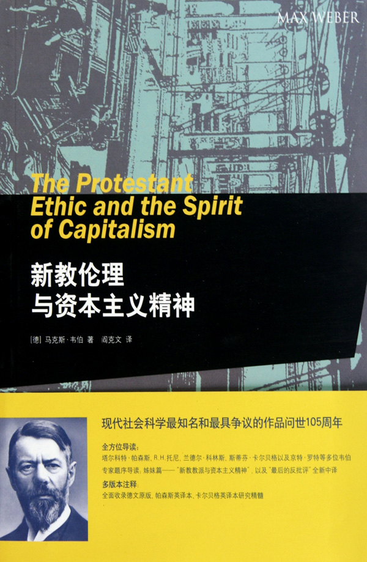
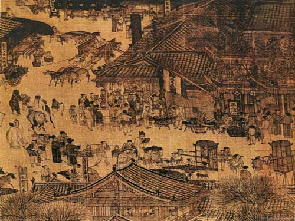

# ＜七星论道＞皆为利往：中国式“资本主义精神”？

**本期导读：** **众所周知，中国没有社会主义了？那么我们现在是资本主义吗？The people's republic of capitalism？作者的观点是，与西方近代开始产生的虽然逐利但却敬业和重视规则的资本主义精神比起来，中国算是一种特殊的资本主义。当然，要谈这个话题，马克思韦伯的《新教伦理与资本主义精神》是最好读读的。**  

# 皆为利往：中国式“资本主义精神”？

## 文/[吕晓宇](http://www.renren.com/profile.do?id=278543482)

 

中国和社会主义四字联系起来，当下剩三种情形：戏谑，入党，谈历史。有时这三者还能携手同来。当“官僚资本主义”和“权威资本主义”重新用于中国社会描写时，学者百姓点头称是。三年前，Discovery拍了部纪录片，The people's republic of capitalism（资本主义人民共和国），更是共鸣一片。

不久前，Michael Sandel（哈佛讲正义论的教授）来中国，在公讲时问及暴风雪之际提高铁锹价格是否合理；而面对同样的问题，八九成中国学生认为合理，而七成欧美学生认为不公；其遂大为感叹道：真正的资本主义精神在中国。

这个由市场供需关系出发的论断，无非捕捉了企业家、投身实业的官员们和小商小贩，以及试图加入他们行列的旁观者，当下不可妥协的盈利动机。市场经济和资本主义精神，是他们自认名正言顺的理由；这不仅让国企的汽油涨价可以理所当然，投机倒把和囤积居奇也无可厚非。然而，与其相反的是，我认为资本主义的内核倒是具有抵触这般的因素，至少近代资本主义精神是。

Franklin（本杰明∙富兰克林）在一段被称为 “美国人的自白”（《给愿意发财致富的人们一些必要的提示》）中大言不惭地宣扬地对时间、效率和资本增加的不懈追求；即便是在这段引起欧洲大陆人士极度反感的功利哲学中，富兰克林也没有宣扬一种发迹的学问（不同于当下的成功学），而形成了独特的伦理，即增加资本的责任—涵着诚实守信的精神气质。由此，资本主义精神不代指是商业的精明。

Weber（马克思∙韦伯）在概括资本主义精神的时候不忘提及，职业道德是“资本主义文化的根本基础”。可见，资本主义带着对规则和秩序的敬重。Weber后进一步阐释了其宗教积淀，把艰苦进取和节制省身的新教伦理和资本主义气质相联。值得人深思的是，禁欲主义和财富追求看似矛盾的融合。对于上帝的笃信，转入现实中就是服从上帝对于自己职业的安排，即在不止的劳动中完成救赎。换句话说，个人道德活动的评价取决于自己履行世俗事务的成效。创造财富作为世俗活动的衡量标准，在道德上允许；只有财富的积累助于贪图享乐和毫无节制的生活时才是邪恶的：

“『禁欲主义』束缚着人们的消费——特别是奢侈品方面，而另一方面，它又将获取财产这一本能意识从传统伦理中解放出来，不仅使这意识合法化，而且还将其上升为上帝的意愿…欺诈行为与冲动性贪婪受到禁欲主义的谴责，并被斥为贪婪、拜金主义，尽管财富本身是一种诱惑。” （《新教伦理和资本主义精神》）

Weber自然是认为这样的精神内质划开了新旧资本主义含义的界限，即便后世对于他唯心主义和理想主义的颇有异议。或许，我们也可以从其他层面，如罗马法而延伸出的律法，和行政机关的建构来阐释资本主义独特的伦理。但难得否定是，仅是对财富的渴求和规模化的生产，是难得解释近代资本主义的。

赚钱欲望的程度，尤其是无法区别近代和传统的资本活动的。古希腊罗马、印度、巴比伦、中国、近代地中海都出现过资本主义方式，甚至我们可以看到，它们的繁荣一度超乎近代资本主义的规模。但他们世世代代未完全打破“无商不奸”的壁垒，Weber带着西方种族论的观点，认为这些地区资本主义发展的落后的共同特征是，在赚钱谋利中擅长使用卑劣、低俗的手段。

当代中国，在关注资本主义时，侧重在它的生产管理方式，它的技术产业潮流，它带来的财富积攒；而忽略了，近代资本主义不是在满足物质欲望的横流中发迹的，却对立性地开创在对于财富使用的节制中。

有人反对资本主义中的节制传统，认定在现代资本主义发展中此般影响式微。新教伦理自然在如今社会已经不是信仰主导，但社会的现存是由道德传统、关系变革、技术手段的系统安排；理性个人选择和道德安排生活，已经难得和现代资本主义割裂了。

中国难有如此节制欲望的资本主义精神。黄仁宇先生和不少专家在考证中国未能产生资本主义时，乐于从历史传统而出，讲到私人财产权的缺失，中央集权和重农抑商，也谈及社会氏族和风俗惯例。而当代，亚太和拉美地区的后进国家，似乎也都面临着如此的困境；看重在经济财富上的跃进，而没有伦理精神的构建；资本主义本国化后失去了与之相应的伦理道德原则，由此资本主义只带上个追求财富的头衔；职业道德和社会风气的趋向，不是“仓禀实”引导的，也不是政策法规解决的。

当然，也有解释说，这是刻意的偏向。伦理构建，对于权贵资本主义的既得利益团体如履薄冰。就单单从中国现状出发，官僚怕的不是炫富的，不是批发奢侈品的，也不是为富不仁的；对投机倒把、缺斤少两的也尚可睁只眼闭只眼；还能把其推卸为为资本主义(市场经济)的腐化。而那些财富积累后，节制且理性的群体前，权贵便是七上八下，不免嘀咕：他们想干什么。

权贵们果真有这样的倾向，我暂不下定论。而从大众来说，这一场伦理课恐怕也来面临缺席的境地。现代资本主义行进的顽固心理障碍便是长期按照资本主义方式的经济行为对新秩序律法的抵制。而这种对长期行为的眷恋也不能单用对利益的追求解释，而是像是一个硬是被脱离酒瘾而百般抵抗的醉汉；过去与权贵共舞的享受“本身是一种诱惑”。

天下熙熙，皆为利来；天下攘攘，皆为利往，也许是对中国当今最生动的写照。而这，和近代的资本主义气质似乎不那么切中。如若有人说，这便是中国式的资本主义精神，我总感觉其中有股自欺欺人的味道。

 

### 【注】

本文虽论及欧洲资本主义精神和其中包含的艰苦辛勤和节制享受传统，但未一概而论说，1）资本主义精神中必然有节制因素，2）欧洲没有追求财富享受的资本家。应该说，资本主义精神的论断，诚然是唯心主义，在当时也有精神气质的函及有阶层局限。但文中的资本主义精神，是一种主流所认定的近代资本主义不可或缺的规范性力量，我也认为其在资本主义的现代化中发挥这比仅仅的资本积累和生产变革更重要的作用。  

（责编：刘一舟）

 
