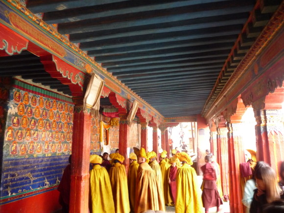
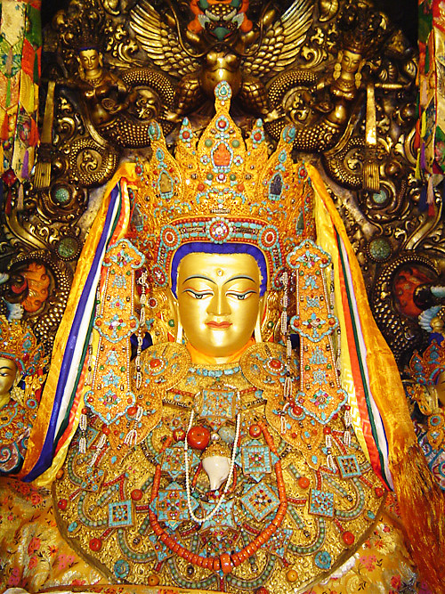
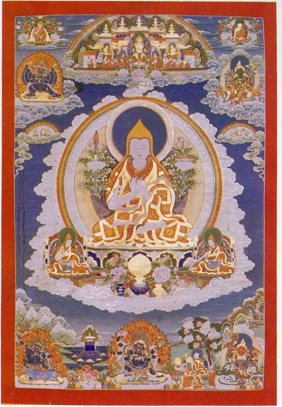
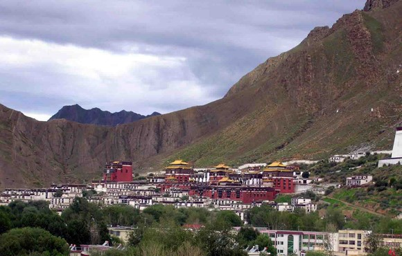
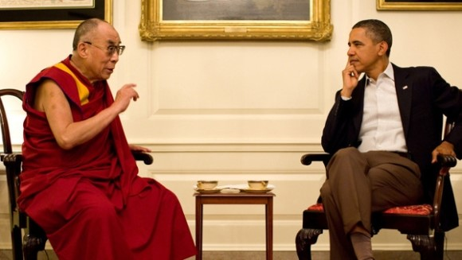
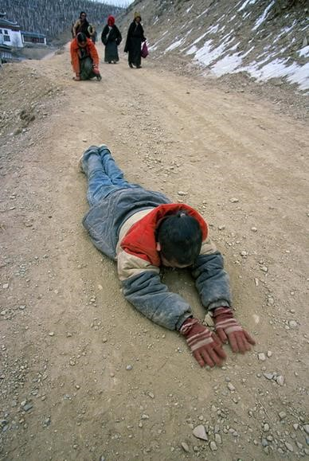
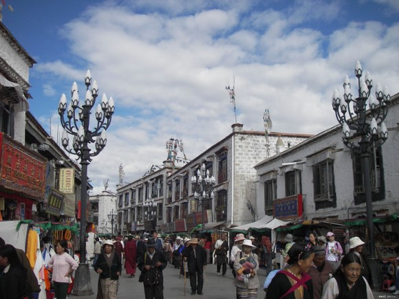

# ＜七星论道＞第七期：西藏在何处（二）

** **

#### 喇嘛的西藏

西藏最重要的一个文化特征，大概就是藏传佛教了。这对外人来说，是别具一格的文化景观，对藏民来说，则是世世代代的生活方式。但藏传佛教，在东方主义的幻想和消费符号的建构中也被曲解了。西藏成了在佛教影响下的乐土，藏民也因信奉藏传佛教而心境恬然，幸福快乐。而似乎外人到西藏的土地上感受一下这份神圣与虔诚，就会得到治愈。现在来看，西藏已经经历了很多变迁，这些变迁好坏不论，原有的社会结构和文化传统早已被改变。如果把藏传佛教看做一种涉及到社会各方面的系统，它已经不复存在了。顶多说还留有一些藏传佛教的文化遗产。而且我对这些遗产的价值也并不看好。只用这些遗产，解决西藏的问题，已经不可能了，更不要说解决他人的问题。而且这样做的动机也应该受到怀疑。

原来的藏传佛教，与印度佛教或者汉传佛教，也都很不一样，它是与西藏本土信仰相结合生出的一个变种。这样就和西藏社会结合的特别快特别深刻。深刻的意思是说，它完完全全掌控了西藏，藏传佛教以及其寺院集团，整合了西藏社会文化、政治、经济等各方面的运作，垄断了一切文化和政治合法性的权力。佛教的传播者喇嘛，都成了西藏的掌权者。所以与其说是佛教的西藏，不如说是喇嘛的西藏。喇嘛在藏语里就是上师的意思，不是所有的穿着红色僧袍的藏传佛教僧人都可以被叫做喇嘛，我们听到过最多的达赖喇嘛和班禅喇嘛，才是真正的喇嘛。喇嘛的地位，在今天仍然得到承认，只能说明他们的权力还没有完全被剥夺，还具有一定的合法性。说藏民信奉藏传佛教，就是幸福的，这是很不负责的说法。在意识形态的控制下，也许存在着被建构的幸福，但永远不会拥有自由。况且，一种宗教性的意识形态，上个大历史时段的产物，在当今现代性的潮流下，会给它的信仰者，带来怎样的紧张和矛盾啊。

（寺庙中的年轻僧人）

佛教在西藏的发展，被分为“前弘期”和“后弘期”两个阶段。前弘期是指吐蕃王朝引入佛教到佛教在与本土宗教斗争中失败的这一过程，而后弘期是指佛教在西藏复兴直至建立全藏性政教合一政体的过程。在此概述一下前弘期和后弘期两个历程，也可以帮助我们获得一个佛教传播影响西藏社会结构变迁的脉络。

佛教在西藏初传，是始于我们都熟知的松赞干布时期。松赞干布建立了西藏历史上第一个强大的王朝——吐蕃王朝。松赞干布在统一过程中，致力于改造文化来支持其统治。而当时与吐蕃相邻的各个国度，无不奉佛，尤其是在吐蕃眼中强盛的大唐王朝，所以松赞干布引入佛教也是理所当然的。松赞干布先后与尼泊尔和唐王朝联姻，娶了“赤尊公主”和“文成公主”。这两次联姻，也可以视作文化交流的契机。比如我们熟知的文成公主进藏，就带入了很多唐朝的文化成果。而两位公主进藏，都携来了佛教史中重要的佛像，拉萨也建寺庙供奉，可以看做是佛教传入的象征。在之前，西藏存在一种土著宗教——苯教，这种宗教信奉巫术，巫师对原来部落的世俗政权制约很大。佛教传入西藏，自然受到本土的苯教的强烈抵制。在有关文成公主进藏的传说当中，有一个是说赤尊公主建大昭寺老是建不成，白天建了晚上就被魔鬼毁了。文成公主特别聪明，看了风水，出了个主意让山羊驮土，建寺才成功。实际上哪有什么魔鬼，阻挠建寺的就是苯教势力罢了。

(现供奉在拉萨大昭寺内的释迦牟尼十二岁等身像）

到了松赞干布的孙子辈赞普赤松德赞，佛教才真正的在西藏由上而下推广。这是因为赤松德赞从印度请来了密咒大师莲华生。莲华生的到来，扭转了同苯教辩论中佛教的劣势，也确定了藏传佛教主要遵从密宗的走向。这时起西藏才有了正式独立的寺院和僧人制度。而又到了赤松德赞的孙子辈赞普赤祖德赞，吐蕃佛教达到鼎盛时期。这时出现的有每七户平民就要供养一位僧人的“七户养僧制度”。

吐蕃王室倡佛，动机还是对自己统治的维护，但一直受到部落贵族和苯教巫师的压制。佛苯之争，在某种程度上也是政治势力之争。随着赤松德赞在斗争中失利，他是被几个大臣勒死的，继任的赞普达磨被倒佛的一方控制，开始了第二次灭佛运动，毁坏寺庙，驱逐僧人。这次灭佛程度很严重，直接导致了佛教前弘期的结束。灭佛也意味着吐蕃王室的失势，此后随着达磨在动乱中死于非命，吐蕃王朝就分裂了，继而土崩瓦解。

吐蕃王朝覆灭后，西藏经历了长期的战乱和分裂，到了10世纪后半叶，社会安定下来，佛教有了复苏的迹象。一般认为，978年佛教从多康地区（今青海西宁一带）重新传回卫藏（以拉萨为中心向西辐射的高原大部叫做“卫藏”），标志了佛教后弘期的开始。随着佛教又从西藏周边地区传回，西藏各地的佛教很快恢复和发展起来，其规模很快就超过了前弘期。这时的佛教，受到了分裂割据的贵族的支持，从唯物史观出发一般认为这是他们推进封建化的需要。僧侣集团和权势贵族的联系越来越密切，这也就为此后全藏性的政教合一政体创造了条件。这时的僧侣们，就不仅仅是由王室强制供养的仪仗团队，而是社会独立团体。僧侣独立把持的寺院，成为了社会的文化中心，有的甚至成了地方的行政和经济中心，实际上也就是社会控制的中心。喇嘛掌权的时代要来临了。

因为西藏还处于分裂割据的局面中，地区在竞争中发展。地方势力和佛教势力结合，就形成了各自的中心，也就滋生了藏传佛教的宗派。时常提到的大大小小就有十个教派。刚开始我还觉得藏传佛教历史如此短，文化体系也不是很成熟，怎么会有这么多宗派。不同宗派的寺院，都在争夺自己的势力范围，不断斗争，这就带来了宗派的兼并。而对这些宗派的发展给予总结的，就是由藏传佛教最重要的人物宗喀巴创立的格鲁派。

（唐卡中的宗喀巴师徒三尊）

格鲁派的产生，源于宗喀巴的宗教改革，这也是对一个统一教派出现需要的应答。当时元朝的中央集权控制了西藏，结束了分裂割据形式，而佛教各教派因为有了更多世俗权力变得腐化。宗喀巴创造的格鲁派要求僧人必须严守戒律，提倡纯正佛教教义，获得了巨大声誉和当时大势力帕竹政权的支持。宗喀巴成为了西藏第一的宗教领袖，并且获得了明王朝中央政府的支持。宗喀巴死后，他的几个重要门徒分赴西藏各地传教并建立寺院。其中有代表性的有根敦朱巴在日喀则建立了扎什伦布寺。根敦朱巴也就是后世所追认的一世达赖喇嘛。15世纪中叶以后，格鲁派已经形成了一个全藏性的，政治经济实力大大雄厚于其它教派的寺院集团。格鲁派有很多的大寺，甘丹寺、哲蚌寺、色拉寺、扎什伦布寺，都是后世的名寺，这些大寺又有很多属寺，这样的关系叫做母子寺。寺院成了有大量农奴和土地的经济实体，他们的寺产主要来源于领主和民众的布施。而寺院集团的统治者，通过活佛转世的制度，将自己的统治地位延续下去。寺院集团的统治就此稳定了下来。现今我们最熟知的西藏宗教领袖达赖喇嘛和班禅喇嘛，也是最主要的两大活佛转世系统。活佛转世也就是喇嘛去世后，要去民间寻找自己的转世灵童，来做下一任的喇嘛。转世符合佛教里轮回的看法，而寻找转世灵童，实际上也是一种巫术。难道真的活佛会转世吗？对灵童的选择是经过操纵的，这样保证了寺院集团上层和贵族的特权，所以后来才有了防止舞弊的金瓶掣签。

（日喀则扎什伦布寺）

这里再以达赖喇嘛一线为例概述其后的发展。“达赖”，是蒙古语中大海的意思。“达赖喇嘛”的直译的意思是智慧浩瀚如大海的老师的意思。在各派的斗争中，格鲁派除了寻求本土帕竹政权的支持外，还寻求过蒙古部族首领的支持。1578年，格鲁派与蒙古族土默特部俺答汗建立了政治上的联盟。俺答汗赠给当时的格鲁派领袖索南嘉措活佛一个尊号“圣识一切瓦齐尔达喇达赖喇嘛”。这时候活佛转世系统已经存在，所以前两任领袖根敦朱巴和根敦嘉措被追认为前两世达赖喇嘛。到了五世达赖喇嘛的时候，顺治皇帝诏他进京，正式册封他为“西天大善自在佛所领天下释教普通瓦赤喇怛喇达赖喇嘛”，这标志着中央政府正式承认达赖喇嘛为西藏的佛教领袖。五世达赖喇嘛也就是现在的布达拉宫的建造者。布达拉宫作为西藏最宏伟的建筑，象征的就是达赖喇嘛的地位。而到了乾隆十六年，清廷正式诏令七世达赖格桑嘉措掌管西藏地方政权。格鲁派寺院正式开始掌政，西藏政教合一政体正式形成。达赖喇嘛不仅仅是西藏的宗教领袖，他也控制了行政权力。

（十四世达赖喇嘛与奥巴马谈笑风生）

（出席全国政治协商会议的十一世班禅喇嘛）

当西藏的统治阶层最早把佛教引入的时候，大概没想到后来会恭恭敬敬地请一个僧人来为自己摸顶，并把此视作莫大的荣耀。而这个僧人，在摸顶的时候，也会差别对待。达赖喇嘛对少数的贵族，会用双手为他们摸顶，对于普通地位的人，会用一只手为他们摸顶，而对于普通百姓，他就用一个带有缨穗的棍子碰一下他们的头就代表为他们摸顶。这大概不符合佛教原初的教义，而是另有象征。

西藏人的历史，多像一个磕长头的过程，在恶劣的环境和贫瘠的条件中，在一个虚构的佛的感召下，蹒跚着向前。谁都不知道什么时候到终点，我们也不知道他们是否真的快乐。外人到了西藏，装模作样地朝拜一下，感叹西藏人“穷并幸福着”、“痛并快乐着”，这些都是他们自己的看法。外人学不了西藏，但西藏却要也必须学外人。

（磕长头的藏民，与其说是信仰的力量，不如说是社会化的力量）

#### 冲突的西藏

西藏处在冲突中，这是什么样的冲突呢？是民族冲突吗？3.14以后，国内主要有两种情绪，一种是民族主义情绪，另一种还是民族主义情绪。但有学者指出，汉化西藏是个伪命题。西藏从来没被汉化，这种“汉化”实际是“西化”、“全球化”、“资本主义化”。我觉得这是有道理的。就是说西藏的民族冲突，只是问题的表现，不是根本。西藏有更大的冲突。这种冲突，可以看作是传统与现代的冲突。从一个线性历史观出发，西藏的历史发展阶段，一直是落后于时代的。还留有厚重藏传佛教文化遗产的西藏可以被看做是社会形态的活化石。当然这种形态是被破坏过的。如何破坏的大家都懂的。还仍然珍视这些遗产的藏民，在面对现代性的冲击，比如市场、世俗化、功利的价值观等等的时候，无所适从。而作为西藏现代化的干预者（这干预即有推动又有阻碍）的国家，或者汉族，就容易即被依赖又被怨恨。民族冲突，是一个政治问题，这个问题可以人为推动解决。而社会变迁带来的冲突，就不仅仅靠人为解决了。西藏，就在迟来的历史大转型，实际的文化政治权力博弈中，被扭打。这其中，有迷茫、有焦虑、有暴力。西藏如此，事实上中国也好不到哪里去，也在应对现代化时捉襟见肘。这样的中国怎么可能解决西藏问题。

（拉萨八角街，做生意和转经的藏民）

第一部分说过，找不到西藏，是因为我们是路盲，我们找错了，找到的是一个虚构的西藏而不是真实的西藏。现在，西藏的真实性被呈现出来，又发现它是非常复杂的。但找不到西藏，又是一个非常有意义的事。追问西藏在何处，实际上是一种反思，也是我们所处的时代和社会一直需要解答的问题。

（本文发表时有删节）

 

#### 【相关阅读】

[《西藏在何处（一）》](http://blog.renren.com/blog/362359989/742719465)  **《七星论道》，内容是人文思想论题的介绍与讨论，瓢虫君出品的新栏目。瓢虫君，是由北斗网打造的公共意见平台。**  

（责编：王也）

