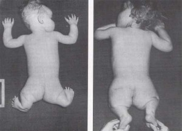

# ＜七星论道＞第五期：医学和科学的逻辑

**中医是该存该废？ 中医有没有合理性？西医就是完全科学的吗？“挺中”或者“倒中”，又都是站在什么立场上呢？** **对中医存废的争论，其实是人文思想的一个大议题，它涉及到对科学和文化的认识。偏执的观点，也会反映在这些问题思考上的狭隘。** **在站队之前，你是否能逻辑自洽地说服自己呢？本文的作者，给我们介绍了医学和科学的不同逻辑。也许你会从本文得到一些启发，而且你会觉得站队已经不那么重要了。**

### 

### 

# 医学和科学的逻辑

### 

## 文/[杨昉](http://www.renren.com/profile.do?id=263221103)（北斗撰稿人）

### 

### 

前几天看到一句话很经典，说网上关于中医存废的争论，就像月经一样每个月都要来一次。 其实参加论战双方，都有个共同的特质，就是没有自己独立的思考，被某某权威忽悠一下，就跟着人家跑了。 “挺中派”的领袖权威人物，即有学院派的衰朽，更有到处招摇撞骗的骗子。他们拒绝接受任何现代医学观念，拒绝反思中医自身的种种弊端，固步自封。“倒中派”的领军人物，自封为医学专家，抬个“科学”的棒子到处打人了。 孰不知医学本是一门实用的技术，而且可以说是人类所有技术中最特殊、最复杂的技术，科学仅仅是辅助医学发挥更好效能的工具之一，医学行为本身还牵涉到伦理学、社会学、心理学等大量非自然科学因素，面对纷繁复杂的疾病，以及与患者直接关联的社会、心理、伦理问题，医疗行为的决策过程就象NBA球员参加比赛一样，已经成为了一门复杂的艺术，不是靠简单的医学原理、简单逻辑推演能够解决问题的。  **医学是科学吗？** 方舟子说过一句话：“医学首先是一门科学，不能用不科学的东西来治病”。此话真可谓滑天下之大稽。 “科学”的基石是实证研究，而实证研究最不可少的手段就是“控制变量”，学过高中物理的人都知道，要验证牛二定律F=ma，就要让一个变量不变（如合外力F），然后通过实验观察另外两个变量的关系。这在物理中很容易实现，在生物学中也不难，无非是多弄死些老鼠就是了。 然而医学的境况则大为不同，“控制变量”是最难做到的事情，因为你的实验对象是人，而且是患有某种特定疾病的人，病人来找你不是来给你当小白鼠任你摆布，而是要你帮他解除病痛。而且同一种疾病，病人的情况千变万化，性格、体质、情绪、家庭环境、经济状况等等，每个要素对病情的发展都可能有决定性影响，要实现“控制变量”实在是难上加难。 唯一可行的做法就是把大量某个要素相近的病人分为一组，其他要素的差异视为“噪音干扰”，然后用统计学的方法进行处理，剔除“噪音”，但这就要求参与实验的病人数量相当庞大，要进行这样的实证研究，需要投入大量人力、物力，所需的经费无疑是天文数字，尤其对于那些发病率低的疾病，采集数据的周期就极为漫长，而对于不那么受重视的小病，也难得有人会投入巨额资金进行实证研究。 因此，用“科学”的方法来研究医学，这句话听起来冠冕堂皇，但实际操作起来困难重重，哪怕一个小小的疾病，要用“科学”的方法研究，都需要天文数字般的研究经费以及少则数年多则数十年的漫长研究周期。 方舟子经常挂在嘴边上说的“科学”的医学研究，其实就是指由1962年美国颁布的《科夫沃—哈里斯修正案》所规定的三期临床研究模式，即：首先在健康志愿者身上进行的相关的毒理、药理研究，证实其毒副作用在人体可以承受的范围内。第一期通过后，第二期就在小范围内对病人进行临床试验，以对药物的安全性和有效性加以验证。第三期，则是由执业医师进行大规模临床试验。三期试验都完成之后，才能进行新药申请。 然而方舟子没搞懂的是美国人为什么要推出这样的研究模式，并不是因为美国人觉悟高，科学素养好，所以高瞻远瞩的发明了一种超越过去以往一切医学文明的先进研究模式，相反，这是现代医学沿着生化科学的发展模式前进时，出现了空前的巨大危机，这才给自己打了的一块破补丁。 20世纪初，化学研究突飞猛进，人类发现、合成的新型化学物质的数量可以用“大爆炸”来形容，面对这些人类重来没有接触过的新物质，科学家往往根据它们的某种属性，推测这种物质可以治疗某某疾病，然后经过简单的动物实验，发现果然可以产生治疗效果，然后就可以上市了，甚至很多新研发的药物仅仅因为理论上合理就直接推向市场。 然而这种医学发展模式带来了很多灾难，例如1937年美国一家制药公司开发的“万能磺胺”，在未做动物实验的情况下就推向市场，结果造成了107人中毒死亡，主持该项目研究的负责人也因为内疚和绝望而自杀。 而举世震惊的“海豹胎”事件标志着原来这种生化医学的研究模式非但不是造福人类，反而是人类的一场灾难。 1953年瑞士一家药厂试图开发一种新型抗菌药物，合成了一种叫做沙利度胺(酞胺呱啶酮，thalidomide)的药物，但是试验结果与理论预期完全不符，沙利度胺没有任何抑菌活性，该药厂便放弃了对它的进一步研究。 然而联邦德国另一家药厂又开始研究沙利度胺对中枢神经系统的作用，并发现该化合物具有一定的镇静催眠作用，尤其能够显著抑制孕妇的妊娠呕吐反应，于是1957年10月商品名称为“反应停”的沙利度胺正式投放欧洲市场，此后的不到一年内，“反应停”风靡美国以外的亚、欧、非、澳等洲国家，作为一种“没有任何副作用的抗妊娠反应药物”，成为“孕妇的理想选择”。 然而“反应停”广泛使用不久，各国都出现了大量罕见的“海豹胎”畸形新生儿，即没有臂和腿，手和脚直接连在身体上，很像海豹的肢体畸形婴儿。这些产妇都曾经服用过“反应停”。 仅在欧洲和加拿大，出现的“海豹胎”婴儿大约就有8000人，并且还大约有5000到7000个婴儿在出生前就已经因畸形死亡。因此从1961年11月起，“反应停”在世界各国陆续被强制撤回，梅里尔公司也撤回了申请。经过长时间的法律较量，研发“反应停”的德国公司支付了1.1亿西德马克的赔偿，被迫倒闭。 1962年，在“海豹胎”事件的促使下，美国才出台了《科夫沃—哈里斯修正案》，规定了三期临床研究模式，药物的严格审批制度，使得临床用药的有效性、安全性都有可靠的临床证据作保证，其毒副作用也在人体可承受范围内。 这就是方舟子整天挂在最边上的“科学”的医学研究方法产生的历史背景。我想再把这句话重复一遍： 三期临床研究并非什么高瞻远瞩的，具有高度医学智慧的制度设计，而纯粹是早期的生化医学研究模式无以为继时，现代医学给自己打上的一块破补丁。 正因为如此，三期临床研究的弊端也是非常明显的，因为有关药物的临床研究仅需入选数十至几百名病人，在数周至数月内即可完成，研发者所关心的是该药物是否能使某项指标发生改变，不良反应是否在可控的范围内。例如降血压的药物，只要经观察它可以有效降低血压，又无对肝、肾、骨髓等脏器的毒性作用，大多数病人对药物可以耐受，便可以得出该药物安全、有效的结论，就可以在临床上广泛应用。但药物是否能有效降低死亡率、能否改善病人的生存能力和生活质量、药物的长期效应如何，这些问题却不得而知。 例如八十年代，医学界普遍认为抗心律失常药物可以减低心肌梗死的发作机会，于是厂商研发的抗心律失常药物，只需要证明有抗心律失常的作用，对肝肾功的损害在人体可接受范围内，那么药物就可以上市了，但是后来的循证研究发现，长期服用这类药物会显著增加患者的死亡率——这是根本无法通过三期临床研究揭示出来的问题。  

 **科学的医学** 要说最完美的“科学”的医学研究模式，那就是循证医学。 “循证医学”也被称为“证据医学”，其核心思想是：医生的个人经验、医学理论的推论、动物实验的结果、专家的看法和建议，都不足以作为支持是否采用某种治疗方法的可靠依据（当然，这些内容也可以作为辅助医生做出决策的重要依据），医生的临床治疗方案应该建立在可靠的临床证据基础上。与以往临床研究只重视短期疗效不同，“循证医学”尤其强调对疗效的评价要重视治疗对患者的远期影响，如治疗后能否使患者生活质量有所改善，能否降低死亡率等等，必须体现“长治久安”的长期效应。 什么是可靠的临床证据呢？ 最理想的证据就是经过了大规模对照研究，并且进行了长期追踪获得的证据。目前循证医学中最好的证据，大多由跨国的几十家或数百家医院共同参加，实验中都设有对照组，对成千上万的患者长达3 ～5年甚至更长时间的追踪观察。 当然，要获得这样的证据是极为困难的，对人力、物力、财力的消耗极其巨大，如果每一项医疗措施都必须经受这种严格的临床检验，那么医学将寸步难行。因此循证医学不得不退而求其次，将那些不是那么严格的证据也纳入医学证据的行列，对证据的可靠性划分了若干等级。 （1）上述涉及数十家医院的大规模研究难以执行，那么小规模的、设计良好的对照实验也是级别较高的证据； （2）再次级证据是非对照研究获得的证据； （3）来自临床经验、描述性研究或专家委员会报告的权威意见，则属于再次一等的证据。 医生的医疗行为建立在以往临床研究基础之上，以高质量的临床证据作为预测医疗效果的依据，而非仅仅凭借医师的经验和理论的推测，这样的医学无疑是真正“科学的医学”。 说到这里，我们不妨对照一下新文化运动时期的中医和西医，那时同样有诸如梁启超、鲁迅、胡适、陈独秀等一大批西方文化的介绍者把中医批得一文不值，但是从循证医学的角度来看，当时的中医和西医究竟谁更科学？ 象前文提到的“万能磺胺”“反应停”，这些药物可以说没有任何循证医学证据，甚至动物实验的证据都不够充分，相比之下，很多中药、方剂都有数百年的传承历史，而且传承方式是以师徒口传心授的方式传承，而且多数医师都在大量病人身上使用过这些药物，至少都符合上书循证医学中的第三级证据，即“来自临床经验、描述性研究”，甚至有的可以上升为第二级：“非对照研究获得的证据” 相比之下，新文化运动时期，那些鼓吹废除中医、倡导西医的人，就象鼓吹马列主义可以救中国一样，纯粹是头脑发热、缺乏独立思考的混蛋逻辑。 同时，中医现在最大的弊端，就在于极度缺乏循证医学的观念，连观念都没有，就更谈不上进行循证研究的实践了，于是每每和“倒中派”辩论时，对方要你拿出中医药有效的证据来，“挺中派”们要么哑口无言，环顾左右而言它，要么就高呼： “不要用西医的评价标准来衡量中医，这是不同的医学体系。” 这个逻辑中的“西医的评价标准”如果是指三期临床评价，那么我有保留赞同。如果“西医的评价标准”是指循证医学，那么我无保留的反对——如果中医不脚踏实地的朝着循证医学的方向前进，那么被淘汰是必然的，而且自身也根本无法向前发展。  **不科学医学** 所以，西医疗法如果缺乏循证医学证据，那么也是非科学（方舟子爱说伪科学）。中医疗法如果具有高质量循证医学证据，那就是真科学。 于是，“倒中派”会跳出来说：那你中医有循证证据么？且慢说中医，西医具有循证证据的疗法也不多，来看一组2005年的数据： Cochrane协作网是世界上公认最可靠的提供循证医学证据的网站，截至2005年8月,在该网站所有2435个循证医学的系统评价中,只有30%的证据能给相关的临床问题给予肯定或否定的答案,其余70%则都不能确定。即使是一些世界上流行的大病种,采取眼下最流行的治疗方法也没有证据证明其究竟是有效还是无效。以腰背痛为例,循证医学证据显示,全世界因为腰背痛而请病假者占所有开病假条者的1/3以上,但是从最便宜的到最昂贵的128种腰背痛治疗手段中,竟然没有一种被循证医学证据证明有效。 你看，西医真正具有循证证据的疗法也很少，这是因为开展“循证医学”研究太困难，要的经费太多，研究周期太长，所以西医的大多数疗法也还处于“伪科学”状态。 说到这里，“挺中派”且慢高兴，虽说西医目前的循证证据还不多，但人家在脚踏实地的朝这个方向往前走，那天看中国循证医学领域的权威李幼平的文章，看到一句话，颇感震撼： “WHO正式开始把世界上现在做的十万个以上的临床试验从一开始就入口把关，全部实行注册，一旦认可注册就给你一个号，就像我们现在生孩子准生证一样，一旦把你纳入进去，就全程指南监控，从标书就开始审查，是不是真实的，是不是科学的，是不是正确的，全程跟踪，直到做完，这样严格检测下来，副结果照样是结果，这是一个惊人的事情，我原来觉得做不到，但是他们做到了，这很了不起。” 这就是现代文明与中国文明的差异，西方人认定一个方向，就会千方百计、不余余力、脚踏实地而且开创性的去完成一件事情，让人感觉惊讶、叹服！ 所以，中医与现代医学的较量，不是医学体系、医学方法的较量，而是两种文明、两种文化的较量。中医人只会固步自封，自以为是，几十年来虽说政府投入了大量资金研究中医、发展中医，却没有任何具有在中医领域划时代意义的进步。  **作为技术的医学** 前面我就说过，医学不是科学，医学是一门实用的技术。科学的任务是解释现象，技术的任务是解决问题。 从患者角度来说，医生和厨师、裁缝、乐师是一样的，厨师做出好吃的菜、裁缝做出得体的衣服、乐师演奏出动听的音乐就行了，他们不是学校的老师，没必要告诉你这盘菜为什么好吃，这件衣服为什么好看，这首曲子为什么好听。同样，医生的职责是解除病人身体的病痛、不适，至于为什么会生病、为什么能治好病，并不在医生的职责范围内。 因此对于医学而言，黑猫白猫，抓住老鼠就是好猫，能治病的方法就是好方法。坊间流传这样一句话：“中医是稀里糊涂让人活，西医是明明白白让人死”，此话虽说过于夸张，但如果一种医疗方法确实对某病有很高的治愈率，就是讲不清道理，而另一种学理论能把病理讲得头头是道，但就是不知道该怎么治这个病，那么对于急需解除病痛的患者来说，前者就比后者强千倍万倍。 当然，这只是从患者的角度看问题，如果从整个医学体系发展的角度来看，如果只知道怎样治病，但不知道为什么能治好病，这样的医学体系不可能产生飞跃式的发展，这也是中医最大的弊端所在，除了吃老本，再没有推动自身向前发展的办法。所以我一贯主张中医的研究必须引入科学的思维方法和科学的研究模式。 “倒中派”们经常还会有这样的混账逻辑：既然你承认中医的理论、思维方式、研究模式都不科学，那么不科学的医学，怎么可能产生出正确的治疗方法呢？ 这种逻辑的混账之处在于：他们以为正确的治疗方法，都是象做初中物理数学题一样，依照某几条已知的原理推理演绎得到正确的答案。殊不知人体复杂得难以思议，即便现代医学弄清了全部细胞、神经、基因的工作原理，也不可能经过演绎得出正确的治疗方法。 

 他们更不懂得，“试错”才是推动临床医学发展的第一原动力。纵观现代医学史，几乎找不到哪种有效的疗法，是纯粹是通过理论推演得到的，相反很多重要的医学突破，大到具有里程碑意义的牛痘、青霉素，小到壮阳神药“伟哥”，都是医生们偶然间发现了一种无法理解的效应，然后再通过生理病理研究来解释其机制——“牛痘”是英国医生琴纳听说挤牛奶的女工接触过牛痘后不会生天花，这才研发出来；“青霉素”则是弗莱明无意中把细菌培养皿暴露于空气中才被发现。 可见，现代药学那些令人叹服的成就，大多是在不断的“试错”过程中偶然间被发现的，绝非现代医学理论有什么高明之处。  (经作者同意，本文有所删改！原文地址：
    
    [《关于中医的逻辑（1）》](http://blog.renren.com/blog/263221103/738660443)
    
    [《关于中医的逻辑（2）》](http://blog.renren.com/blog/263221103/738668611?from=fanyeNew)
    
    [《关于中医的逻辑（3）》](http://blog.renren.com/blog/263221103/738678805?from=fanyeNew)
    
    [《关于中医的逻辑（4）》](http://blog.renren.com/blog/263221103/738752382?from=fanyeNew)）

### 【相关阅读】
    
    [《中医为什么有用》](http://blog.renren.com/blog/263221103/739392341)
    
    [《我为什么反对中医》](http://blog.renren.com/blog/248926174/739595791)
    
    [《我为什么反对古西医》](http://blog.renren.com/blog/248926174/739864701)

（责编：刘一舟）
