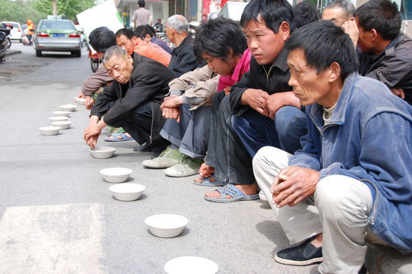
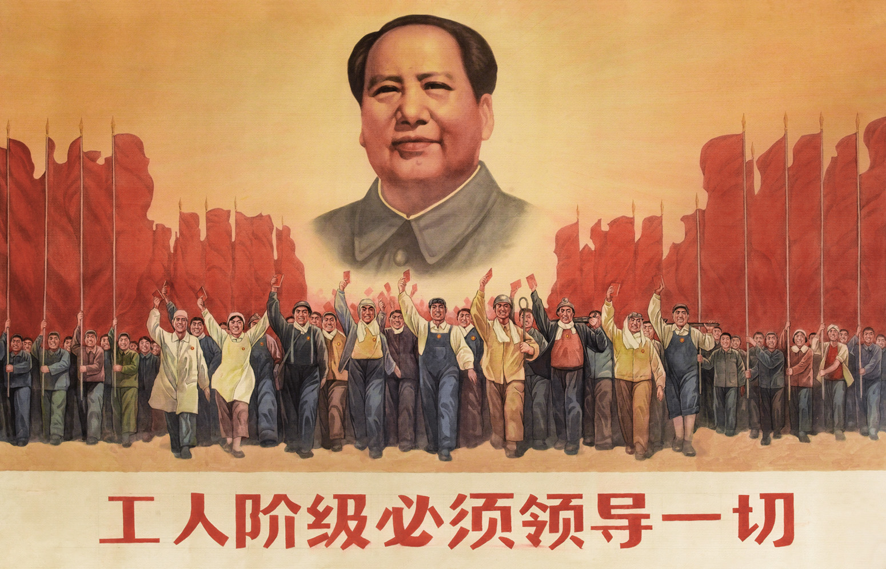
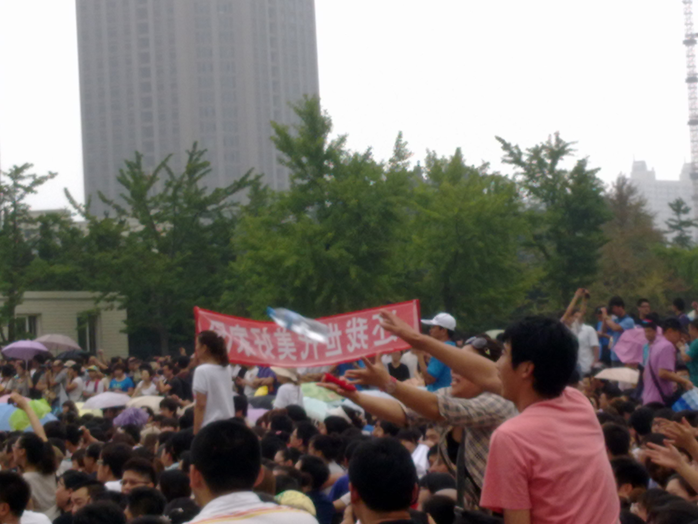

# ＜七星论道＞第十期：工作这么累，为什么还这么，没钱？

**本期导读：** **本文从社会个人不公平遭遇着眼，剑指无可避免的结构性成因。本文分为三块，每块都有其各自的逻辑，而围绕一个议题：遍身罗绮者，终归不是养蚕人。社会除了要分工，利益格局也会分化。无论几次洗牌发牌，人总要被圈内圈外。在这种看似无奈的背景下，作者仍然呼吁各人争取自己的权利，也许这样才会使规则重构。**

# 工作这么累，为什么还这么，没钱？

###  ——个人命运的结构视角解读

## 文/[王新强](http://www.renren.com/profile.do?id=236201830&from=opensearch)（上海大学）

**钱的逻辑**

工作这么累，为什么还这么，没钱？

回答这个问题，得有几个前提要搞清楚：1、要钱干嘛？2、钱和工作之间什么关系？3、没钱又怎样？

要钱干嘛？要钱来养家糊口，用钱来换取生活必须品，票子可以用来换车子、房子、女子、儿子，最基本的是：包子。车子可以是两个轮的，也可以是四条腿的；房子可以是蜗居，也可以是汤臣一品；女子可以是街边的廉价的皮肉生意，可以是裸婚，还可以是终生相伴的神仙眷侣，更可以是现在时兴的电视相亲会上对对方百般要求自己却无所谓的女人（丈母娘催涨房价）；儿子可以是农村留守二代，可以是富二代，当然还可以是李刚他儿子；包子可以是3毛钱一个的萝卜丝包子，也可以是铁道部领导们在温州吃的那一顿豪华宴，可以是上海红十字的那桌9K多的酒水。

没钱这些能不能获取？有时候能，有时候不能。在那些虽然我们还很怀念，但却不再可能的比如原始社会，这些东西不用拿钱来换，只要劳动就可以了。而且只需要很少的劳动，就可以获取足够的食物（那个社会似乎除了食物其他的需求似乎很少）。虽然在我们这种貌似的富裕社会的人们看来原始社会很穷，但似乎未必如此。那个年代早离我们远去，没有证实或者说证伪的可能。所以只能停留在我们的想象中。能证实的是，现在，我们的很多人要工作很累、很多个小时，才能换来勉强的生活。这种累，有时候是身累、有时候是心累。这一点点工资，养家应该不难，糊口尚可勉强。当然，在那些可以复印的成功学看来，这只是因为你工作不够努力。

没钱本身不是问题，但当钱成了换取生活必须品的媒介的时候，没钱就成为了问题。

钱和工作什么关系？工作是让你的老板给你发工钱的必要前提。那什么是老板？钱，和工钱的区别又在哪？为什么一个叫“钱”，一个叫“工钱”？在马克思理想状态中的共产主义社会劳动是单纯的用来获取生活资料的手段，但在所谓社会主义初级阶段，劳动不叫劳动叫工作，你工作了还不一定能够获取必须的生活资料，即使你工作的很努力、很卖劲。很多理想主义者、共产主义者们理想中的社会，跟现实——至少是天朝的现实——相差太远、太远，以致这群曾经满怀共产主义希望的氓们，已经看不到希望。无论是资本主义或者工业体系的建立已经把所有人都纳入其管理范围。任何人都必须通过这个体系获得其人口生存和延续后代的必须品。而这个体系，却不是由所谓国家主人的工人阶级控制着。资本家们、ZF官僚们、游戏规则的制定者们，还有所谓的砖家们，代行了工人阶级的职能。

**社会的逻辑**

柏拉图在《理想国》里似乎给我们设计了一个近乎完美的国度，但那似乎只能是实验室里的乌托邦，离现实太过遥远。但即使是在柏拉图所设想的理想国里，那些能够参与城邦政治生活的公民们，都是有奴隶为他劳动的。至于这些奴隶们从哪里来，不是柏拉图论述的重点。但我们却可以尽情对此发挥想象。或者，即使我们对此存而不论，他也有意无意的告诉了我们，所谓公民的政治生活，是需要物质基础的，是建立在其他人的劳动，而自己不需要去为自己的生产和再生产进行劳动的基础之上的。劳动者们之所以被叫做劳动者，是因为有一部分人不用劳动所以才形成了有意义的对比。在马克思所设想的共产主义实现之前，永远有一部分人的生活是建立在其他人劳动成果、劳动剩余的基础之上的。有时候表现为地主对农奴的剥削，有时候表现为资本家对工人的剥削，有时候表现为宗主国对殖民地的剥削，有时候表现为资本主义霸权国家对那些处在世界体系边缘的落后国家的剥削。而离我们最近的，是那些社会上层、既得利益者们对生活在底层人民的剥削。我们所处的社会正逐渐变成一个丛林社会，弱肉强食、胜者为王。

社会精英、既得利益者们利用由他们单方面决定但却为影响所有人民的规则、制度维护着他们的既得利益。上层与底层的博弈，仅仅只是一个结果早就决定的过程。他们既是运动员，又是裁判，还TMD是规则制定者。大学，以前还可以作为少数底层们用来上升的途径，但现在看来似乎这条路也已经断了。整个社会结构似乎已经陷入僵硬。农人之子恒为农，商人之子恒为商。这个僵死的结构，怎么去打破呢？全面的重新洗牌？似乎不太可能：1、洗牌本身的不可能，2、重新洗牌未必就能解决这个问题。重新洗牌也许只是另一种建立乌托邦的实验。而这，需要极大的信任自身理性的勇气。而人类的理性，在反思现代性的今天，似乎早就已经没有了信誉。62年前新中国的建立未始不是一种重新洗牌，可60一甲子 的轮回似乎又回到了历史的起点。新中国的建立未始不是另一种意义的改朝换代、王朝更迭。

洗牌，也许并不能承担整个社会结构的改变的使命。工人和农民阶级，也只是充当了被利用的大多数的角色。重新洗牌，也许我会变得有钱，但仍会有人替代我之前没钱的位置。工人还是工人，农民还是农民，既得利益者还是既得利益者。

那么，怎么办？

受马克思主义影响的共产主义实验的苏联，已经解体了；也许这并不能代表共产主义/社会主义本身的失败。同样是共产主义实验的天朝，又怎样呢？天朝面临着“那么，怎么办？”的问题。

受马克思主义影响的似乎并不只是那些后来建立社会主义制度的国家。资本主义体系也发生了巨大的变化。共产党人们发动的工人运动以及世界各地的共产主义组织在150多年前就已经开始了争取工人自身权益的斗争。这些斗争在世界各地由于各国传统的不同而以不同的形式开展。其与各国历史的结合产生了各国形形色色的民主化运动的潮流。资本主义的改良并不是资本家或者其代理人们看了《资本论》以后自发的改良，而是资本主义生产体系内部的工人们争取自身权益的斗争的结果。资产阶级自身在最初向封建贵族和国王们争取其自身合法地位时宣扬的民主、自由等观念后来也一定程度上成为工人们争取自身权益的意识形态武器，共产主义，也成为一种用来争取权益的意识形态武器。工人阶级们本来属于圈外人的角色，通过其争取慢慢的变成了圈内人的身份，开始能够享受圈内人的公民待遇。一方面我们觉得这是资本主义体系的自我完善、自我修复的体系；因为它能够吸纳来自体系内部异见者的声音并把其利益诉求纳入考虑范围之内，并逐步经验性地改良和完善自身。

**中国的逻辑**

工作这么累反而没钱，一部分是因为至少天朝的体制、结构需要一部分人没钱；如果人人都有钱了，并且有很多钱了，还要他ZF干嘛？说白了，没钱是一个“他者”，一个ZF可以用来证明其合法性的“他者”。你没钱，一部分是因为你没有成为圈内人，而只是个圈外人。咱们的蛋糕其实已经做了很大了，但至于会不会、能不能分你一块，那得另说，看你是不是自己人——圈内人。

那么该怎么办呢？我们来一场革命把那些圈内人都消灭掉，然后重新设计一个天上人间的完美制度？这似乎太过于相信人的理性了。我们需要亦步亦趋的经验主义。按照理性设计制度当然没有错，很多现行制度就是凭空设想出来的并且在运行过程中还运行良好。但一个从未经经验检验的制度直接拿十几亿甚至几十亿人的幸福生活来实验，未免太过于冒险。至于你愿不愿意做小白鼠我不管，反正我不愿意。不论是现行制度，还是重新设计的制度，都是一个逐渐完善同时又不断碰到新问题的过程，然后是接着完善。而完善的形式可以有很多种。游行、示威、集会、静坐、上访、言论自由、非暴力不合作，这些都是体制自我修复功能的体现—当然这有点太功能主义和主体主义了—这些都是在原有话语体系下承认原有制度合法性的基础上进行的体制内的修修补补。

修补的另外一个意思是，把圈外人都变成圈内人。怎么变？争取！但不是争夺。说白了是重新分蛋糕的问题。但怎么分？谁来制定规则？其实根本就没有所谓规则，规则是一个很抽象的东西。经验层面上来说，所谓规则其实就是在面对你和他人的权利受到损害的时候能够挺身而出为自己争取哪怕是1块钱的发票。杭州的哥们的罢工，也是一种规则，同时也是规则的重构。一个具有强烈权利意识的人，才能叫公民。当每个人都具有这种权利意识时，涂尔干意义上的社会事实也就发生改变了，并将带来进一步的改变—但似乎任何社会事实的改变都是一个“路漫漫其修远兮，吾将上下而求索”的过程。当每个人都具备争取自己权利的意识和能力的时候，正是人们逐渐被纳入圈内人范围的时候。也是那些普适价值能够实现的时候。普适价值，也是一种意识形态，它在被一部分人用来争取自身利益的时候也会同时反身性地被所有人利用。

去努力为属于自己的权利争取吧，人人都争取自己权利的过程同时也是一个人人都履行自己义务的过程。争取了，就有钱了，大家都有钱了。有钱了，就都有车子、房子、女子、儿子、包子了。最重要的，是票子—P-i-a-o,piao,选票的票。

 

（责编：刘一舟）

 
