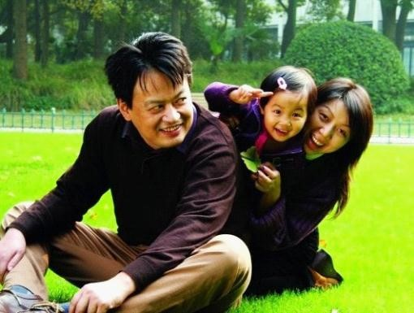
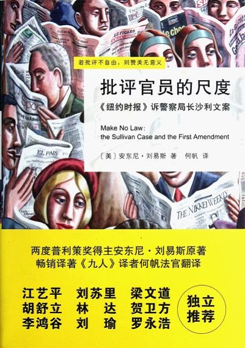
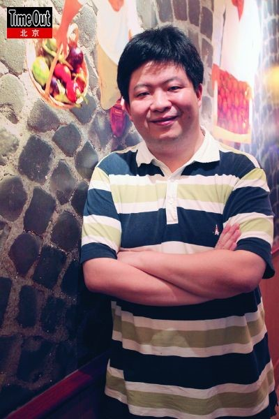

# ＜七星说法＞一个职业的明天

**编者按：**

七星说法回来了。

我们在开办《七星说法》这个栏目时曾经说过，《七星说法》所希望的，是从小处着眼，深入浅出，不拘一格。我们的目的是希望将更多对法理的探讨，对法的实践的关注带入大家的视野，从而彰显法的价值和精神。

如今我们的目的，仍然如此。但我们更希望，能够通过新的文章形式，通过不一样的文章内容，让大家看到一个不一样的《七星说法》。让大家在文章的字里行间增进对法律认识的同时，能够不觉得艰深晦涩，能够在读完文章后，对法律这两个字有新的想法。

基于这样的目的，《七星说法》在形式上和内容上都有了一些新的探索。既有对法律问题一如既往的严肃探讨，又希望能够从轻松的角度探讨它，让它以不同的面目呈现在大家面前。所不变的是，我们依然期待读者的意见。

非常欢迎建议和投稿。请@瓢虫君。

  **本期导读：**

著名刑辩律师钱列阳曾说过，“刑辩律师应该有水的心态，狭窄的地方我们冲过去，平缓的地方我们流过去，放到什么瓶子里都能够生存，必要的时候也可以冲破一切阻拦，还有滴水穿石的韧劲。”到2011年为止，我国的律师制度已经恢复了32年，可斯伟江律师却觉得，“改革开放后，律界的一个现实是，刑辩律师随着民商律师一同市场化，而前者的经济利益远难与后者相比。”不仅如此，刑事辩护律师的生存状况还并不只是经济利益无法比拟民事律师这么简单。

2011年，暨李庄第一季、第二季之后，北海四律师被拘案的发生，引发了人们关于“刑辨律师何去何从”的讨论。而就在最近，李庄又向最高法院提起申诉，请求撤销重庆市第一中级法院的“渝一中法刑终字（2010）第13号”刑事判决书，并对该案立案再审，依法宣告申请人，也就是李庄本人无罪。李庄案的前生今世，无疑是现今社会里刑事律师生存现状的一个黑色注脚。而与之相映的是，“律坛怪侠”杨金柱近期开办了公益性“律师刑事辩护实务高级研修班”，将于12月17日开始邀请刑辩律师界各泰斗授课，来自全国各地报名听课的年轻律师，已超过200名。基于此，我们本期的说法关注，着眼的是刑事律师。

除此之外，本期的《说法荐书》和《说法人物》，为大家介绍《批评官员的尺度》一书，以及他的译者，何帆。

# <七星说法> 第七期：一个职业的明天

  **<****说法关注****>****一个没有明天的职业？**

说实话，这十年，我并不十分关心刑事司法体系，今年夏天，当我第一次站在上海第二看守所门口，刑辩律师马朗对我说，中国的刑辩律师最需要的是，勇气，而不是技能。我感到很震惊。

我当时理解的勇气是律师要对抗公安、检察，有时甚至是法院，如今，看了杨海鹏妻子的案子，和宁波章国锡案子，加上李庄案第二季，我现在理解的勇气是，坚持把刑辩律师做下去，需要极大的勇气。怪不得，老友张培鸿（马朗的老板）老是喊着要退出刑辩律师界，盖其心灰意冷之极。

如果你去看章国锡、杨海鹏的控诉材料，就算一半是真的，已经触目惊心。检察机关非法羁押，欺骗，殴打，不让睡觉，拿其家人自由作威胁，没有法律，没有底线，这已经和黑社会无疑。杨海鹏的妻子在黑监狱的审讯中晕了过去，一个斯文秀丽的人，受如此折磨，得来的口供可想而知。

至今，这些案件中，没有一个侦查机关的人员遭到追诉。李庄案中，检方撤诉说是因为有了新材料，即录音材料，其实，录音材料的文字记录件，欧阳法律服务所盖章的证据，公安手中早就有，（我手头有证据证明，当时侦查人员已经取到这份证据），但是，他们隐匿了，事后，他们依然逍遥法外。更不用说，欺骗李庄，“什 么全国人民都在关心日本地震，抢盐的事，没人关心你李庄的事”之类的欺骗。难道没有法律制约这种违法吗？有，只是死法条，没有活人来执行。

杨、章两案，能峰回路转，至少现在是胶着状态，其实是和家属的清醒抗争有关。杨海鹏是法律专业毕业，又当过法官，现在是法制记者，坚持住没有去做苟且交易，通过微博揭露了检察院、工商局联合办案，将嫌疑人羁押于黑监狱，欺骗，车轮战等刑讯。宁波章国锡也是几天几夜没让睡，也羁押于小宾馆，被殴打，有伤痕，拿其妻子的自由来威胁，威胁将其妻子关入强奸犯的笼子，欺骗他。他同意虚报受贿数额，他同意换律师，他同意一切。好在他妻子陈瑛不同意换律师，不同意苟且。陈也和杨海鹏一样，开了实名博客，控诉一切。在宁波姜建高律师的辩护下，宁波鄞州区法院一审判决，适用了非法证据排除规则，排除了章国锡之前的所有口供，给章定了共6000元的三张卡，免于刑事处罚，非法证据排除的司法解释，是去年赵作海案后出台，至今正式引用，笔者所见，就此首例。检方抗诉，章国锡也认为自己无罪，认为这6000元中，仍有水分，二审如何，将是宁波司法的试金石。同样，梅晓阳（杨海鹏妻子）案，也将是上海法治的试金石。

现实就是这样，只要不死人，不重伤，就不会有侦查人员受到处分，打人的也好，引诱作证的也好，梅晓阳案子中的小佳佳也好，都安然无恙。仿佛他们练就金钟罩铁布衫，任你劈空掌凌厉，他自岿然不动。因为，启动追究的按钮在自己人手中，或者在友军手中。公安、检察之间的互相制衡已经失去，因为很多情况下，他们会这样做，谁都不是十分干净。马佳不是第一个这样干的人，联合执法，黑监狱也不是他们第一个创造的。把法律的百炼钢，化为绕指柔的，是前辈，有的前辈或已经是领导，谁又能忍心处理这些弟子？手下？功臣？

从宏观上来说，黑监狱，变相刑讯的出现，都是整个执政者的思路，仍以打击犯罪优先，保护人权置后，落后的观念必有如此副作用。如果真要平衡打击犯罪和保障人权之间的关系，至少应该有沉默权，要对侦查人员的刑讯行为作处罚，不能任他们自己查自己。然而，刑诉法修改，永远只是公检法几家的博弈，外人不足道也， 岂不悲哉！

杨海鹏也好，陈瑛也好。在自己未碰到这种悲剧之时，尚觉得刑事司法离自己很远，其实，看守所就在你身边，因为，人不是圣人，在法网已经紧密的今天，一旦被人瞄上，秒杀是自然的事情。

即使系无辜，大多数的人进去也会选择妥协，公安、检察说多少就是多少，因为受不了刑讯，锤楚之下，何求不得？家人也会选择去搞关系，这是，如果真是冤案， 侦查人员找不到证据，只有口供，往往需要犯罪嫌疑人的配合，于是，犯罪数额是可以谈判的。如果是个缓刑、轻判也就算了，家人会让嫌疑人认了算了，一旦法庭上认了，这个案子，也就板上钉钉了。西哲说过，恶棍的施舍中绝无善意。和他们做交易，吃亏的是嫌疑人。因此，如真是无辜，反而是抗争，才能赢来对自己家人公正审判的一线机会，因为，公开了，有善良的民众站在身后，体制内正直的人，才容易坚持原则，阳光之下是最好的防腐剂。

律师，面对侦查、起诉人员，作为规则上的竞技对手，当对手可以打破游戏规则，而毫发无损，律师自己万般小心，当心被李庄，这游戏，你有多强的心理能力？你可以玩多久？

良禽择木而栖，有能力的律师会选择退出，侦查人员的对手，会越来越弱，他们的感觉越来越好。当权力的感觉越来越好，打着正义的旗帜在刑讯的道路上高歌猛进，社会将迎来法制最败坏的时代，谁都不会是受益者！今天是梅晓阳，明天甚至就是检察官、法官个人，当他们面对内斗，面对更大的权力时，能否幸免？《红楼梦》里说，眼前无路想回头。问题是，你身后有余时，有没有缩手？

有学者写，国家的产生，主要是它能提供正义。无需以牙还牙，以血还血，暴力的丛林让渡于公正的权威（包括政府、法庭），一旦一个国家无法提供正义，谁都会知道，我们将没有明天！尤其是法律人！

谁都不会坚守在一个没有明天的职业！

（by 斯伟江，大邦律师事务所律师）

（文章原文链接：[http://blog.sina.com.cn/s/blog_4b9cb36b0100x7r1.html](http://rrurl.cn/uz1Skm) 经作者同意，原文有删节）

 ** <****说法荐书****>****批评官员的尺度** 

在中国政治社会学领域，这本书能出版尤为难得，译者何帆的翻译也处理得很好，让我对我国最高人民法院的法官职业水准又恢复了几分信心。

一本好书不应该仅仅满足于观点正确或者立场正确，而是应该告诉你人类获得这样的认识是经历了怎样的过程，在这些过程中的复杂考量能够让我们对世界的认识更加深入和透彻，进而认清一个好社会应该具备的一些特征，包括我们自己，应该在思想和认识方面做好怎样的准备。

这本书讲述的是1960年一名警察局长起诉《纽约时报》的诽谤故事，他发现该报纸的一则广告里面出现了不实内容，而且广告利用不实事实批评他所在警察局的管理，他认为这是诽谤了他这个实际警局负责人的名誉。

在一开始州立法院两级判决里，都认为报纸败诉，局长胜诉。眼看一份百年老报就要因此破产，美国联邦法院大法官做了纠正的判决，在判决书里，他们认为：

我国曾对一项原则作出过深远承诺，那就是：对公共事务的辩论应当不受抑制、充满活力并广泛公开，它很可能包含了对政府或官员的激烈、刻薄，甚至尖锐 的攻击。在此背景下，我们考虑了本案涉及的问题。本案中的那则广告，抗议的是我们所处时代的主要公共议题，它显然有权得到宪法的保护。

判决词主笔布伦南大法官引用了“全国有色人种协进会案”的判词：“在自由争论中，错误意见不可避免；如果自由表达要找到赖以生存的呼吸空间，就必须保护错误意见的表达”。

事实上这个判词的观点和布兰代斯大法官在“惠特尼诉加利福尼亚州案”中的观点一脉相承：

**达到心中至善的最好方式，是不同思想的自由交流。也就是说，如果我们想确定一种思想是否真理，就应该让它在思想市场的竞争中接受检验。**

我并不想就这本书的观点来嘲笑我们国家的现状，我们知道在中国批评一个官员是高危事业，过去如此，现状还是如此，并没有因为我们实施了人类最先进的文化价值观而有改变。

我是想提醒各位，在批评一个官员的时候，有很多问题，在很多国家还有不同的认识。

比如在英国，他们现在也并不认可媒体在批评官员公共事务的时候可以引用错误的事实或者证据，哪怕是出于无心之失。

又比如在我国，我们对官员或者公知的公共事务行为进行批评讨论首先不是有无权利，而是关注你到底是出于什么动机？假如批评者就是出于恶意的动机，能否有批评的自由？这恐怕不是每个人都能立即认同的。

即使在观念相对领先的美国，这个判决也没有一劳永逸解决言论自由尺度的问题，事实上媒体在批评官员和公众人物的时候，因为拥有持有言论自由宝剑，而不断突破自己的职业规范或底线，也引起了公众反感，这样在美国近年的判决又多对媒体不利，客观上让媒体又有所收敛。

关于言论自由尺度的问题，我想一个好答案绝对不能用在别人身上是好的，出现在自己身上就是难以接受的。

我最后想，美国社会就言论自由达成共识也经历了两百年的反复，我们最后走向一个言论自由的社会，也不是一日之功，也许我们要用更长的时间才能消化领先国家的文明成果。

但是日拱一卒，不期速成，这是我们国家理性又现实的公民应该具备的心态。

**虽然有时候我们不说话，但不代表我们没有为说话做准备。**

（by秋叶）

（原文链接：[http://www.70man.com/?p=9206](http://rrurl.cn/jiEv9Q) ）

 ** <****说法人物****>****何帆：做一个****“****接地气****”****的法官**

何帆，《批评官员的尺度》译者，法学博士，现为最高人民法院法官。他除了是法官、司法文化传播者，还是爱书狂、美剧迷，和他交流，你会觉得生动、有趣兼长见识。在办公室里接到诈骗电话后，何帆和同事们会争相对骗子各种盘问、各种调戏；听到司法八卦小道消息，何帆会蹦出“最有爱了”这样的词儿，让人觉得他是一位很“接地气”的法官。

**关于译作**

晶报：《批评官员的尺度》一书在深圳“年度十大好书”中排名第二，作为译者你有何感想？

何帆：说实话，既荣幸，又意外。搁在前几年，一本法律题材的书，能够进入公共阅读领域，并被非专业读者认可，就已谢天谢地了。

当然，《批评官员的尺度》能够获奖，更大程度是因为作者安东尼·刘易斯先生以如花妙笔，串接言论自由历史，界定批评官员尺度，反思新闻伦理边界，展示了他作为一位资深新闻人的深厚功力与自省精神。这本书提出的问题，虽发生在半个世纪之前的美国，却也切中当下中国诸多时弊。

**关于读书**

晶报：你多久去一次书店？

何帆：在北京，只要不忙，我一般每两个星期会去一次万圣书园。那里的社科书比较新，也比较全。每次去新书台，都有种与新书“约会”的快乐。我每次在那里都会买三四百块钱的书。我知道有读者会在万圣记下书单，然后上网店买折扣书，但我不会这么做。民营书店本来就很艰难，好的民营书店更是寥若晨星。在实体店买书，本身就是一种支持。毕竟，北京的好社科书店，只剩一家万圣了。

**关于职业**

晶报：作为司法文化传播者，你经常在微博上与别人交流，但作为一名法官，你似乎又应该与媒体保持一定的距离。

何帆：西方有句谚语：“判决之外，法官无言”。意思是，在具体案件中，法官能说的，都应尽可能在判决书里说清楚，而不是事后去补充、解释。这在世界各国，都是最基本的司法伦理。就比如现在我们俩可以谈书、谈翻译、谈司法文化，但若涉及具体个案，不管是正在审理的，还是已经宣判的，我都不能发表任何意见。微博上也是一样。

晶报：怎样做一个接地气的法官？

何帆：具备专业知识，富有人生经验，洞悉民生疾苦，还适当了解点儿传播规律。我经常鼓励同行没事就上上微博，我不是让他们发言，而是看看一些案件或公共事件被如何传播，民意如何反应，舆论如何形成，一些谣言如何扩散，一些真相如何澄清，顺便了解一些专业学者、公共人物的言论和观点。只有个人“接地 气”，才能保证判决“接地气”，也知道如何看待和处理真实民意和虚拟“舆论”。

（摘自晶报网：http://jb.sznews.com/html/2011-12/04/content_1851004.htm ）

（采编：陈蓉，责编：纳兰辰瀚）

 
