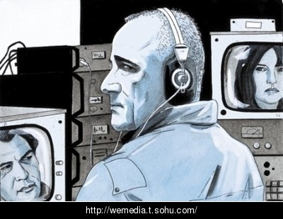
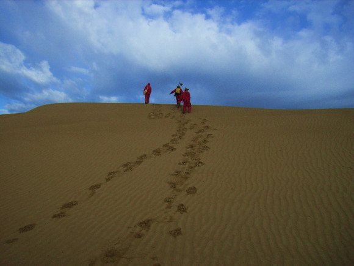

# ＜七星说法＞刑诉法的轻语呢喃和高歌猛进

**本期导读：**

在中国，房子比自由和生命重要，你或许不信，但当看到对婚姻法司解的讨论要远远广泛于刑诉法修正案草稿的讨论时，你或许信了...但是，亲，不要悲观，热乎乎的“刑诉法的轻语呢喃和高歌猛进”出炉了，为你奉上关于修正案的私家清晰解析，有攻有守的丰盛大餐。亲，做人最重要的是开心，现在不代表将来，已经进入了这样生存模式，不仅要承受得起，还要一步步的去改变，明天，能扶得起，失望之际，这也正是作者希望的。那么，来，亲，快来读读吧。

 

# 刑诉法的轻语呢喃和高歌猛进****

## **文****/****余学文（中国政法大学）**

 **前言：**

笔者只希望能写出一些自己的东西。

刑诉法修正案出台后，漫天的意见中我认为最引人注目的莫过于对“秘密逮捕”的恐慌。酝酿了数年的艰难的修法最终产生这样的效果，令人失望。但是纵观整个修正案草案，客观的说却也不是一无是处，在有一些地方还是有了可见的长进的。套用斯伟江的话，我认为此次刑诉法的修改如果说进步的话不过是轻语呢喃，但是在退步之处却是是高歌猛进。

**轻语呢喃：**

客观说此次修法有一些地方相对于旧法而言在法律文本上有一定的改进，在这里，谨举出笔者以为比较重要的亮点：非法证据排除和证人权利保障。

**非法证据排除**

非法证据排除一直是我国刑诉法的软肋，正如笔者某位老师曾言：“刑诉法的灵魂就在证据方面，我们警察为什么刑讯逼供，不就是为了证据吗？”对此看法，我深以为然。

_十四、将第四十三条改为第四十九条，修改为：“审判人员、检察人员、侦查人员必须依照法定程序……不得强迫任何人证实自己有罪……”_

_“（三）综合全案证据，对所认定事实已排除合理怀疑。”_

此次修法中加了一个对于证据确实充分的定义，前两者没什么特别的地方，最有意思的是第三点即“排除合理怀疑”。排除合理怀疑是美国诉讼法领域内的标准，著名的辛普森案就是因为警方的证据出现瑕疵而被陪审团以证据不能排除合理怀疑而最终导致不能将辛普森被定罪。在中国过去的诉讼法领域中，可能是长久以来查明真相的诉讼传统的原因或者是由于马克思的唯物论的影响，民众和公诉机关对于案件的真实表现出了极强的渴望。于是，在我们的诉讼法中的证据确实充分代表的是对于绝对真实的追求。但是不得不说，这种“上帝的视角”的追求是虚无缥缈的。这次将排除合理怀疑引入到刑诉法中，单从此条分析却是可以说刑诉法开始由上帝的刑诉法转向了人的刑诉法。此条未必确实在刑诉实务中有特别明显的表现，但是它代表的是一种理念的进步，尤为可嘉。

 _十九、增加一条，作为第五十五条：__“……_

_“__当事人及其辩护人、诉讼代理人有权申请人民法院对以非法方法收集的证据依法予以排除。申请排除以非法方法收集的证据的，应当提供相关线索或者证据。__”_

_二十、增加一条，作为第五十六条：__“__在对证据收集的合法性进行法庭调查的过程中，由人民检察院对证据收集的合法性加以证明。_

十九条和二十条是最为值得一说之处。

举证问题可以说是非法证据排除和禁止刑讯逼供的重中之重，从此条中可以推断出举证问题的脉络（仅仅是法庭上的）。首先，当事人对于申请排除非法证据当然是要提供相关的证据和线索的，很明显的一个例子就是比如当事人可以向法官展示其受到刑讯逼供的伤痕之类的，然后在当事人提供初步的证据之后，检察院必须提供其没有实施刑讯逼供的证据，一旦公诉方提出的证据不能排除合理怀疑，那么即可推定公安机关在侦查的过程中出现了刑讯逼供的行为，其获得的口供及通过口供获得其他证据将会被排除。

当然，在我国的刑事诉讼中最有可能出现的情况是，当事人连基本的证据可能都拿不出来，因为警察进行刑讯逼供的痕迹可能在上法庭之前就将被抹杀，所以说此两条法律单独实行是势单力薄的，必须还要有其他配套的规定，例如在公安机关审讯的过程中当事人有权要求律师或者监护人在场，例如快速审理原则的贯彻即不能被超期羁押等。

但是，不管怎么说，这两条在文本上构建起了非法证据排除的举证程序。

因为上文说到了非法证据排除的问题，即当事人可能连基本的证据都无法提供。本来这种问题一句话就可以得到解决，就是规定当事人有权要求其律师或者监护人在场。然而我们的立法机关似乎并不想走这条很简便的路，于是出现了录像这个不伦不类的规定。在一般犯罪中“可以”对讯问过程进行录像，而对可能判处无期徒刑或者死刑的，则“应当”录像。本来录像是对于侦查机关权力的一个限制，但是在“可以”这样的语境下却成了侦查机关可行可不行的一项权力，试问，哪个侦查机关会主动提供录像？当然，不可否认的是，毕竟对可能判处无期徒刑和死刑的嫌疑人而言，此条规定是十分有意义的，它在一定程度上可以替代律师在场权。

但是将律师在场权正式明文规定而不是这样的遮遮掩掩尚不知在何年何月。

**证人权利保障**

在我国，证人出庭率给刑事案件当事人正当权利的保障造成了极大的影响，而因为我国的“案卷笔录中心主义”（陈瑞华语）的审理方式，公诉方完全可以通过笔录的形式弥补证人出庭带来的不便，并且对于他们来说多一个证人出庭则法庭审理中就可能多出现一份变故，因此可以说证人出庭率极低对公诉方而言是基本没有影响甚至是其乐意见到的。

我国的刑诉法在过去一直没有保护证人权利的系统性规定，无权利保障导致许多证人不愿出庭的情况，这也是证人出庭率很低的一个重要原因，而这次刑诉法的修改新增了多条保护证人权利的款项。

_二十三、增加一条，作为第六十一条_

_二十四、增加一条，作为第六十二条_

证人不愿出庭有许多的原因中比较典型的安全和误工费的问题， 这次修法都有了很大的改进，从理论上说是可行的，不失为一个进步。

证人的出庭率有如双腿残疾的残障人士，残疾的双腿一个是证人权利得不到保障一个则是公诉方甚至是法院都不愿意证人出庭，证人权利保障的条款虽然不能完全解决出庭率的问题，但是至少医好了这个残障人士的一条腿，为其以后站起来增加了可能性。

证人权利保障的另外一点就是特定人员免除作证义务

_六十八、增加一条，作为第一百八十七条：_

新增的第六十八条修正案规定了一些人的免除作证义务，但是细看之下却不是十分令人满意。因为修正案规定“被告人”的配偶、父母、子女”可以不被强制到庭，但是犯罪嫌疑人的配偶、父母、子女呢？当犯罪嫌疑人尚在侦查起诉阶段的时候还不能被称为被告人，因此可以从这条中推断出在审查起诉阶段和侦查阶段犯罪嫌疑人的近亲属是有作证义务的，即侦查机关可以要求犯罪嫌疑人的近亲属为其提供证人证言。再加上我国的诉讼中，公诉方并不是很喜欢证人（因为出庭作证意味着有可能出现无法控制的情况），他们更喜欢将证人的证言做成笔录的形式在庭审中交由法官审阅。因此，这条修正从表面上看似乎是有利于排除刑诉中的“大义灭亲“的情况，但是却由于一些很小的细节而使得这种作用被架空。一旦犯罪嫌疑人的近亲属作证被做成公诉方的笔录，就算是在庭审中他们想帮被告说话都将是很困难且很危险的，因为品德证据在我国刑诉中并没有被作为出罪根据的情况，而且他们一不小心就将陷入到作伪证的地步。

综上，笔者以为这条可能并不会起到一些人预想的作用。

此条除了规定近亲属在庭审中免除作证义务以外还规定了证人强制作证，以证人“没有正当理由”为限 。但是在笔者看来这样的规定还不是很完善，甚至这样的不完善会将强制出庭作证条款架空，因为“正当理由”过于宽泛。据笔者了解，在德国刑诉法和其他一些国家刑诉法中对证人不出庭作证的理由都是有列举式的规定的，这样的规定既有利于法官斟酌同时也有利于限制强制出庭的范围而保护证人的正当权利。

但是很遗憾，修正案中并没有规定，很多人认为这是为最高法和最高检的司法解释留下空间。我只能说，但愿如此。

**高歌猛进：**

**对于危害国家安全罪的特殊照顾**

_刑诉法修正案第三十、三十六及三十九条，请自行查阅_

原刑诉法第六十四条，公安机关拘留人的时候，必须出示拘留证。

拘留后，除有碍侦查或者无法通知的情形以外，应当把拘留的原因和羁押的处所，在二十四小时以内，通知被拘留人的家属或者他的所在单位。

此处修改曾经引起很大误读，无非就是没有正确理解法条含义，简单之处略过不表。

以吴法天为代表的很多人都认为此条虽然将危害国家安全的犯罪特别列出，但是从法条上来看是限制了国家权力的，乃是一进步，然笔者对此不以为然：

这两个法条中有一个点出现了极大的争议就是“等严重犯罪”的“等”如何定义的问题，吴法天吴副教授甚至专门发了一条微博对这个等进行了语义解释，认为其有对内的等和对外的等两种，并且这两种有着极大的差别等字在文义解释中两种含义：1、“表示列举未尽” ；2、表示“列举后煞尾” 。前者为“等外” ，后者为“等内”。新刑诉法修正案草案中，涉及到“等”字的共有24处。大多数是“等外”，少数“等内”。但“等外”也必须严格限制在性质相同事项，不应当宽泛。危害国家安全罪即刑法规定的12项个罪。抛开吴副教授的内等或者外等不论，这里的等应该作何种的解释？

我们没有相应的司法解释对此说明，因此我想对此做出我们一般人的理解是没有错的，那就是这个“等”扩大了该条文适用的范围。

对于此条，还有一点是值得说明的。那就是修法将“有碍侦查”改为了“可能有碍侦查”。吴法天副教授也专门发微博解释这个“可能”的意义说：有人拿“可能”二字大做文章。我不认为增加了“可能”二字不严谨，殊不知79年刑诉有8处“可能”，96年刑诉有17处，现在的修正案有33处。例如，“可能判处死刑”的案件由中院审理，去掉“可能”就不对。在人民法院确定被告人有罪之前，侦查、起诉中的认定都是可能，而不是确定。这在立法技术上是常识。

吴教授以专业性对此“可能”做出了善意的解释，认为这是一种立法技术。

然笔者以为非也。对于“可能判处死刑”中的“可能”之意是在判决下达之前，就算是证据再怎么充分也都是“可能”判处某种刑罚，这既是对犯罪嫌疑人权利的尊重同时也是对司法权威的尊重。

然而新修刑诉法中的“可能”却并非如此，如果没有增加“可能”这一模糊的限定语，那么在侦查机关确定“通知家属有碍侦查”之前，侦查机关可不将将其排除在通知家属的范围之内，况且对于犯罪人的家属而言，24小时之内很难确定“通知有碍侦查”。

简单的说，没有“可能”，24小时之内通知家属是常态而不通知家属是例外，因为侦查机关很难确定“通知家属”在24小时之内“有碍侦查”，既然不能确定“有碍侦查”就应该通知；而有了“可能”，能够在24小时之内排除“有碍侦查”的可能性则很小，既然不能排除有碍侦查就是“可能有碍侦查”了，那当然不通知家属就成了常态。

吴副教授的两个“可能”不可相提并论：一个是扩大侦查机关权力一个则是对司法权的及犯罪嫌疑人权利的尊重，两者内涵完全不同有如何能做同一层面的理解？吴副教授偷换概念的功力实在了得。

 

**监视居住条款过于强化**

监视居住在我国刑诉法的强制手段中有着很重要而特殊的意义，修法对于监视居住做出了很大的改动。

_二十九、增加一条，作为第七十二条_

_ __三十三、增加一条，作为第七十六条：__“__执行机关对被监视居住的犯罪嫌疑人、被告人，可以采取电子监控、不定期检查等监视方法对其遵守监视居住规定的情况进行监督；在侦查期间，可以对被监视居住的犯罪嫌疑人的通信进行监控。__”_

对于被监视居住对象的规定没有新意，不过是将其他地方的一些规定移植过来罢了。之前我国刑诉法对于被监视居住人的限定已经足够严格，如刑诉法第五十七条

然而，似乎立法者觉得这样的限定还不足够，于是新增加了一条用以限定对被监视居住人实行电子监控和不定期检查等方式监视被监视居住人，并且可以再监视期间监视被监视居住人的通信。

不管是刑诉法修正案这样的规定：“被监视居住的犯罪嫌疑人、被告人违反前款规定，情节严重的，可以予以逮捕；需要予以逮捕的，可以对犯罪嫌疑人、被告人先行拘留。”还是原来的刑诉法，从监视居住的立法原意（适用对象、和其他强制手段的关系等）来看，其并不是一项十分强的强制手段，其强制性应该排在拘留和逮捕之后，因为我们能够从上述法条中明显看出来只有在犯罪嫌疑人、被告人违反了某些规定才会将监视居住改为拘留或者逮捕。还有一点，毕竟监视居住的常态是在被监视居住人的住所进行。因此对于被监视居住对象的限制也是比较大的，一般都是患有严重疾病、生活不能自理或者怀孕、正在哺乳自己婴儿的妇女，从其进行的场所和对象看应该是一种极为特殊的强制措施，应该体现的是一种人文关怀。

然而各种监视方式的涌入却使得原本应该体现的人文关怀极大的稀释。如果是过去的监视手段还能说得过去的话，新增的电子监控和不定期检查却让人感觉到了恐怖，这种恐怖是仅仅是它稀释了监视居住的人文关怀性。

我们可以注意到，监视居住的适用对象不仅仅是严重疾病或者生活不能自理、孕妇之类的，更有“因为案件的特殊情况或者办理案件的需要，采取监视居住措施更为适宜的”和“羁押期限届满，案件尚未办结，需要采取监视居住措施的。”我想，新增的监视居住的其他监视手段不是针对前两款的对象的，试问，谁会想到对一个严重疾病或者生活不能自理或者孕妇之类的人做如此的监视？

之所以说监视居住条款的增加非常可怕，笔者以为监视居住针对的对象越来越有偏向后两者的嫌疑，是因为什么是“案件的特殊情况”或者什么是“办理案件的需要”实在是太难定义，因为几乎所有犯罪嫌疑人一有不配合侦查机关办案的行为都能够被侦查机关定为案件的特殊情况或者是办理案件的需要而监视居住。此筐太大，侦查机关几乎能够对他们所有想要监视居住的人进行监视。如此一来加上强制力度的大大加强，那么犯罪嫌疑人的个人权利往哪里放？再者因为“羁押期限届满，案件尚未办结，需要采取监视居住措施的”的人本来在常态下应该是羁押期限一届满就应该释放的，监视居住如此强化，几乎所有的自由都被剥夺了，那这和超期羁押有什么区别？在这样严厉的约束下，你在被监视居住的可能时候每天警察来你家例行检查甚至是半夜来都可以（不定期嘛），并且在你的卧室、洗浴间都装上电子监控器，这样的生活有和权利和隐私而言？

  **技术侦查手段有不受限制的嫌疑**

对于技术侦查手段，估计网络上对其批评之声应该更多，然而笔者以为，对世界上各国而言，技术侦查手段并非是陌生的东西，当遇到严重犯罪的时候相应的技术侦查手段是必要的，它的高科技性和隐蔽性很容易让人想到个人权利被侵犯而不自知的情况。因此，对于已经存在的技术侦查手段一味的堵截是无用的，而将其放在阳光下反而是更好的处理方式更有利于公众的监督和其他方面的制约。

然而，新的刑诉法规定的技术侦查手段受到的限制和约束过于模糊了，令人担心。

_“__第一百四十七条公安机关在立案后，对于危害国家安全犯罪、恐怖活动犯罪、黑社会性质的组织犯罪、重大毒品犯罪或者其他严重危害社会的犯罪案件，根据侦查犯罪的需要，经过严格的批准手续，可以采取技术侦查措施。_

_“……__对于复杂、疑难案件，期限届满仍有必要继续采取技术侦查措施的，经过批准，有效期可以延长，每次不得超过三个月。_

技术侦查手段适用的对象是“对于危害国家安全犯罪、恐怖活动犯罪、黑社会性质的组织犯罪、重大毒品犯罪或者其他严重危害社会的犯罪案件”和“重大的贪污、贿赂犯罪案件以及利用职权实施的严重侵犯公民人身权利的重大犯罪案件”

首先，它的第一个问题在于没有足够的权力制衡在其中。修法中只是用一个词概括了它的批准手续即“严格”，由于这是我国第一次将技术侦查手段写入刑诉法，批准的主体是什么？有什么具体的程序？这些都没有，很容易便会令人怀疑“严格”二字在实践中的有效性。

再者，技术侦查手段规定的时间上，修法规定“对于复杂、疑难案件，期限届满仍有必要继续采取技术侦查措施的，经过批准，有效期可以延长，每次不得超过三个月。”虽然说延期需经过批准，但是其批准程序令人怀疑。因此这条对于延期的的限制可以说并无多大作用，反而是为侦查机关无休止的延长技术侦查手段的时间提供了方便之门，对于公民隐私的侵犯也将有始无终。

  **不得强迫自证其罪和分则中要求坦白的冲突** 

_十四、将第四十三条改为第四十九条，修改为：__“__审判人员、检察人员、侦查人员必须依照法定程序__……__不得强迫任何人证实自己有罪__……”_

从这条来看，确实“不得强迫任何人证实自己有罪”白纸黑字说明了不得强迫自证其罪的存在。然而现实的情况是，在规定不得强迫自证其罪的同时却没有删除久被诟病的刑诉法第九十三条：原来的刑诉法第九十三条：_侦查人员在讯问犯罪嫌疑人的时候__……__犯罪嫌疑人对侦查人员的提问，应当如实回答。但是对与本案无关的问题，有拒绝回答的权利。_

可见，不得强迫自证其罪的规定十分没有诚意，因为一旦有诚意应该就是直接规定犯罪嫌疑人拥有沉默权。总则和分则的矛盾，侦查机关应该如何处理？我们同样不得而知，但是至少他们仍然有原刑诉法第九十三条可以倚仗，进步无从谈起。

 

**后记：**笔者有一好友在微博上向我指出说“刑事司法在我国本就不是一个法律问题而是政治问题。”“在中国法律所起的作用就微乎其微。目前为止，大大小小的冤假错案都剑指政法委。但政法委的问题，目前为止是看不到解的问题”

对于这样的问题我认真思考后如下回答：

确实，法律肯定不能解决所有的问题，甚至确实不能解决中国的绝大部分问题，但是所有人却都不能否认，一部良法是一种脚踏实地的存在，它确确实实能起到作用，它不能解决政法委的问题但至少可以解决自身的问题，妄图一次性改造一切的思想只会带来曾经给中国造成了巨大灾难的整体主义思潮和我们一直在说需要告别的“革命”和“政治浪漫主义”

现实，需要一步一步地去改变，法律，就是脚踏实地的改变。

注：法条未能详尽列出，请到[http://t.cn/aurrpB](http://www.npc.gov.cn/COBRS_LFYJ/user/UserIndex.jsp?ID=2526729) 查阅。

非常欢迎建议和投稿。请[@瓢虫君](http://www.renren.com/profile.do?id=362359989)。 

（本期编辑：张蒙）

 
