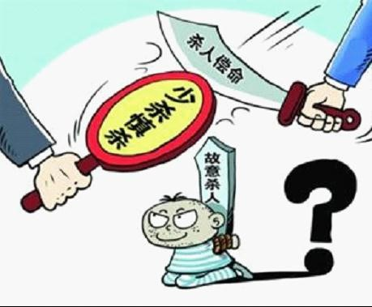
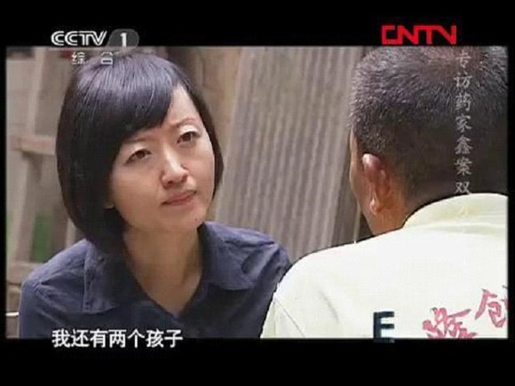

# ＜七星说法＞第三十一期：斩立决，谁说了算

**本期导读：近期的[敖翔案](/?p=21615)引发众多讨论，许多人都将其与药家鑫案件进行对比。除了均犯故意杀人罪外，两被告都有自首、积极赔偿的从宽处罚情节，但药家鑫被判处死刑立即执行，而敖翔却被判死缓，普通民众纷纷质疑，法学界却认为甚为合理。可见，“杀人偿命”的民间传统观念与法学界当前“少杀、慎杀”的刑事司法理念存在激烈的碰撞。本期说法主要谈法官是如何确定理当判死刑的罪犯应判死刑立即执行，还是判死缓。**  

# ＜七星说法＞第三十一期：

## 斩立决，谁说了算

 

2010年，药家鑫，西安某音乐学院学生，开车撞伤人后因担心“农村人难缠”，又向被撞者张妙连捅数刀致对方死亡，后自首。撞人后不救反而连捅数刀引起广泛愤慨，被告是“富二代”“军二代”谣言四起，“激情杀人”的辩护被指司法不公，网络一片喊杀声。2011年，陕西省高院判处药家鑫死刑立即执行。

2009年，李昌奎，云南巧家县村民，因琐事矛盾，奸杀同村少女王家飞，并杀害受害人3岁弟弟，出逃后自首，一审被判死刑，但云南省高院在二审中以李昌奎有“自首”情节，改判其死缓，引发社会热烈议论：药家鑫死了，李昌奎凭啥活着？2011年，云南省高院再审，认定原判定罪准确，量刑不当，再次改判李昌奎死刑立即执行。

2009年，吴英，浙江东阳本色集团老板，因涉嫌集资诈骗罪，浙江省高院终审判决死刑立即执行。然，上至政府高官、法学学者、经济学家，下至普通群众，社会各界高呼“罪不至死，刀下留人”。2012年5月21日，最高院死刑复核驳回该判决，浙江省高院判处吴英死刑，缓期二年执行。

2011年，东莞理工学院学生，在女厕所猥亵同校女生，并在受害人激烈反抗的情况下杀害该女生，遭通缉后自首。2012年5月25日，东莞市中级法院以敖翔有“自首”情节，判决敖某死刑，缓期两年执行。舆论再次哗然，“‘有激烈反抗行为’又是‘激情杀人说’？”“仅因自首就可以免除一死吗？”等新闻标题充斥各大媒体。

这些案件中，可以明显看出**舆情民意对死刑裁量产生的巨大影响**。正如有些媒体所报道的，药家鑫、李昌奎被判处死刑立即执行，吴英被判处死缓，舆情民意的“围观”及其强烈反应无疑起到了非常重要的推动作用。而敖翔案件还未尘埃落定，媒体的报道已经铺天盖地，专业的、不学法的，认真的、扯淡的，各种网络评论不绝于耳。

那么，**罪犯死还是不死，究竟应该听民意，听法官，还是听法律的？**

 

### 死刑立即执行还是死缓，听法官的

犯故意杀人罪，决定他应当死(死刑立即执行)，还是可以不死(死刑缓期两年执行)，当然应该由法律决定：

刑法第四十八条：“死刑只适用于罪行极其严重的犯罪分子。对于应当判处死刑的犯罪分子，如果不是必须立即执行的，可以判处死刑同时宣告缓期二年执行。”

从法条判断出两点：

**1、 死缓适用于罪行极其严重的犯罪分子，罪该处死。**

**2、 可以判死缓的是那些“不是必须立即执行死刑”的犯罪分子。**

再通俗点，第一句话是说，罪该处死，手段残忍，情节、后果极其严重等是讨论判死刑、死缓的基础，不是决定死立执的理由。这是整个问题讨论的基础。否则就会陷入与“杀人偿命”的观点对决的口水仗。

第二句话是说，在罪行极其严重的情况下，因为具备一些从轻减轻情节，不是必须立即执行死刑，适用死缓。

而哪些情节属于“不是必须立即执行”，却没有具体的立法和司法解释。尽管在司法实践中，法官会将“犯罪动机不是特别恶劣，被害人有一定过错，犯罪人有积极悔罪表现”等等作为“不是必须立即执行”的情节。但这些判决或司法实践中总结的情形并不具有法律约束力。各地在实践中，对“不是必须立即执行”的理解和适用各行其是，没有统一适用的立法规则和司法解释，一方面，可能法官的自由裁量权过于膨胀，易滋生徇私枉法的腐败行为；另一方面，还容易引发舆论关于司法信任、司法腐败的质疑，甚至导致民意干预司法，对个案而言，可能会妨碍司法公正性，可能会促进司法公正，而整体而言却是破坏了司法的独立性。当然上述问题有待学术探讨和立法完善，本文不对此做任何深入讨论，只借此得出一个结论：**被告人是否属于“不是必须立即执行”，仍然依靠法官的综合判断和内心确认。**

介入具体案情来看，药家鑫、李昌奎、敖翔都是犯故意杀人罪既遂，故意杀人的事实清楚，证据确实充分，属于罪该处死的犯罪分子，即可能判死立执，也可能判死缓。吴英犯集资诈骗罪，虽然对于是否应当认定为集资诈骗，法学界、民间议论纷纷，但按照法院判决认定“罪该处死”，也是可能判死立执，也可能判死缓的类型。

当具备从轻减轻情节，并被法官认定为属于“不是必须立即执行死刑”的情形，则可以适用死缓。基于上述案件，以下探讨三个从轻或者减轻处罚情节：**自首、立功，以及被告获得被害人亲属的谅解。**

 

### 自首、立功可以免于一死吗

刑法第六十七条规定：“对于自首的犯罪分子，可以从轻或者减轻处罚。”

2010年2月8日最高院颁布《关于贯彻宽严相济刑事政策的若干意见》规定：

“对于自首的被告人，除了罪行极其严重、主观恶性极深、人身危险性极大，或者恶意地利用自首规避法律制裁者以外，一般均应当依法从宽处罚”。

“对于被告人检举揭发他人犯罪构成立功的，一般均应当依法从宽处罚。”

自首体现出罪犯一定的认罪或悔罪态度，其人身危险性已在一定程度上得到减弱，因此，刑法将其规定为法定从宽处罚的情节。但是应当明确，刑法的规定自首是“可以从轻”而不是“应当从轻”。法官还会考虑到其他情节，如在“犯罪情节特别恶劣、犯罪后果特别严重、被告人主观恶性深、人身危险性大”的情况下，自首情节又不从轻处罚。

药家鑫与李昌奎均被认定为自首，但最终都未给予从宽处罚。

李昌奎犯罪后，虽然是迫于通缉的强大压力才投案，且在第四次供述的过程中才交待全部犯罪情况，但从原一审判决到二审判决，从再审判决到最高人民法院复核裁定，均认定被告人在案发四天后主动至公安机关投案的行为构成自首。但因为自自首有被迫因素，且在庭审中供述时有反复，同时犯罪手段特别残忍、后果特别严重、情节极其恶劣、人身危险性极大，所以最终并未从宽处理。

药家鑫在其父母带领下到公安机关投案并如实供述罪行的行为应认定为自首，且相当稳定，没有任何反复，加之其还存在为初犯、偶犯情节以及被告人认罪悔罪、愿意赔偿、一贯表现良好等酌定从轻情节，若没有其他加重情节，理应从轻处罚，但法院未阐明“不从宽处理”的具体理由，只是简单地以“不足以对其从轻处罚”为总结。判决书理应详细叙述在交通肇事仅致人伤害本可避免死亡的情况下，不顾被害人连连哀求，连续捅刺数刀等酌定从重情节，因而不予从宽，**以增强死刑判决的说理性，从而避免合法判决却留下屈从舆情、民意压力的口实。**

敖翔案的一审判决书关于适用死缓的理由如下：“被告人敖翔犯故意杀人罪，手段残忍，情节、后果极其严重，论罪当处极刑，鉴于被告人敖翔有自首情节，归案后认罪态度良好，可对被告人敖翔判处死刑，不必立即执行。” 可见，**本案中法官将自首作为从轻或者减轻处罚的依据，因此对于有可能判处死刑立即执行的敖翔而言，从轻或减轻处罚即意味死缓。**

区别于药家鑫、李昌奎、敖翔，吴英所犯为经济犯罪，刑法修正案（八）废止了包括“金融凭证诈骗罪”等13种非暴力犯罪的死刑，但仍然保留了非法集资罪的死刑。吴英案也引发了社会各界关于非暴力犯罪应当废止死刑的大讨论。本文对此不作深入，只讨论根据现行法律，经最高院复核后，改判死缓的依据。

浙江省高院经重新审理后认定，吴英集资诈骗数额特别巨大，危害特别严重，应依法惩处。鉴于吴英归案后如实供述所犯罪行，并主动供述贿赂多名公务人员并经证实的事实，对吴英判处死缓。**吴英供述多名公务人员贿赂的行为被认定为立功，本案中法官将立功作为从轻或者减轻处罚的依据，给予从宽处罚。**

 

### 获得被害人亲属的谅解等于拿钱买命吗

2007年1月，最高院颁布《关于为构建社会主义和谐社会提供司法保障的若干意见》等司法解释明确强调：案发后真诚悔罪并积极赔偿被害人损失的案件，应慎用死刑立即执行；

2010年2月，最高院出台的《关于贯彻宽严相济刑事政策的若干意见》第23条：“被告人案发后对被害人积极进行赔偿，并认罪、悔罪的，依法可以作为酌定量刑情节予以考虑。”

被告人通过本人或其亲属、朋友向被害方积极给予物质赔偿的，反映了被告人的悔罪态度，也有助于减缓被害方的痛苦，减轻犯罪的危害程度。在此情形下，被告人积极赔偿体现了其主观真诚悔罪态度，是其人身危险性降低的具体表征，故应该成为衡量其所判的死刑是否“不是必须立即执行”的酌定量刑情节。

**最高院的司法解释表明，民事赔偿情况对被告人刑事责任的承担是有重要影响的，法院可以据此对被告人适当从轻处罚。**据北京市首信律师事务所杨学林律师了解，自2007年以来，对于那些应当处死刑的罪犯，如被害人亲属予以谅解，法院一般会判死缓。取得被害人亲属的谅解的形式大多是进行实质性的经济赔偿，但并非 “以钱买命”、“花钱买刑”。但如果被告人积极赔偿并非出于真诚悔罪，只不过是逃避死刑适用的藉口，罪犯行为极其恶劣，被害人亲属不予原谅，也不能排除对其适用死刑立即执行。而不明法理的群众往往并不清楚，一概否定甚至“阻止”被告方积极赔偿寻求和解的行为。

另一方面，在实务中，有些被告方虽真诚悔罪并积极赔偿，但被害方拒绝接受，坚决要求判处被告人死立执，通过网络舆论，甚至采取上访、闹事等方式向法院施压，有时法院会迫于各方压力对被告人适用死立执。在这种情况下，**法院罔顾被告人的真诚悔罪、积极赔偿之表现，迫于被害方的压力而对被告人适用死刑立即执行，在法律上是没有任何根据的。**

在李昌奎案中，判死缓的原二审法院曾将李昌奎亲属的积极赔偿作为改判的理由之一，但因为先期的赔偿是在有关组织责令赔付下给付的，根本谈不上什么积极赔偿，未能被再审法院所认可。

在药案中，药家鑫父母有积极赔偿、认罪悔罪，求得被告人原谅的行为，按照法律规定，药家鑫父母如能给予一定的赔偿，加上药家鑫没有预谋犯罪和自首情节，“斩立决”或可避免。那么，为何法院否定了这一从轻理由？事实究竟是如何的？

2011年2月，药家与张家第一次见面，药母向张妙父亲下跪,表达了深深的歉意，当事双方进行过和解。后在一审前的民事调解中，双方基本达成一致意见，药家筹款30万，外加一辆车，作为对张家的赔偿。但张妙的丈夫在打电话问过代理人张显后，以张显不同意而拒绝签署调解协议。

11年4月2日，西安市中院法官曾告知被害人家属药庆卫的真实身份和家庭情况。张显应该知道药家真实的家境，但其仍在微博上发表药庆卫是“军代表”“负责军品采购”的言论。社会民众不了解事实，舆论一边倒地同情被害人，将药父积极寻求和解视为“拿钱买命”。

一审判决，判处药家鑫死刑，附带民事赔偿4.5万。张妙的丈夫不服，以赔偿数额太少，要上诉。然而，在一审判决上午下达后，中午11时46分，上海学者傅蔚冈发布微博：“凡转一次本微博，我将为张妙女士的儿子捐助1元人民币。”几小时后，微博转发数就已超过10万次。最后，傅蔚冈捐出款项总计54.5万元。据张显所说，王辉收到的社会各界捐款有16万元，加上傅蔚冈和周斌对张妙儿子发起的捐款，总共是92万元。

当此之时，王辉放弃了上诉，说再也不要药家的赔偿，只要药家鑫的命。

**社会舆论群情激奋，以社会捐款来抵制“以钱买命的司法不公”，大规模的网络捐款封死了赔偿和解这条路。**

张显在微博上将药家捏造成官僚权贵家庭，公众因对司法的怀疑和缺乏信任，产生对抗情绪，发动网络捐款，支持张家拒不接受赔偿款，并提供捐款援助，阻却了药家向被害人亲属求得原谅的道路。连被害人丈夫王辉也说：“没有张显，药家鑫肯定被判死缓了！”

在巨大的网络舆论压力下，药案匆匆结案，4月22日药家鑫一审被判死刑，5月20日二审维持一审判决，6月7日药家鑫被执行死刑。事后，张平选在接受柴静采访时说，“我对你说个实话，我还有两个孩子，我必然还有依靠，药家现在没有一点依靠了，就那一个孩子，我不知道药家鑫他妈他爸这人究竟是个啥心情，咋想。”

  

一方面，药家鑫案中，尽管药家鑫及其亲属有积极赔偿的意愿，同时被害人家属也曾经有调解的意愿，应当考虑酌定从轻。但法院最终却以被害方拒绝接受为由否定该从轻理由。**主审法院以被害方拒绝赔偿为由，而完全无视忽视药家鑫真诚认罪、悔罪的主观心态，是有悖于我国慎用死刑的死刑政策。**

另一方面，如果双方和解的机会没有被人为地一次次阻断，也没有网络舆论的巨大压力，如果获得了被害人家属的谅解，双方的遗憾和痛苦会不会都少些呢。可惜，**这个世界没有如果，只剩反省，和下一次的反省。**

 

### 少杀慎杀，逐步废除死刑

截至至今，全球已有120多个国家和地区废除了死刑，或者保留死刑条款但不执行死刑，废止死刑已成为全球范围内死刑变革的主旋律。虽然目前中国是全球保留死刑刑种最多、实际适用死刑最多的国家之一，但我国在2007年最高院收回死刑核准权， 2011通过《刑法修正案（八）》废止13种非暴力犯罪的死刑，可以体现出 “慎用死刑”确实是我国刑事司法理念的改革方向。

我国当前死刑政策是**“保留死刑，严格限制和慎重适用死刑”**，简单而言，就是“少杀，慎杀”。“少杀”强调的是减少死刑的适用，而“慎杀”指应尽可能地适用自由刑等其他刑罚方法，即便是不得已而适用死刑，也要合理、有节制、合乎事宜，决不能滥用。

刑法学家马克昌认为，不轻易判一个人死刑，是对生命权的尊重；但中国目前废除死刑，还不具备条件。“杀人偿命、欠债还钱是老百姓的口头禅。杀人者死，已经成为中国人的一个观念，要改很难”。但是根据近几年的案件可以看到，从药案一审判死刑，李昌奎案二审判死缓再审判死刑，吴英案最高院复核后判死缓，到敖翔案一审判死缓，法官开始更多地考虑从宽情节，坚持“少杀慎杀”的刑事司法理念。**社会各界也更多地开始思考，非暴力犯罪废除死刑的合理性，逐步废除死刑的可能性，以其他方式替代死刑威慑力的刑罚执行方式。**

根据刑法修正案八，罪犯判处死缓后，即使确有突出表现并不断减刑，至少也要服刑27年。一个20岁刚出头的年轻人服刑27年，和死刑立即执行，哪个更痛苦？或者说，**斩立决对被害人家属带来的抚慰会更多吗**，这得打个问号。

 

### 【深入阅读】

 [对死刑适用标准的两点看法 ](http://rrurl.cn/8St2th) [纪实采访去药家鑫家看望了药家父母](http://rrurl.cn/li1620) [药家鑫案中张家所获捐款去了哪里](http://rrurl.cn/76Fhml) [柴静药家鑫,柴静专访药家鑫案双方父母](http://rrurl.cn/f7Za72) 法宝期刊【法宝引证码】 CLI.A.1158997 《关于中国现阶段慎用死刑的思考》，赵秉志，北京师范大学   **北斗读者交流问卷调研地址：http://www.sojump.com/jq/1488982.aspx**  

(编辑：林骥，陈蓉)

 
