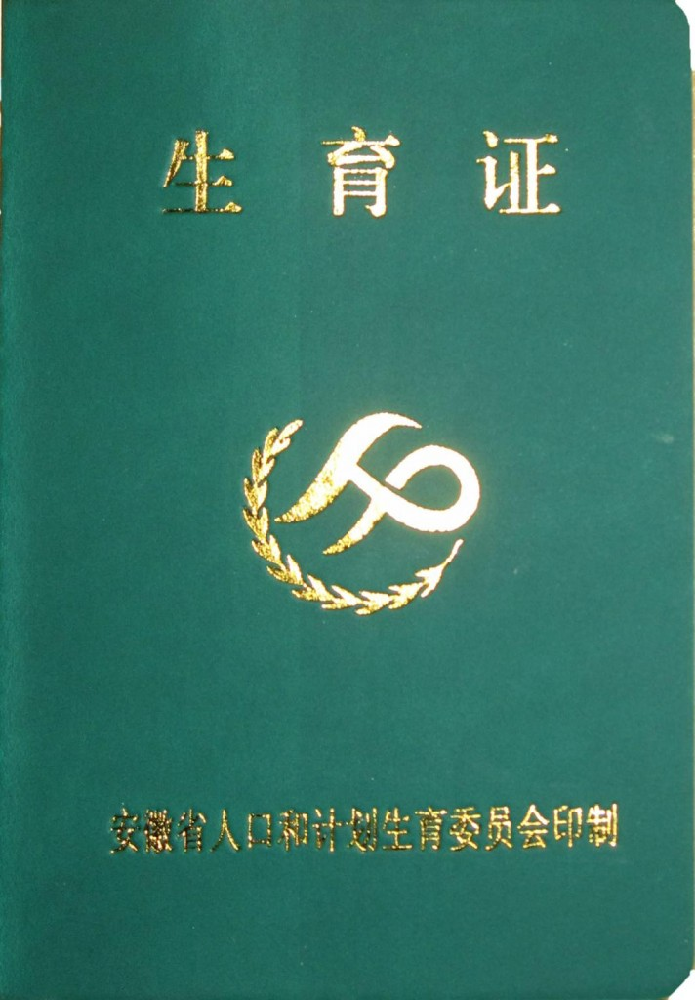

# ＜七星说法＞第三十三期：陕西孕妇强制引产案——指标下的生命

**本期导读：最近安康市镇坪县妇女冯建梅，因交不出4万元押金，怀孕7个月被计生部门强制引产的事件引发了众多关于“强制引产是否违法”、“政绩杀人”、“计划生育政策施行30年了该到头了”的讨论。本期说法将从冯建梅生育二胎是否合法，4万元押金到底是社会抚养费还是罚款，引产是自愿的还是强制的，强制引产者是否要承担法律责任等角度对本案进行深入研究，以期能够对计划生育政策下的种种问题有初步了解，引发更多解决问题的思路。**  

# 陕西孕妇强制引产案

## ——指标下的生命

 

“冯建梅的所有思维都在那一瞬间定格，引产针的药水已经被注入体内！她并没有感觉到疼痛，但是恐惧和哀伤却把她的心撕碎。她的眼睛被计生干部捂住，但她似乎能透过那双丑陋的手掌，看到自己腹中的孩子挣扎着，最后归于沉寂。”

安康市镇坪县曾家镇政府非法拘禁一怀孕7个月的母亲，在没有通知家人的情况下，将其肚中胎儿强制引产。对此，镇坪县人口和计划生育局在其官网回复称：该孕妇属于政策外怀孕，通过该镇干部“反复做思想疏导工作”，“孕妇同意落实终止妊娠术”，并与于6月2日15时40分接受终止妊娠术。

网络、现实、国内、国际、法律、道德……陕西孕妇引产案引起了广范围的激烈讨论，莫衷一是的认知和模棱两可的事实将案件导向了复杂的漩涡。在此，我们希望借由此文还原案件的真相，对于该案争论的焦点和法律问题进行回答。

 ** ****冯建梅是有资格生二胎的****** 

根据陕西当地公安部门的调查，冯建梅的身份信息为：女，汉族，非农业户籍，1989年12月25日出生于内蒙古呼伦贝尔盟根河市新兴路南平海巷235号。而她的丈夫邓吉元的户籍信息则是所属陕西省的农村户口。冯建梅自己并非独生子女，在她之上还有一个姐姐。同时，冯建梅和邓吉元之前已经生了一个孩子，是一个女孩。

比照《内蒙古自治区人口与计划生育条例》（第十七条至第二十三条）和《陕西省人口与计划生育条例》的相关规定（第二十三条至第二十五条），邓吉元冯建梅夫妇的确是不符合生育二胎的法律规定。

但是有没有办法解决这个问题呢？《陕条例》第二十五条规定夫妻双方是农村户口，只有一个女孩的，可以生育第二胎子女。同时，农村中某些群众在特殊困难的情况下，允许间隔5年后生第二个孩子。**冯建梅的第一个孩子是女儿，已经****5****岁半，照理说，只要****冯可以把户口迁至男方，将自己也归于农村户口，便可以符合生育二胎的政策，****应该可以生二胎，但是需要办理准生证等证件。**镇坪县很显然也明白这一点，镇坪政府通报是如此表述的：2012年3月，曾家镇计生办查出冯建梅怀孕3月有余，“三查”工作人员立即要求冯建梅迅速迁入户口，办理生育证。后两个月中，镇计生办工作人员先后多次登门督促冯建梅迁入户口、办理生育证的情况。也就是说，从计生局一直催促冯建梅办理准生证而并非要求冯建梅采取其他节育措施、缴纳罚款等事实可以看出，冯建梅生育二胎很有可能是合法的。

邓吉元也告诉记者：“依照我们家的情况是符合二胎生育政策的，关键是我要将老婆的户口迁过来，并办理生育证明。”并且他还表示：“因为程序实在繁琐，我要把材料寄到内蒙古去，所以耽误了不少时间，不过我确实已经在办理了。”

**能否在法律规定的情况下享受生育二胎的政策，对于邓冯夫妇来说不是绝对不可能达到的目标，而仅仅是一个时间问题。**但是很明显，镇坪县政府计生工作人员没有那么多的耐心可以消耗，而是迅速采取了行动。也许正如邓吉元所说的那样：“生育证明与户口不是关键，就是因我没有在规定时间交上四万元罚款，所以才导致了这样的事情发生！”

  **四万元押金原来不是社会抚养费****** 

那么上文所提及的四万元押金到底是什么呢？原来2012年6月2日当天，远在江苏南京的邓吉元二姐邓艳接到曾家镇计生办的袁芳发来的短信：“4万，一分不能少，我都给你爸说了，他说没钱那还能怎样，还是你们大意了没当回事。”至于这笔押金属于什么性质，发送短信者声称，这是因为邓冯夫妇超生，所以必须缴纳的社会抚养费。

随后记者对此进行了调查，曾家镇计生办的袁芳证实确有此事，只不过她改口这4万元系户口保证金，只要冯建梅把户口搬过来，钱还是要退的。

根据《陕条例》第五十六条的规定：违反本条例规定，多生育一个子女的，由县级计生部门或者其委托的乡（镇）人民政府、街道办事处按照规定征收社会抚养费。

假如那四万元的确是“社会抚养费”，计生办似乎以这个名义向邓家收取费用十分合理，但是实际上这个行为却出现了极为明显的法律错误。**社会抚养费是在当事人超生事实发生时，依法作出书面征收决定才可向当事人征收。**此时冯建梅怀有身孕尚未生产，在当事人还没有（超）生育之前（据以征收的违法事实不存在），计生办要的又是什么钱呢？

假如交了这四万块钱，就能够生育二胎，这和买卖准生证（生育指标）有什么区别？理所当然是违法的！

如果按照镇计生办工作人员所说，这四万元是向冯建梅迁户口的保证金。那么收“户口的保证金”的法律依据在哪里？擅自增设收费项目，反而违法！违反《社会抚养费征收管理办法》第三条第三款“任何单位和个人不得违反法律、法规的规定擅自增设与计划生育有关的收费项目，提高社会抚养费征收标准”规定。

对于一个家中母亲患癌症的的普通农村家庭来说，四万元无疑是一笔不菲的款项，是无论怎样东拼西凑都是拿不出来的。**而邓冯夫妇面对这样不合法也不合理的收费，根本没有缴纳的义务，却因交不出钱而失去了自己即将出生的女儿。**

 **“被”自愿的引产******

既没有时间等待迁移户口的办理，也没有足够的金钱支付高额的罚款。对于邓冯夫妇和冯建梅肚子的孩子来说，唯一的结局很快就到来了。

6月2日，在县城唯一的医院——镇坪县医院，冯建梅迎来了自己人生中最灰暗的时刻。此时，她的丈夫远在内蒙古工作，身边的亲人也被阻拦在县医院之外。15点40分——冯建梅被注射了引产针。6月4日凌晨3点多，浑身乌青的死婴被排出体外。自此之后，肚子里的那个小生命与妈妈之间再也没有了联系。此时，得知老婆被抓的邓吉元正揣着跟老乡借的1万8千元，刚刚匆匆赶回，但已经永远无法改变妻子怀孕7个月被强制引产的事实。

镇坪人口网于2012年6月11日发表了一篇名为《陕西镇坪曾家镇依法终止一起流动人口政策外妊娠》的报道：“根据《陕西省人口与计划生育条例》和《内蒙古人口与计划生育条例》的规定，冯建梅属政策外怀孕，不能再生育二孩，应当依法终止妊娠。通过该镇干部反复做思想疏导工作，冯建梅同意落实终止妊娠术，于6月2日15时40分左右在陕西省镇坪县医院接受了终止妊娠术。”

自愿同意引产？官方对于此次事件的回应引起了舆论的轩然大波。如果这起事件的确是自愿同意引产的话，无非就是一场闹剧，镇坪县政府和当地计生办除去收取不明款项的嫌疑之外，尽可以把责任推卸的一干二净。

针对在术前谈话记录上签字这一点上。冯建梅坚持否认自己是自愿同意的，“我不愿意，他们就用枕头蒙住我的头，两个男的，一个捉住我左边，一个捉住我右边，右手被捉住写字，另一只手被强迫在按手印。”冯建梅说，自己都急了，可拗不过对方力气大”，“上面的指印也按得乱七八糟。”

当众多媒体对此情节进行询问时，医护人员称不知情，并称相关入院材料不能看。

5月30日冯建梅和丈夫还在打算准备办理准生证生育二胎，计生办也要求其尽快办理准生证，怎么会6月2日她就做出决定要遵循计划生育政策，同意将已经7个月大的胎儿引产？

如果孕妇真的是自愿引产，那为何被当地计生办所抓，拘禁72小时？如果孕妇真的是自愿引产，其丈夫为何要在领导经过该镇时拦车喊冤？如果孕妇真的是自愿引产，为何在家人不清楚的情况下就被强行带走前往医院？如果孕妇真是的是自愿生产，还需要官方报道里所称的那样，“反复做思想疏导工作”？如果孕妇真的是自愿引产，那为何偏偏要在七个月的时候才把孩子拿掉？

判断孕妇是否自愿引产，不是通过有没有书面本人签字，而应该通过现场监控录像、当事人证言、目击证人证言、书面物证综合分析。因为不愿意签，有人会强行按着她的手签。不自愿，有人会“反复劝说”，直到你“被自愿”。

**反正我们已经被加薪，被自杀，被失踪，被代表，被幸福，被就业，再多一个“被自愿引产”，倒也不是什么稀奇的事情了。**

** **

** **

** ** ** ** **执法者的违法行为******

计生办职责第一条：认真贯彻执行计划生育的政策法规，完成上级下达的各项任务。但是现在看来，本案中的计生办只记住了完成上级下达的任务，而忽略了认真贯彻执行计划生育的政策法规。

1995年7月国家计生委下发 《“七个不准”》：一、不准非法关押、殴打、侮辱违反计划生育规定的人员及其家属。二、不准毁坏违反计划生育规定人员家庭的财产、庄稼、房屋。三、不准不经法定程序将违反计划生育规定人员的财物抵缴计划外生育费。四、不准滥设收费项目、乱罚款。五、不准因当事人违反计划生育规定而株连其亲友、邻居及其他群众；不准对揭发、举报的群众打击报复。六、不准以完成人口计划生育为由而不允许合法的生育。七、不准组织对未婚女青年进行孕检。

2007年，国家人口计生委发布了《人口和计划生育群众工作纪律》，规定**不非法关押、不打骂侮辱群众；不强迫群众手术**。

本案中的计生办不仅滥设收费项目，还非法限制孕妇自由及殴打的行为。更为恶劣的是，计生办和医院对冯建梅实施了强制引产手术。

**我国计划生育法并没有强制引产的规定，对于计划外生育，也只是用罚缴社会抚养费的办法进行调节。** 除此以外，《陕条例》第33条规定，公民享有节育措施的知情选择权。避孕节育措施失败怀孕的，应当及时终止妊娠。可见，《陕条例》并未赋予计生部门或政府对超生妇女执行终止妊娠手术的权力，其仅可以通过征收社会抚养费来实现控制的目的。同时条例规定，孕妇享有节育措施的知情选择权，计生部门可以在早期提出终止妊娠的建议，但孕妇有权利选择是否实施该节育措施。因此，计生办没有权力对冯建梅实施终止妊娠手术。

同时，安康市人口和计划生育局在2011年也发布了《人口和计划生育群众工作纪律》，其中明确表明不强迫群众手术。可见，**强制引产于法无据，同时国家明确禁止强迫堕胎、暴力实施计划生育的行为。**怀孕7月被强制引产是一种违法行为。

根据2002年实施的《人口与计划生育法》规定，“各级人民政府及其工作人员在推行计划生育工作中都应当严格依法行政，文明执法，不得侵犯公民的合法权益”，显然冯建梅被被非法拘禁、非法剥夺人身自由、没有法律依据被强制引产，其人身自由权益、健康权，已经明显受到侵犯，应该追究当地有关官员的法律责任。

因此邓冯夫妇完全可以依法对当地涉案官员和部门提起法律行政诉讼，维护自己的合法权益，请求国家赔偿，并且向当地检察院举报涉案官员和部门的犯罪行为，要求立案侦查，并且追究当事官员和部门刑事责任。

**当然，近几年相关的判例均表明追究计生办干部的法律责任实乃困难重重。**经常出现受害人向公安机关、检察院报案要求追究相关人员的法律责任时，往往会以“政府行为”等各种理由拒不立案；

或者立案后，被法院判令：“当事人只有对计划生育管理部门采取的扣押财物和限制人身自由两类强制措施不服才可以依法提起行政诉讼。而对原告要求确认计生部门采取终止妊娠的具体行政行为违法提起行政诉讼人民法院是否受理，最高人民法院没有明文规定。因此，原告的请求事项目前还不属于人民法院行政审判权限范围。据此，驳回原告起诉”；

或者立案审理后，法院判决：“被告在没有法律、法规或者规章授权的情况下，强制原告引产，超越职权。因被告没有提供证据证明引产手术属原告自愿行为，应承担举证不能之不利后果，认定被告强制对原告实施引产手术的行为违法，但原告未获批准生育二孩而怀孕时，有义务采取补求措施及早终止妊娠。故被告的违法行为尚未对原告的合法权益造成损害。此种情形，国家不承担赔偿责任。原告的行政赔偿请求，本院不予支持。”

 **千千万万个冯建梅******

北大人口学专家穆光宗先生感慨：邓吉元和冯建梅夫妻二人的遭遇，隐藏在计划生育的大国情之下，显得渺小而又无力。

也许事情的真相正如邓吉元所说的那样，这一切的发生都是因为曾家镇前两年的计划生育工作出现下滑，抽查结果没有达到95%的合格标准，因而被上级挂了黄牌。曾家镇想在今年拿掉黄牌，于是加强了工作。而他们一家正好撞上了六月的计划生育月，上头下了硬指标，要求镇坪县必须拿下指标。

像这样的例子还有很多。而被强制引产的，甚至还包括未婚先孕的情况。

2011年10月，东阳市千祥镇将10月定为计划生育社会抚养费清缴月。仅十多天，就完成了20名计划外生育对象的社会抚养费清缴工作，并对3名计划外孕妇强制引产；

2011年1月18日临海新闻网报道：白水洋镇仅在去年5月份，就组织外出追逃行动11次，完成社会抚养费征收33.05万，落实补救措施11例，其中引产11例，落实结扎2例；

2010年3月31日双峰县洪山殿镇计生办、派出所、综治办等联合行动，查出政策外怀孕对象12人，落实补救措施6人；

2009年2月26日，未婚先孕的刘丹被十几个人强行带到浏阳市计生委，刘丹本人坚决不同意引产，双方家属也都拒绝在手术前签字。但计生办主代表镇政府签字，刘丹被推进手术室。当晚12点左右，死胎被生了下来。然而凌晨三点，刘丹下身开始不停的流血。早上六点多，经抢救无效死亡。

…… 

而早在很久以前，2005年3月开始，山东临沂市三区九县开展大规模暴力计生运动，抓人、打人、关人、强制结扎、强制堕胎、办学习班、收学习费。滕彪在《临沂计划生育调查手记》中写道：一个盲人维权者在某种程度上遏制了临沂计生暴行在沂南县的泛滥。但是他的力量还太小。焦点访谈不理他们，报社记者不敢涉及这个题目，也极少有律师愿意趟这趟混水。陈光诚跟我们讲：“**我当时就站在河这岸，河那边就正在进行着大规模的犯罪，你无法制止它，那种痛苦无法形容。一个人的力量真是太小。**”

时隔7年，那位盲人兄弟在被留学出国。而国内的情况似乎并无好转。

有人说我们现在的法制状况是：严格立法，普遍违法，选择执法。而邓冯夫妇一家遭遇的一切，正是这种法制环境下的缩影。所以我们只有不断的奔走，不断的呐喊，不断的争取，不断的抗争，为了自己的孩子，不再成为指标下的生命。

仅此而已。

 **【深入阅读】** 

[强制引产不合法、不合人道 政府明确反对](http://finance.jrj.com.cn/biz/2012/06/15104413489545.shtml%20)

[强制引产毫无疑问是违法行为](http://heyafu67.blog.163.com/blog/static/1073343422012513113732496/%20)

[强制引产的法律责任](http://www.dffy.com/fayanguancha/sd/201206/29518.html%20%20)

[三律师建言最高检公安部对强制引产者追究法律责任](http://www.dffy.com/fazhixinwen/zhif/201206/29490.html%20%20)

[镇坪县计生部门“依法”一说自欺欺](http://news.sina.com.cn/z/qzyc/%20%20)人

[人口和计划生育群众工作纪律：安康市人口和计划生育局](http://www.akpop.gov.cn/canyu_content.asp?id=469%E3%80%80)

 

**费加凤不服被告临邛镇计生办对其采取终止妊娠强制措施 【案件字号】 (2001)邛崃行初字第10号 **

**张敏诉兴国县计划生育委员会请求确认计划生育行政强制行为违法及行政赔偿纠纷案【案件字号】 (2005)兴行初字第6号**

（编辑：戴正阳，陈蓉）

