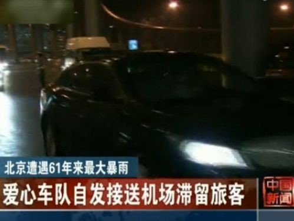
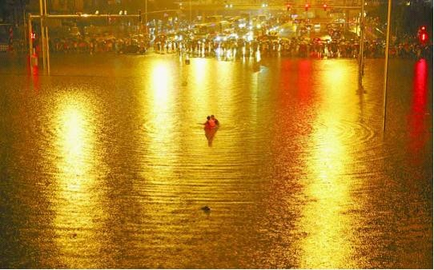
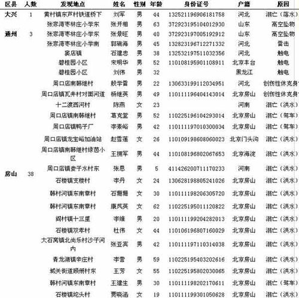

# ＜七星说法＞第三十九期：北京暴雨，国家责任

**本期导读：2012年7月，面对北京这一场可谓凶残的大雨，我们看到了许多。有奋力救人、忠于职守的公共机构人员，更有通过微博传递消息，倾力救助的民间热心人士。这次北京大雨中体现出的公民精神令人感动，但更重要的是，大雨过后，我们对突发事件中国家责任的反思。要知道，种种善举只是公民精神的一个开端，在这类突发事件过后，我们对于政府和国家责任不停的质问、考析，对于干瘪无力的紧急预案、对于无动于衷的36亿公车、对于毫不含糊的收费站、对于残疾的排水公共系统等这些话题的不断追究，才是公民意识的真正觉醒。**  

# 北京大雨，国家责任

## 

 

### 国家的应对？

可能许多人都不知道2007年我国通过的一部《中华人民共和国突发事件应对法》，以及2006年国务院发布的《国家突发公共事件总体应急预案》。

先来看看《突发事件应对法》中的规定。

**第五条 突发事件应对工作实行预防为主、预防与应急相结合的原则。国家建立重大突发事件风险评估体系，对可能发生的突发事件进行综合性评估，减少重大突发事件的发生，最大限度地减轻重大突发事件的影响。**

这里主要指的各种预报，综合评估可能性再做出例如地震、海啸、当然还有暴雨的各类预报或预警。从这次的北京大雨来看，气象台虽然发布了橙色预警，但其普及度和影响力都无法让人满意，严重的损失依旧造成了。

**第六条 国家建立有效的社会动员机制，增强全民的公共安全和防范风险的意识，提高全社会的避险救助能力。**

何为有效的社会动员机制？我们从小接受的地震避险措施尚且存在误区，遑论水下逃生知识了。

**第二十六条 县级以上人民政府应当整合应急资源，建立或者确定综合性应急救援队伍。人民政府有关部门可以根据实际需要设立专业应急救援队伍。**

**县级以上人民政府及其有关部门可以建立由成年志愿者组成的应急救援队伍。单位应当建立由本单位职工组成的专职或者兼职应急救援队伍。** ** **

**县级以上人民政府应当加强专业应急救援队伍与非专业应急救援队伍的合作，联合培训、联合演练，提高合成应急、协同应急的能力。**

七千位被大雨淋透的交警，一个趴在水里疏通下水道的大爷，一群挡在没井盖的排水沟前的环卫工人，不停免费送人的私家车队，向路人开放避难的民间机构和个人……在大雨的救援队伍中，我们唯独不见各处的公共建筑和去年花了36亿预算的公车身影。

第四十三条 可以预警的自然灾害、事故灾难或者公共卫生事件即将发生或者发生的可能性增大时，县级以上地方各级人民政府应当根据有关法律、行政法规和国务院规定的权限和程序，发布相应级别的警报，决定并宣布有关地区进入预警期，同时向上一级人民政府报告，必要时可以越级上报，并向当地驻军和可能受到危害的毗邻或者相关地区的人民政府通报。

通过这样啰嗦的层层上报，我们就真的可以在突发的灾难前做好准备吗？北京市气象部门从7月20日开始就发布预警，先后发布蓝色、黄色、橙色暴雨预警，然而一方面很多市民并不了解颜色所代表的含义，另一方面在传播上效果有限，没有穷尽一切可能通知市民。没有传播的预警，等于没有预警。

在这样的突发事件面前，市民们守望相助是公民社会成长的标志，但这也反映出了信息不是非常的透明或者不是特别的清晰。民间自发的行动并不能够代替有关部门，特别是应急部门的工作，如果像这样的一个灾难，所有的信息、情报如果只是通过市民本身相互来发送、相互告知的话，那么我们的政府需要改进的就不只是一点点了。

再看看《总体应急预案》中的指示。

预案中明确提出了应对各类突发公共事件的6条工作原则:以人为本，减少危害；居安思危，预防为主；统一领导，分级负责；依法规范，加强管理；快速反应，协同应对；依靠科技，提高素质。

毫无疑问，以人为本、减少危害是最重要，反观我们的收费站：这么大的雨，水都淹没半个轮胎了，排成长龙的车随时有熄火的危险，可机场高速和成为重灾区的京港澳高速仍在一丝不苟地收费。这样的冷漠与僵化，与民众的温情与爱心形成让人刺眼的反差。面对舆论的指责，首发集团人士回应称，北京并没有高速路应急停止收费的规定。就这样，把责任全推给了规定。诚然，在这种情况下，政府是行动不够迅速，没有与收费站进行应急的沟通，但如果管理收费站的首发集团从以人为本、减少危害的原则出发，稍微做出变通，那么一部分损失将是可以避免的。

 

### 脆弱的下水道？

大雨带来的内涝不止一次给不同的城市带来灾难。

去年6月23日，北京的一场降雨造成城市严重内涝、多处积水，微博上就有网友戏称“欢迎来北京看海”。当时《人民日报》事后曾刊文，“再迎暴雨 北京有谱了”。然而一年过去了，去年淹水的城市依然淹水。去年讨论的城市排水问题也还在讨论。

从去年到今年，不只是北京，武汉、长沙、南京……包括之前的广州、最近的天津，中国大多数城市都发生过城市内涝，雨果的“下水道是城市的良心”这一说法也一再被媒体提及。《南都周刊》两年前做过一个封面专题叫做“泡汤城市”、《新世纪》周刊一年前做过一个封面专题叫做《暴雨倾城》、凤凰网一年前也出过专题“去武汉看‘海’是怎样的浪漫”……

就是这曾在这块土地上无数次上演的一幕，依然在今日重映。排水不畅、应急机制僵硬，这一切的一切都曾无数次被提起。当然，**没有人会期待短短的一年时间里会全部解决这些问题，然而这些问题不仅没有趋于缓解反而越来越严重，脆弱的下水道今年为何更加脆弱？**

 

### 天灾？人祸？责任谁来承担？

政府管理部门在这类事件中究竟应否承担公共安全责任？这个问题的分歧点在于，能否将暴雨造成的损失归结为不可抗力。

**政府无责任说：**

侵权责任法专家、中国人民大学法学院教授张新宝：“我们总是走不出一个误区:死了人就一定要有人来为此承担责任，一定要涉及到赔偿。”事实上，很多突发的灾难性事件中并无事故责任人，这就有如一个人走在大街上被雷击死,无人需要为其赔偿。政府管理部门只要能证明自己已经尽到日常的管理责任，就可以免责。毕竟突如其来的暴雨具有某种不可抗力的性质，而当下我国经济还没有发展到令所有市政设施都能尽善尽美到可以抵御一切自然灾害的地步。

**政府有责任说：**

中闻律师事务所律师吴革明确表示：“这涉及到管理者的能力和水平问题。固然不排除其中有自然因素；但如果认定其就是"天灾"的话；那么暴雨的黄色预警又起了什么作用？管理者在已经预知到将有暴雨来临的情况下为何未采取有效预防和管理措施？”

他举了美国一个著名的判例“夺命椰子案”来说明。上世纪六十年代，一名游客在沙滩上被一颗掉下的椰子击中而死亡。游客的弟弟将夏威夷州政府告上法庭，以政府未尽到对椰林的监管职责，要求夏威夷州政府赔偿1亿美元。夏威夷州政府辩称：州政府已通过设立警告牌警示游客，且椰子自由坠落属不可抗力。最终，大法官判定夏威夷州政府败诉。

在吴革看来，管理者即使没有明显过错也须承担责任的立法精神在我国的民法通则中就有体现。其第一百二十六条和第一百二十七条分别对建筑物或者其他设施以及建筑物上的搁置物、悬挂物发生倒塌、脱落、坠落造成他人损害的做了规定,都提到一个“管理人”或“所有人”的责任主体。作为市政设施的管理者和所有者的政府，需要承担责任。

正如一个侵权法上的经典案例德国“道路撒盐案”。1903年，原告于夜间在供公众通行的石阶上跌倒受伤。因被告市政府并未除雪，也没有在道路上撒盐，原告请求赔偿。法院认为，无论国家或私人，对公众均负有增进福祉的义务，若以作为或不作为的方式违反此义务，不仅属于公法义务的违反，同时也构成民法上的侵权行为。即**政府对于公众的公共安全负有不可推卸的义务。**

 

### 良好的范本

最后我们可以看看别的城市是怎样应对类似的突发事件的。

去年纽约遭遇百年飓风：开始前几天新闻就铺天盖地，让市民屯水屯粮备收音机，划分区域强制撤离到政府的避难所。周五六日纽交所关，地铁关，查信息打311紧急情况打911求救，每隔几小时市长开新闻发布会公布最新动向。纽约市警察局备皮艇直升机，满街的警车随手就招。你想要的防灾知识，在政府网站电视广播都有。

香港遭遇12级大风，最多300mm降水：1.天文台提前2小时风球预警，大部份公司提前下班。2.机场每个乘客可以凭登机牌到麦当劳等4家餐厅任点不超过75元的食品，24小时营业。3.东铁因树木倒塌停驶，因大风未能安排接驳巴士，每位乘客获赔200港币。4.电视台随时插播预警。5.巴士公司仍保持有限度服务。

 

### 结语

到现在，北京的雨还是在一直下。在这篇文章截稿前，根据权威信息发布的显示，北京7.21暴雨已致77人遇难。如果说硬件问题直接造成了灾难，那么软件问题决定着人们在灾难面前的信心。“国家是不是真的走得太快忘记了灵魂”，这句去年流传甚广的议论今天被人重新忆起。社会治理的软件一旦呈现的是无序无情，冰冷机械，甚至神秘而不透明时，人们面对灾难的信心必将受到强烈的打击。

关乎于责任，这是国家需要进行反思的。正如凤凰网的社评所言：**77个名字是刻在城市身上的伤痕，没有彻底的反思，伤痕永远不会平复。**

 

### 【深入阅读】

[暴雨倾城，我们见证美与丑](http://news.ifeng.com/opinion/special/beijingbaoyu)

[冷血收费站的养成并非一日之寒](http://www.aisixiang.com/data/55799.html)

[城市内涝是天灾还是人祸？](http://www.town.gov.cn/csph/201207/23/t20120723_566612.shtml)

[为了77个名字](http://news.ifeng.com/opinion/special/baoyufansi)

《中华人民共和国突发事件应对法》

《国家突发公共事件总体应急预案》

 

（编辑：石味诗，陈蓉）

 
