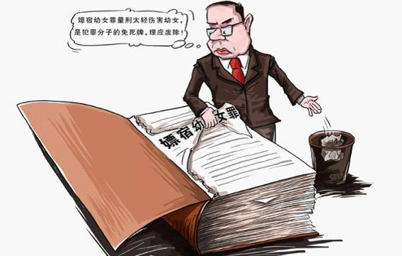

# ＜七星说法＞第三十五期：幼女何以嫖宿？

**本期导读：近期，浙江永康、山西略阳纷纷爆出嫖宿幼女的案件，在社会上引起了广泛关注，而在此类案件中频频出现的公职人员的等敏感性身份，以及嫖宿幼女罪与强奸罪最高刑之间的差距也让人疑惑，嫖宿幼女罪到底在保护谁？本期说法将理清人们反对嫖宿幼女罪的全部理由，对如何更好保护幼女的权利进行有建设性的探讨。**  

# 幼女何以嫖宿？

## 

 

2012年5月27日，网曝浙江永康发生大规模嫖宿学生事件，20多名在校学生被强奸，涉案数名企业家甚至人大代表被警方定性为涉嫌“嫖宿幼女罪”。有网友愤愤不平“明明白白是强奸未成年，怎么成嫖宿了。都是小孩子！怎么就变成妓女了！”而几乎同时，河南永城市委副秘书长李新功涉嫌强奸10余名幼女的事情在网上被揭露，“有的孩子哭着求他说：‘我才13岁，叔叔别这样呀！’也无济于事。在受害幼女中，最小的才2001年出生。”

幼女受到性侵事件频频发生，而此类案件中又频频出现市委副秘书长、人大代表、法官、校长、国税局局长的身影，根据现有材料，有的被判“嫖宿幼女罪”，有的被判“强奸罪”。**甚至曾数次发生这样的事情：检察机关先以“嫖宿幼女罪”提起公诉，再根据被告人“不明知”受害人为未满14周岁的幼女，判定该行为只属于一般的嫖娼行为，被告人无罪。**

侵害了幼女的性权利，可能会被判处：嫖宿幼女罪，奸淫幼女罪，强奸罪。那么这打到底有什么区别？广大人民群众和一些专家认为，嫖宿幼女罪是放纵高官犯罪、为权贵提供“免死通道”，也有学者反驳说，嫖宿幼女罪实际上比奸淫幼女罪定罪要高，实际上是在打击嫖宿幼女的行为。那么，事实和法律究竟是怎样的呢？

 

### 嫖宿幼女罪，奸淫幼女罪，强奸罪

自79刑法、97 刑法一直到2002年，关于侵害幼女性权利的三个罪名的发展演变如下：

1979年刑法没有规定嫖宿幼女罪，第一百三十九条规定了强奸罪。

1997年3月，八届全国人大五次会议表决通过的刑法修订草案上规定：嫖宿幼女判处5年以上有期徒刑。自此，嫖宿幼女罪成为独立的罪名。

1997年12月，最高检颁布《关于适用刑法分则规定的犯罪的罪名的意见》，规定了奸淫幼女罪，第236条第一款是强奸罪，第236条第二款奸淫幼女罪，此外第360条第二款是嫖宿幼女罪。这段时间，三个罪名并立而存。

2002年3月，《最高人民法院、最高人民检察院关于执行〈中华人民共和国刑法〉确定罪名的补充规定》，取消奸淫幼女罪罪名，将奸淫幼女罪作为强奸罪的加重情形，纳入强奸罪。至此，关于侵害幼女的性权利，由强奸罪和嫖宿幼女罪两个罪名调整。（本文为方便说明起见，仍然使用“奸淫幼女罪”来说明，但应该是强奸罪）

那么，奸淫幼女罪和嫖宿幼女罪的区别是什么呢？分析两罪的犯罪构成：

奸淫幼女罪，是指与不满十四周岁的幼女发生性关系的行为。**构成本罪应具备两点：1．被害人是不满十四周岁的幼女；2．有奸淫幼女的行为。**此处没有把暴力、胁迫等强奸手段和违背妇女意志等强奸罪的构成要件作为构成奸淫幼女行为的必备要件，不论行为人采用什么手段，也不问幼女是否愿意。因为幼女缺乏决定性行为的意思能力，幼女的“同意”在刑法上被视为不同意，即使征得幼女同意与其发生性关系，在法律上仍被视为违反该幼女的意志。因此，只要明知对方为不满十四周岁的幼女，无论对方是否同意，与其发生性关系，就侵害了其性的决定权，成立奸淫幼女罪。

而1997年制定的嫖宿幼女罪，是指嫖宿不满十四周岁的幼女的行为。**构成本罪应具备四点：1．被害人是不满十四周岁的卖淫幼女；2．有嫖宿幼女的行为。3。行为人明知被害人是或者可能是不满十四周岁的幼女。4。行为人交付金钱或者其他财物为代价。**

从两罪构成要件中可以看出，**嫖宿幼女的行为同时完全符合奸淫幼女罪的构成要件。**

首先，奸淫幼女罪的对象是幼女，卖淫幼女也是幼女，不因幼女的性格、品质影响奸淫幼女罪的成立，卖淫幼女也是奸淫幼女罪的保护对象；其次，因为幼女的同意无效，所以无论是卖淫幼女还是一般幼女，与幼女发生性行为的行为均侵犯了幼女的性决定权，**法律始终坚持以“违背年轻女孩之意志的方式保护年轻女孩”；**再次，嫖宿幼女罪的成立以明知对方为不满十四周岁的幼女为前提，所以，嫖宿幼女时，行为人已经明知自己是在与不满十四周岁的幼女发生性交，因而具备了奸淫幼女罪的故意。

增设嫖宿幼女罪名后，刑法中的“幼女”被分为两类：一类是卖淫幼女，另一类是非卖淫幼女。上述罪的区别仅在于，被害人是否是卖淫幼女。

那么单独设置嫖宿幼女罪的立法目的何在？是为了保护高官？平衡幼女和被告人的合法权益？还是，为了打击儿童色情行业，严厉打击嫖宿幼女行为，加强对卖淫幼女的保护？

 

### 立法目的是为保护卖淫幼女

对1997年的立法修改，由于缺乏必要的立法背景资料，难以准确查明立法者的真正意图。从学者的分析来看，主要有两种理解：一种是官方的解释，一种是民间的解释。

官方解释认为：全国人大常委会法工委刑法室1997年编著的《中华人民共和国刑法释义》中有官方说明，“嫖宿幼女的行为极大地损害幼女的身心健康和正常发育”，**增设罪名是为了“严厉打击嫖宿幼女的行为”。**刑法学界普遍认可官方的这一解释。全国人大法律委员会委员周光权分析，起刑点就是5年，这在刑法较为少见——连抢劫罪、故意杀人罪的起刑点都是3年。官方和学者普遍认为，当年的单独成罪，是对卖淫幼女进行特殊保护，有打击儿童色情业，严惩嫖宿幼女行为的目的，所以其法定刑重于强奸罪的基本法定刑。

而另外也有一些学者认为：增设嫖宿幼女罪是鉴于奸淫的对象是卖淫幼女这一特殊情节。在嫖宿幼女的场合，多是幼女“自愿”，甚至是在幼女主动纠缠的情况下进行的。换言之，犯罪行为的实施，受害幼女本人也有一定的过错。相比强奸罪（奸淫幼女）而言，行为人的主观恶性也较小，因此应该适用比较轻的刑罚。笔者认为，这种说法是不攻自破的。卖淫幼女的“幼女自愿”，和普通幼女的“幼女自愿”甚至主动，法律都认为幼女没有性决定权，自愿无效，何来卖淫幼女本人有过错？且根据奸淫幼女罪的构成可以判断，行为人的主观恶性并不以被害人是否自愿为依据，只以明知为依据。**“卖淫幼女”不能被认定为性工作者，因为法律不容反驳地推定幼女没有性交易的意志与行为能力。**

再看两罪的法定刑设置，或许会对立法目的有进一步的了解。

**奸淫幼女罪的法定刑为3-10年有期徒刑，并从重处罚；如果有加重情节，判处十年以上有期徒刑、无期徒刑或者死刑。**如奸淫幼女情节恶劣的；奸淫幼女多人的；在公共场所当众奸淫幼女的；二人以上轮奸的；致使被害人重伤、死亡或者造成其他严重后果的。

**嫖宿幼女罪的法定刑为5-15年有期徒刑，对于加重情节，刑法中未予以说明。**张明楷等学者指出应该适用重法优于轻法的原则，此时按奸淫幼女罪定罪量刑，将法定刑升格到十年以上有期徒刑、无期徒刑或者死刑，以避免罪刑不均衡；也有学者指出，存在加重处罚事由的嫖宿幼女行为也应当按嫖宿幼女罪进行处罚，仍然应该以15年为上限。而根据山西略阳的案件，数名略阳县干部轮奸幼女，最后被定“嫖宿幼女罪”，被判5-7年不等，可见法院司法实践中对嫖宿幼女罪未适用加重情节(至少是略阳县人民法院的司法实践)。

若如果没有加重情节，奸淫幼女可能会被判3-10年，而嫖宿幼女罪则被判5-15年有期徒刑。**相比而言，法律对于卖淫幼女的利益保护要强于对普通幼女的保护。**贵州习水案中，如果根据奸淫幼女进行认定，不会达到7-14年的罪刑。而公众大多会受“嫖娼不为罪”光晕效应的影响，认为嫖宿幼女罪的定罪比奸淫幼女罪要轻。中国政法大学刑事司法学院教授阮齐林曾公开说“强奸重于嫖宿是人们的错觉”。

而对于加重情节，因为法律未明确说明，所以如果对于有严重情节的嫖宿幼女行为，仍然依照最高刑15年来判，确实不公，而来自民众大部分的争议即源于此处，认为嫖宿幼女罪是高官的保护伞。（笔者猜想，官方的立法目的体现在基本法定刑设置，而民间学者所认为的立法目的可能正是体现在不适用加重情节方面。）

对于在存在嫖宿幼女罪的前提下，如何处理奸淫幼女罪和嫖宿幼女罪的关系，2009年张明楷教授提出这样一个观点，因为嫖宿幼女的行为完全符合奸淫幼女罪的构成要件，因此：**1、与幼女发生性交，既不属于嫖宿幼女，也不具备奸淫幼女的加重情节的，认定为奸淫幼女罪，处三年以上十年以下有期徒刑；2、与幼女发生性交，属于嫖宿幼女，且不具备加重情节的，认定为嫖宿幼女罪，处五年以上有期徒刑；3、与幼女发生性交，不管是否属于嫖宿幼女，只要具备刑法第263条第3款规定的加重情节之一的，就应认定为奸淫幼女罪，适用十年以上有期徒刑、无期徒刑或者死刑的法定刑。**

他认为，倘若认为嫖宿幼女的一个行为，同时触犯了嫖宿幼女罪与奸淫幼女罪，属于想象竞合犯，那么，按照从一重罪论处的原则，能够得出上述结论。

**如果嫖宿幼女罪的法定刑高于奸淫幼女罪，能够更好地打击嫖宿幼女的行为，同时，存在加重处罚事由的嫖宿幼女行为也可以判无期徒刑、死刑，是不是就可以不用取消嫖宿幼女罪了呢？**

NO, 如果法律可以按照张明楷教授的观点进行修改，还是有顾虑。因为嫖宿幼女罪，可能会因被告人不知被害人是幼女而被认定无罪。

 

### 不明知是幼女可以无罪

最高人民检察院于2001年6月11日发出高检发释字（2001）3号《关于构成嫖宿幼女罪主观上是否需要具备明知要件的解释》，明确规定行为人知道被害人是或者可能是不满14周岁幼女为构成嫖宿幼女罪的要件。这里的明知，既包括知道对方确为幼女，又包括知道对方可能是幼女，还包括应当知道对方为幼女。**湖南省常德市中级人民法院于2001年审判一起嫖宿幼女案件，根据再审认定的周某某、张某某虽有嫖宿行为，但主观上不明知被害人为满14周岁的幼女这一事实，认定被告人无罪。**

在2003年最高院出台了一个批复，**如果行为人确实不知对方是不满14周岁的幼女，双方自愿发生性关系，未造成严重后果，情节显著轻微的，不认为是犯罪。**对于该司法解释，朱苏力教授撰文《一个不公正的司法解释》，而陈兴良教授撰文《奸淫幼女构成犯罪应以明知为前提——为一个司法解释辩护》，提出反驳意见。法学界的两个大佬前后分别撰文，由此引发2003年我国法学界绝大多数著名的刑法学家、学者的大讨论。据有关报道说，“由于该解释实践效果并不好，于当年8月暂停执行，至今尚未恢复。”

苏力在文中提到：“一位要人，无论他是腐败的政府官员还是一位外商老板，如果他的下属，或有求于他的地方官员，知道他有某种邪恶的喜好，就可能替他妥善安排好这种“自愿”的性关系，而有意不告知他这个幼女的年龄。只要没有人可以拿出超出一个人说没有的证据，那么这些邪恶的男子就会屡屡得逞。”

而2008年发生的宜宾县国税局白花分局原局长卢玉敏的案子正是2003年苏力所预料的那样。卢玉敏将被害人何某(案发时不满14周岁)带至一旅馆，在其不情愿的情况下将其奸淫。宜宾县公安机关当时的定罪分析如下：

“**介于此案涉及到在校未成年学生，又涉及到国家干部，为了该案正确定性，及时依法处理，宜宾县公安局党委副书记、政委高原主持召开案情分析会。**根据2003年最高院司法解释，行为人不明知是不满14周岁的幼女双方自愿发生性关系不构成强奸罪，经审查，卢玉敏确实不知道对方何某是不满14周岁的幼女，因此，卢玉敏不构成强奸罪。又根据最高检司法解释，行为人知道被害人是或者可能是不满14周岁幼女为构成嫖宿幼女罪的要件。经查，卢玉敏不知道何某是或可能是不满14周岁幼女而嫖宿，因此，卢玉敏也不符合嫖宿幼女案的追诉条件。根据以上司法解释及相关法律规定，案情分析会形成一致意见。**卢玉敏的行为属于与不明知是未满14周岁的幼女发生性关系，未造成严重后果，不认为是犯罪，只属于嫖娼行为。**”

直到有知情人通过网络把**“国税局局长嫖宿幼女之后花60万买通关系得以获释”**的真相公之于众，该被告人才被逮捕，并由四川宜宾市翠屏区人民法院认定卢玉敏淫幼女的行为，构成强奸罪，判处强奸罪10年有期徒刑。

同时法律并未规定嫖宿幼女是否必须是在特定色情场所，或该幼女是长期卖淫，还只是偶尔，或者只是“被强迫卖淫”。**目前的司法实践普遍认为，“被强迫卖淫”属于“卖淫”，而不认为是“被强奸者”。**于是，会导致许多本应该是奸淫幼女的案件被认定为嫖宿幼女罪。虽然奸淫幼女案例中，“不明知，双方自愿，情节轻微，视为无罪”的司法解释暂停使用，但在嫖宿幼女中，“不明知即无罪”的司法解释仍然存在。几乎可以想见，类似的案例如果没有网络曝光，**多少被强奸的幼女会被按照“嫖宿幼女”先定罪，再因为“不明知嫖宿的是幼女”而被判无罪。**对此，清华大学的劳东燕提出，需要对“卖淫幼女”进行限定，即仅限于色情行业中以性交易为业的幼女，而不包括偶然从事性交易的幼女。**将嫖宿幼女罪的被害人限定为“卖淫幼女”，这也符合设立嫖宿幼女罪是为打击犯罪的目的。**

所以，我们可以看到，当一个人侵犯了幼女的性权利时，只需想方设法将对方描绘成一个低龄性工作者的形象，那么就很有可能逃脱强奸罪的指控，而在这个公务员等这种身份之人频繁出没的地带，办到这一点似乎并不是一件很困难的事。

 

### 嫖宿幼女罪名该何去何从

除了上述两个个理由以外，学者和专家反对嫖宿幼女罪的另外一个理由，是“嫖宿幼女罪”是一个污名化的罪名。即使设立单独罪名严厉打击嫖宿幼女行为的立法目的是可取的，但是定罪名为“嫖宿幼女”罪则很不妥。**幼女本是受害者，但是使用“嫖宿幼女罪”，使得这个群体被冠以“卖淫者”污名，“身体受伤害外，精神再受伤。”**

而在现实生活中，更是有很多“被强迫卖淫”的幼女，实则是“被强奸”，而被认定为“卖淫”，这种情况也认定为“嫖宿幼女”，对于一个已经历了极为恶劣的性侵犯，到最后还受到了名誉上的二次伤害的幼女而言，影响是极大的。此时，**即使嫖宿幼女罪判刑高于奸淫幼女罪，也无法弥补对幼女的伤害。**

在近年来爆出的多起案件中，我们发现，居然公务员、企业主、人大代表等在外人看来有身份有地位的人频繁现身，山西略阳案，犯罪嫌疑人为三名村镇干部和一名包工头，浙江永康案，牵涉到数名当地企业主和一名人大代表，再早些的贵州习水案，五名公职人员落网。这些人本应当是为人民服务，在践行法律保护百姓方面做出努力的，却如今成了嫖宿幼女的急先锋，而更令人担心的是，**这些人由于其职业带来的权势优势，在规避法律上更为容易，结合上一点提到的罪名转化的低难度，**我们就不难理解为什么有越来越多的人称嫖宿幼女罪就是这些人的保护伞了。

目前，针对该罪名的争议，2010年全国人大代表、中华女子学院女性学系教授孙晓梅已建议取消嫖宿幼女罪，而社会上关于此罪名的争议也愈演愈烈。2012年6月25日人大法工委也开始着手调研关于嫖宿幼女罪的存废问题。**那么到底嫖宿幼女罪，是否该废除，如何修改，我们拭目以待。**

 

### 【深度阅读】

 [嫖宿幼女罪，被指“恶法”有点冤——存废之争：民间热，业界冷](http://rrurl.cn/chE9sm)： [嫖宿幼女罪的存废之争](http://blog.renren.com/http:/mall.cnki.net/magazine/article/CUPL201006007.htm) [嫖宿幼女取消论](http://blog.renren.com/http:/www.cnki.com.cn/Article/CJFDTotal-XZYF200801033.htm) **强奸罪与嫖宿幼女罪的关系新论**，劳东燕，清华大学 **从习水案探析嫖宿幼女罪**，刘娥，中国青年政治学院 **习水嫖宿幼女案中行为人的犯罪性质**，齐文远，周详，中南财经政法大学 **周某某、张某某被控嫖宿幼女再审宣告无罪案** 2002.08.06，[湖南省常德市中级人民法院](http://rrurl.cn/o050tT) **一个不公正的司法解释**，朱苏力 **淫幼女构成犯罪应以明知为前提——为一个司法解释辩护**，陈兴良 **嫖宿幼女罪与奸淫幼女型强奸罪的关系**，张明楷  

（编辑：林骥，陈蓉）

 
