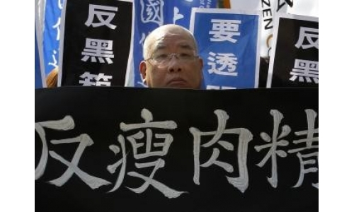
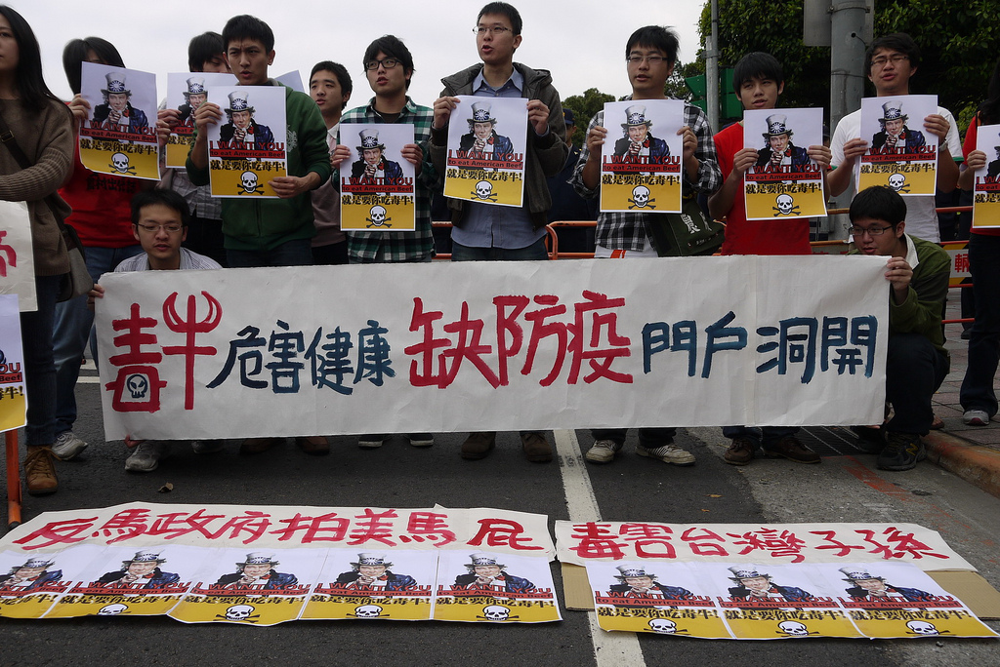

# ＜七星说法＞第三十八期：管中窥豹：从台湾进口美牛案看台湾民主政治的一个侧影

**本期导读：台湾是美国牛肉重要的出口市场之一，2003年美国本土暴发“疯牛病”疫情后，台湾多次禁止进口美国牛肉。去年初，美国牛肉被查出含有瘦肉精，台湾当局再次下令全面下架、禁止进口此类货品。而今年3月，台湾行政机构针对进口“美牛”提出有条件解禁饲料含莱克多巴胺(一种瘦肉精)的政策方向，其后相关修正法案送交台立法机构，持续引发国民党与民进党的激烈争议。25日最终获得通过的“食品卫生管理法修正案”。本期说法将讲述台湾进口美国牛肉的立法修正案获通过的过程，来看台湾民主政治的一个侧影。**  

# 管中窥豹：从台湾进口美牛案

# 看台湾民主政治的一个侧影

## 文 / 周遠游 （上海财经大学）

 

7月25日，台湾立法院终于以表决的方式三读修改《食品卫生管理法》的相关条目，正式开放美国牛肉的进口。这件事从马英九在今年年初连任后正式提起，到现在终于过关，整整搞了大半年时间。我基本是全程关注此事，包括事件本身，包括事件背后的各种角力，我觉得，这件事，不单对台湾是大事，其实对于大陆，尤其是对大陆关心时事的人来说，是一件很值得参考的事情。不过看人人网的各位似乎对此事并不太关注，我就把自己的一些看法和感想写在这里。因为我对台湾历史比较了解，我觉得台湾过去的路，很多我们现在正在走，好多事情，不管是好的，坏的，都有很值得参考的地方。

美国牛肉案，说白了是因为美国牛肉固然肉质可口，但是大部分美国牛在饲养时候，喂了各种添加剂，最重要的一条是莱克多巴胺，也就是我们俗称的瘦肉精，因为这样，大部分国家其实是不允许这种美国牛肉进口的。

对于台湾的美国牛肉来说，美牛案涉及三个层面。

**第一，喂了瘦肉精的美国牛肉能不能吃。**

**第二，美国牛肉该不该进口，进口与否利弊各在何方。**

**第三，关于美国牛肉问题的朝野攻防和政府民间的博弈。**

我们先看第一个问题，其实这个问题，初一看是最简单的，因为答案非此即彼。但麻烦就在于这一次不是非此即彼。具体大家可以去搜相关文献，目前的资料是，喂了瘦肉精的牛肉没有吃死过人，也没有造成很恶性疾病的记录，没有证据证明吃含有瘦肉精的牛肉会对人体产生危害。但是瘦肉精如果剂量大，的确会在动物实验里对动物造成损害，也有致死的记录。

所以从科学角度，说美国牛肉会吃死人，这不对，目前没有证据。但是说吃不死人，可以随便吃，那也不对。因为目前为止虽然没有记录，你怎么知道下一个吃的人会不会吃死？你怎么知道这个潜伏期会不会很长过一段时间会不会大规模发作？

所以，对于这个问题准确的回答，应该是不知道，不确定。

我们再看第二个问题。这个问题的要害，是我们默认政府应该保护民众健康，这一点大陆做的很不好，众所周知的三聚氰胺啊苏丹红啊什么的，说罄竹难书，也不为过。台湾过去做的也极为不好，我查过资料，八九十年代这种事情一样很多，包括在前年，起云剂事件一样闹得沸沸扬扬。所以如今台湾朝野对这个事情都极为敏感，稍微不注意，一个“不管民众死活”的帽子扣下了，那可受不了。

但问题就在于，这个美牛能不能吃，科学家答不出来！

因为如果科学证明吃了没事儿，那就进口呗，无所谓，毕竟好吃，还有利于国家利益。如果科学证明那就不能吃，那也简单，美国你施压就施压，为了民众健康可以不甩你，民众也会支持政府顶住。

问题就在于，美国添加了莱克多巴胺的牛肉会不会对人体健康有影响，这事儿不好说！

那么在第一，第二两个问题的前提下，就有了第三个问题。为什么美国一定要让别国进口他的这种牛肉？为什么台湾会纠结？

美国农业州人口不多，但是由于独特选举制度，选举人票不少，奥巴马要连任，需要讨好他们，这是一个，当然历届总统都几乎要干这事情。韩国最先顶不住，李明博天人交战了很久，还是最后决定开放美国牛肉进口，为此还向全国人民道歉。

但山姆大叔不会白白让你吃亏，说白了，这一次美国的盘算很明显，台湾进口美牛帮了奥观海的忙，观海的回报是可以谈过去免谈的TIFA，即“台美贸易暨投资框架协议”。并且为之后的TPP，即“太平洋伙伴协议”打下基础。

这俩协议不用多解释，因为都知道，台湾是外向经济，自由贸易的重要性不言而喻，韩国之所以最近迅速超越台湾，其实就是开放美牛后美国和他的自由贸易协议的功效。

**那么问题就在于，签署TIFA，肯定是攸关台湾前途和命运的大事，但是这需要冒着“有可能牺牲民众健康的危险”。**

**注意，是有可能，而不是“冒着牺牲民众健康的危险”。这俩个表述，差别很大。**

马英九连任总统后，他的考虑，是鉴于台湾和韩国的竞争已经渐渐落于下风，光靠和大陆的ECFA也不够，所以TIFA一定要签，非签不可，关系台湾前途和命运。

**至于美牛，马英九认为毕竟，目前没有证据表明一定会损害人类健康，而且他的对策是【安全容许、牛猪分离、强制标示、排除内脏】，意思就是最可能出问题的内脏，不行。强制标示，就是所有美国牛肉卖出去的时候要注明这喂了瘦肉精，民众买的时候觉得不放心可以不买。马英九没说出来的一句话是“可以不吃”，意思是说，进口那是非要进口，但是我进口回来你老百姓可以不买。牛猪分离是说喂猪的瘦肉精目前来看可能比较有问题所有猪绝不进口。安全容许是指有最低瘦肉精残留量的限制。**

马英九自己认为，这样的话，既能够兼顾国家利益，也能够兼顾民众健康，他满以为这样一定能够轻松闯关，作为他连任的第一桩重要改革。

而且，为了确保民意基础，他本可以透过行政院直接下行政命令开放，但是他选择了修法，让民意机关立法院予以背书。

但是马英九没想到，这件事引起了强烈的政治风暴，一直闹到今天才结束。

反对者主要有以下几个声音：

1.不能吃就是不能吃，哪怕有可能有问题，民众健康高于天，不签FITA就不签。这种说法在民间其实很有市场。

2.开放了美国牛进来，台湾养牛的人怎么办？他们怎么活？

3.开放了牛，会不会猪啊，内脏啊也顶不住？

4.民进党一小部分人认为是美国在2012大选里帮了马英九，现在是要索回报。

这几种声音，第四个没有证据，而且即便如此，美国已经公开承诺开了美牛可以谈TIFA，所以这一条不重要。

第三条，这次修法已经明确否定了他们的担心，所以也不必谈。

第二条，保护主义的声音在全球化时代永远嗓门都很大，但是我觉得这完全是个人利益的取向问题，你是养牛的你肯定反对，这没有什么可说的。

要害在第一条。

民众反对，这是可以预期的。此事，我还专门问过家里人，因为大陆也是禁止美牛的，我问家里如果大陆向民众征求意见说是不是要开放美牛，并且交换条件是可以签一个什么什么协议，并且政府也答应那个十六字原则，你们同意不同意？

我妈的答案是坚决反对，有可能有问题那就不能吃，至于你说的什么协议是不是对国家有好处我管不着。

我爹的答案则是可以考虑同意，如果政府仔细沟通声明。

我自己在这种情况下其实也赞同开放。

因为的确没有证据证明有害，最重要是，可以不吃。你进口，我不买，不就完了？

当然，我尊重反对者的意见。

本来，这事情在大陆，其实国务院一个命令下来，什么都搞定了，不容百姓置喙。

在台湾，马英九要透过民主程序推动，这肯定是对的。

可是这个时候，民进党台联党等反对党把这个事情搞成了政治斗争。

台湾民主政治运作20多年来，可以基本下个定论，他们就是不问是非，只论蓝绿，想搞的，就是把对方搞垮，至于这个案子是不是有利，哪些地方可以协商妥协，他们不管，就是为了反对而反对。

我认为这一点很值得思考。

民进党嘴上当然是拿民众做幌子，说不能吃就是不能吃，非要进口就要零检出，就是不能有瘦肉精。

问题是没瘦肉精的牛肉美国人还怕卖不出去？怎么可能给你条件？

而大家知道，国会里，国民党占多数，要表决，肯定国民党赢。但是民进党摆出了焦土政策，霸占主席台，占据会场，不让国民党进场议事，根本就不给你表决的机会！

一个重大法案，事关国计民生，透过民主程序来解决，没有错。但是反对党根本不让法案表决，这是民主吗？

而且因为这样，民进党把整个会期搞得只通过了15个法案，大量法案该通过该表决却还躺在那里，这是对民众负责吗？

但是你要说民进党所做的完全没有道理，这也不对。因为的确，美牛很多台湾人反对，当时的民调，可以约略说，大部分人反对美牛。

也就是说，执政党这个时候和民意有距离，席次的多数和民意的多数有背离。

问题就在这里！

**选举时候的多数是当时的民意，可是民意如流水，民意是会变的！**

**这个时候民意不在你这一边了，你究竟是不是一切以民意为依归呢？**

**可是以民意为依归，一个不小心，就是民粹。因为很多时候民众他就是错的，怎么办？执政的目的是为了做好，而不是一切听民意的，不是吗？**

这个时候正常的办法，执政党应该不断说明，解释，争取民意的支持。因为民意毕竟是可以改变的，民众也是可以说服的。

但是这样的成本就是时机成本和社会成本。

有人会说，这样固然看起来效率低，但是可以避免大陆这种短平快决策模式造成的不可挽回的损失。

我只能说这必须就事论事，不能一概而论。

总而言之，美牛案搞到现在，就搞成了政治斗争，直到前几天联合国食品卫生法典委员会通过决议，定了食品中瘦肉精的最低残余后，民进党才不再强力杯葛。

**但问题就在于，如果你是打着捍卫民众健康的旗帜，你就要始终如一，坚持零检出，反对到底，为什么现在就退缩了呢？**

**要知道，联合国食品卫生法典委员会这个决议，绝不是一个科学的决议，而是美国和其他各国透过利益交换谈出来的决议，牛肉里这个残余量就能保证健康了吗？不一定。**

所以我们看见，在这样一个事情里，政治斗争一旦搀和进来，就会把本来很复杂的事情，很复杂的利益博弈，搞得更加复杂，更加难办。

但是我还是认为，政治斗争是人事权力争夺，而很多政策性事件是全民利益分配，在公共政策上搞政治斗争，这究竟是利还是弊，其中有没有相应的边界，是个很值得思考的问题。

就在我正在写这篇文章时，我发现北斗最新发的那篇《不要总把具体问题泛政治化》，最后那句话写的真好，我也就借来一用。

**美牛案的泛政治化只是把本来就麻烦的事情搞得更麻烦，还加剧对抗，造成更多的矛盾，制造更多的口水，这固然是民主的代价，但是即便要付代价，付多少代价，哪些代价需要付，哪些不需要付，都是很值得讨论的。**

 

（编辑：陈蓉）

 
