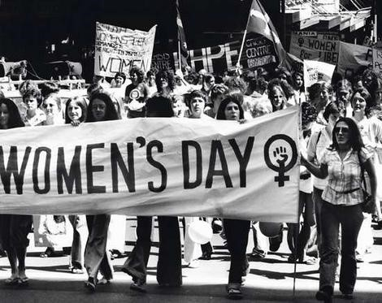

# ＜七星说法＞第三十四期：再做扬州梦？——对性产业非罪化的探索

**本期导读：“食色，性也”，娼妓业古已有之，这一点古今中外概莫能外，而性工作者甚至被称为是最古老的职业。但当下中国性工作者的生存环境和职业境况却令人担忧。不但法律明确规定卖淫非法，社会也对这个地下产业缺乏足够的认识和理解，造成了诸多现实与法律脱轨的问题。包括萧瀚、潘绥铭、李银河的诸多国内学者都先后公开发出过性产业“非罪化”的呼吁。说法曾讨论过无被害人犯罪行为，本期说法将深入这个领域，带各位读者回顾古今中外性产业的发展演变历史，比对各国法律对性产业的不同规定，一起思考中国性产业立法的前路。**  

# ＜七星说法＞第三十四期：

## 再做扬州梦？——对性产业非罪化的探索

 

### 中国娼妓盛衰兴亡史

杜牧有诗云：“十年一觉扬州梦，赢得青楼薄幸名”。唐宋文杰笔下那些或袅娜或幽怨的青楼女子带给了我们不少传世诗词，而娼妓在中国的历史则远远早于这些盛世。

娼妓源于“巫娼”，早在巫风最盛的殷商就屡见于占卜祭祀等活动中。这些原始形式的妓女因主祭祀教鬼神且才、情、色、艺俱佳而地位显赫，也因为这种浓厚的宗教色彩，这些巫娼披上了一层神圣的外衣。

历史车轮不断向前，封建制逐渐取代了奴隶制，东周末年春秋五霸战国七雄轮番登场，各种小国不计其数。一个国家兴盛衰亡并非取决于巫娼的占卜行卦，在唯实力论英雄的背景下，巫娼这种带功能性的通神职业逐渐不再得到主流认可。**于是，娼妓开始回归它本来的“属性”——即达成性的满足，此时娼妓成为了国君借以稳固统治的一种制度。**

《东周策》记述：“齐桓公宫中女市七，女闾七百”。这大概就是国家经营娼妓业的发端，设立这种“官妓”的目的无非是想增加财政、容纳奴隶、优待游士。无可否认后人对这种“荒淫“的官妓少不了批判。但《管子·小匡篇》则对这种制度进行了辩解：“好色非恶之极”。说的是好色并不是不可宽恕的罪恶，而是满足人之常情、有时不可或缺的东西。《吴越春秋》上说：“越王勾践输有过寡妇于山上，使士之忧思者游之，以娱其志。”由此可见勾践不仅善于“尝胆”，还把“军妓”发扬光大。

汉代男娼之风尤甚，历代汉帝无一无不蓄养男宠，汉哀帝更是怕吵醒袖上人而毅然割袍，为今人留下"断袖"之名。**虽说汉代已经发展到有“官妓”和“家妓”之分，但娼妓行业真正的兴盛是在唐宋。**

唐代社会风气开放，是中国官妓发展的鼎盛时期。而在宋代，各式各样的私妓开始出现，从文人墨客平平仄仄的词句中我们亦可一探究竟。这个时候的妓女为了符合文人雅士的旨趣，开始精通琴棋书画等各项技艺，而且那些色艺双绝的妓女还很可能卖艺不卖身。由此也诞生出一代代名妓，其中最出名的当属李师师，她的顾客中甚至有当朝的皇帝宋徽宗。

**到了明代，城市经济极度兴盛，政府开始公然介入对娼妓行业实行课税制度。**谢肇淛的《五杂俎》中记载：“今时娼妓满布天下，其大都会之地，动以千百计；其他偏州僻邑，往往有之，终日倚门卖笑卖淫为活。而京师教坊官收其税钱，谓之脂粉钱（如后世之“花捐”）。当然，此时男色亦十分鼎盛，从天子到平头老百姓，都有去光顾男性的。《五杂俎》就称当时“天下言男色者动以闽广为口实，然从吴越至燕云，未有不知此好者也。”

民国时期，妓女这个职业虽然卑贱，但仍然跟九儒十丐一样在职业排序中占据着一席之地，有关当局为妓女发放许可执照，那些附庸名人风雅的“名妓”甚至地位更为超脱。

建国初期，北京采取了断然禁娼的方式，一夜之间封闭了全市所有的妓院，并对妓女进行集中收容、教育、改造和安置。有媒体称“北京市封闭妓院、改造妓女，彻底摧垮了娼妓制度，取得了巨大的成功”。

#### 现代西方性产业非罪化的进化史

其实不仅中国最早的妓女发于“娱神”，在西方妓女的起源也与神分不开。在基督教盛行之前的迦南，就有神庙妓女的制度，是繁衍后代必不可少的宗教规则。甚至在古巴比伦只有在神庙中行淫后的妇女才有资格结婚，希罗多德甚至还做了详细的记载。

在西方文明发端的希腊，力求革新的政治家梭伦干脆直接设立了国家大妓院。他标榜设立妓院的目的是为了减少淫乱而不是增加淫乱，该理由显然更能得到民众支持。在罗马，妓女的地位举足轻重，甚至有妓女自己的节日“花神节”。罗马人同时也将卖淫当做一种生活的必须，认为“任何人也不能禁止你逛妓院，也不能不让你买公开出售的东西”。

另观西方的娼妓产业，在中世纪，教廷将妓女视为一个合法团体，以及一种必要的淫邪。“如果禁止卖淫，那么社会必将污秽遍地”。欧洲各地也普遍对之抱以有存在必要的态度，并由政府严格管理。以致于教皇Sixtus 五世宣布对从事娼妓行业的人实施死刑的时候，欧洲各国几乎无一真正去执行，沦为了一纸空文。

**基督教将禁欲主义和苦行视为服侍上帝，可对待妓女他们是宽容的。**虽然基督教不鼓励卖淫，但是认为妓女在忏悔和从良后可以得救。例如新约中耶稣对妓女玛丽罪行的赦免时就说：“所以我告诉你，她许多的罪都赦免了，因为她的爱多”。

真正对妓女大加斥责的反而是宗教改革中涌现出来的各派新教，路德认为婚姻是“一切人间法则之母”，加尔文则将婚姻视为“一切社会秩序奠定基础的不可违逆的人生法则”。新教极端重视婚姻的完满，所以必然极力排除破坏婚姻完满的娼妓的存在。**于是一个奇怪的现象诞生了，不是保守的教廷而是晚近的新教对妓女痛下了屠刀，西欧的娼妓行业在这个时期逐渐没落和走向地下。**

但人类自然冲动的力量明显强过了信仰的教条。当18世纪宗教改革的锋芒逐渐退去，妓院重新出现在了大城市中的显眼位置。以荷兰为例，在经历了17世纪保守的思想对娼妓行业的极端排斥之后，中产阶级开始对这份职业逐渐报以宽松的态度，政府也出于防止梅毒在军队中的蔓延而加强了对其的管理。特别是越来越多的人持宽容态度并展开了一系列改善妓女生存状况的行动。**荷兰最终于20世纪下半叶赋予整个性服务行业合法地位。**在荷兰，经过近20年的性产业合法化进程，其国民已经将妓女视为与教师、医生、律师同样的职业化岗位。

1979年，《联合国削除所有形式的对妇女歧视的国际公约》规定，“妇女有自由选择职业和工作的权利”。随后，“消除对妇女歧视委员会”确认：自愿卖淫包括在“自由选择职业”的范围之内。**由此，联合国文件正式确立卖淫为应该保障的职业自由。**该条约有180多个成员国签署，中国是最早的缔约国之一。此外，联合国文献在1959年（“关于个人和卖淫中的交易的研究”）提出，卖淫本身不应当是非法的。

世界各国对性产业的态度，主要分为：非法、合法、非罪化、部分非罪化等。其中无罪化的呼声越来越高。20世纪末，一场“性交易非罪化”的浪潮在西方社会兴起，不少欧洲国家不同程度上宣布了卖淫非罪化，德国和荷兰规定性交易合法。在东方世界也有支持非罪化的地区，2011年，台湾明确“性交易除罪化”，地方政府可于特定区域，规划性交易的合法场所，交易双方皆合法；特定区域外则严禁性交易，违者双方皆罚。**性交易非罪化在西方得到很多支持的原因就是：性交易非罪化在法律精神上和道义上依然不赞成性交易，但在实际操作层面上默许性交易的存在。**

相比之下，性交易合法化却并非得到了广泛支持。荷兰面临着诸多合法化后的政府监管问题。政府投入大量的行政资源对性产业进行管控，但性交易背后孕育的酗酒、吸毒、疾病传播、暴利犯罪等，使得管控收效甚微。在2006年由于性产业带来的巨大负面效应，曾经一度使荷兰政府计划关闭“红灯区”， 但是在荷兰性工作者的抗争下，最终不了了之。

纵观历史及现实，不可否认的是，无论一国法律认定性产业违法、非罪或合法，无论人们认为性交易是“赤裸裸的罪恶”、是合理的，还是人的本能，谁都无法回避它存在了5个世纪或许更长的历史事实，在人类历史的大部分阶段都是广泛存在而且不违反法律的，一段历史时期内它将依然存在。

其次，大部分认为性产业违法或犯罪，主要是因为性交易“败坏社会风气”，不符合社会主流道德价值判断。站在道德制高点的反对者，认为性产业非罪化是“黄钟毁弃瓦釜雷鸣”。但通过回顾历史，可以看到古今中外历史上对待性交易的态度很多时候都相当宽容，所谓“性交易自古以来便是‘见不得人’的行当”的道德观念并不属实，甚至古人的大度与豁达要远胜于今人。**正因为回顾历史，才能明白，近些年国人对性逐渐开放的态度，从来不是一场解放，而是一场回归。**

 

### 中国性产业应当非罪化

在谈论中国的性产业是否应该非罪化或合法化之前，有一个前提问题要讨论：目的是什么。赞成性产业非罪化也好，反对卖淫合法化也好，最后的目的绝非 “改良社会风气”、“树立社会主义道德观”、“改造妓女”。因为道德价值判断会随着社会发展而变化，如在1981年时，42%的西德人认为“无论如何都不能进行性交易”，到了1994年时，只有25%的西德人还这么认为了。同时，因为每个人或每个群体心中的道德标准和价值评判都不同，若进行道德论战，则讨论永无终点。现代社会每个个体相较于以往，都得到了更大的自由和独立的空间，这就意味着，这个世界更加复杂，单一的道德评价体系在某种程度上根本不能维系。这就需要由法律来进行调整，确定一般规则，平衡各个团体之间在意见上的分歧。这点应该是基本无异议的。

一个理性的讨论应该定位于，**承认性产业长期存在的事实，如何在现行的价值体系下对长期存在的性产业进行有效管理，以及如何保障性工作者的生存状况和保护其权益。如果同意这点，那么才有继续阅读下文的必要。**

性产业存在的事实和现状、存在的问题，是讨论性产业非罪化或合法化，还是任由其发展的基础。据说“在建国初让卖淫现象绝迹”的中国，1984-1998的14年间，查处的卖淫嫖娼人数增长了约192倍。30年的禁娼史，越打击越多，几乎证明了**严厉打击和取缔性产业的政策，基本完全无效，同时造成的社会问题比解决的还多。**由于性工作者不被法律和社会认可，没有正规的体检、安全防范措施教育，导致许多疾病传播问题；性交易是地下活动，必须要有一个保护伞，因而较多受到黑社会控制，然后造成了警察腐败、官员腐败；妓女被抢劫、被杀害、被强奸，但由于她们身份信息不全，家人也羞于报警，大量案件无法侦破，没有人关心他们的生死存亡。

目前我国的法律明令禁止卖淫嫖娼。**对于性产业的监管有以下两个方面：组织、强迫和引诱、容留、介绍他人卖淫的行为犯罪，由刑法调整；卖淫、嫖娼的行为违法，依照治安管理处罚条例第三十条的规定处罚。**对于卖淫者和正常的买淫者，并没有规定刑责，只规定了需根据治安管理条例，处以短时间的监禁和罚款。这种立法思路是着手于严惩组织者和卖淫者中严重威胁人身安全的人，从而达到遏制地下色情业发展的目的。但是很显然这种严禁严罚的手段，除了在保护女童方面有些许成效外（甚至这种成效也被“嫖宿幼女罪”的存在而抵消了），面对一座座纸醉金迷的天上人间悄然出现，面对一条条妓女大迁徙路线的不断壮大，面对一座座如东莞似性都的崛起，根本是无能为力、束手无策。

于是在现实生活中，就存在这样的局面，一方面公安部组织基层民警开展各类“扫黄打非”行动；另一方面，卫生部下属的中国疾病控制中心，努力通过各地NGO来接近性工作者，向她们宣讲疾病防治知识，以及派发安全套，监控因性交易而产生的疾病传播。2007年卫生部会同商务部组织制定的《沐浴场所卫生规范》的意见稿中，明确要求沐浴场所内应放置安全套或者设置安全套发售设施。卫生部在这一规定中的姿态其实已经显而易见地暗合了“性交易无罪化”，在没有法律支持的边缘行走。

许多对性工作者开展健康教育的NGO组织都深入中小型娱乐场所，以及各类洗浴中心，宣传疾病防治知识，请“小姐”和“同志”免费进行艾滋病的初筛与梅毒的检测；定期组织针对她们的健康讲座，与小姐交朋友，让她们感受到关怀。**这些活跃在基层，对高危人群推行健康教育的NGO组织，在降低艾滋病的发病率上功不可没。**

但是这种“法律未动，操作先行”的现状，并非是一个良性的情况。由于社会观念以及法律不认可，这些NGO的工作得不到社会大众的理解和认同，甚至在开展工作的早期，NGO的工作人员常被执法民警带走。于是，在没有立法的支撑下，民间NGO的处境十分尴尬。也让人不由得想起，类似邓飞的免费午餐计划，各种山区资助和支教的公益组织，承担了许多国家应该做的工作。而防治性病的NGO、关怀性工作者的NGO则面临着法律不认可、明令禁止卖淫嫖娼、社会对性工作者缺乏了解的现状，境况还要严峻。

地下性产业在中国是如此庞大且又禁止不能，但法律选择性的失明，忽视了这个领域，很难说这是社会治理或者立法上的困难，只能说是新中国前30年有效禁娼带来的优越感和意识形态在其中作祟，当然也不排除社会道德方面的压力。但既然在未来可预见的长期阶段，取缔性产业是不可能完成的任务，打击地下性产业又造成了众多问题，那么唯一的出路就是为之立法，将性产业合法化或非罪化，施之以必要的规则与监督，**“把性产业从地下转到地上，限制范围，严加管理，杜绝性病流行；成立专门的工会组织，为性工作者开展维权活动和社会保护”。**

**在这方面，除了NGO对降低艾滋病发病率、关怀性工作者方面作了许多贡献以外，许多学者和专家也进行了较多立法方面的研究。**性学专家李银河提出，女权主义理想的社会应当是没有卖淫的。为达到这个目标，除了严厉打击取缔性产业以外，还有另一个途径——非罪化。“非罪化”就是对成人之间自愿的性交易行为，不追究其刑事和治安责任。“非罪化”不是让人领执照、开红灯区。我提倡的是男女之间自愿性质的性活动，不管其中是否有金钱交易，警察都不必去管。

2003年至2012年连续九年，**人大代表迟夙生律师在两会上坚持建议卖淫嫖娼非罪化，建议我国确认性从业者的地位，对性从业者给予健康检查，防止性病和艾滋病的传播。并删除刑法第358条当中关于组织他人卖淫的处罚规定，但保留对强迫他人卖淫者的处罚。**虽然在新闻报道中，迟夙生的名字常与“卖淫合法化”同时出现，但实际上，迟律师的观点也是“非罪化”，她曾在凤凰网《雪夜漫谈》栏目中提到：“其实我谈的是非罪化不是合法化，合法化可能是大家的误读，我说的是我们把刑法的358、359和 360条修改了以后，我们就不再追究这个组织者的责任了，这实际上就是不追究他犯罪了，也就是非罪化了。”

 

### 后记

具体的立法建议笔者也无力贡献，人大法制办公室的撰稿者们肯定会有他们的“思路”。但不得不说的是，**无论具体的治理思路如何，必须赋予这个行业与其它行业同等的地位，必须赋予那些守法的从业者以平等的尊重。歧视和偏见不是时代的进步，宽容才是，包容才是。**

也许地下性产业的存在会被很多人视为对纯洁爱情的玷污，但是我们不得不正视我们的社会、我们的文明中一直存在着这种有时合法有时非法的行业。厌恶性产业或支持性产业的观点也不能妨碍人们对自由的行使，且不能破坏法治基础的完整。**与其偏见地选择性忽视，倒不如真正勇敢地去面对这个我们一直在忽略的问题。**

最后也许可以用聂绀弩的话作为文章的结尾：“娼妓是文明的怀疑者。她用自己的存在，证明这文明包含有人的买卖和性的买卖。最需要帮助而最无助，最需要得救而最无自救能力的是娼妓。”

 

### 【深度阅读】

  王书奴《中国娼妓史》 叶扬兵《日伪统治时期南京的娼妓业》 匿名《圣经时代迦南人的道德和宗教状况》 金彩云《近代早期欧洲妓女问题研究》 熊培云《娼妓：由庙宇到市场》 福柯《性经验史》 储琰、汪冬冬《身体和性：福柯微观权力的载体》 李拥军《性权利存在的人性基础——中国当代性行为立法不能省略的维度》 刘芳《中国性犯罪立法之现实困境及其出路研究》 Wikipedia 《Prostitution of Netherlands》，《Prostitution of japan》,《Prostitution of United states》,《History of Prostitution》 《中华人民共和国刑法》 《全国人民代表大会常务委员关于严禁卖淫嫖娼的决定》 [“性产业”，毁灭还是驯服？](http://rrurl.cn/a6B89k) [卖淫合法化可行吗](http://rrurl.cn/vkgl1S)  

（编辑：王晓曈，陈蓉）

 
