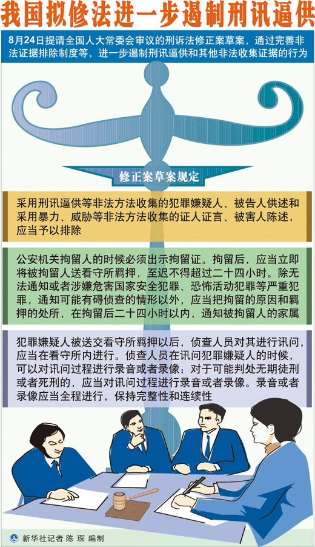

# ＜七星说法＞第三期：进步or退步，对刑诉法修正案草稿的简单分析

**编者按：** 开办《七星说法》这个栏目，我们的初衷是这样的。 中国社会当前，有很多变革的趋势：市场经济取代计划经济，生产力的整合能力大幅提高；在文化层面，世俗化不断推进，意识形态色彩逐渐淡出日常视野；在人的个性层面，现代的合理的生活方式，被设想和实现。中国社会的世俗化进程正在推进，包括社会结构和意识形态结构的转型。 不过，问题也就在这里。我们社会的发展历来受到政府的强力支配，宏观经济计划的制定，社会体制的规划，无所不包，而相应的法的合法性建设始终欠缺。因而，社会问题的出现和行政系统的相应功能是分不开的，如日益严重的腐败问题，权力寻租，贫富分化造成的尖锐社会矛盾。 缓解社会矛盾，关键在于制度化的渠道建设和疏导，而制度的建设和保障，需要强有力的法力系统。关键也在于社会对法的普遍认同和承认。我们社会的法治建设一直不完善，现行的法律，无法有效保障社会弱势的群体的利益实现并限制强势群体的权利扩张。 在法律正义维度缺失的现实中，当代社会问题的本质，就是合法性问题。实际上，我们的法律在事实与价值之间的张力凸显，重构法的合法性就刻不容缓。 这样说是个大议题，但我们的《七星说法》栏目希望从小处着眼，深入浅出，不拘一格。我们的目的是希望将更多对法理的探讨，对法的实践的关注带入大家的视野，从而彰显法的价值和精神。 非常欢迎建议和投稿。请[@瓢虫君](http://www.renren.com/profile.do?id=362359989)。  **本期导读：** 怀胎15年，这部刑诉法修正案草案终于呱呱坠地，草案一出即惹起轩然大波，被网友们调侃为《人间蒸发法》、《刑事维稳法》，更让一些法律界人士模糊了明天。对此，本文作者提出了自己独到的见解，通过摘出一部分变动较大或较有意义的条款，解释这些修改是怎样“进步”与“退步”的。作为编者，我坚信法治时代终将到来，我也期待刑诉法得到完善的修改，你呢？ 

# 进步or退步，对刑诉法修正案草稿的简单分析

 

## 文 /龙匡夔

 按：这次刑诉修正案的提出，共有九十五条，涉及修改的法条近四分之一，新增的法条亦有近四分之一。进步之处可以说占绝大部分，如不得强迫嫌疑人自证 其罪，增加死刑复核程序的复杂程度，明确规定律师会见时不被监听等与律师法相一致的规则等。也有部分引起争议的内容，如草稿第三十六条、三十九条中的口袋 罪条款，第四十条对律师义务的规定等。修正案草稿中的每一条都含有不少信息，但是将每一条都解读一遍，笔者没有这个精力，看客也难有这个耐心，下面我摘出 一部分变动较大或较有意义的条款与刑事诉讼法进行比对，看看到底这些修改是怎样“进步”与“退步”的。草稿全文请参照 http://news.163.com/11/0830/16/7CNI08HN00014JB5.html，由于内容繁多，我摘取的部分直接用原文的 序号，不另起开头了。文中之所以常用“公检”这个字眼，是因为不同的案子有公安局立案和检察院立案的差别，合并起来说较为严谨。 另外说一句，本次修改的大部分内容是将之前的规范性司法解释直接入法，而这些法律渊源主要是最高人民法院关于执行《中华人民共和国刑事诉讼法》若干问题的解释（刑诉解释）、人民检察院刑事诉讼规则（高检规则）这两部。 

 四、将第三十四条修改为： “公诉人出庭公诉的案件，被告人因经济困难或者其他原因没有委托辩护人的，人民法院可以指定承担法律援助义务的律师为其提供辩护。” …… “犯罪嫌疑人、被告人可能被判处无期徒刑、死刑而没有委托辩护人的，人民法院、人民检察院和公安机关应当通知法律援助机构指派律师为其提供辩护。” 这里是第一款的修改使自诉罪的被告人丧失了被援助权，实际上自诉案件本来就是很轻微的刑事案件，这样改是没有问题的。第三款增加了可能被判处无期徒刑的犯罪嫌疑人的强制辩护，算是对人权的改进。 七、将第三十六条改为二条，作为第三十七条、第三十八条，修改为：…… “辩护律师持律师执业证书、律师事务所证明和委托书或者法律援助公函要求会见在押的犯罪嫌疑人、被告人的，看守所应当及时安排会见，至迟不得超过四十八小时。 “辩护律师会见在押的犯罪嫌疑人、被告人，可以了解有关案件情况，提供法律咨询等；自案件移送审查起诉之日起，可以向犯罪嫌疑人、被告人核实有关证据。辩护律师会见犯罪嫌疑人、被告人时不被监听。 第二款细化了一个程序性的规定，把会见权的具体行使方式列了出来。第三款参见律师法第三十三条“犯罪嫌疑人被侦查机关第一次讯问或者采取强制措施之日起，受 委托的律师凭律师执业证书、律师事务所证明和委托书或者法律援助公函，有权会见犯罪嫌疑人、被告人并了解有关案件情况。律师会见犯罪嫌疑人、被告人，不被 监听。”之前有公检方面一直对于某些刑事犯罪保留律师会见时的监视权，因为刑诉里有“律师会见在押的犯罪嫌疑人，侦查机关根据案件情况和需要可以派员在 场”的规定，和律师法是冲突的。想也知道律师法出台三年以来，悲剧的是谁。 十一、增加一条，作为第四十六条：“律师对在执业活动中知悉的委托人的有关情况和信息，有权予以保密。但是，律师在执业活动中知悉委托人或者其他人，准备或者正在实施危害国家安全、公共安全以及严重危害他人人身安全的犯罪的，应当及时向司法机关通报。” 刑 诉之前出现律师这个字眼近二十次，除三十四条“辩护律师和其他辩护人，不得帮助犯罪嫌疑人、被告人隐匿、毁灭、伪造证据或者串供，不得威胁、引诱证人改变 证言或者作伪证以及进行其他干扰司法机关诉讼活动的行为。”规定的是禁止性的义务之外，其他全是一个用词“可以”，也就是说基本上都是有关律师权利的规 定。但我们看这几年律师被检察院搞得案例层出不穷，哪一个不是适用刑诉第三十四条的？可以说，之前公权力迫害律师的合法性依据就是刑诉三十四条，大奸大恶 皆源于此。可以预见的是，每给刑辩律师多增加一个义务，就又一批锒铛入狱的律师。这第四十六条将成为明证。 十四、将第四十三条 改为第四十九条，修改为：“审判人员、检察人员、侦查人员必须依照法定程序，收集能够证实犯罪嫌疑人、被告人有罪或者无罪、犯罪情节轻重的各种证据。严禁 刑讯逼供和以其他非法方法收集证据，不得强迫任何人证实自己有罪。必须保证一切与案件有关或者了解案情的公民，有客观地充分地提供证据的条件，除特殊情况 外，并且可以吸收他们协助调查。” 自证其罪是共产主义运动的流产儿苏联遗留下来的伟大光荣的胜利劳动果实。不得自证其罪这一条 一出来，当然字面意思上是进步。但是你要知道以中国的侦查机关的姿势水平，很多案子不严刑逼供、不让你求饶认罪，那是绝对审不出来的。也就是说，可以预见 的是这一条大大增加了公检机关的破案难度。 

 十七、增加一条，作为第五十三条：“采用刑讯逼供等非法方法收集的犯罪嫌疑人、被告人供述和采用暴力、威胁等非法方法收集的证人证言、被害人陈述，应当予以排除。违反法律规定收集物证、书证，严重影响司法公正的，对该证据应当予以排除。 “在侦查、审查起诉、审判时发现有应当排除的证据的，应当依法予以排除，不得作为起诉意见、起诉决定和判决的依据。” 这个是非法证据排除规则。最高检98年即发布了高检规则，这里是从司法解释融合到法律中。草稿从第十七条到第二十一条都是关于非法证据排除与证据采用事项的程序性问题，不多说了。 二十三、增加一条，作为第六十一条：“对于危害国家安全犯罪、恐怖活动犯罪、黑社会性质的组织犯罪、毒品犯罪等案件，证人、被害人因在诉讼中作证，本人或者其近亲属的人身安全面临危险的，人民法院、人民检察院和公安机关应当采取以下一项或者多项保护措施： “（一）不公开真实姓名、住址和工作单位等个人信息； “（二）采取不暴露外貌、真实声音等出庭作证措施； “（三）禁止特定的人员接触证人、被害人及其近亲属； “（四）对人身和住宅采取专门性保护措施； “（五）其他必要的保护措施。 “证人、被害人认为因在诉讼中作证，本人或者其近亲属的人身安全面临危险的，可以向司法机关提出予以保护的申请。” 有 人拿这个开炮，说你被抓了以后，证人只给个证言，声音脸都看不见。这是法盲的说法。首先刑事诉讼看法条的意思，本来就没要求证人一定出庭作证，至于刑诉解 释一百四十一条说“证人应出庭作证”，实际上刑诉案件证人出庭率不足10%是个常态。一百四十二条规定四种不出庭情况，第四种叫“有其他原因的”，其实就 是无限扩大证人不出庭作证的权利。而草稿第二十三条说的不是这回事，而是对于某些很牛逼的犯罪集团，证人真是弱势到哪里去了，不保护不行的。 三 十、增加一条，作为第七十三条：“监视居住应当在犯罪嫌疑人、被告人的住处执行；无固定住处的，可以在指定的居所执行。对于涉嫌危害国家安全犯罪、恐怖活 动犯罪、重大贿赂犯罪，在住处执行可能有碍侦查的，经上一级人民检察院或者公安机关批准，也可以在指定的居所执行。但是，不得指定在羁押场所、专门的办案 场所执行。 “指定居所监视居住的，除无法通知或者涉嫌危害国家安全犯罪、恐怖活动犯罪，通知可能有碍侦查的情形以外，应当把监 视居住的原因和执行的处所，在执行监视居住后二十四小时以内，通知被监视居住人的家属。 “指定居所监视居住的，被监视居住的犯罪嫌疑人、被告人委托辩护人，适用本法第三十三条的规定。 “人民检察院对指定居所监视居住的决定和执行是否合法实行监督。” 第二款这里又被人开炮，说1、无法通知2、涉嫌危害国家安全犯罪3、恐怖活动犯罪4、通知可能有碍侦查的情形，这四种情形不通知家属了。我们仔细看看逻辑结 构是这样的，当1、无法通知2、涉嫌危害国家安全犯罪3、恐怖活动犯罪且4、通知可能有碍侦查的情形时，可以不通知家属。其中1-3是并列的，4是必要条 件（4是之前刑诉中的充分必要条件）。另外，您都涉嫌危害国家安全和恐怖活动了，一般不给你直接扔到400W灯下就算好的，像取保候审、监视居住这样的监 外措施，公安要真是用了才是撞见鬼呢。 值得一提的是，草稿第三十六项和三十九项也有相似的条款，但是这两项和第三十项有个不同之处“除无法通知或者涉嫌危害国家安全犯罪、恐怖活动犯罪**等**严重犯罪”，多个“**等**” 字。这一条引起广泛热议的原因在于“等严重犯罪”是个口袋罪，什么都可以往里装。实际上，我们看刑诉第六十四条“拘留后，除有碍侦查或者无法通知的情形以 外，应当把拘留的原因和羁押的处所，在二十四小时以内，通知被拘留人的家属或者他的所在单位。”修改后对于公安局的权利做了一定限度的缩小。然而我认为这 个口袋罪还是亟需一个配套的司法解释来释义一下，什么叫“等严重犯罪”的，比如可以规定对社会危害极大、可以判处无期徒刑以上刑期的犯罪等。有个稍微明确 的规则，公安方面执行起来争议会少一些。 四十九、增加一条，作为第一百二十条：“侦查人员在讯问犯罪嫌疑人的时候，可以对讯问过程进行录音或者录像；对于可能判处无期徒刑或者死刑的，应当对讯问过程进行录音或者录像。 “录音或者录像应当全程进行，保持完整性。” 录像是对合法执法的监督，也是侦查人员可以证明行为合法的证明力较强的证据。这一条最理想的状态是什么呢？在讯问全过程（乃至可以延伸到所有取证的过程，当 然出于取证的必要无法进行录像的除外）均需录像，在讯问中取得的口供，当事人提出异议的，需侦查人员提供合法性证明。这一条在刑诉第十次大修的时候大概能实现吧。 

 五十、删去第九十六条。 删除的主要是第二款，与律师法相悖的，臭名昭著的，“律师会见在押 的犯罪嫌疑人，侦查机关根据案件情况和需要可以派员在场。”但是仍然没有对于公检系统禁止监听的规定，因此不难想象以后的情形大多是，在公安机关认为有必 要的时候，取消专程派员监督，代之为会见过程全程录像与监听。 五十六、在第二编第二章第七节后增加一节，作为第八节： “第八节技术侦查 这一节内容太多不一一叙述，技术侦查的对象主要有以下几类1、危害国家安全犯罪、恐怖活动犯罪、黑社会性质的组织犯罪、重大毒品犯罪或者其他严重危害社会的 犯罪案件，2、重大的贪污、贿赂犯罪案件以及利用职权实施的严重侵犯公民人身权利的重大犯罪案件，3、追捕被通缉或者被批准、决定逮捕的在逃的犯罪嫌疑 人、被告人。技术侦查在之前的刑诉中没有明文规定，出现最多的情况是滥用技术侦查侵犯个人隐私的，这年头都见怪不怪了。可以说这一节的加入对公权力也是一 定的限制。至于效果，还不太好说。 五十七、将第一百二十八条改为第一百五十七条，第一款修改为：“在侦查期间，发现犯罪嫌疑人另有重要罪行的，经上一级侦查机关批准，依照本法第一百五十三条的规定重新计算侦查羁押期限。” 这一条增加了一个“经上一级侦查机关批准”的限定条件，看在之前的刑事案件中对于犯罪嫌疑人各种变相超期羁押的理由已经罄竹难书的份儿上，做这么个修改着实是个进步。 八十三、将第一百八十九条改为第二百二十四条，增加一款，作为第二款：“原审人民法院对于依照前款第三项规定发回重新审判的案件作出判决后，被告人提出上诉或者人民检察院提出抗诉，第二审人民法院经过审理，仍然认为事实不清楚或者证据不足的，应当依法作出判决。” 一 百八十九条规定二审法院对第三种情况的处理方式“原判决事实不清楚或者证据不足的，可以在查清事实后改判；也可以裁定撤销原判，发回原审人民法院重新审 判。”这样一来有的案子没完没了地审了上诉，上诉审完退回来再审，再审完了再上诉，上诉审完了再退回来……丝毫体现不出刑法的谦抑性来。这样的修改让“疑 罪从无”的原则有了可以实现的空间，算是一个不小的进步。 最后九十五到九十八章是新增的四个程序：未成年人犯罪案件诉讼程序，当事人和解的公诉案件诉讼程序，犯罪嫌疑人、被告人逃匿、死亡案件违法所得的没收程序，对实施暴力行为的精神病人的强制医疗程序。其中有不少值得关注的地方： 未成年人犯罪案件诉讼程序类似于中国的第一部半成熟的少年法庭法，之前整个刑诉法中关于未成年人的条款只有第一百五十二条第二款未成年人涉嫌刑事案件不公开审理的规定，现在依习惯与司法解释将未成年人涉嫌刑事案件的司法程序立为正式法可谓进步。 有关和解协议，“第二百七十四条对于下列公诉案件，犯罪嫌疑人、被告人自愿真诚悔罪，通过向被害人赔偿损失、赔礼道歉等方式获得被害人谅解的，双方当事人可以达成和解协议： “（一）因民间纠纷引起，涉嫌刑法分则第四章、第五章规定的犯罪案件，可能判处三年有期徒刑以下刑罚的； “（二）除渎职犯罪以外的可能判处七年有期徒刑以下刑罚的过失犯罪案件。 “花钱买刑”有木有？最容易联想到的是交通肇事罪（除非逃逸致人死亡，基本最高刑是七年）之后加害人一个劲儿地悔过赔钱，从而从宽处理。这一条立法并不新鲜，在3月份笔者对药家鑫案进行分析时就谈到了，下面部分转述。 2000 年《最高人民法院关于刑事附带民事诉讼范围问题的规定》（以下简称《规定》）第四条“被告人已经赔偿被害人物质损失的，人民法院可以作为量刑情节予以考 虑”。《意见》第二十三条规定“被告人案发后对被害人积极进行赔偿，并认罪、悔罪的，依法可以作为酌定量刑情节予以考虑。” 这 些条文的大前提是在刑事附带民事诉讼的案件中存在的刑事和解制度，即司法机关在司法过程中借助司法权威，依法促成侵权型刑事案件中的被害人和加害人的和 解，使加害人在获得被害人谅解的前提下获得轻判或免于刑罚。其内在逻辑是，部分刑事案件被告人的犯罪行为给原本正常、平衡的利益关系造成了破坏性后果，刑 罚则是通过惩罚加害人以抚慰被害人的心灵，通过司法强制力量恢复已被破坏秩序的平衡。如果能以和平的或和解的方式恢复这种平衡，就没必要采取暴力的或强制 的刑罚方式。因为后者可能产生新的社会心理怨恨或新的失衡，而前者则恰恰能以最小代价和最温和的方式恢复秩序平衡。 许多人担心 社会阶层的分野会导致以罚代刑、花钱买刑等问题的滋生。实际上刑法实施30多年来，刑事附带民事诉讼在长期的司法实践中，往往是重刑轻偿的。另一个最明显 的例子是《规定》第一条第二款“对于被害人因犯罪行为遭受精神损失而提起附带民事诉讼的，人民法院不予受理”，在2010年7月起施行的《侵权责任法》出 台后方有“侵害他人人身权益，造成他人严重精神损害的，被侵权人可以请求精神损害赔偿”的条款。而根据之前段落中所述“恢复平衡”的逻辑，接受法定刑罚的 可以不予法外赔偿，给予法外赔偿的可以减轻刑罚的说法也是没有问题的。 先说这么多，欢迎大家批评和补充。 

 [原文点此](http://blog.renren.com/blog/248926174/756109702) 

### 

### 

（本期编辑：张蒙）

 
