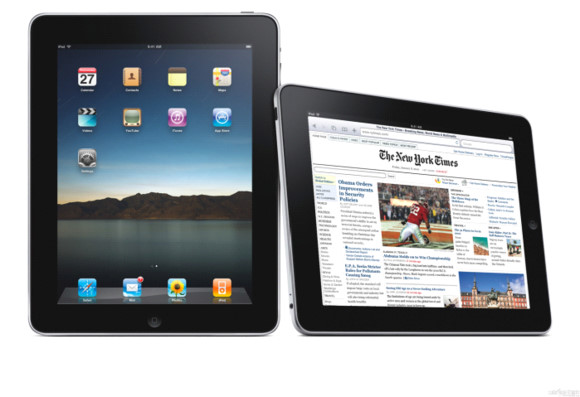
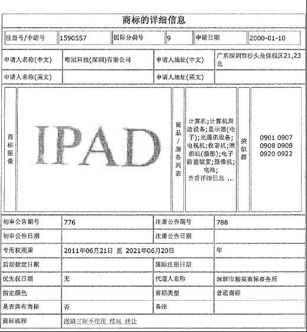
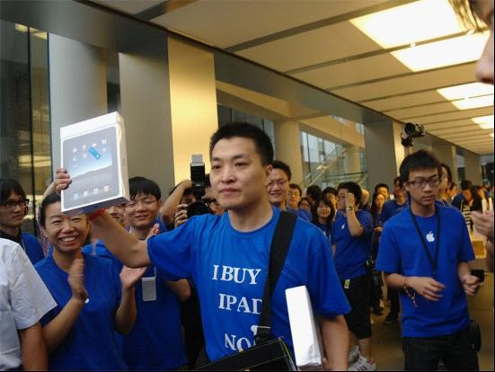
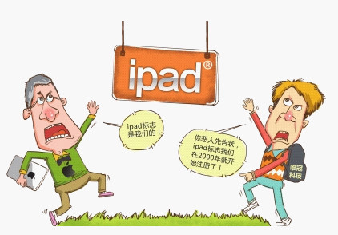

# ＜七星说法＞第九期：“iPad”的身世之谜

**本期导读：** **前几日，朋友问我，“哎，你知道，‘iPad’商标是苹果公司的吗？”** **我一愣。这不是个问题啊， “iPad”毋庸置疑是乔帮主的创世之作，“iPhone”、 “iTouch” 、“iPod”的同胞弟兄，商标怎么会不是苹果公司的呢?然，问者露出得逞的浅笑，娓娓道来，** **“去年4月苹果起诉深圳唯冠公司归还“iPad”中国内地商标权。今年12月，深圳中级人民法院一审判决驳回苹果公司的诉讼请求，所以，深圳唯冠公司才是真正的“iPad”商标持有人。知识产权律师游云庭说了，苹果公司将在中国大陆地区面临要么给iPad改名，要么通过和解的方式获取唯冠公司的授权，继续使用iPad商标的境地。”** **网上关于本案的评论分析很多，对苹果在转让商标权中的失误几乎没有异议，也对在商标收购、签订商标转让协议、撤销三年不使用商标申请中需注意的要点进行了深入而详尽的分析。因此，笔者仅从事实和法律出发，从事件细节着眼，揭开iPad扑朔迷离的身世之谜。**  

# 第九期：“iPad”的身世之谜

## 

#### “iPad”商标权案件始末

唯冠国际控股有限公司（唯冠国际）是香港的上市公司（00334.HK），“唯冠科技（深圳）有限公司”（深圳唯冠）和唯冠电子股份有限公司（台湾唯冠）是唯冠国际在深圳及台湾地区的全资子公司。深圳唯冠的法定代表人和台湾唯冠的负责人均是杨荣山。

早在2001年6月和12月，深圳唯冠就在中国申请了注册号1590557“IPAD”和注册号1682310“iPAD”的商标权。2001年至2004年，台湾唯冠先后在欧盟、韩国、墨西哥、新加坡、印度尼西亚、泰国、越南等国家注册了8个与“iPad”相关的商标权。

2006年前后苹果公司策划进入欧洲市场时，得知台湾唯冠在先注册了“iPad”商标权，于是以“撤销闲置不用商标”为由向英国商标局提出撤销申请，希望获得iPad商标，但因台湾唯冠当时仍有相当数量“iPad”平板电脑存货，因而苹果在英国败诉。

2009年8月，英国一家专利商标中介- IP申请发展有限公司（IP Application Development Limited）向当时因经济危机打击正处于困境的台湾唯冠提出受让其所有的全球iPad商标，除了台湾唯冠注册的8个商标以外，还包括深圳唯冠的两个商标。

2009年12月23日，杨荣山授权员工麦世宏与英国IP公司签署相关协议，转让iPad商标权。据苹果公司称，该协议约定唯冠将iPad全球商标以3.5万英镑的价格转让给IP公司。

2010年2月，苹果发现,iPad商标无法在中国国家商标局办理转让手续。究其原因，是他们拿到的商标权仅限于7个国家或地区，而在中国的商标权并不属于当初转让的台湾唯冠，属于深圳唯冠。

2010年2月9日，IP公司以商标连续三年停止使用为由，向中国国家商标局申请撤销深圳唯冠的iPad商标。该申请已被国家商标局受理。根据截稿日笔者在国家工商行政管理总局商标局网站查询的结果显示，“IPAD”商标已获续展，商标持有者为唯冠科技（深圳）有限公司，期限自2011年6月21日至2021年6月20日。

2010年2月，苹果公司试图就iPad商标权转让事宜与唯冠进行协商。

2010年3月，中国银行、民生银行、开发银行等8家银行查封了深圳唯冠的资产，目前和君创业公司担任深圳唯冠的债务重组顾问。“深圳唯冠”公司曾是全球第四大平板显示器制造商。但由于金融危机，资金链断裂，使得这家公司如今债台高筑，所有资产都已被8大银行接管，包括其申请的两项商标权。据知情人士透露（待证实），在银行查封深圳唯冠的资产前，苹果公司曾与其就商标权转让事宜进行谈判磋商。苹果公司开出的转让价格是4000万美元，但是由于双方的期望值差距过大，未能达成协议。苹果公司也曾经与前述8家银行进行沟通，其解决方案是希望深圳唯冠进入破产程序，然后将iPad商标权进行拍卖，苹果再以合适的价格买走该商标权。不过，此方案遭到了各家银行的拒绝。

2010年4月7日，IP公司以象征性的10英镑价格转将“iPad”商标权让给苹果公司。

2010年4月19日苹果公司和IP公司将深圳唯冠告上法庭，要求其归还商标权，并赔偿调查费、律师费损失共计人民币400万元。该案已于2011年2月23日、8月21日、10月18日三次开庭审理。

2010年5月20日苹果公司和IP公司在香港法院，就台湾唯冠在商标转让协议中的违约行为，向唯冠控股、台湾唯冠、深圳唯冠等提起了民事诉讼。

2010年9月17日，苹果公司iPad产品进军中国市场。

2011年12月5日，深圳中级人民法院做出一审判决：驳回苹果公司的全部诉讼请求，案件受理费人民币4.56万元由两原告（苹果公司与IP公司）承担。

2011年12月30日和2012年1月 17日，深圳唯冠将向深圳和惠州的法院分别提起诉讼，要求苹果iPad的代理商停止商标侵权。

就笔者研究所得，用三句话表述整个事件，即：

1． 苹果公司为在世界范围内推出iPad，借由IP公司收购了台湾唯冠的全球“iPad”商标权，然而事后发现中国内地的“iPad”商标权属于深圳唯冠，苹果公司收购的所谓全球“iPad”商标权并不包括中国内地 “iPad”商标权。

2． 于是，苹果几乎马不停蹄地采取了一系列措施，希望获得中国内地 “iPad”商标权。如向商标局提出撤销深圳唯冠商标权、与深圳唯冠谈判转让商标权（其中又包括谈判转让费，提出拍卖“iPad”商标权等方案），起诉台湾唯冠对商标转让协议承担合同违约责任，以及起诉深圳唯冠归还“iPad”商标权。

3． 目前深圳唯冠所有资产已被8大家银行接管，欠银行约11.45亿，而iPad商标则成了最有价值的资产，深圳唯冠于是提出向苹果索赔100亿元，其很可能打算通过iPad商标“解套”。

这里有一个博弈的过程，如果苹果收购中国内地“iPad”商标，想必要付出不菲的商标权使用费；如果苹果改名，则该商标一文不值，以为找到救命稻草的深圳唯冠和8大银行将空欢喜一场；如果苹果不收购也不改名，则面临侵权，需向深圳唯冠支付侵权赔偿损失，具体数额会依据深圳唯冠的损失、苹果iPad销售所得、深圳唯冠提起侵权的时间等具体因素进行综合考虑。所以，三步之内，必有结论，且拭目以待。

#### “iPad”商标权案件争议焦点

关于这场硝烟之战，有以下几个问题。

**观众问**，中国内地“iPad”商标权究竟属于谁？ 

我国商标注册遵循注册在先原则，是指两个或者两个以上的商标注册申请人，在同一种商品或者类似商品上，以相同或者近似的商标申请注册的，申请在先的商标，其申请人可获得商标专用权，在后的商标注册申请予以驳回。中国内地“iPad”商标权属于在先注册的深圳唯冠。

我国商标法规定不得侵犯他人的在先权利或合法利益，申请商标不可与在先申请的商标近似，深圳唯冠在平板电脑上注册 了“iPAD”和“IPAD”商标，使得苹果公司不可能在同类产品——平板电脑上申请“iPad”商标。同时，我国商标法规定注册商标的有效期为10年。深圳唯冠的iPad”商标权有效期至2011年6月20日止。但深圳唯冠已于6月21日提出续展，有效期自2011年6月21日至2021年6月20日。根据中国国家商标局的登记记录，中国内地“iPad”商标权属于深圳唯冠。

**支持苹果者问**，台湾唯冠向IP公司转让商标协议中包括深圳唯冠的两个商标，为何IP公司未取得深圳唯冠的商标权？ 

签署商标权转让协议的是台湾唯冠，而协议中的中国内地商标权属于深圳唯冠。商标权具有地域性，只在特定国家或地区的地域范围内有效，不具有域外效力。

深圳唯冠代理律师、广东广和律师事务所律师肖才元对台湾唯冠与深圳唯冠进行了具体分析，台湾唯冠与深圳唯冠是不同法域内的企业法人，台湾唯冠是按台湾地区法律设立的股份公司，深圳唯冠是依照中国大陆法律设立的有限公司，两家公司组织架构、管理模式均是独立的，商务活动及民事责任均是独立的。因此，台湾唯冠转让深圳唯冠的iPad商标专有权的行为，属于无权处分。无权处分的情况下，如果权利人追认，则处分有效，即如果深圳唯冠做出同意台湾唯冠转让的表示，则转让协议有效，否则协议中关于转让深圳唯冠商标权的部分无效。深圳唯冠明显没有作出类似的表示，因而IP公司并未取得深圳唯冠的两项iPad商标权利。

**支持苹果者问**，台湾唯冠与深圳唯冠的法定代表人均为杨荣山，台湾唯冠与IP公司的协议也明确表明转让全球iPad的商标权，即便承认台湾唯冠确实无权处分深圳唯冠享有的商标权，是否可以认为，IP公司因为信赖台湾唯冠有权代理深圳唯冠转让中国内地商标权，而与其签订协议，所以应当保护IP公司的合法权利呢？ 

此处提出的理由，在法律上称之为“表见代理”，是指虽无代理权，但交易对方表面上有足以使善意相对人相信其有代理权，而将交易结果由权利人承担的代理，体现法律保护善意相对人的利益。表见代理发生有权代理的效果。例如甲公司长期委任乙为总代理与丙公司交易，后甲撤销了对乙的授权，却未通知丙，乙此后再以甲的名义与丙订立合同，合同有效，此即为表见代理。

而在IP公司和台湾唯冠的商标权转让协议中，不存在表见代理。台湾唯冠自始至终没有作出其是深圳唯冠代理方的表示 (案件审理过程中没有出示任何相关证据),问题就在于苹果“自以为”台湾唯冠享有对深圳唯冠的代理权，却没有去做详尽的尽职调查，没尽到最低限度的注意义务，因此造成了这“一揽子专利权”漏了中国内地商标权的乌龙事件。

“表见代理”以外，还有一个词叫“无权代理”，指行为人不具有代理权，而以他人名义实施法律行为，且不构成表见代理的情形。此处台湾唯冠提出转让包括中国内地商标权在内的全球iPad的商标权的行为，是无权代理的行为，苹果以表见代理为理由抗辩不成立。法律保护善意相对人的利益，但此处的IP公司并非善意相对人。

 **支持唯冠者问**，不难看出，此处的英国IP申请发展有限公司（IP Application Development）是苹果公司的壳公司。那是否正如担任深圳唯冠的债务重组顾问的和君创业公司总裁李肃所说，苹果此前以3.5万英镑价格购得唯冠iPad全球商标使用权，涉嫌“欺诈罪”？ 

资深知识产权律师游云庭认为，事实上，在我国法律框架下通过成立这种“白手套”式的公司进行交易是合法的，而我国法律上规定的无效交易的情形主要局限于损害国家、集体、第三人或社会公共利益，以及以合法形式掩盖非法目的等情形。只要所谓的白手套公司设立时手续齐全、在交易过程中积极履行交易义务，并且交易条件未显失公平的话，类似苹果通过IP公司获取“iPad商标”的交易就是合法有效的。

**支持唯冠者问**，深圳唯冠将对苹果经销商提出商标侵权诉讼，苹果公司在中国销售不享有商标专用权的商品，其经销商是否应承担侵权责任? 

我国商标法规定，商品经销商销售侵犯商标权的商品，不管行为人主观上是否有过错，只要实施了销售侵犯注册商标专用权的商品（只要苹果不上诉或二审维持一审判决，则所有iPad产品均为侵权商品）的行为，都构成侵权。只是在行为人主观上是善意时，可以免除其赔偿责任。商标法第56条第3款规定：销售不知道是侵犯注册商标专用权的商品，能证明该商品是自己合法取得的并说明提供者的，不承担赔偿责任。因此，只要商品经销商主观上并不明知自己销售的iPad产品为侵权商品，即免除赔偿责任。

**果粉问**，“唯冠明明就是恶意抢注，等到iPad大卖之后再索要巨额赔偿！”，“这无异于一场抢劫，要知道为了推广这个品牌，苹果花了多大的力气，如今却面临着为他人做嫁衣的结果！”，“这就是一场赤裸裸地商业讹诈！” 

我国商标法第31条规定：申请商标注册不得损害他人现有的在先权利，也不得以不正当手段抢先注册他人已经使用并有一定影响的商标。唯冠注册商标在2000年，苹果公司推出iPad是在2006年。除非唯冠能穿越时空，预见到2010年iPad在中国大卖，否则恶意抢注纯属扯淡。

这场打了近两年的官司如抽丝剥茧般牵扯出了10年前的故事，“iPad”的身世也逐渐明了。无论如何，不能否认的是iPad确实是苹果的创世之作，唯冠的iPad并没有轰轰烈烈地改变世界；而唯冠虽然有敏锐的洞察力，预知平板电脑会是潮流所向，只是没料到，一切伟大产品的诞生与该产品所处的时代，受众对产品的接受度密不可分。我更愿意相信这个故事会有一个圆满的结局，苹果和唯冠可能会牵手，拉着iPad一起过上幸福美好的生活。毕竟，如果因为发现生母不是苹果，而使得“iPad”被迫改姓，是大家都不愿意看到的。

#### 法律实务深入研究，请参阅：

《苹果iPad商标诉讼能够避免吗？——简析我国法律框架下商标收购的注意要点》 游云庭新浪博客 [http://blog.sina.com.cn/s/blog_49e5b1240100zist.html](http://blog.sina.com.cn/s/blog_49e5b1240100zist.html)  《注册商标连续三年停止使用撤销程序简介》 中国商标网[ http://www.tmchn.com/use/l/2982.htm]( http://www.tmchn.com/use/l/2982.htm) 

#### 一审法院观点，请参阅：

新华网 [http://news.xinhuanet.com/newmedia/2011-12/15/c_122426746_2.htm](http://news.xinhuanet.com/newmedia/2011-12/15/c_122426746_2.htm) 

#### 关于案件信息来源，请参阅：

《中国经营报》 [http://www.chinaipmagazine.com/news-show.asp?id=3446](http://www.chinaipmagazine.com/news-show.asp?id=3446) 《南方都市报》 [http://tech.qq.com/a/20111209/000025.htm](http://tech.qq.com/a/20111209/000025.htm) 《深圳新闻网-晶报》[http://tech.qq.com/a/20111206/000115.htm](http://tech.qq.com/a/20111206/000115.htm) 《中国贸易报》[http://chinatradenews.com.cn/founder/html/2011-12/15/content_20299.htm?div=-1](http://chinatradenews.com.cn/founder/html/2011-12/15/content_20299.htm?div=-1) 《中国广播网》[http://big5.jrj.com.cn/gate/big5/finance.jrj.com.cn/tech/2011/12/07092211742723.shtml](http://big5.jrj.com.cn/gate/big5/finance.jrj.com.cn/tech/2011/12/07092211742723.shtml) 《价值中国 李肃的职业日志》[http://www.chinavalue.net/General/Blog/2010-10-27/503462.aspx](http://www.chinavalue.net/General/Blog/2010-10-27/503462.aspx) 《中国商事仲裁网》[http://www.ccarb.org/news_detail.php?VID=18452](http://www.ccarb.org/news_detail.php?VID=18452) 《搜狐网》[http://roll.sohu.com/20111226/n330275106.shtml](http://roll.sohu.com/20111226/n330275106.shtml)  

（编辑：陈蓉，余学文）

 
