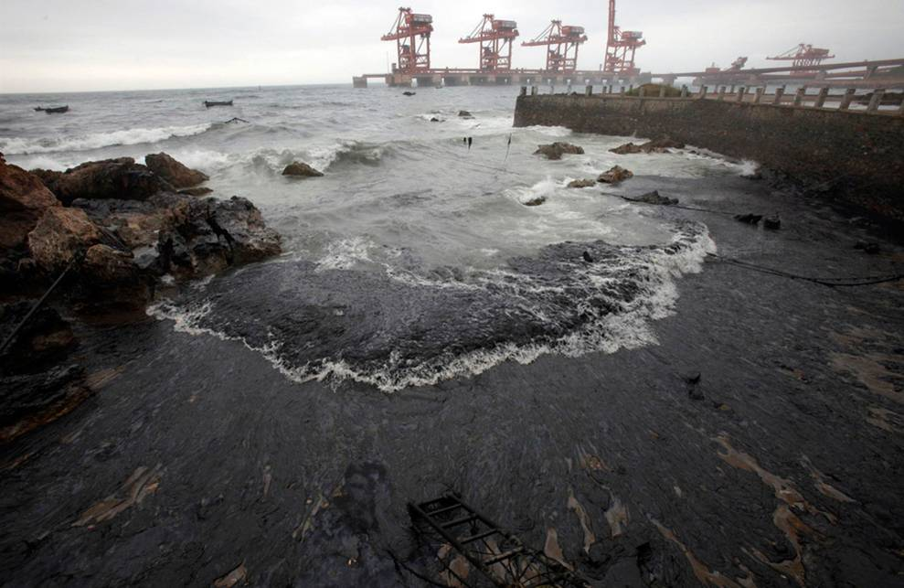
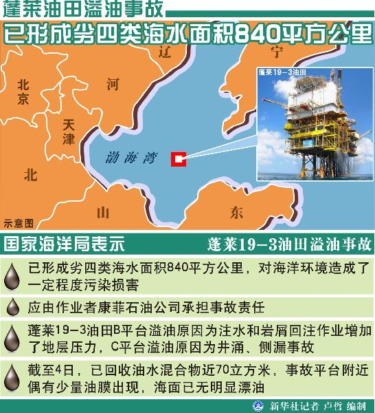
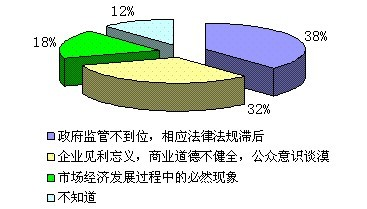
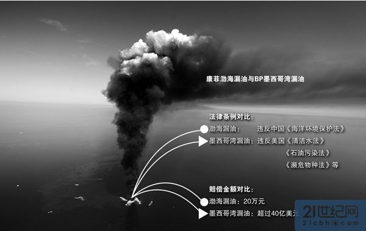

# ＜七星说法＞第二 期：油光倒映法律：渤海湾漏油事故之辨

**编者按：** 开办《七星说法》这个栏目，我们的初衷是这样的。 中国社会当前，有很多变革的趋势：市场经济取代计划经济，生产力的整合能力大幅提高；在文化层面，世俗化不断推进，意识形态色彩逐渐淡出日常视野；在人的个性层面，现代的合理的生活方式，被设想和实现。中国社会的世俗化进程正在推进，包括社会结构和意识形态结构的转型。 不过，问题也就在这里。我们社会的发展历来受到政府的强力支配，宏观经济计划的制定，社会体制的规划，无所不包，而相应的法的合法性建设始终欠缺。因而，社会问题的出现和行政系统的相应功能是分不开的，如日益严重的腐败问题，权力寻租，贫富分化造成的尖锐社会矛盾。 缓解社会矛盾，关键在于制度化的渠道建设和疏导，而制度的建设和保障，需要强有力的法力系统。关键也在于社会对法的普遍认同和承认。我们社会的法治建设一直不完善，现行的法律，无法有效保障社会弱势的群体的利益实现并限制强势群体的权利扩张。 在法律正义维度缺失的现实中，当代社会问题的本质，就是合法性问题。实际上，我们的法律在事实与价值之间的张力凸显，重构法的合法性就刻不容缓。 这样说是个大议题，但我们的《七星说法》栏目希望从小处着眼，深入浅出，不拘一格。我们的目的是希望将更多对法理的探讨，对法的实践的关注带入大家的视野，从而彰显法的价值和精神。 非常欢迎建议和投稿。请@[瓢虫君](http://www.renren.com/profile.do?id=362359989&from=opensearch)。  **本期导读：** 在环境问题层出不穷的今天，我们最该朝谁竖中指？本文作者给出的答案是我国落后的相关环境法律。作者在文中指出事故中康菲公司丑恶嘴脸的本质是我国不给力的环境法律制度，没有法律的保护，环境就只能赤裸裸的任人凌辱。歌德说，自然是唯一的问题；作者说，法律是唯一的问题。对此，不管你信不信，反正我信了，下次的油光中，我们希望看到法律清晰的倒影。  

# 油光倒映法律：渤海湾漏油事故之辨

## 文/纳兰辰瀚（中南财经政法大学）

如果不是因为渤海湾的漏油事故，公众恐怕很少关心康菲公司这个在公众视野中鲜有提及的美国石油企业。而如果不是因为康菲公司，公众恐怕也很少会关心，跨国公司造成环境污染之后，需要承担的法律责任是什么。

在2011年的六月四日，康菲公司负责作业的蓬莱19-3油田发生了海底溢油事故，之后的几个星期时间，接连发现了若干个溢油点，这些漏油直接导致了渤海相关海域的水质由一类水质变成了四类水质，沿海城市的养殖业和海洋生态环境暴露在了巨大的危险之中。毫无疑问，这是一起由于海上油井作业疏忽，导致的环境污染事故。其带来的严重后果和潜在的巨大环境风险是非常值得重视的。

渤海湾的漏油事故不禁让我们想起了去年美国墨西哥湾的漏油事件。这两个事件拥有类似的事故情节，但处理的方式和责任方所需要承担的法律后果却大相径庭（http://opinion.hexun.com/2011-08-22/132679583.html）。两个事件在各方面的巨大差距让我们开始关心，关于环境事故所涉及的法律条文和可能导致的法律后果，我们应该了解哪些？而透过这样的环境事故，法律所暴露出的缺陷又在哪里？

在康菲石油漏油事件中，首先值得分析的，是康菲石油对于漏油事故成因的解释。

2010年开始实施的《侵权责任法》中，第八章规定的是环境污染责任。其中的第六十五条规定，因污染环境造成损害的，污染者应该承担环境侵权责任。而第六十六条则规定，因污染环境发生纠纷，污染者应就法律规定的不承担责任或者减轻责任的情形及其行为与损害之间不存在因果关系承担举证责任。简而言之，这两个法条所表达出的意思就是，对于造成环境污染的责任方，需要承担法律规定的责任，而这样的责任，是不以过错为前提的。

在普通的民事侵权诉讼中，信奉的是“谁主张，谁举证”的原则，这样的原则，有利于平衡原被告双方的诉讼责任，也有利于防止原告滥诉情况的发生。但是在环境污染事件中，污染环境的一方与遭受污染损害的一方，在诉讼地位和力量大小上存在着很大的不平等。有很大一种情况是：受害方在遭受环境污染后，根本无力提出他方应该对环境污染承担责任的证据。而在实践中造成环境污染的责任方又一般都是大企业大公司，如果单凭普通民众的力量，很难收集到证明被告污染行为的证据。再者，基于环境问题的复杂性和影响的深远性，并不能只是单纯以污染方是否有过错来判断其是否应该担责。因此从这些角度出发，法律规定对于污染环境的侵权行为，只要发生环境污染的事实，除非被告方可以提出环境污染的事实和自身所做出的行为之间没有因果联系的证据，或者这一事实是由于法律明文规定的免责事项所导致的，否则责任方就必须无条件的承担环境污染的损害赔偿责任。

这就是环境保护法和环境侵权行为中常说的无过错责任。**在康菲石油漏油事故中，康菲石油在一开始便一直在淡化海底漏油与自己的开采行为之间所存在的因果关系。强调这一漏油是来自海底的自然断裂带，而否认漏油事故与其向油层中灌水导致压力升高，从而使断裂带与油层联通有直接关系，便是出于这一考量。**

其次，康菲公司对事件消极处理的态度，更让人气愤，也更值得让人反思。其先是对漏油事故的影响作出所谓的“谨慎评估”，并且对要求道歉的声音置之不理（当然现在已经道歉了），之后又一而再再二三的宣布完全控制漏油的时间需要推迟。可是相关的行政主管部门却对其无可奈何。究其原因，是因为**康菲公司确实已经看清了中国环境保护相关法律的软肋。**

关于此次事故，主要适用的法律是《海洋环境保护法》。其中涉及到石油开采污染的法条，包括了第五十一到五十四条，具体规定了在石油相关的作业中需要遵守的规定和义务。对于造成海洋环境污染责任的规定，在这次漏油事故中主要涉及到第七十三条：“违反本法有关规定，有下列行为之一的，由依照本法规定行使海洋环境监督管理权的部门责令限期改正，并处以罚款：

（一）向海域排放本法禁止排放的污染物或者其他物质的；

（二）不按照本法规定向海洋排放污染物，或者超过标准排放污染物的；

（三）未取得海洋倾倒许可证，向海洋倾倒废弃物的；

（四）因发生事故或者其他突发性事件，造成海洋环境污染事故，不立即采取处理措施的。

有前款第（一）、（三）项行为之一的，处三万元以上二十万元以下的罚款；有前款第（二）、（四）项行为之一的，处二万元以上十万元以下的罚款。”和第八十五条：“违反本法规定进行海洋石油勘探开发活动，造成海洋环境污染的，由国家海洋行政主管部门予以警告，并处二万元以上二十万元以下的罚款。”

而在责任的赔偿方面，《海洋环境保护法》作出规定的法条只有第九十条“造成海洋环境污染损害的责任者，应当排除危害，并赔偿损失。•••对破坏海洋生态、海洋水产资源、海洋保护区，给国家造成重大损失的，由依照本法规定行使海洋环境监督管理权的部门代表国家对责任者提出损害赔偿要求。”和第九十一条第三款“对造成重大海洋环境污染事故，致使公私财产遭受重大损失或者人身伤亡严重后果的，依法追究刑事责任。”而已。对于赔偿细则的设定不够细致，在实践中也缺乏可操作性。

我国的《海洋环境保护法》上一次修订，已经距今十一年了。其中对于行政处罚的规定已经完全不能够适应现在环境污染问题所体现出的新情况。我们可以看到，在对责任人的处罚上，我国的环境保护法律实在是显得有些捉襟见肘。在《海洋环境保护法》的法律责任一章中，大部分法条所规定的处罚金额都不会超过二十万元。最高的处罚金额也不过一百万元。在这种情况下，既然消极怠工也不过是付出区区二十万元罚金的代价，那作为维利益至上之法人主体的康菲公司又为何要耗费巨资去做一件并不见得费了力就能讨到好的事情呢？处罚金额的畸低，导致了责任方对履行责任的懈怠，这无论是对环境的补救还是对受害者的补偿，都是很没有好处的。

在这次事件里，姑且不论当局是否有此决心，在对康菲石油的诉讼中争取到合理的赔偿。就算是在起诉时认定赔偿能够依照的法律，想必也是很难令人满意的。而通过以上分析，我们也可以了解，康菲公司在对待漏油事件中的傲慢，底气到底硬在了哪里。

其实我们可以美好的设想一下，如果以上的问题都不成问题，在这一次渤海漏油事故中我们或许能够取得完满的结果。但是透过此次渤海漏油事故，我们得以看到的横亘在环境污染受害者和环境损害赔偿之间的鸿沟，还不止以上那点。

最值得讨论的是第三点，**诉讼问题**。

在环境诉讼领域，各国通常认定的诉讼主体主要有三个，即国家、遭受损害的主体和无利害关系主体。首先，在特别重大的污染事故——比如这次渤海漏油事故——中，国家所起到的作用是毫无疑问的。相关部门代表国家提出环境损害赔偿诉讼也是各国多见的做法。其次，对于环境污染事故所造成的侵权损害赔偿诉讼，遭受直接损害的主体——比如这次漏油事故中可能遭受油污侵害的渔民——也可以提起诉讼，这是民事法律所规定的基本权利，其效力是毋庸置疑的。再次，相关组织和个人也是环境污染诉讼的重要主体。与案件无利害关系的公民或者组织可以为维护公共利益而向法院提起公益诉讼。这种方式在世界上很多国家也得到承认。

但是这个进路在我国，行到公益组织这一环时遇到了问题。因为我国的《民事诉讼法》规定，在民事诉讼中提起诉讼的主体，需要具有的资格之一便是“原告是与本案有利害关系的公民、法人和其他组织。”而公益组织、公益律师在案件中很少会是有直接利害关系的主体。

或许我们不禁要问了。既然已经有了公民和国家作为诉讼主体，那公益主体的作用体现在哪里呢？其实，公益主体是环境诉讼中一个非常重要的部分，国家对于环境污染事件提起诉讼，很大程度上取决于这个污染影响是否广泛。国家相关责任机关这一主体，实践中很少会以民事原告的身份在一般的环境污染案件中提起诉讼。事实上就算是在这一案件中，相关责任机关也体现出了怠于行使诉讼权利的倾向。而公民，如前所述，其力量实在弱小。分散在整个渤海湾地区的受害方是无法通过一己之力作出收集诉讼证据、起诉跨国公司、应付旷日持久的侵权诉讼这样明显超出能力的事情的。反而观之，环保公益主体既有心又有力，唯一缺少的，便是法律对他诉讼主体资格的认可。这样的缺陷，是我们需要尽早解决，也是应该解决的。

**康菲石油此次的漏油事故，其实只是中国这些年来众多环境问题和环境诉讼中的一个很小的点。此次事件所暴露出的环境法律问题，也远不止以上几个。因经济发展而日益恶化的环境与公民法律意识的日渐觉醒一道，共同促成了环境法律问题得到社会愈多重视和关注的现实。但是，也是由于此次事故，使得我国环境保护法律制定程度之落后与我国环境保护形势之严峻的对立赤裸裸地展现在了公众的面前。**

**歌德曾经说过，自然不是一个问题，而是唯一的问题。而在这个案例之后，我们或许同样可以说，法律不是一个问题，而是唯一的问题。**

 

（本期责编：张蒙）

 
