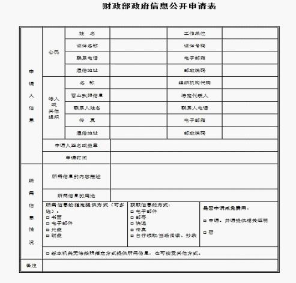
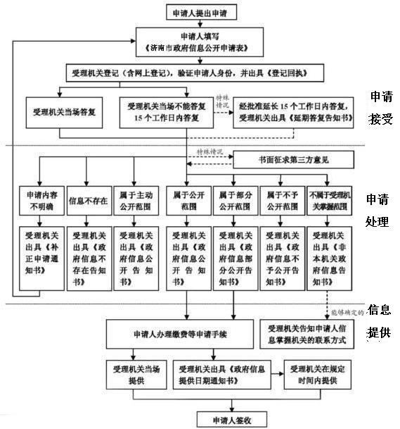

# ＜七星说法＞第二十三期：我该知道的，你就必须告诉我

**本期导读：在阅读本期的说法之前，读者们不妨先回答一个问题。你是否知道政府应该对公众公开哪些信息，而我们又可以向政府申请什么？如果你的答案是哑口无言，那么或许在看完本期说法后，你可以变得理直气壮起来。本期的说法，抛开一切不相干的主义，只希望告诉你一个简单的问题。那就是当我们想知道自己应该知道的政府信息时，我们，应该做什么。**  

# ＜七星说法＞第二十三期：

## 我该知道的，你就必须告诉我

 

在进入4月份之前，全国各省市、国务院各部委都陆续发布了2011年的政府信息公开工作年度报告。这已经是政府信息公开工作年度报告发布的第四个年头。

《政府信息公开条例》自2008年5月1日开始施行，到现在不足四年，虽然内容规定的很粗很原则化，但它的出台已经是一个很大的进步了。**我们希望，通过这篇文章，能让大家对政府信息公开的流程和自身可以选择的救济方式有一个大致的了解。**

让我们以一个现身说法的形式来开始说明如何申请信息公开吧。

首先我们应该弄清的是：**到底有什么信息，是政府应该主动告知公众的。**我国的《政府信息公开条例》对这一问题做出了详细的规定。按法律规定，**主动公开的信息一**般包括：**行政机关的机构设置、职能、办事程序；法律法规；财政预算；拆迁补偿；行政许可；政府采购，这些和公民切身利益有关或者公众广泛参与的内容。**法条如下：

 第九条 行政机关对符合下列基本要求之一的政府信息应当主动公开：

（一）涉及公民、法人或者其他组织切身利益的；

（二）需要社会公众广泛知晓或者参与的；

（三）反映本行政机关机构设置、职能、办事程序等情况的；

（四）其他依照法律、法规和国家有关规定应当主动公开的。

 第十条 县级以上各级人民政府及其部门应当依照本条例第九条的规定，在各自职责范围内确定主动公开的政府信息的具体内容，并重点公开下列政府信息：

（一）行政法规、规章和规范性文件；

（二）国民经济和社会发展规划、专项规划、区域规划及相关政策；

（三）国民经济和社会发展统计信息；

（四）财政预算、决算报告；

（五）行政事业性收费的项目、依据、标准；

（六）政府集中采购项目的目录、标准及实施情况；

（七）行政许可的事项、依据、条件、数量、程序、期限以及申请行政许可需要提交的全部材料目录及办理情况；

（八）重大建设项目的批准和实施情况；

（九）扶贫、教育、医疗、社会保障、促进就业等方面的政策、措施及其实施情况；

（十）突发公共事件的应急预案、预警信息及应对情况；

（十一）环境保护、公共卫生、安全生产、食品药品、产品质量的监督检查情况。

 第十一条 设区的市级人民政府、县级人民政府及其部门重点公开的政府信息还应当包括下列内容：

（一）城乡建设和管理的重大事项；

（二）社会公益事业建设情况；

（三）征收或者征用土地、房屋拆迁及其补偿、补助费用的发放、使用情况；

（四）抢险救灾、优抚、救济、社会捐助等款物的管理、使用和分配情况。

 第十二条 乡（镇）人民政府应当依照本条例第九条的规定，在其职责范围内确定主动公开的政府信息的具体内容，并重点公开下列政府信息：

（一）贯彻落实国家关于农村工作政策的情况；

（二）财政收支、各类专项资金的管理和使用情况；

（三）乡（镇）土地利用总体规划、宅基地使用的审核情况；

（四）征收或者征用土地、房屋拆迁及其补偿、补助费用的发放、使用情况；

（五）乡（镇）的债权债务、筹资筹劳情况；

（六）抢险救灾、优抚、救济、社会捐助等款物的发放情况；

（七）乡镇集体企业及其他乡镇经济实体承包、租赁、拍卖等情况；

（八）执行计划生育政策的情况。

 第十八条 属于主动公开范围的政府信息，应当自该政府信息形成或者变更之日起20个工作日内予以公开。法律、法规对政府信息公开的期限另有规定的，从其规定。 

从上面的法条我们可以看出，只要是县级以上的人民政府，就应该公开包括每一年度的政府财政预算和决算、政府的采购信息在内的涉及公众利益的各种政府文件。而在县级以下政府里，则应该公布包括乡镇集体企业的各种情况、财政收支各项资金的管理和使用情况在内的各种政府信息。可是在日常生活中，我们并不能看到所有的这些政府信息都能够公开的让我们查询到。因此，我们尚且不讨论各级政府是否违反了《政府信息公开条例》的规定（大家觉得呢？），先耐心的往下看，**我们有没有办法，可以督促政府做出这些事情。**

**答案当然是肯定的。**

当然，我们可以做的不仅如此。除了这些政府应该主动公开而没有公开的信息以外，我们还可以申请公开与己有关的其他政府信息。

一般来说，**要申请信息公开有这样几种方式：**当面申请，网上申请，信件，传真。不管是哪一种，一般都要采取书面形式，填一张表格。这张申请表上应该包括一下几种内容：（一）申请人的姓名或者名称、联系方式；（二）申请公开的政府信息的内容描述；（三）申请公开的政府信息的形式要求。例如下面这张中央财政部的：

这些申请表在各种政府部门的网站上都能找到。而且经过网上海量的测试，现在政府网站上的信息公开大部分弄得还是很正规的，表格至少是都能有。

但是在现实中，当面申请的人更多。

我们以北京为例。

根据北京市2010和2011这两年的政府信息公开工作年度报告来看，当面申请的占到了90%左右，这种当事人亲自去政府办公地点填表申请的，我国的《政府信息公开条例》第二十四条规定：行政机关“能够当场答复的，应当当场予以答复。”

现在，填完了表格交给行政机关，行政机关就要对申请公开的内容进行审查了。

按照我国《信息公开条例》的规定，政府公开信息有两种：**主动公开的、依申请公开的。**

如果我申请的信息行政机关已经主动公开了，那么他会告诉我去哪里能查到；如果不是主动公开的，那么他就要继续审查。（当然，如果政府应该主动公开的信息没有公开，我们就应该考虑政府不作为的可能了。在这里我们不予详细讨论。)最后审查的结果无非这么两个：

**公开给我。**那就皆大欢喜，我拍屁股走人。（北京市的申请中，2010年同意公开的占总数的61.70% ，2011年同意公开的占总数的45.36% ）

**不公开给我。**那就得向我说明理由。不过，根据现实的情况，我得到的很可能是“信息不存在”“影响社会稳定”“涉及国家秘密”这类语焉不详、牵强附会的理由。

不过不管是哪种结果，**“行政机关不能当场答复的，应当自收到申请之日起15个工作日内予以答复；如需延长答复期限的，应当经政府信息公开工作机构负责人同意，并告知申请人，延长答复的期限最长不得超过15个工作日。”（《中华人民共和国政府信息公开条例》24条）**这里只有一个**特殊**情况，就是当我申请的信息涉及商业秘密、个人隐私，公开后可能损害第三方合法权益的，行政机关应当书面征求第三方的意见，这个征求意见的时间不计在期限内，而这种情况还是很少的。也就是说，一般情况下，行政机关应该在30日内都要给出答复。

而这一套过程中，行政机关“除可以收取检索、复制、邮寄等成本费用外，不得收取其他费用。行政机关不得通过其他组织、个人以有偿服务方式提供政府信息。”

到了这里，关于信息公开的申请程序就结束了。

  

但是，可能最后我对拿到的结果并不满意，例如行政机关根本就没搭理我的申请，石沉大海没有回应了，例如他们竟然说我申请的这么一点小事“影响社会稳定”“涉及国家秘密”而拒绝我的申请，或者我就复印了一页纸的资料竟然收我了几十甚至几百元的“资料费”。那么，**下面我还可以进行一些救济。**

**行政复议。**

对于行政主体做出的具体行政行为（例如上边列举的几种），我们都可以申请行政复议。这个申请是向行政复议机关提出的。不同的行政主体相对应的行政复议机关是不同的，这个要在实际情况中具体讨论。

复议机关会对这个争议进行审查并作出裁决。一般来讲，最后的结果会有：维持原行政行为；责令被申请人履行某种职责；撤销或者变更具体行政行为。

根据北京市政府信息公开工作报告，有关于政府信息公开的复议案件，2010年审结的247件中，改变了原行为的只有8件，占3.24% ；2011年审结的367件中，改变了原行为的只有32件，占8.72% 。

面对这样的结果，如果我对维持的或者改变复议决定还是不服，那么就不能再复议了，这时就可以提起行政诉讼。

**行政诉讼。**

对于申请政府信息公开的行为，法律并没有复议前置的规定，所以我们也可以跳过复议，直接提起行政诉讼。

最高人民法院2011年8月13日开始实施的《关于审理政府信息公开行政案件若干问题的规定》可以算是提起行政诉讼时法院的主要参照。

这个规定中第二条列举了法院不予受理的情形，有：（1）因申请内容不明确，行政机关要求申请人作出更改、补充且对申请人权利义务不产生实际影响的告知行为；（2）要求行政机关提供政府公报、报纸、杂志、书籍等公开出版物，行政机关予以拒绝的；（3）要求行政机关为其制作、搜集政府信息，或者对若干政府信息进行汇总、分析、加工，行政机关予以拒绝的；（4）行政程序中的当事人、利害关系人以政府信息公开名义申请查阅案卷材料，行政机关告知其应当按照相关法律、法规的规定办理的。

这一条看似受案很轻松，但是，现实堪忧。

还是拿北京市有关的政府信息公开的案例来说。

2010年一审案件264件，其中驳回起诉234件，不予受理5件，不算撤诉和移送的，最后改变了具体行政行为的只有14件，占5.30% 。二审案件239件，其中维持原判238件，指令再审1件。

2011年一审案件410件，其中驳回起诉171件，驳回诉讼请求165件，不算撤诉和移送的，最后改变了具体行政行为的只有20件，占4.88% 。二审案件152件全部维持原判。

看到这些数字我感到很灰心，但是，在这一方面也并不是没有成功的案例。

 **浙江省案例：浙江余姚68名村民信息公开案告赢市政府**

摘要：2008年5月26日，浙江省余姚市朗霞街道新新村泥堰头自然村徐尧芳等68位村民向余姚市政府申请查看土地被征用的信息，市政府未做出回应。7月4日，徐尧芳等人向宁波市政府申请行政复议，希望余姚市政府限期公开他们提出的信息。宁波市政府做出责令余姚市政府履行行政行为的决定。

[http://www.fl168.com/Lawyer8463/View/128728/](http://www.fl168.com/Lawyer8463/View/128728/)

 **四川省案例：“不伦不类”的政府信息公开案**

摘要：2007年年初旬阳县蜀河镇渡口村五组村民向旬阳县人民政府申请公告经国务院批准的征用土地方案，遭拒绝。申请人后向安康市人民政度提起行复议，复议决定责令被申请人旬阳县人民政府履行法定职责。

[http://blog.163.com/herblawyer@126/blog/static/29118767200841682153203/](http://blog.163.com/herblawyer@126/blog/static/29118767200841682153203/)

 **广东省案例：深圳公民的“公共预算之旅”**

摘要：资产管理公司的CEO吴君亮、两位财务分析人员李德涛、万宇涵，从2006年起，在深圳开始了“不务正业”的公共预算之旅。他们向十几个中央部委、十几个地方政府提出了查看预算案的申请，2008年5月27日，他们终于看到了深圳市政府的2008年度部门预算草案；10月27日，卫生部向他们公布了一份接近完备的本级部门预算。在新中国的历史上，这两次回应都是第一次。

[http://www.infzm.com/content/19585](http://www.infzm.com/content/19585)

 **2008打虎案——郝劲松：对付周老虎的六套方案**

摘要：为了对付周老虎，维权律师郝劲松于5月12日，同时向国家林业局和陕西林业厅提交信息公开申请，要求前者公开华南虎科考状况和经费，要求后者公开建立陕西镇坪国家级自然保护区的申报材料。未得到有价值的信息。6月23日，要求陕西省林业厅重新公开虎照的相关信息。之后，陕西方面承认虎照造假。

[http://www.infzm.com/content/14821](http://www.infzm.com/content/14821)

通过这些案例，可以看到，如果我想从深缄其口的行政机关最终获得想要的信息，就不能被他的各种理由打倒，坚持下去，通过各种渠道进行每一次复议、每一次诉讼，对自己的权利进行尽可能大的伸张，我们就能得到我们想要得到的东西。或许这样的冗长程序，不是每一个民众都能接受得了，但是我们怎么能因此而放弃呢？

就像郝劲松说的，诉讼的重要性不仅仅在于改变一个东西，更重要的是起激活作用，“激活老百姓的法律意识，让他们走向法庭，是我们需要做的，就好像一壶水，有一批水分子先被加热，然后向四处传递热量，最终让整壶水沸腾起来。”

要知道，“我”字的古意就是“手”加上“戈”，只有手持法律的长戈，才能保护我应享有的一切权利。我们也大可以理直气壮的说，“我应该知道的，你就必须告诉我。”

 

### 【深度阅读】

[http://www.gov.cn/zwgk/2007-04/24/content_592937.htm](http://www.gov.cn/zwgk/2007-04/24/content_592937.htm) 《中华人民共和国政府信息公开条例》 [http://www.court.gov.cn/qwfb/sfjs/201108/t20110815_159790.htm ](http://www.court.gov.cn/qwfb/sfjs/201108/t20110815_159790.htm )《最高人民法院关于审理政府信息公开行政案件若干问题的规定 》 [http://news.163.com/12/0406/03/7UCKEDMR0001124J.html ](http://news.163.com/12/0406/03/7UCKEDMR0001124J.html )报告指“涉及国家秘密”成政府信息不公开借口。 [http://bbs.pku.edu.cn/bbs/bbsanc.php?path=/groups/GROUP_0/PersonalCorpus/K/KMZ/D9D0E2C7E/M.1247844415.A ](http://bbs.pku.edu.cn/bbs/bbsanc.php?path=/groups/GROUP_0/PersonalCorpus/K/KMZ/D9D0E2C7E/M.1247844415.A )政府信息公开案例汇编2 - 北大未名站 精华区文章 [http://www.gov.cn/gzdt/2011-04/29/content_1854761.htm ](http://bbs.pku.edu.cn/bbs/bbsanc.php?path=/groups/GROUP_0/PersonalCorpus/K/KMZ/D9D0E2C7E/M.1247844415.A )北京市人民政府2010年政府信息公开工作年度报告 [http://www.gov.cn/gzdt/2012-03/30/content_2102948.htm ](http://www.gov.cn/gzdt/2012-03/30/content_2102948.htm )北京市人民政府2011年政府信息公开工作年度报告  

（编辑：石味诗，纳兰辰瀚）

 
