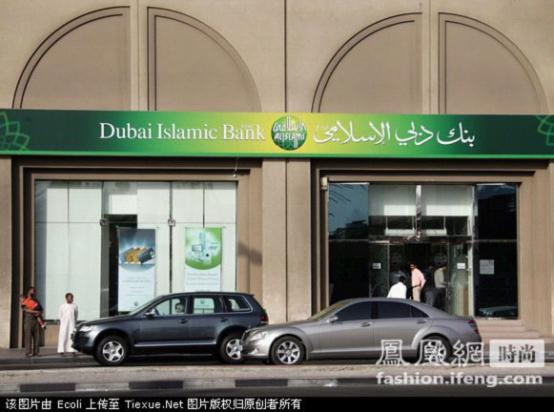

# ＜七星说法＞第二十九期：法律变成信仰，还是信仰变成法律？

**美国法学家伯尔曼在《法律与宗教》一书中说，****“****法律必须被信仰，否则将形同虚设****”****。发展了1300****多年至今仍然适用的伊斯兰教法正是诠释这句话最好的例证。宗教法以法律形式体现宗教教义，而宗教的****神圣性确保了法律必定被信仰，必定有最高的权威性。反观当下的中国，信仰缺失，法律问题变社会问题，社会问题变政治问题。因此，也有人问，中国没有信仰的传统，如何才能信仰法律？本期说法不讨论中国问题，只向读者介绍东方三大法系唯一的活法系****——****伊斯兰教法，讨论其特殊的法律规范，以及如何在文化多元的背景下审视权利和法治。 **

# 法律变成信仰，还是信仰变成法律？

# 

## 

 

#### **千年长存的伊斯兰教法 **

** **

对于大部分坚持无神论的中国人而言，“宗教”这个词，代表着古老落后的，非科学、非理性的，应当在历史的前行中被淘汰的东西。但**在伯尔曼看来，法律与宗教不能分离，人类社会不能没有法律，没有法律就没有秩序；也不能没有宗教、没有信仰，没有了信仰，人类就失去了方向，失去了存在的意义。**纵观法制史，宗教是法律的渊源之一，而直到现在，许多国家也承认某些宗教规范具有法律效力。例如，在西方国家，结婚仪式采取基督教的神父证婚制度，美国国家元首就职时，以手按圣经来宣誓，都体现出宗教对法律的重要影响。

伊斯兰法系是世界五大法系之一，也是东方三大法系唯一的活法系。(伊斯兰法系；英美法系；大陆法系为仍在适用的活法系，中华法系和印度法系则是已经解体的死法系)。**与中华法系，以及同为宗教法的印度法系相比，伊斯兰法系表现出了极其顽强的韧性。**面临与中文与印度相同的西方殖民统治、高度发达的物质文明带来的巨大冲击，伊斯兰法不但没有在短时间内彻底被其他法律制度所取代，反而在从总体走向衰落的过程中常常表现出复兴的态势。

目前全球約有15至18亿穆斯林成员，**包括伊朗、沙特、巴基斯坦、埃及、摩洛哥、马来西亚在内的许多国家都是信仰伊斯兰教并适用伊斯兰教法的国家**，并都在宪法或法律中规定了伊斯兰教法的地位。随着近代以来的改革，大多数伊斯兰教国家都采用了混合型的法律制度，如大陆法与伊斯兰法相混合，或普通法与伊斯兰法相混合，或大陆法、普通法与伊斯兰法相混合；另外包括沙特阿拉伯、阿曼、巴林、阿拉伯联合酋长国等数个国家把伊斯兰教法作为唯一的基本的法律制度。当然，也有在改革中彻底放弃伊斯兰法，加入普通法法系或大陆法系的国家，印度和土耳其。但仅是少数。****

现代西方的法律制度，无论是大陆法还是普通法，从中世纪就逐渐脱离了宗教规范，与教会法相对立的世俗法规范成为了主要的法律制度；而与此形成鲜明对比的是，伊斯兰法的法律渊源是早在８世纪就已形成的《古兰经》，发展了1300多年后的今天，依然统治着伊斯兰世界的数亿民众，**该宗教法的生命力令人咂舌。******

** **

伊斯兰的宗教法，在西方来看是野蛮的。其中例如一夫多妻制，例如非人道主义的残酷刑罚石刑，不仅仅从西方发达国家，即使从任何一个经历过现代化进程的第三世界国家（如我国）的眼光来看，都是应该剔除的落后因素。然而，在穆斯林眼里，伊斯兰不仅仅是宗教那么简单，它已经植根在社会生活的各个方面与公民生命中的各个阶段，成为一种伊斯兰国家特有的社会制度。因此，**只有了解伊斯兰教法具体的法律规范，才有资格去讨论伊斯兰教法是否应当被世俗法所取代，客观地审视伊斯兰社会体系内部的权利和法治。******

#### **一夫多妻制并不意味着不保护女性权利**

** **

伊斯兰教法中规定一夫多妻制，男性最多可以娶四名妻子，前提是必须公平对待并妥善照顾各个妻子。此外有些国家对娶第二位妻子做出了一定的限制，如巴基斯坦和摩洛哥，男子只有得到首任妻子允许，才获准娶第二位妻子。

由此可见，**虽然伊斯兰的婚姻法是建立在夫权基础上的，但其内在本质是“平权平责”。**按照伊斯兰法，男性和女性享有不同的、“互补”的权利——即男性需要履行较多义务，因此拥有较多权利；而女性义务较小，权利也较小。然而这些权利并不必然对男人有利。例如，在沙特阿拉伯，公共场所和交通工具都会设有女性区，男性不许进入，商场也会设立女性购物日，单身男性不许进入；沙特政府不提倡女性外出工作，所以每名女性可以领到高额的生活津贴，而且可以领一生，事实上沙特女性的消费力很高。

具体而言，首先，在婚姻方面，妻子婚后的个人财产仍然属于自己，而丈夫的个人财产算夫妻共有。另外，男人必须负担婚礼、住房及其嫁妆的费用。沙特规定，娶多个妻子的男人，必须保证妻子间的平等，包括每个人都有一套房子；

第二，在继承方面，伊斯兰法律规定，父母亡故，女儿享有遗产的份额仅为三分之一，为其儿子的一半。表面上似乎没有保护女性的权利，而实际是因为，穆斯林妇女对家庭不负有经济上的义务。一位妇女即使非常富有，也没有在经济上扶持他人、甚至是扶持她本人的责任。这一法律规范制定的原理是，妇女可以工作，但是她绝不应有必须工作的义务。因此，她最亲近的男性亲属要负责在经济上对她予以扶持。**从实际结果上讲，女人的经济责任为零，而她的兄弟除了要在经济上为自己的妻子负责，还要负担其母亲以及其他未婚姐妹的生活，并且法律规定，如果她的兄弟亡故，还要把自己遗产的三分之一分给她，这对该女性看来似乎慷慨地有失公平。******

当然，对于西方女权运动者而言，这些对女性的额外保护，例如不提倡女性工作，专门设女性公共区域，没有解放女性的权利，因此并非对女性权利的实质性保护。

** **

#### **石刑及其严格的实施条件**

** **

这恐怕是伊斯兰刑法最饱受争议的一点，这种源自中东地区的古老的残忍刑罚至今仍有七个伊斯兰国家还明确写入刑法（但不一定适用），具体而言，**根据伊斯兰教法规定，已婚者犯通奸，只要有四位证人，可以判处乱石砸死。******

当然在这一点上，对于通奸的认定，伊斯兰教有严格的标准，古兰经说：“你们的妇女，若作丑事，你们当在你们的男人中寻求四个人作见证；如果他们已作证，你们就应当把她们拘留在家里，直到她们死亡，或真主为她们开辟一条出路。”这里要注意的是，认定丑事，必须要有四名证人，其中若有女证人的话需人数更多一点。而且**作证是有严格的要求**，首先证人本身必须清白，没有历史污点。而作证者必须同时亲眼目击二人在交媾，连脱光了躺在一起都不能成为断罪的依据。而古兰经在上面这段经文后，立刻警告那些可能作伪证的人：“凡告发贞节的妇女，而不能举出四个男子为见证者，你们应当把每个人打八十鞭，并且永远不可接受他们的见证。这等人是罪人。”

** **

随着西方司法制度的引入和人权运动的兴起，保留这种刑罚的国家越来越少，比如伊朗，已经开始将石刑改为绞刑，但石刑仍然作为名义上的刑罚写在刑法里，在判决石刑后，由法官提出宽恕，改为执行绞刑。

实际上，从中可以看出伊斯兰刑法的一个立法思想就是用严厉的惩罚来迫使人自律，在一定程度上的确抑制了犯罪的发生，但是其中对于人权的侵犯仍然是不可回避的问题。

** **

#### **马来西亚：宗教法、世俗法并用**

** **

在适应社会发展的过程中，有的伊斯兰教国家在现有的伊斯兰法里面加入大量世俗法条，有的则单独制定另一套世俗法律。而**马来西亚是比较有特色的伊斯兰教国家，存在伊斯兰教法和世俗法两套法律**。虽然宪法规定其体制为政教分离，但几乎所有政党都认为马来西亚是伊斯兰国。

立法方面，伊斯兰教法是马来西亚制定涉及婚姻家庭继承等法律的一个立法依据，但不像埃及一样是立法的唯一依据。

**在马来西亚，司法分为两部分：宗教法庭和世俗法庭。**在宗教事务方面，穆斯林成员必须遵守伊斯兰法庭的各项决定。在民商法事务方面，诸如婚姻、继承、离婚、叛教、改宗和监护权等，穆斯林之间的纠纷由伊斯兰法庭处理，非穆斯林的纠纷由世俗法庭处理。伊斯兰法庭具有类似于马来西亚法院的层次结构，但它并不管辖其他刑事或民事罪行。尽管马来西亚民事法院（包括联邦法院）是此地最高层级的法律机构，但它们并不审理有关伊斯兰习俗的事项。

马来西亚联邦刑法，对通奸、盗窃、抢劫、判教的处罚比古兰经规定的较轻，比如把死刑改为有期徒刑或者罚金，这在伊斯兰政党看来是不可接受的，所以在伊斯兰党派执政的一些州，利用宪法赋予的自治立法权通过了较严厉的伊斯兰教刑罚，而不使用联邦刑罚。

** **

#### **伊朗：伊斯兰无息银行的兴起**

** **

伊斯兰教的《古兰经》有数节经文严厉禁止放高利贷,将高利贷定为非法的借贷关系，禁止人们参予、经营、运作，否则视为大罪。伊斯兰提倡和鼓励合法的借贷，即“善贷”。利息一词阿拉伯语叫“利剥”，指向他人放债，从中收取利息，具有放高利贷的含意，有时也指代有利息的易货贸易。在每一个时期都有许多穆斯林思想家们根据《古兰经》明文和伊斯兰教法制定符合当时代的、不存在放债吃利现象的经济发展体系。

**伊朗伊斯兰革命取得胜利后，创建伊斯兰无息银行是继起草宪法之后，又一个引起国家领导人关注的重要问题。**《伊朗伊斯兰共和国无息银行执行法》于1983年9月1日在伊斯兰议会通过。该法的目标包括建立公正的金融体系、加强人民之间的经济协作、推广善贷的实施。

善贷是世界银行史上的一大创新，也是伊斯兰银行的重要特征。事实上，善贷存款是一项通过银行完成的公益事业。在善贷存款中，银行不向存款客户提供任何利息，银行在向那些穷人提供贷款时也不收取任何利息。

但不收取利息并不符合世界金融运作的惯例，因此在伊斯兰世界具有领导地位的沙特，对是否建立伊斯兰无息银行颇为犹豫，一方面作为伊斯兰教最早的实践者和圣地的监护人，对当代伊斯兰世界建立伊斯兰无息银行的潮流不能无动于衷，但另一方面其输出巨额石油资本的经济需要使得其不会真正实施无息的金融政策。因此，沙特在1940年就作出了自己“版本”的解释，理论上禁止利息，但银行放款允许收取手续费或酬金。

#### **世俗法与伊斯兰法的冲突**

** **

伊斯兰法律发展到今天，不可否认的是出现了法治改革上的滞后状态，特别是在人权保护和女性权利上，与现代普遍接受的思潮有一定的距离和差异。世俗法律与伊斯兰法律仍然在冲突与选择之中。**伊斯兰世界不仅正经历着政治的冲突和军事的冲突，而且也经历着世俗法律和伊斯兰法律的冲突，如何解决这些冲突和回应这些挑战，只能由伊斯兰世界做出抉择。******

宗教法作为人类文明的重要组成部分，在历史上以及促进社会发展的过程中，发挥了很大的作用。即使在历史发展过程中，宗教法最终让位于世俗法，发展一千多年的伊斯兰教法存在的意义也不会被抹煞，仍然值得人们去研究探索。****

 **【深入阅读】**

[为什么“法律必须被信仰”--法律与宗教关系解读](http://www.islambook.net/xueshu/list.asp?id=3256%20%20)

[伊斯兰法系：法律现代化的艰难抉择](http://www.islambook.net/xueshu/list.asp?id=3522%20%20)

[对宗教法的学习和探索-以伊斯兰法为例](http://www.islambook.net/xueshu/list.asp?id=3521)

[基督教对西方法律的影响](http://article.chinalawinfo.com/Article_Detail.asp?ArticleId=41541%20)

 **【斗内文章】******

[从中国佛道文化看中国近代落后的必然性以及基督教文化的天然民主性](/?p=10497%20%20)

[宗教与战争关系略谈](/?p=16189%20)

**本文内容参考：维基百科、伊斯兰之光、绿色中华、伊斯兰之窗、中国学术期刊网、中穆青网、北大法律信息网。******

（编辑：马特，陈蓉）

 **北斗读者交流问卷调研地址**：[http://www.sojump.com/jq/1488982.aspx](http://rrurl.cn/gMNL5h) **** ** **
