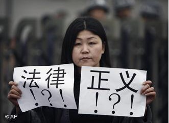

# ＜七星说法＞第二十二期：监视居住的是是非非

**4.9****本期导读：这是一个变革而变革本身注定也充满着争议的时代，想必各位读者都对前不久轰轰烈烈的刑诉法批判****“****运动****”****还留有深刻的印象。本期说法关注的便是这次对73****条****批判的真正焦点所在——监视居住，以期让各位了解这个自从出生以来就备受争议的强制措施的今生前世，了却一些人对于它的误读从而让大家能够更好的审视它的存在。**  

# <七星说法>第二十二期：监视居住的是是非非

 **背景：关于****73****条的满城风雨** 从2011年公布刑诉法修正案草案征求社会意见开始，刑诉法的修改历程就从未离开过满城风雨的争执和质疑。这是一场酝酿了16年的修法，然而今年两会不管是一审稿还是二审稿，在社会上引起的争议可以用“恐慌”来形容。其中受到最大争议的无疑就是新法的73条，由于它对于监视居住的扭曲和强化而被指为当下修法最为严重的倒退，千夫所指也不过如此罢了。 争议的焦点聚集在“监视居住”这项原本并不是十分受到关注的强制措施上。然而，多数参与争论的公共知识分子和网民可能并不了解，监视居住存废论早在这次满城风雨的指责和争论之前十数年就已经在学界取得了相当充分的讨论，令人遗憾的是学界所取得的研究在这个问题上却似乎没有给我国立法工作带来任何影响，并且公众对于监视居住的具体内容、条件、适用对象以及相应的弊端也似乎知晓不多，遑论学界的讨论了。学界研究、立法现状以及民众认识之间竟然距离如此之远，不可不谓之诡谲。 

 **学说：监视居住的存废之争**  监视居住是我国自刑诉法立法以来便有的五个强制措施之一，具体是指公安机关、人民检察院和人民法院责令犯罪嫌疑人、被告人在一定期限内未经批准不得离开住处或者指定的居所，并对其行为加以监视的强制方法。由于它几乎可以说是我国一个颇具特点的强制措施，加上在理论上以及司法实践上出现的许多缺陷和不足，它也同时受到了许多质疑。但是，同时也有一些学者基于降低羁押率等考虑，认为虽然监视居住有诸多不足但却也应该加以保留并完善。“废除论”和“完善论”在此针锋相对，他们的主要观点和依据分别如下(当然，这些争议都在新刑诉法出台之前，故而这里的论述只是针对旧法)： **废除论：** 1、 监视居住执行难度大，浪费司法资源 从监视居住的实际运用来看, 绝大多数情况下执行机构均为被监视居住人指定居所并派专人看守。一方面增加了国家诉讼成本中的财力、物力、人力, 另一方面将监视居住变成变相羁押就意味着国家诉讼成本中的错误成本增加。从被监视居住者执行期间必须遵守的具体规定来看, 执行机关要真正保证被监视居住者遵守相关法律规定, 就不可避免的要24小时对犯罪嫌疑人进行监督, 而这恰恰是作为执行机关的公安机关目前所不可能做到的，不管是从人力还是物力上看, 具体负责执行的被监视居住人住处或者指定居所所在地的公安派出所。囿于派出所民警的人数和派出所所承担的具体职责的广泛性，都不可能做到安排专门的警力来24小时执行这项任务。于是问题的困境就是，如果适用监视居住则必然要求巨大的司法资源投入——这是我国现在的司法现状所不能承受的；要么则干脆无法适用，造成监视居住的空置。 2、 监视居住不符合“比例原则” “比例原则”被称为刑诉法中的“帝王原则”，简单说来就是对于犯罪嫌疑人要根据其所涉罪名的轻重而考量适用强制程度不同的强制措施。一般说来, 犯罪嫌疑人、被告人涉嫌实施的行为社会危害性越大。逃避侦查的可能性越大，强制措施的强度也应当相应增加。如果排除监视居住，我们可以清楚的看到, 我国刑事诉讼法规定的几种强制措施——拘传、取保候审、拘留、逮捕正是按照强制措施的强度轻重呈递进式规定的。而这也与相应犯罪嫌疑人、被告人的人身危险系数相适应。监视居住在和取保候审的对比当中，两者强制程度不一样而适用对象和条件近乎相同，缺乏必需的梯度性。这是违反比例原则的主要体现。 3、 监视居住容易异化为变相羁押 监视居住本身是限制公民自由的刑事强制措施, 而在具体的执行中大量出现由办案人员陪同被监视居住的公民, 一起吃住。这就等于被监视居住的公民没有了自由, 只是被羁押的地点不在看守所而已。于是在这样的情况下，监视居住在实践中很容易便变异成为了变种的羁押。并且和变相羁押针锋相对甚至是走向另外一个极端的就是监视居住容易演变成为某些人享受特权的一个规则，具体而言就是有些地方甚至建起了豪华的监视居住场所。这两点看起来十分矛盾，却诡异的在中国并存着。 4、 监视居住和取保候审界限过于模糊 根据原刑事诉讼法第51条, 《公安机关办理刑事案件程序规定》第63条、第94 条, 《人民检察院刑事诉讼规则》第37条、第63条以及《最高人民法院关于执行< 中华人民共和国刑事诉讼法> 若干问题的解释》第63 条的规定, 监视居住与取保候审的适用条件完全相同, 凡是能适用取保候审的也能适用监视居住。这导致的后果是，监视居住并没有显示出区别于取保候审的不同之处而且在实践中的适用空间容易被取保候审所压缩。导致司法机关在这两种强制措施的选择适用上具有很大的随意性。而实际上取保候审和监视居住在实施效果上存在着重大的区别: 取保候审所允许的犯罪嫌疑人、被告人自由活动的区域要比监视居住大得多，法律对被取保候审人的人身自由限制很小，几乎不影响其正常的生活、工作和学习, 但被监视居住者的人身自由则受到很大的限制。取保候审和监视居住是两种严厉程度相差很大的强制措施。与取保候审相比, 监视居住更加严厉。这点上，学界的质疑和第二点是相呼应的。 

  **完善论：** 1、 监视居住固然存在问题，但有利于降低羁押率 这种观点承认监视居住的问题，但是作为一项替代性的强制措施，和取保候审一样，其本意是在于将一些不适于进行羁押的犯罪嫌疑人进行非羁押性的强制。一则可以减轻我国侦查机关的压力，二则这种非羁押性的强制措施作为某种替代性的强制措施是保护当事人权利的一种体现。虽然监视居住存在上述的种种问题，但是却可以通过对它的完善处理好，而其原本良好的立法目的也并非不可实现。 2、 监视居住异化为变相羁押并非单独是立法之原因 笔者以为这是一种相对强有力的反驳废除论的一个论点。它所坚持的是，监视居住存在的问题不可以单独从法律条文和立法上找原因，甚至立法上的原因远非主要。这种观点的基础是，在中国这个整体不甚良好的司法现状之下，即便是一个立意良好的立法同样也可能在司法过程中异化，也就一般认为的纸面上的法律和实践中的法律存在距离。而这种观点所批评废除论的地方在于，监视居住在立法本旨上并非不可接受，如果在实践中遇到问题则要求废除便落了下乘，根本没有抓住问题的关键所在。  **变法：监视居住的沿革** 2011年推出了刑诉法修正案的草案，面向全社会征求意见。从当时舆论的反应来看似乎并没有像今年对监视居住这般洪水滔滔的意见，而这次网络上的批评以笔者看来很多不得要领，原因很简单，那边是很多人甚至是多数人在此之前并没有十分认真的阅读过73条以及包括72条在内的许多相关法律条文，跟风之流甚多。很多问题需要通过对法律条文的解答加以澄清。 原刑诉法分别在51、57、58、59、65以及高检规则等对监视居住进行了规定。鉴于很多读者可能未详尽阅读过新旧法的对比，现笔者将两者完善列举附录如下，望各位参阅（已经读过的可忽略之）。 通过对比新旧法，我们可以十分清晰的感觉到这次立法的变革而不管其到底是所谓的进步亦或是退步，总的来说有如下几个特点： 第一：原本与与取保候审混沌不清的情况有所改观，监视居住开始走向和取保候审相对独立的道路。原来的刑诉法对于取保候审和监视居住近乎没有任何区分，在法条上通常都是两者同时可以选择适用。但是新的刑诉法出来以后可以明显看出的是，在适用对象、适用条件上对两者进行明确的区分。从这个层面上说，之前学界的讨论部分被立法者所采纳了。 第二：对指定监视居住有了一些新的规定。指定监视居住在原刑诉法中便有了规定，而新法上对于适用条件上有了一些改变。 第三：以前一直在学界颇有争论的监视居住能否折抵刑期的问题得到了落实，新的刑诉法明确规定了“定居所监视居住的期限应当折抵刑期。被判处管制的，监视居住一日折抵刑期一日；被判处拘役、有期徒刑的，监视居住二日折抵刑期一日”。 当然，改变的肯定不止上面三点。篇幅所限故而只是做抛砖引玉之用，希望各位读者都能去认真发现。 

  **关键：监视居住的是是非非** 旧法意义上的监视居住实际上已经取得充分的讨论，笔者无法在这里提出更进一步的论点和论据，新法刚出台不久而且网络上的批评多没有什么意义，故而笔者斗胆在这里提出一些对于新法的看法，以呈各位读者共享。 首先便是民众最为关心的73条中通知家属以及“指定监视居住”的问题。 有一种说法不无道理，那就是在相比于旧法对监视居住粗糙的规定，新的刑诉法在具体性方面有了长足的进步。而且通知家属也就是人们常常担心的秘密拘捕的问题可能并没有人们想象中的那么问题严重，相比于旧法中笼统的规定而言，新法规定除了“无法通知”以外所有的指定监视居住都必须在24小时之内通知家属，这里的“无法通知”应该采取狭义的理解，即在现代的科技和信息手段之下都无法通知，这留下的不通知的空间是极小的。当然这只是一个学理解释，在司法过程中运作如何还不好说。但这并不能归结为立法的不够严密——司法上的问题都归咎到立法上的不恰当的。 其次，个人以为，在新法出台之前，监视居住由于和取保候审的功能、适用上的重合导致它在某种程度上并不是一个完全具有独立地位的强制措施。新法出台之后，这种情况有了颠覆性的改变。监视居住可以说“从此站起来了”，新法在一定意义上新设了一个强制措施。但是问题同样随之而来，那就是和取保候审区别开来的监视居住同样比较粗糙，留下的问题依然不少。但是，客观的说这并不完全是立法者的不是，毕竟一项立法只有在司法实践中方才有不断完善的机会，那种想要一切问题都在立法机关立法的过程中解决的想法是不切实际的。并且，不管是不是好的，我国立法从会有一个惯例那就是一般情况下立法会给司法解释和其他部门解释留下一定的空间。从这个方面上说，我们只有期待最高法和最高检能够尽快出台一个完善的司法解释。 当然，笔者并非说这次立法是没有瑕疵的。许多疑问至少现在还没有答案。其中之一的还是对于监视居住违反“比例原则”的质疑，只是这里笔者的质疑和前面所述的学界对旧法的质疑颇有不同：监视居住作为一项强制性比拘留、逮捕这类的羁押性措施要弱很多的强制措施，为何要适用在“涉嫌危害国家安全犯罪、恐怖活动犯罪、特别重大贿赂犯罪”中？当然，立法中并未明确说明，而是通过对指定监视居住的规范间接说明了这个问题。为此笔者实在是无法理解。当然，这个问题也许可以是这样的：对于非上述三类案件而言，监视居住是一项通常意义上的非羁押性措施，其强制性自然很弱；但是对于上述三类案件而言监视居住的内涵应该和前者有所区分，也就是我们通常理解的“隐性羁押”。在这样的情况下，监视居住被分割成为了两部分。 最后需要说明的另外一个问题是，新法第七十六条：“执行机关对被监视居住的犯罪嫌疑人、被告人，可以采取电子监控、不定期检查等监视方法对其遵守监视居住规定的情况进行监督；在侦查期间，可以对被监视居住的犯罪嫌疑人的通信进行监控。”监视居住是一项在犯罪嫌疑人住所执行的强制措施，在这种情况下不可避免的会涉及到第三人即和犯罪嫌疑人同住的如配偶等近亲属的利益，如何对他们的包括隐私权在内的一系列利益进行保护是监视居住这项强制措施在实行的过程中不得不面对的问题，在新法如此规定的情况下，加之我国缺乏必要权力制约和权利申诉条件的司法体制，对于第三人利益的保护堪忧。 篇幅所限，关于新的刑诉法对监视居住的重新评价就仅限于上述几点。值得一提的是，作为中国近年来修改幅度最大的法律，社会上的种种讨论都是可以理解的，笔者不是很赞成一些人，尤其是一些法科出身的人所说的认为这些批评是“中国的知识分子···总是没有能力去解释世界，但有巨大的野心去改造世界”（郑永流语）的体现。即便是所谓的教义法学也不仅仅有一个解释的可能性边界问题，而且还有一个解释的方向性问题。那种批评对于学法者是有一定意义的，如果轻易就套用在这次公众对新法的质疑和不满上是有一些武断的。 

  附录：  第五十一条 人民法院、人民检察院和公安机关对于有下列情形之一的犯罪嫌疑人、被告人，可以取保候审或者监视居住： （一）可能判处管制、拘役或者独立适用附加刑的； （二）可能判处有期徒刑以上刑罚，采取取保候审、监视居住不致发生社会危险性的。 取保候审、监视居住由公安机关执行。 第五十七条 被监视居住的犯罪嫌疑人、被告人应当遵守以下规定： （一）未经执行机关批准不得离开住处，无固定住处的，未经批准不得离开指定的居所； （二）未经执行机关批准不得会见他人； （三）在传讯的时候及时到案； （四）不得以任何形式干扰证人作证； （五）不得毁灭、伪造证据或者串供。 被监视居住的犯罪嫌疑人、被告人违反前款规定，情节严重的，予以逮捕。 第五十八条 人民法院、人民检察院和公安机关对犯罪嫌疑人、被告人取保候审最长不得超过十二个月，监视居住最长不得超过六个月。在取保候审、监视居住期间，不得中断对 案件的侦查、起诉和审理。对于发现不应当追究刑事责任或者取保候审、监视居住期限届满的，应当及时解除取保候审、监视居住。解除取保候审、监视居住，应当 及时通知被取保候审、监视居住人和有关单位。 第六十条 对有证据证明有犯罪事实，可能判处徒刑以上刑罚的犯罪嫌疑人、被告人，采取取保候审、监视居住等方法，尚不足以防止发生社会危险性，而有逮捕必要的，应即 依法逮捕。对应当逮捕的犯罪嫌疑人、被告人，如果患有严重疾病，或者是正在怀孕、哺乳自己婴儿的妇女，可以采用取保候审或者监视居住的办法。 第六十五条公安机关对于被拘留的人，应当在拘留后的二十四小时以内进行讯问。在发现不应当拘留的时候，必须立即释放，发给释放证明。对需要逮捕而证据还不充足的，可以取保候审或者监视居住。  新法对监视居住和取保候审都进行了很大幅度的修正，其中关于监视居住的规定如下： 第七十二条 人民法院、人民检察院和公安机关对符合逮捕条件，有下列情形之一的犯罪嫌疑人、被告人，可以监视居住： （一）患有严重疾病、生活不能自理的； （二）怀孕或者正在哺乳自己婴儿的妇女； （三）系生活不能自理的人的唯一扶养人； （四）因为案件的特殊情况或者办理案件的需要，采取监视居住措施更为适宜的； （五）羁押期限届满，案件尚未办结，需要采取监视居住措施的。 对符合取保候审条件，但犯罪嫌疑人、被告人不能提出保证人，也不交纳保证金的，可以监视居住。 监视居住由公安机关执行。 第七十三条 监视居住应当在犯罪嫌疑人、被告人的住处执行；无固定住处的，可以在指定的居所执行。对于涉嫌危害国家安全犯罪、恐怖活动犯罪、特别重大贿赂犯罪，在住处执行可能有碍侦查的，经上一级人民检察院或者公安机关批准，也可以在指定的居所执行。但是，不得在羁押场所、专门的办案场所执行。 指定居所监视居住的，除无法通知的以外，应当在执行监视居住后二十四小时以内，通知被监视居住人的家属。 被监视居住的犯罪嫌疑人、被告人委托辩护人，适用本法第三十三条的规定。 人民检察院对指定居所监视居住的决定和执行是否合法实行监督。 第七十四条 指定居所监视居住的期限应当折抵刑期。被判处管制的，监视居住一日折抵刑期一日；被判处拘役、有期徒刑的，监视居住二日折抵刑期一日。 七十五条 被监视居住的犯罪嫌疑人、被告人应当遵守以下规定： （一）未经执行机关批准不得离开执行监视居住的处所； （二）未经执行机关批准不得会见他人或者通信； （三）在传讯的时候及时到案； （四）不得以任何形式干扰证人作证； （五）不得毁灭、伪造证据或者串供； （六）将护照等出入境证件、身份证件、驾驶证件交执行机关保存。 被监视居住的犯罪嫌疑人、被告人违反前款规定，情节严重的，可以予以逮捕；需要予以逮捕的，可以对犯罪嫌疑人、被告人先行拘留。 第七十六条 执行机关对被监视居住的犯罪嫌疑人、被告人，可以采取电子监控、不定期检查等监视方法对其遵守监视居住规定的情况进行监督；在侦查期间，可以对被监视居住的犯罪嫌疑人的通信进行监控。 第七十七条 人民法院、人民检察院和公安机关对犯罪嫌疑人、被告人取保候审最长不得超过十二个月，监视居住最长不得超过六个月。在取保候审、监视居住期间，不得中断对 案件的侦查、起诉和审理。对于发现不应当追究刑事责任或者取保候审、监视居住期限届满的，应当及时解除取保候审、监视居住。解除取保候审、监视居住，应当 及时通知被取保候审、监视居住人和有关单位。  

(编辑：余学文，纳兰辰瀚）

