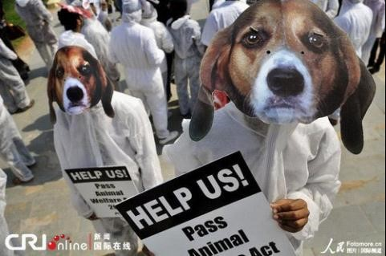
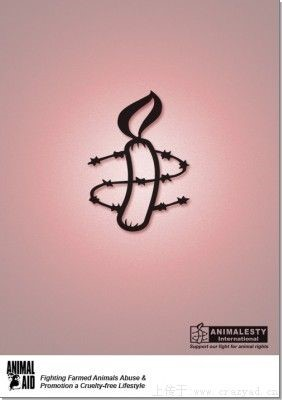

# ＜七星说法＞第二十五期：汪星人和喵星人的逆袭？

**本期导读：不知道读者朋友们有没有关注过，被取胆的活熊和被解救的野狗？本期的说法，谈的就是它们。法律的作用之一，在于维护人类的权利不受非法的侵犯，可大家又知不知道，在与法律有关的这些事里头，还有那么一部分，与动物有关。从高速救狗，到活熊取胆，以至于哈尔滨禁狗令导致的全城风雨。与动物有关的新闻变得越来越显眼和突出。因此本期的说法，便从法律的角度出发，为大家介绍家养动物立法的源流和理论基础，谈一谈和猫猫狗狗有关的那些事。**  

# ＜七星说法＞第二十五期：

## 汪星人和喵星人的逆袭？

 

支持拦车救狗，反对吃狗肉，反对虐待猫狗，抗议活熊取胆，抗议禁狗令。现实中这样的声音不绝于耳，爱心满满的动物保护主义者们的高调举动无时无刻不在网络上引发争论的漩涡。“理性”至上的网友则誓死要揭开博爱之下的伪善面纱，非素食的你们根本没有权利去指责人类对我们的财产——“动物”——合理处分。

由此，无论是上纲上线的动物保护组织，还是刚才还晒着“大头自拍”的爱美姑娘都开始乐此不疲的骂起了政府，为什么不制订“（小）动物保护法”、“反虐待动物法”来保护我们的动物伙伴朋友，甚至激进的要求虐待动物应该被判刑，当然在结尾，一定也会习惯性的挞伐着天朝种种，历数着外国美好云云。

可唯一的问题却是：**我们的社会真的需要和允许法律来保护我们的宠物、保护那些看起来拥有相当智商的汪星人、喵星人、熊星人吗？**

#### 宠物是我们的伙伴，还是我们的财产？

无论大陆法系还是英美法系，**传统的观点都将动物（包括宠物）作为人的财产。**私有财产神圣不可侵犯，这是一个连初中生都知道的道理，也是资本主义制度得以建立和发展的法律基石。

洛克就曾以自然权利为基础来论证财产的合理性：上帝将全世界赐予人类，“土地和土地上的一切都是属于全人类的”。任何人只要将属于自己的劳动附加于大家共同占有的东西，并满足了“足够多并同样好”和“非浪费性”两个条件，他对于某物的财产权便产生了。

黑格尔则在不同的语境体系下对财产做了一番定义，即“财产是人格的体现”。“意志”是黑格尔理论中的关键概念。意志实现需要的第一个阶段就是意志认识到自身就是人格，并将自身强加于外部世界。而人格通过一些具体的形式存在，这些具体的形式即获取占有物，对所占有之物行使“绝对权利”。“一个人几乎可以在任何物质实体中主张自己的财产权。”对于哪些东西可以成为物没有任何先验的判定，人格可以自由驰骋。因此，无论街边的茵茵绿草还是路边洒脱的野狗被认为是可能被占有之物。黑格尔的上述论断被视为私有财产正当性的证明：私有财产有存在的正当性基础。

排除感情因素，我们可以知道无论是明世宗的虬龙猫，还是关羽的赤兔马，无论是英国身价百万的富贵狗，还是笼子中欢实吃食的取胆熊。**从法律的角度来说，他们都是财产。**

我国的财产权包括**占有、使用、受益、处分**四项基本权利。所以按照现行法律的规定，猫狗与你的房子、车子、金银财货一样，都是我们可以合法拥有、合法处置的财产，买卖食用猫狗无可厚非，起码现在不会也不应该受到法律的制裁。

可事情远不可能这么简单，人类跟硅基生命也注定不一样。所以老祖宗孔子很早就说过，“君子远庖厨也”，悲天而悯人是我们的天性，特别是当衣食饱暖了之后，注定要追求一些更“善良”的，一些跟那些粗鄙野蛮的不同的东西。

正是在这种背景下，“高帅富”德国率先走出了看着貌似惊世骇俗的一步。

#### 动物是不是物？

 **德国民法典说——“动物不是物”。**

大陆法系的本家之一德国在1990年把这句话写上的时候可以说是把不少人惊了。要知道，如果不是物，不是民法的客体，那么在法律的体系里。只能把动物放在与自然人、法人、社会团体一个类别的主体这个类别里。用通俗的话讲就是，动物也能投票，也可以有财产，也能起诉和应诉，能跟人类平起平坐，汪星人喵星人站起来了。

为此动物保护主义者们欢欣鼓舞，奔走相告，并屡屡拿着这一句话向世人展示“高帅富”的高风亮节。**可是事情的真相是什么的？**

让我们重新审视《德国民法典》第90条a款的规定：“ Tiere sind keine Sachen Sie werden durch besondere Gesetze geschutzt. Auf sie fur Sachen geltenden Vorschriften entsprechend anzuwenden, soweit nicht etwas anderes best immt ist”。翻译成中文是：“动物不是物。动物应受特别法律的保护, 除另有规定外, 准用关于物的规定”。

表述很明确，虽然**规定动物不是民法里的物，但是如果没有特别法的保护**（特别法由于一般法，若两者对同一法律关系都有规定，则优先使用特别法），**动物还将是我们的财产，这一点一点没有改变。**

大多数德国本土学者认为，《德国民法典》的真正意图是说明，动物在私法的范围内是一个活物(livingthing)，而不仅仅是我们通常所拥有的无生命“物”；作为活物，它应该得到符合法律规定的对待。也就是说，从私法上处理动物，必须考虑公法和其他性质的法律对动物福利、动物卫生等保护提出的要求。这就是所谓的“动物应受特别法律的保护”。

**该条的规定意味着：**其一，在无公法施加特殊要求的情况下，动物是一类可以适用适物规则的私法客体。其二，在有公法施加特殊要求的情况下，动物也是私法上一类客体，不过对这类客体的保护要符合动物福利保护法律法规和环境保护法律法规所施加的保护要求。可见，《德国民法典》并没有授予动物以非客体甚至主体的法律地位。

德国1998 年修订的《动物福利法》可以说是民法所配套的“特别法”，其第１条规定:“基于人类对其伙伴动物的责任，本法的目的是保护生命和动物的福利。无合理的理由，任何人不得使动物感到痛苦、不得折磨或者伤害动物。”

**该条有两层意思，**其一，动物是人类的伙伴动物，说到底，它就是一类特殊的具有生命的物。其二，动物的保护是基于人的责任感，而不是动物本身享有得到保护的权利。正是如此，该法的其他条文(第2至第22条)和德国的其他动物福利保护法律法规强调的是人类应提供给动物的福利(Welfare or well-being)，却始终没有使用动物的“ 权利”(right)一词。

其中“福利 ”(welfare)一词，根据《布莱克法律辞典》，是指一种“对经济贫困者提供帮助的社会保障系统”,历史上也称为“贫困救助”。而“动物福利”，一般是指保护动物康乐的外部条件；后来，动物福利观念发展成为动物享有不受饥渴的自由、生活舒适的自由、不受痛苦伤害的自由、生活无恐惧感和悲伤感的自由以及表达天性的自由等五项自由原则。福利的本义是给予弱者道义上的帮助，而动物福利的实质是把动物视为弱者，主张人们应把福利救助的对象扩展到动物，把人们的道德关怀延伸到动物。

所以，德国著名民法学家科拉( Kolher) 就曾直言不讳道：“德国动物保护法已设有保护动物的规定, 民法此项规定乃——概念美容”。

#### 为什么要为动物立法？

卢梭在《论人类不平等的起源和基础》的序言中，曾指出人类从动物进化而来，而又不像其他动物那样“缺少智力和自由”，但是，其他动物也是有知觉的，“它们同样应该享有自然赋予的权利，人类有义务维护这一点”，最后他就特别指出“动物有不被虐待的权利”。

叔本华则认为在本质上其他动物与人是一致的，尽管动物缺乏思考能力。尽管他为人类食用动物的行为做出了功利主义的辩解，他仍旧呼吁给予动物道德关怀，同时，他反对对动物进行活体解剖。

一个很明显的错误倾向是对待不同种类的动物施以不同层级“福利”，叔本华所写的《康德哲学批判》中有大段对康德将某些动物排斥在道德体系之外的批评，言辞甚为激烈，其中有一句话是这样写的“那些不能对所有能看见太阳的眼睛一视同仁的伪道德，当被诅咒”。如果不能做到平等，起码是对有感知能力，有一定“智力”的动物的平等对待，那么我们很可能陷入“道德分裂”的危险境地。

中国古典法理学教科书经常会提及的一个原理是：道德发展到一定阶段就会上升到法律。这在某种程度上是正确的，这是对社会规范的一种固化，将减少由道德不具强制力带来的社会成本损失。

但并不是每条所共知的道德规范都能升级为法律。“野生动物保护法”保护的是基因库，是生物多样性。那保护小动物、宠物的法益在哪里呢？

禁止残酷对待动物，这既与动物的福利有关，也与人的德性培养有关，对动物的善待， 能够给人们带来情感与道德上的满足。达尔文就认为，关心动物是一个人真正有教养的标志; 一个社会的文明程度越高，其道德关怀的范围就越广泛。

美国各州都有保护动物的立法，其中伊利诺斯州的“人道地照料动物的法律”规定, 动物养育者必须为动物提供足量的、质量好的、适合卫生的食物和水；充分的庇护场所和保护, 使其免受恶劣天气之害；人道地照料和待遇，禁止任何人残酷对待、折磨、超载、过度劳作或用其他方式虐待。表明上述道德要求已经被提升为法律要求，但是这丝毫不意味着动物获得了法律上的主体资格。我们的关怀只能是一种外源性的保护，而绝不可能是动物有权利的体现。

当然动物保护主义者中也有相当“聪明”的人。彼得·辛格是当代动物权利运动的精神领袖，但他本人对保障动物精神地位的方法论出发点却不是维权，而是一种兼顾各方利益的功利主义。在他1975年出版的《动物解放》一书中指出，人类给予动物道德关怀的原因，既不是智力（对婴儿或智障患者也无智力可言），也不是道德（对罪犯或精神病人无道德可言），或是其他一般人类所拥有的品质，而是否能够体验痛苦。可以说这种观点比道德情操论更近了一步，但是却没有公众的共识，着实缺乏需要立法的法益基础。

#### 别黑少将了，立法可是个技术活

在民法上，自罗马法以来，对物的划分，历来就有普通物与特殊物、可交易物与不可交易物的区别。当人类需要对某些物给予特殊保护时, 完全可以通过立法的方式, 将其列入特殊物或不可交易物的范畴, 而不必将其升格为法律主体。

但这并不够，还需要解决的另一个问题是，如何确定一个物种有这种我们能感知到“智力”？能完成缉毒的犬类跟只能条件反射的水母之间有巨大的鸿沟是显而易见的，但能力相近的动物之间的的“智力”差异将很难让我们确定那条边界的位置。可法律，特别是大陆法，没有一个确定界限的情况下将产生极大的混乱，万不可行。

反虐待在某种程度上的确可以在我国推广刚开来，但这的确缺少压倒性的民意支持，我国传统的和现代的道德观念并没有达成一致的意见。如果强行立法，无异于将创立一套“书面”的法，而不是“现实”的法。而且只保护宠物的做法，前文已经论述，也显违公平。

所以说，保护喵星人和汪星人的事情只有时间能解决，现在我们能做的只有不断努力，找寻那个懂得爱的善良社会，这才是正途。

 

### 【深度阅读】

 《动物法律地位的界定和思考》——常纪文 《动物作为物的法律本质》——高利红 《动物法律地位之探讨——兼析我国民事立法对动物的应有定位》——陈本寒、周平 《论动物福利立法的限度及其定位——兼谈动物福利立法中动物的法律地位》——杨朝霞 http://zh.wikipedia.org/zh/%E5%8B%95%E7%89%A9%E6%AC%8A%E5%88%A9 维基百科——动物权利 http://www.legaldaily.com.cn/index_article/content/2011-01/05/content_2428217.htm?node=5955 反虐待动物立法引热议 http://www.chinanews.com/gn/2012/02-24/3694667.shtml 北京晨报：活熊取胆呼唤反虐待动物立法 http://www.qhnews.com/newscenter/system/2012/04/26/010753848.shtml 别以保护动物的名义破坏法治  

（编辑：王晓瞳，纳兰辰瀚）

 
