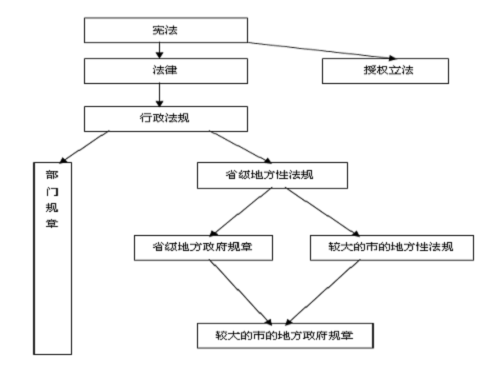
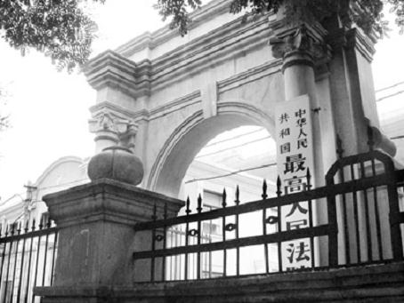
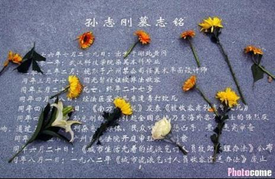

# ＜七星说法＞第二十八期：如何“对付”违法的法律

**法律条文是法院审判的规则。如果条文之间出现冲突，法官应该适用哪一条呢？对此，法律有相应的规定：上位法优先于下位法。那么，如果在现实生活中，国务院发布的办法违背了宪法的规定，刑诉法修改的程序违背了立法法的修法程序规定，学校出台的奖学金政策违背了教育部的规定，地方政府出台的规定违背了国务院制定的条例，而这些违背上位法的法律规定侵犯了我们公民的基本权利，我们可以做些什么呢？本期说法主要想谈谈面对违反宪法、违反法律的法律法规， 人大、政府、法院，以及个人，应该怎么做。**  

#  ＜七星说法＞第二十八期：

## 如何“对付”违法的法律

 

### **这些年，一起违宪、违法的法律法规**

由于制定主体不同、制定程序的严格性不同、法律规范和调整的内容的重要性不同，法律自产生之初就是有不同位阶的。**立法法规定，上位法的效力优于下位法。**说的官方一点，就是：法律的效力高于行政法规、地方性法规、规章，行政性法规的效力高于地方性法规、规章。所谓法律冲突，即某法律的一些条文与上位法冲突，由此产生了“违法的法律”。****

目前我国的法律位阶关系如下图：

从上图中我们不难猜到，**最容易与上位法冲突而导致违法的是地方性法规**。它位阶低且产量极高，根据最新速递法律法规信息的网站信息资料显示，前一个月之内，各地新颁布的地方性法规就有38部。这么庞大的地方性法规总会产生尾大不掉的问题。例如，2011年1月《国有土地上房屋征收与补偿条例》，即所谓的“将行政强拆逐出历史舞台的新拆迁条例”，已经开始颁布施行，然而到了2011年7月，还有逾百件与该条例存在巨大差异的地方性法规、规章，仍未被废止或修改。

也就是说，法律冲突所带来的，**内容违法的法律法规的失察现象是很普遍的。**

 

### **法律规则冲突的问题有多严重**

#### **一、仲裁规则冲突**

五一前后，两家仲裁委员会机构的掐架引起众多围观，却至今没有结论。一家是国际经济贸易仲裁委员会，一家是国际经济贸易仲裁委员会上海分会。事件发生于4月23日，贸仲委发布其新制定的仲裁规则，并表明该《仲裁规则》将统一适用于贸仲委及其分会；接着，

4月30日，贸仲委上海分会在其网站发布了贸仲上海分会仲裁规则，也于今年5月1日起施行。双方你来我往的刀枪唇剑便由此展开。

5月1日贸仲委发表公开信，称上海分会只是贸仲委的派出机构，其不是独立的仲裁机构，所制定的规则无效；

5月2日，上海分会发表声明，称自己并非贸仲委分支机构，贸仲委新制定的规则严重违反程序，且其动机不纯，修改规则的目的是为获取更多的仲裁费收入。

**两家仲裁机构纷纷称对方的规则无效，这对正在审理中的仲裁案件应如何适用规则，对已经审理完毕的仲裁裁决是否有效，都会带来很大影响。**

相比于仲裁委员会之间互相认定对方仲裁规则是否有效，法律规则的效力的认定是无法通过某个“公开信”或“声明”来明确的。仲裁规则冲突和法律规则冲突，唯一类似的是，**规则的冲突，必然会带来审判的不确定性，降低审判机构的公信力，无法保障公民的权利。**

#### **二、法律规则冲突，导致征税权的混乱**

去年秋天 “月饼征税”一经媒体披露，引起民间哗然。但有关部门及时跳出，表示“月饼计税早在1994年就开始实行，依据当时的《个税法》明确了单位所发的月饼、食用油等实物福利，应并入其工资、薪金所得，计征个人所得税。”除此以外，各种馒头税（对消费品征税），加名税(夫妻在婚前房上加名)，解聘税（单位给予解聘员工的经济补偿）等种种征税，均有法可依。

然而其中仍然存在问题，**即税收的立法权属于全国人大还是国务院？**

****

2000年颁布的立法法第8条规定，征税的法律制度只能由立法机构制定基本法律进行规范，即排除了国务院的征税权。然而早在1985年，全国人大已授权国务院对“经济体制改革和对外开放方面的问题”可以制定暂行规定或条例，于是，国务院依照授权制定了大量税收暂行条例**。****虽然授权国务院制定税收条例违背了立法法的规定，但因全国人大授权国务院立法的时间早于立法法颁布的时间，国务院的税收立法权在体制上不存在问题。**这就像是车钥匙在房间里，房间钥匙在车里的问题。

**于是导致****国务院能不断开征新税，而民众却无抗辩之权。**立法法明确规定，被授权机关不得将该项权力转授给其他机关。然而，现实却是，大量征税的行政法规是经国务院再一次授权，由财政部或国家税务总局制定的。可见，**立法法的规定如同竹篮打水，违反立法法的法律法规、规章规定都层出不穷。**

 

### **面对“违法的法律”，人大或政府应改变或撤销**

对这些与上位法冲突的法律法规，全国人大，各级政府，法院，以及每个公民应该怎么做呢？****

2000年通过的《立法法》为法律冲突提供了解决的途径和机制。

首先**，全国人大有权改变或撤销法律，全国人大常委会有权改变或撤销有关法规，国务院、地方人大及其常委会及地方各级政府，有权改变或者撤销不适当的规章。**

其次，**有关国家机关或者公民、组织在认为行政法规和宪法、法律相抵触时，可以向全国人大常委会****书面提出进行审查的建议并****申请处理。**

 

### **面对“违法的法律”，法官不可以在判决书中认定无效**

2003年5月，洛阳市中级人民法院审理的“河南种子案”引起社会很大关注。在庭审中，遇到两部法律的选择适用问题，原告要求适用《种子法》，被告则要求适用《河南省农作物种子管理条例》。

主审法官李慧娟在面对这个法律冲突的问题时，在判决书上写下：“《河南省农作物种子管理条例》作为法律位阶较低的地方性法规，其与《种子法》相抵触的条（款）自然无效”。

这一句简简单单的判断激起河南省人大的强烈反响，河南省人大认为这样的表述“其实质是对省人大常委会通过的地方性法规的违法审查，违背了我国人民代表大会制度……是严重违法行为。” 并要求河南省高院作出严肃处理，于是，李慧娟被撤去审判长职务。

面对下位法与上位法之间的法律冲突，法官可能作出的选择大概有这么几种：

（1）直接适用上位法，而不作任何说明；

（2）适用上位法，同时解释，是因为下位法抵触上位法而不予适用；

（3）适用下位法，对上位法不予理睬。

（4）中止审理，逐级上报，等候裁决。

显然，根据上位法优于下位法原则，第三种做法是明显错误的。而第一种不做任何说明的做法，不能给人以信服的理由，也不符合判决书应该加强说理的趋势。然而，适用第二种做法的李慧娟以身试法，虽然正确适用了法律，但在判决书中直接认定地方性法规无效而遭遇意外风险。因此，在不确定应该适用何种法律的情况下，第四种选择，**逐级上报，向上级请示，等候最高院的回复，俨然成为法院回避风险的“免死金牌”。**

2004年3月30日，最高人民法院在《关于河南省种子合同纠纷一案请示的答复》中认定，“人民法院在审理案件过程中，认为地方性法规与法律、行政法规的规定不一致，应当适用法律、行政法规的相关规定。”这一最高院的回复是对河南种子案适用上位法的肯定。即，**河南省《种子条例》与国家的《种子法》相抵触，****李慧娟法官****选择《种子法》作为判决的根据，是符合上位法优于下位法的规则的。**

但同时，因为我国不存在违宪审查制度，**法院没有合宪性审查权，只能通过法定程序提请有权机关进行审查，而无权宣布地方性法规无效。**因为法律的有效与否，是立法权的一部分，如果允许法院宣布法规范无效，无疑是认可法院拥有立法权，破坏权力分立的原则。**法院适用法律正确，但“直接对地方性法规的效力加以评判是错误的”。**

“河南种子案”证明了：**法院只能基于案件而对在该个案中是否适用某法律文件作出评判，而不能一般性地对该法律文件的效力加以评论，即不能宣布某法律文件是否违法**。法院在适用法律时，发现地方性法规与宪法、法律相抵触的，适当的做法应该就是不适用地方性法规，而适用其上位法。然后再通过法定途径解决法之间的抵触。

 

### **面对“违法的法律”，公民的不懈努力**

上述河南种子案中，**03年11月19日****，肖太福、涂红兵、陈占军、朱嘉宁四位律师依据立法法规定，向全国人大常务委员会递交了“关于审查《河南省农作物种子管理条例》 的建议书”**。建议有两条：一是依法审查《河南省农作物种子管理条例》的法律效力，并向河南省人民代表大会常务委员会提出书面审查意见。二是尽快审查和清理国务院的行政法规和各地的地方法规，责令制定机关废止或修改与宪法和法律相抵触的行政法规和地方法规。4月1日，河南省人大常委会通过《河南省实施〈中华人民共和国种子法〉实施办法》，办法自7月1日起施行。《河南省农作物种子管理条例》同时废止。

03年，湖北大学生孙志刚因未携带身份证，被广州治安人员收容遣送，并于3天后死于收容救治站。尸检结果表明他是被殴打致死。孙志刚的死，推动了社会对于收容遣送制度的重新审视。**当年5月16日，许志永、俞江、滕彪3位青年法学博士，以普通中国公民的名义上书全国人大常委会，要求对《收容遣送办法》进行“违宪审查”。**几天后，北大法学院教授贺卫方等5位学者再次联名上书，提请全国人大常委会就孙志刚案及收容遣送制度实施状况，启动特别调查程序。6月20日，国务院发布第381号国务院令，废止收容遣送制度，代而施行《城市生活无着的流浪乞讨人员救助管理办法》。

今年两会通过的刑诉法的修正案，社会各界除了对第73条“对有碍侦查情况的监视居住或拘留不通知”的条款有较大争议外，还对其表决通过的程序违宪发出强烈质疑。立法法第十五条规定，**须表决的法律草案需在会议举行前的一个月前发给与会代表。然而，本次两会，全国人大代表是来京参会后，才看到需要审议的最终法律草案文本的**，根本没有一个月审议的程序。许多代表都放弃投票权利，并积极号召其他与会代表深思熟虑后再投票。虽然，我们都已经看到结果，刑诉法修正案仍然以2639：160票获通过。

5月15日，华东政法大学的一名研究生，发布了一条长微博，大意是说，教育部于去年发表声明：严禁向计划内研究生收取学费。而华政确实从2011年开始停止向研究生收取学费，问题在于其并非完全遵守该部门规章，而是制定“奖学金制度改革”，对成绩排名在前90%的计划内研究生免收学费，而剩余的10%的研究生仍需交纳将近1万元的学费，明显是对这10%的学生的合法权益的侵犯。**华政制定的该奖学金制度规定违反了教育部制定的部门规章，属于违法规定，应当予以废止**。针对这一情况，华政校方已于5月17日下午开展关于“评定奖学金评价体系的会议”，并邀请多位学生代表参与发言，期待其进一步的处理结果。

也许你担忧我们公民自身的力量，在强大的国家机器面前是何其弱小；也许你觉得我们即使知道了这些违法的法规存在，也根本没有办法改变什么；也许面对我国没有建立起违宪审查制度，众多违法的地方规章遍布得不到解决而忧心忡忡。而我想说，就像**中国政法大学何兵教授所言：关注就是力量，围观改变中国**。从知道违法是错误的，到让更多的人过来围观，到向全国人大常委会提出违宪审查意见书，终有一天，违法的法规会在我们的不懈努力中溃不成军，让我们等到建立违宪审查制度的那一天。

 

### **【深入阅读】**

 [http://portal.sinoth.com/sining/1000086026.html](http://portal.sinoth.com/sining/1000086026.html%E4%BF%AE%E6%94%B9%E5%88%91%E8%AF%89%E6%B3%95%E7%9A%84%E7%A8%8B%E5%BA%8F%E6%B6%89%E5%AB%8C%E8%BF%9D%E5%AE%AA%E8%BF%9D%E6%B3%95) 修改刑诉法的程序涉嫌违宪违法 [http://www.infzm.com/content/58001 ](http://www.infzm.com/content/58001%20) 谁有征税权 [http://www.mlr.gov.cn/wskt/flfg/201107/t20110714_901422.htm](http://www.mlr.gov.cn/wskt/flfg/201107/t20110714_901422.htm%E9%80%BE%E7%99%BE%E4%BB%B6%E5%BE%81%E5%9C%B0%E6%8B%86%E8%BF%81%E5%9C%B0%E6%96%B9%E6%B3%95%E8%A7%84%E8%A7%84%E7%AB%A0%E4%B8%8E%E4%B8%8A%E4%BD%8D%E6%B3%95%E5%86%B2%E7%AA%81%E4%BA%9F%E5%BE%85%E6%B8%85%E7%90%86) 逾百件征地拆迁地方法规规章与上位法冲突亟待清理 [http://news.sohu.com/2004/02/06/62/news218946269.shtml](http://news.sohu.com/2004/02/06/62/news218946269.shtml%E6%B2%B3%E5%8D%97%E6%9D%8E%E6%85%A7%E5%A8%9F%E4%BA%8B%E4%BB%B6%E8%B5%B7%E6%B3%A2%E6%BE%9C) 河南李慧娟事件起波澜 [http://www.china.com.cn/economic/zhuanti/ggkf30/2008-11/13/content_16759768_2.htm](http://www.china.com.cn/economic/zhuanti/ggkf30/2008-11/13/content_16759768_2.htm) 救助管理办法出台 收容遣送制度2003年废止 [http://article.chinalawinfo.com/Article_Detail.asp?ArticleID=31547](http://article.chinalawinfo.com/Article_Detail.asp?ArticleID=31547) 由洛阳种子违法审查案看法院的宪法地位  **北斗读者交流问卷调研地址：****[http://www.sojump.com/jq/1488982.aspx](http://rrurl.cn/gMNL5h)**  

(编辑：石味诗，陈蓉)

 
