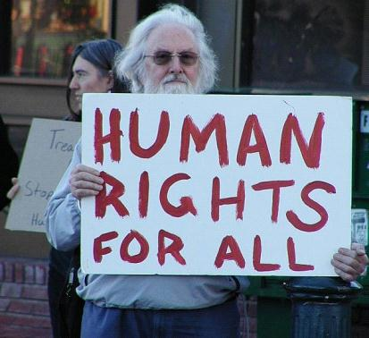

# ＜七星说法＞第二十六期： 你说要保护我不被伤害，但是我说我是自愿的

**本期导读：在有些国家，赌博、卖淫、吸毒、同性恋、安乐死、堕胎，这些行为是违法犯罪，而有些国家正积极推动卖淫、吸毒、安乐死的合法化。这些行为的共同点是——犯罪行为为自愿的，犯罪人和被害人是同一个人，即文意上的“无被害人犯罪”行为。这几天，“人权问题”一词频频出现在各大媒体，本期说法也来打个擦边球，讨论下“政府在公民伤害自身时对其进行惩罚”背后的人权问题。**  

# 你说要保护我不被伤害，但是我说我是自愿的

## 文 / 马特（北京师范大学珠海分校）

 

####  私密的淫乱行为也是聚众淫乱？

2010年5月，南京某大学副教授在私下组织"换妻" 活动，结果被起诉“聚众淫乱罪”并获罪判处有期徒刑3年6个月。一时争议四起。法院依据《刑法》第301条第1款“聚众进行淫乱活动的，对首要分子或者多次参加的，处五年以下有期徒刑、拘役或者管制”，对被告人作出有罪判决。从法院判决来看，三人以上聚众发生性行为，不论公然还是私密，都构成聚众淫乱罪。

笔者分析如下，第一，参与聚众淫乱的人应该是自愿的，而不是被强迫的；否则，则视行为性质认定为强奸罪或强制猥亵罪，或者实行数罪并罚。第二，“淫乱”可以分为公然性淫乱和私密性淫乱。前者是指，当众进行或者采取其他使公众能够听到或看到的方式进行的淫乱；后者是指，避开公共场所，秘密进行的，尽量不为人知的淫乱活动。按照法条规定，只有公然性的淫乱才构成本罪，私密性的淫乱不构成犯罪。因此，三个以上的成年人，基于自愿秘密实施的性行为，由于没有侵害公众对性的是非价值判断，不属于刑法规定的聚众淫乱行为。法院的判决有失公允。

如果将该类行为规定为犯罪，则此类犯罪就是无被害人犯罪。

####  西方国家为什么推动卖淫、吸毒、安乐死的合法化？

根据西方已经成型的理论，赌博、卖淫、同性恋、乱伦、通奸、自杀、安乐死、堕胎、吸食毒品、流浪、酗酒、高利贷等行为都是“无被害人犯罪”的行为。其显著特征是行为各方都是自愿同意，甚至是热忱参加的，没有人强迫他们去做他们不愿做的事情，即不存在典型意义上的被害人。从形式上看，由于行为发生在自愿的当事人之间，不存在强迫与被强迫的关系，所以是没有被害人的犯罪；从实质上来看，规制无被害人犯罪行为保护的是不明确的法益，即无法明确该行为侵害了谁的利益或对何种利益造成危险。无被害人犯罪的认定在不同国家有不同的范围。这主要与各国的民主自由程度、文化传统观念等的差异有关。

早期欧洲规定卖淫违法是因为它违反了禁止通奸的宗教教条，玷污神明；自杀在基督教里是被禁止的，自杀未遂者被认为是罪犯，其财产应当被没收，行为人应钉死在十字架上；在纳粹时期，过分注重社会本位，刑法严重干涉个人生活的方方面面，自杀也被认为是犯罪，因为在他们看来，个人的一些权利并非仅属于个人，个人应当是社会的个人。

在第二次世界大战之后，西方人权运动兴起，非犯罪化成为西方刑事政策改革的重要内容，而首先成为非犯罪化实践对象的就是无被害人犯罪，欧洲国家，以及美国等都进行了不同形式的非犯罪化实践，主要体现在刑法中所保留的罪名和处罚幅度。

1967年通过的《英国性犯罪法》和《英国堕胎罪法》有条件的承认了同性恋和堕胎的合法性；1975年的《德国刑法典》（联邦德国）废除了决斗、通奸、堕胎、男子间单纯猥亵行为等罪名。最突出的是荷兰，积极推动卖淫、吸毒、安乐死的合法化。对于赌博，欧陆国家也采取了事实上的除罪化。在美国，从目前的实际做法来看,同性恋和私人间的自愿性行为在多数州都是合法的，卖淫在内华达州是合法的，对于酒后妨害治安的行为已不再由执法机关处理，而是送到酒精治疗部门这种社会机构。对于大麻等软性毒品的管制放宽，不再由刑法进行制裁，而是由社会来处理。

从普遍来看，大多数国家放宽了与性和麻醉品有关的管制，但仍然存在一部分无被害人犯罪被归为犯罪范畴，大致的政策方向是放宽私密的、个人的行为，对于公开的、公共场所的行为仍然管制严格。

####  我国对卖淫、吸毒、赌博行为的双重处理方式

在讨论中西方关于这个概念的立法前，需要了解一个基本法律常识：西方的犯罪分为“重罪”、“轻罪”和“违警罪”，而我国刑法入罪标准比较高，国外作为违警罪处理的行为，在我国，可能是违法行为，或仅仅是不道德行为。所以有一些无被害人犯罪行为，在西方认为是犯罪，而在我国仅仅是违法行为但非犯罪行为，比如个人吸毒；有的仅仅是不道德，比如乱伦；有的甚至不涉及不道德，比如流浪、堕胎。所以在这个概念上，全盘借鉴西方关于这个概念的立法规定是行不通的。

我国对于无被害人犯罪一直是严谨的态度，卖淫、吸毒、赌博是无被害人犯罪的典型行为，目前我国对于这几类行为的管制分为两个部分，一是对大部分个人行为基本上是采用行政手段，比如个人卖淫、个人吸食毒品、非营利性质的小规模赌博，基本根据《治安管理处罚法》、《卖淫嫖娼人员收容教育办法》、《强制戒毒办法》、《劳动教养办法》、《劳动教养戒毒工作规定》等法律法规，通常处以拘留、罚款、收容教育、劳动教养等惩罚措施；二是对一些可能扰乱适合秩序的无被害人犯罪在刑法中进行规制，我国刑法中规定的无被害人犯罪主要有高利转贷罪、聚众淫乱罪、赌博罪、开设赌场罪、非法持有毒品罪（与毒品有关犯罪较为复杂，不能一概论之）、组织卖淫罪、制造、贩卖、传播淫秽物品罪、此外还包括其他犯罪中的一些特殊形式，比如安乐死（协助自杀）。

整体而言，我国对该类行为的刑事处罚是严格限制的，一般的行为都通过治安处罚措施来规范。

####  政府有权在公民伤害自身时对其进行惩罚吗？

包括西方以及我国在内的立法者将无被害人犯罪纳入刑法调整的范围，主要基于两个方面的考虑：

一是 【法律应当保护公民如同家长保护孩子一样，避免他们滥用权利伤害自己，应用宽泛的法律去约束限制其行为。】这种观点即“家长式立法”。这种立法的动机也许是善意的，但善意的动机不能因此证明干涉行为的正当性，因为其与自由主义的刑法的精神格格不入。无被害人犯罪都是行为人对自己利益的处置或对他人同意放弃的利益的处置，且不危害其他第三人的利益，行为人有权根据自己的自由意志决定是否做出一定行为和如何做出行为。这里涉及“自我决定权”的概念。所谓自我决定权，是指个人就一定私人的事情，有不受公权力干涉自我决定的权利。日本是明确提出公民“自我决定权”的国家。自我决定权的提出是为了保护那些缺乏明文依据的基本人权。比如性自由、服用药品或者麻醉品、赌博等行为不可能作为宪法保障的公民权利，但这些行为确实是围绕着人格产生的，作为个体人的一部分。

二是 【卖淫、吸毒、赌博等对于社会风气有较大负面影响。如果不禁止，会扰乱了正常的社会秩序，并滋生其他犯罪。】在这一观点中，社会风气被当成重要的法益来对待，因此与社会风气相关的行为就应由刑法来进行调解。笔者认为这是错误的。首先，社会风气不应由法律进行强制规范，而应在道德层面上进行引导，法律应该是解决社会问题的最后手段而不是首选手段，应该用道德解决的问题就不应当用法律来规范，更不应该用刑法处罚来调整。其次，卖淫、吸毒、赌博等和其他犯罪之间并不存在必然的因果关系。因为“可能滋生犯罪”为理由，将该行为纳入刑法规制的范围，全然不顾犯罪须具备社会危害性的本质特征，实在是滥用刑罚权。

除了对以上观点的反驳外，支持无被害人犯罪非罪化的观点有如下两点：

一是 【无社会危害性的行为不应当认定为犯罪】 犯罪的本质特征是其具备社会危害性，从这一点上看，判断社会危害性是区分罪与非罪的关键。刑法的任务不是维护社会道德，而是保护法益。只有侵害或者威胁法益的行为才能被刑法规定为犯罪。无被害人犯罪具有一定的反伦理性，但是不存在被害人，不会对法益产生侵害或者威胁，所以不应当规定为犯罪。

二是【无被害人犯罪属于道德范畴】大部分无被害人犯罪的范围均与道德存在天然的联系，有时甚至可以用道德犯罪来概括这类犯罪。无疑，对于这类犯罪我们应该持相当慎重的态度。道德过分介入法律，甚至直接纳入刑法的范畴，其后果是非常危险的。泛道德主义必然会导致刑法的恣意性和残酷性。

#### 道理都懂了，可是该怎么操作呢？

笔者赞成对无被害人犯罪彻底去罪化，不但包括刑法规定的相关罪名，还包括受到行政处罚的相关行为（由于存在行政处罚过重以及处罚混乱失衡的情况，最好的方法就是完全去除），而换之以法治管理。对于卖淫嫖娼、吸毒、赌博等带无被害人的行为，应该在开放的前提下进行一定程度的制约，如果卖淫嫖娼合法，应如何规范场所、制定经营规则、完善卫生和从业人员资质审查；如果吸毒合法，应当如何避免价格过高、走私偷税和市场供求失衡；如果赌博合法，应当如何规范登记注册、税收，建立工商监督和行业自律机制。以及，如果安乐死合法化，如果同性恋合法化，如果乱伦合法化…………（因为本论文探讨的是有关法理而不是具体法律实践的内容，因此笔者在这里提出的建议仅仅是依据法理探讨的理想状态，而非具体实践）。

一部分无被害人犯罪根源在于少数群体的价值观和生活方式不同于主流社会价值观，法律不应该因为不同的信仰、价值观、生活方式而对少数群体进行惩罚；也不应该对没有造成明显社会危害的行为过分惩罚，法律制裁某种行为的依据应该是该行为对社会的危害程度，其作为社会规则的底线应当保障个人最大可能的自由和选择余地。

一个社会的文明程度就在于多数人如何对待少数人。如果我们可以不再将“巫婆”烧死，不再将“奸夫淫妇”游街示众，不再对同性恋者鄙夷羞辱，那么我们就可以宽容的对待其他那些目前仍遭受“过当惩罚”的“无被害人犯罪”行为。在文明理性的社会中，人们应该明白自己的想法并不一定正确，也应该尊重他人的生活方式和价值观。也许我们现在的条件和环境还不允许我们有太大的改革，但我们相信文明的时代终将会到来。

 

### 【深度阅读】

 [http://www.sls.org.cn/law_update_webf/all_about.jsp?main_id=8&id=0080000286](http://www.sls.org.cn/law_update_webf/all_about.jsp?main_id=8&id=0080000286) 无被害人犯罪研究 北斗读者交流问卷调研地址：[http://www.sojump.com/jq/1488982.aspx](http://rrurl.cn/gMNL5h)  回答问卷者有机会认识作者，与说法编辑聊天、喝茶，更有可能获得北斗前辈加好友、状态转发、嘘寒问暖等机会哦~^_^  

（编辑：陈蓉）

 
