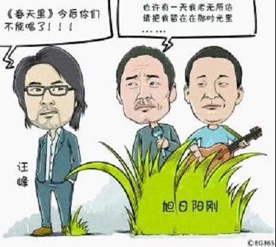
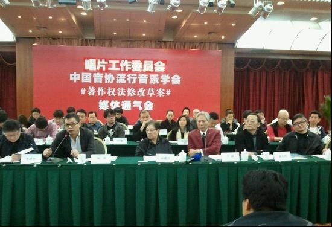
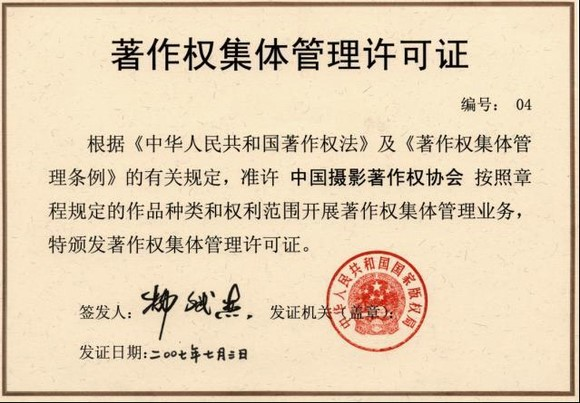

# ＜七星说法＞第二十四期：制度的问题，还是国情的问题？

**本期导读：前几日，著作权法大修在音乐界引起轩然大波。音乐界领军人物对修法后的“恶法条款”提出质疑，向立法机构请命修改46条，废除60条、70条；而包括国家版权局、文著协、音著协、音集协在内的官方代表忙于澄清各种观点：46条是为防止唱片公司垄断，70条是为广大使用者合法使用作品提供途径，确保付酬机制；知识产权法学界则认为 “音乐人以及媒体存在对修正草案的误解。修正案相比现行法律规定更为合理。当然，法定许可费的标准应当适当，不可过低。”（王迁），观点不一而足。本期七星说法将带您梳理清楚著作权法修改中的种种疑问。**  

# <七星说法>第二十四期：

## 制度的问题，还是国情的问题？

 

很久很久以前，有位作词人写了首歌，一位作曲家谱了曲，一位歌手用自己独特的嗓音演绎了这首歌，一家唱片公司收录了这位歌手的歌，并用这首歌制作成唱片。后来有了很多作词人，作曲家，歌手和唱片公司，再后来有了一个音乐著作权协会，负责代表词、曲、演、录四个版权人，从卡拉OK使用者，从商场、酒店、飞机等播放背景音乐的公共场所，从互 联网或以无线方式下载音乐及广播电台电视台等收取版权使用费，打各种维权官司。

过了几年，四个版权人发现只拿到很少的钱，于是质问音著协版权费的分配方案。

音著协慌忙解释，“是这样的，我们音著协代表词、曲作者，音集协代表唱片公司。这两年卡拉ok版权费的收费总额将近1.2亿元，刨去中文发（北京中文发文化发展有限公司）收取的娱乐场所阳光工程费用8%，剩余的50%分配给音集协和天合公司之间作为运营成本，音集协的管理成本为23%。受协会委托，提供版权使用费收取服务的天合集团占27%。另一半利润中的60%归唱片公司， 40%由音著协分发给词曲作者。”

一位精通财务的版权人掐指一算，中文发占8%，音集协还有负责收账的“天合”公司共占46%，唱片公司只有27.6%，而音著协拿到18.4%，估计还会扣除部分再发给词曲作者，这样一来，词曲演录四个版权人加在一起的所得甚少，再分配到每个人手中已寥寥无几。54%的管理费用远远高于其他国家和地区的9%-13%的标准。

然后，唱片工业协会理事单位的负责人突然发话，“从长远角度看，大分配方案中，音集协和天合公司所占的比例有点偏高，但在初级阶段是可以理解的！你们不应该把着眼点放在分配比例上，而应该从更高层面去认识这件事情，毕竟音集协在成立短短一年就取得这些成绩，堪称中国音像版权斗争的重大胜利啊！”

然后，南方周末的同志适时地凑过来，拿出调研报告 “天合公司是由中文发控股的，中文发一开始征收8%费用，随后天合公司又收取了27%的服务费，可见依照分配方案获得巨额利益的是中文发。而中文发是由文化部下属的正局级单位——文化部文化发展中心参股40％的机构。”

然后，就没有然后了…………

 **著作权法修改前后 ** ** **

2012年3月31日，随着国家版权局发布著作权法修正案意见稿，这个故事有了新的发展。音乐人强烈抨击著作权法修改主要集中在两个方面：制作录音制品的准法定许可变为纯法定许可(第46条)，适用 “延伸集体管理制度”，加大了著作权集体管理组织权力—— (48条、60条、70条)。

根据现行的著作权法，A唱片公司第一次收录某歌手的歌曲需要获得该歌手及词曲作者的许可，并支付报酬。之后，如果B唱片公司想将A唱片公司发行唱片里的某首歌收录进B公司的唱片中，可以不经过该歌手、词曲作家以及唱片公司的许可，使用该歌曲，重新找歌手进行录制并制作成唱片，但必须要向版权人支付报酬。但如果原版权人声明“不许使用该音乐”就不适用法定许可。即现行法律规定制作录音制品采用**准法定许可制度**。

现行著作权法第39条：

录音制作者使用他人已经合法录制为录音制品的音乐作品制作录音制品，可以不经著作权人许可，但应当按照规定支付报酬；著作权人声明不许使用的不得使用。

而修正案规定，所有唱片公司都无须经过版权人许可，事先向国家版权局备案，在该唱片出版3个月后即可使用该唱片中的歌曲制作唱片，并在一个月内向音著协或音集协付费。这笔法定许可使用费的标准，由国家版权局制定，音著协或音集协只需及时转付给词曲演录权利人，并在某个不确定的日期内建立查询系统即可（自音著协及音集协成立至今尚未建成某种可用的查询系统）。修正案规定制作录音制品采用**纯法定许可制度**。

修正案第46条：

录音制品首次出版3个月后，其他录音制作者可以依照本法第四十八条规定的条件，不经著作权人许可，使用其音乐作品制作录音制品。

修正案第48条

不经著作权人许可使用其已发表的作品，必须符合下列条件：

（一）在使用前向国务院著作权行政管理部门申请备案；

（二）在使用时指明作者姓名、作品名称和作品出处；

（三）在使用后一个月内按照国务院著作权行政管理部门制定的标准向著作权集体管理组织支付使用费，同时报送使用作品的作品名称、作者姓名和作品出处等相关信息。

使用者申请法定许可备案的，国务院著作权行政管理部门应在其官方网站公告备案信息。

著作权集体管理组织应当将第一款所述使用费及时转付给相关权利人，并建立作品使用情况查询系统供权利人免费查询作品使用情况和使用费支付情况。

需要注意的是，这里仅针对唱片公司制作唱片的行为进行法定许可，并非许可在演唱会及其他公共场所翻唱的行为。很多歌手或词作家，十分担心修法以后，旭日阳刚开演唱会翻唱汪峰的歌，都不需经过汪峰同意直接演唱，翻唱行为会泛滥成灾，许多媒体也发表类似的错误观点。这里有个著作权的常识：**只要营利性地公开演唱他人的音乐作品，即在公共场合进行收费表演的，或者把表演的影音作品灌录成专辑放在互联网上传播的，都必须取得著作权人的许可。**

**为什么可以不经著作权人许可制作唱片**

著作权法的立法目的，首先是保护创作者因创作作品而产生的权益，其次是保护传播者因传播作品而产生的权益，最终能够繁荣文化和科学事业。虽然著作权是财产权，但仍然区别于具有排他性的物权，其立法目的体现了对创作者及创作者家属（通过继承）、作品传播者和一般公众的利益的保护及其相互的平衡。例如，著作权法规定了保护的时间限制，设立了法定许可、合理使用的规定，即某些情况下可以不经过权利人许可使用著作权人的作品。

现行法律第39条以及修正案第46条讲的是“制作录音制品的法定许可制度”，该制度在20世纪初设立目的在于防止唱片市场的垄断，防范一些唱片公司购买大量流行音乐的版权，通过控制其版权垄断音乐制品的发行业务，阻碍音乐作品的流行和传播。该制度旨在防止出现高价唱片，保障合理竞争，促进音乐作品的加速流通，以及保障音乐著作权人的利益。明确该立法目的，是讨论是否要删除或修改现行制作录音制品的“准法定许可”的基础。

对于“制作录音制品的法定许可”制度的存废问题，不仅在我国修改著作权的历程中，在国际上也一直有争议。反对该条款的主要观点是，现在不同于20世纪初，唱片业的竞争已足够充分，不存在垄断；其次，即使有垄断，也有反垄断法进行规制，同时，法定许可的定价是固定的，例如美国一开始规定的是每首歌2美分，根据调查研究，如今定价为40美分才符合市场规律，该固定的定价机制不利于激发创作者的积极性，著作权法应当首先保护词曲作者对自己作品的许可权和定价权；

支持保留该条款的主要观点是：发展中国家的唱片发展尚未充分，保留该条款有助于避免可能出现的高价垄断，同时因为很多国家采用该制度有很多年的历史，已经形成正常的唱片业商业模式，为利用他人音乐作品制作和发行唱片提供了稳定的法律预期，一旦改变将不利于市场平衡发展。因此，伯尔尼公约对是否采用该制度并没有做强制性规定。

现实情况是，国际上有许多国家没有规定该制度，包括许多发达国家；也有很多国家规定了该制度，且限制的程度不一，有的规定只要在音乐作品被录制之后，他人即可以使用，无须申请报备；也有规定在出版后一定时间之后适用。唯独中国著作权法的规定，属于有中国特色的折衷规定：即，规定了较为宽松的法定许可（只需合法录制，也无须申请报备）后，又规定了保留声明——著作权人可以通过保留声明排除适用法定许可。同时，并没有规定应当以何种方式作出该保留声明。因此在现实案例中存在较多问题，有法院要求必须在著作权人每一次许可他人制作的唱片上注明不许使用，也有法院将唱片外包装上所印的“版权所有 翻印必究”字样，视为“著作权人不许他人擅自使用作品的声明”，因为立法不完善，造成实务中判案时标准的混乱，使用者因侵权风险，也不敢贸然使用。

可见，修改现行39条条款是很有必要的。要么废除，保证版权人对自己作品的专有权，保障版权人的许可权和定价权，保全版权人高呼的尊严，并冒着有可能限制作品流通，减少版权人收益的风险；要么修改，删除但书规定，许可在一定期限（如3个月）之后可以使用该音乐作品，强制性地促进作品流通，排除可能存在的垄断风险，或者修改并明确但书规定，许可一定期限之后可以使用。

**制作录音制品法定许可制度，废除还是修改**

关于废除还是修改现行制作录音制品法定许可制度的讨论一直在进行中，在修法征求意见过程中，鉴于这项制度的实际效果，有专家建议取消法定许可制度。但最后立法小组认为，目前该制度比较适合中国国情，不成功的原因在于付酬机制和法律救济机制的缺失。因此草案删除了“著作权人声明不许使用的不得使用”的但书规定，变准法定许可制度为纯法定许可制度，采用备案登记制度和著作权集体管理组织付酬制度来保证权利人的权利。

华东政法大学知识产权学院院长王迁教授提出，修正案第第46条较现行39条第3款更为合理。按照现行规定，只要第一家唱片公司已经合法地将音乐作品录制为唱片，哪怕刚刚出版，甚至是还没有来得及出版，其他唱片公司就可以自己找歌手在录音棚演唱该歌曲后，制作为唱片出版（例子参见尾注“丁香花案”）。而修正草案第46条规定，必须要等待第一家唱片公司出版唱片3个月之后，其他唱片公司才能这么做。同时，王迁教授认为删除保留声明是有道理的，保留但书规定，实际上将此项“法定许可”的存废权交到了音乐著作权人手中，达不到反垄断的目的，实务中也十分混乱。

大成律师事务所的陶鑫良律师也认为修改后的条文表达比现行著作权法更加维护著作权人的权益，但不应删除保留声明。当前我国国情需要能够覆盖各种利益趋向和能够兼顾各种主观意愿的“准法定许可”制度。例如，汪峰与高晓松等著名音乐作品著作权人完全可以通过“准法定许可”制度，事先声明自己的相关音乐作品必须经授权才能使用。又如，普通的音乐作品著作权人一般可能认为法定许可更有利于自己的作品被使用、被传播和利益最大化，则也完全可以遵循“准法定许可”程序不发特别声明而实现法定许可。即修改现行条款的条文表达，且保留但书规定。

同时，学者们对于准法定许可变为纯法定许可的规定，首次出版仅“3个月”后的时间限制，以及采用由版权局定价、音著协收款的付酬制度等具体条款仍然存在较多异议。

**延伸性集体管理又是怎么一回事儿**

音乐人提出要删除草案第60和第70条，是著作权集体管理组织延伸性集体管理制度。著作权集体组织代表著作权人进行收费是世界通行的规则，设立这个制度的目的是为了减小作品使用者寻找著作权人的交易成本，更便利的促进作品的传播。

修正案第60条 著作权集体管理组织取得权利人授权并能在全国范围代表权利人利益的，可以向国务院著作权行政管理部门申请代表全体权利人行使著作权或者相关权，权利人书面声明不得集体管理的除外。

修正案第70条 使用者依照与著作权集体管理组织签订的合同或法律规定向著作权集体管理组织支付报酬的，对权利人就同一权利和同一使用方式提起诉讼，不承担赔偿责任，但应当停止使用，并按照相应的集体管理使用费标准支付报酬。

修正案借鉴了北欧国家延伸性集体管理制度，即使一些著作权人未加入集体管理组织,集体管理组织也可以代管其权利,并将收取的作品使用费参照会员的待遇分配给著作权人。其立法本意是为了解决现实中常常出现的使用者愿意合法使用作品，却找不到权利人的情况，可以使未加入著作权集体管理组织的著作权人的利益也得到保障。总体来说，确立延伸性集体管理制度有利于更好地维护权利人利益、方便使用人使用，满足社会公众对知识文化传播的需求，这一点是可以肯定的。

同时，草案规定对于只要使用人事先和音著协或音集协签订合同并支付报酬，无论著作权人是否是该集体管理机构的会员，其要求额外赔偿的请求不予支持。简而言之，即便著作权人认为集体管理组织所确定的收费标准不合理，不愿意被集体管理组织“代表”，他自己通过诉讼所能获得的收益，也不能超过集体管理组织的定价。

这一条制定的来源有以下一个因素。音集协最广为人知的业务内容，便是向KTV收取卡拉OK著作权使用费。但由于其管理费比例过高、使用费定价不合理等因素，有很多权利人没有参会，而选择自行维权。2010至2011年间，一些“音集协”非会员在全国范围提起民事诉讼，向已经给音集协缴费的KTV店家维权。部分案例中，法院判赔的标准远远高于集体管理组织的标准。

国家知识产权局副局长李玉光认为，非会员的成功维权，影响是负面的，他在今年的两会上表示，“这扰乱了刚刚建立起来的作品正常利用的市场秩序，还破坏了集体管理制度，给法院增加诉累，浪费现有诉讼资源。” 第七十条规定非会员诉讼判赔不得高于集体管理组织设定的标准，也基于此逻辑，以求“疏堵结合”引导权利人入会。当然，在业内人士看来，集体管理组织不是通过改善自身服务质量来吸引会员，反而寄希望于修改法律，通过权力之手倒逼权利人入会，乃是立法上极大的倒退。

**如何化干戈为玉帛**

4月13日，由于音乐界反对的声浪较大，且表示如果草案通过，将集体退出音著协，于是音著协发表回应称：要求删除草案第46及48条，即取消制作录音制品法定许可制度，从而还词曲作者完整的著作权专有权。但音乐界人士的观点则是：唱工委只是要求改进46、48条（将“三个月”改成“三年”，同时保留但书规定），真正要求一定删除的是第60和第70条（“音著协根本没提删除第60条和第70条，原因很简单，因为这两条才是他们真正的利益所在。他们只提46条和48条，是有意转移立法机构对于修法意见的关注方向。”），同时表示希望国家能打破音著协一家垄断，批准至少三家以上音乐版权代理机构，形成良性竞争关系。

音乐人最大的担忧其实不在制作录音制品法定许可制度，而是在延伸性集体管理制度。46条、48条中以著作权集体管理组织付酬制度来保证权利人的权利，到60条、70条规定“非会员”的维权诉讼赔偿标准不得高于集体管理付费标准，无论出发点是如何从大局出发，借鉴西方优秀法律制度的想法是多么正当，但将音乐作品的许可权交给版权局，收费权一律交给了音著协和音集协等集体管理组织的结果却是一目了然。

由于音著协、音集协议及其委托收取卡拉OK著作权使用费的天合公司具有较多的官方背景，且国家版权局在制定收费标准时较少与音乐人、社会公众的沟通,音著协和音集协的管理范围有交叉，效率低下、财务不透明，管理费比例过高、使用费定价不合理等因素，使得我国的集体管理组织和版权人之间缺少信任感。相信每个人都会愿意把作品交给自己信任的人或组织去管理收费，自己也乐得清闲。然而因为缺乏信任感，带有对各自的偏见，尽管双方的目标都是鼓励更多的音乐作品能在市场上发行，保障所有音乐人的合法利益，也难以开诚布公地合作。

现在出现这样的情况，音著协因担心版权人集体退会而要求直接删除“制作录音制品法定许可制度”，版权人因为担心音著协全权代理自己的作品导致自己丧失收费权而要求删除“延伸性集体管理制度”，就好像一个外国人因为不会用中国的筷子而认为是筷子有问题。最后，这可能又变成一个无解的中国式问题。

让我们设想一个比较理想的情况，公众的著作权保护意识得到了较大的提升，明确了解使用他人作品是需要付费的，KTV也能够按时按量将音乐作品的版权费交给相应的几家集体管理组织，这些集体管理组织有较多从事著作权集体管理的实务人才，运作高效，合理制定作品使用收费标准，财务透明、管理费用不高于18%，并形成公平竞争的机制，政府相关部门积极支持但不介入各个集体管理组织的运作，并削减著作权人的税负。那么是不是就可以如何化干戈为玉帛呢。

（**关于丁香花案**：2005年发生的“丁香花案”中，《丁香花》的词曲作者唐磊许可了九州音像出版社制作《丁香花》的CD。但在该CD出版之前，南京音像出版社未经许可，自行聘用其他歌手演唱了《丁香花》，并制作成录音制品出版，随后向音著协支付了200元法定许可费。法院认定，该曲目是在涉案光盘复制、发行前已公开发表并已制作为录音制品的音乐作品，原告唐磊并未主张“涉案音乐作品著作权人已声明不许使用该作品”，故南京音像出版社在使用涉案音乐作品制作录音制品时，属法定许可，可以不经原告的许可，但南京音像出版社作为出版发行者，应当支付报酬。由此可见，该法院认为，音乐作品只要已经被“录制为录音制品”，无论该录音制品是否“发行”，都可适用“法定许可”。而且因为现实生活中，一般著作权人都不会作出声明，所以原法条对著作权人的保护十分有限。）

 

### **【深入阅读】**

 [http://blog.renren.com/blog/362359989/821114318](http://blog.renren.com/blog/362359989/821114318) 七星百科 《著作权法定许可》 

[http://www.ncac.gov.cn/cms/html/309/3502/201203/740608.html](http://www.ncac.gov.cn/cms/html/309/3502/201203/740608.html)关于《中华人民共和国著作权法》（修改草案）公开征求意见的通知

[http://www.infzm.com/content/42972](http://www.infzm.com/content/42972) “中文发”借卡拉OK监管平台获利 KTV版权利益分配浮出水面

[http://www.iprcn.com/IL_Lwxc_Show.aspx?News_PI=2155](http://www.iprcn.com/IL_Lwxc_Show.aspx?News_PI=2155)论“制作录音制品法定许可”及在我国《著作权法》中的重构

[http://www.legalweekly.cn/content.jsp?id=171731&lm=%E8%AF%84%E8%AE%BA](http://www.legalweekly.cn/content.jsp?id=171731&lm=%E8%AF%84%E8%AE%BA)对著作权法修改的争论不得要领

[http://www.mcsc.com.cn/index.php](http://www.mcsc.com.cn/index.php)关于中国音乐著作权协会要求删除《中华人民共和国著作权法》（修改草案）第46及48条的意见

[http://www.fengxiaoqingip.com/ipluntan/lwxd-zz/20090801/4867_10.html](http://www.fengxiaoqingip.com/ipluntan/lwxd-zz/20090801/4867_10.html) 中国音乐作品著作权集体管理制度的现状与未来

 

（编辑：陈蓉，纳兰辰瀚）

 
