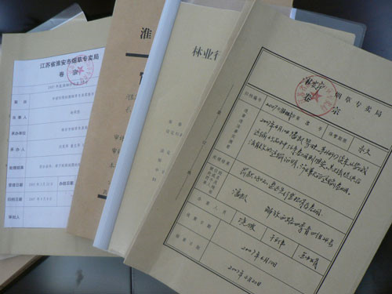

# ＜七星说法＞第二十期：这一切，没有想象的那么糟——人民法院实习记

**本期导读：一说起法院，不知道众位读者心中会浮现出一个什么样的形象？是高大威严的建筑、司法独立的权威？亦或是完全没有公信力的政治附庸、一个又一个缺乏司法正义的判决？本期的说法，将独辟蹊径，带您以一个法学专业生的实习视角，从实习的日常工作中出发，去看看“人民法院”里最为平常的工作状态。让你体会实习中的所思所想。或许在您看完本期的说法后，会发现自己的一些固有观念，变得有那么一些些有失偏颇。**  

# ＜七星说法＞第二十期：

## 这一切，没有想象的那么糟——人民法院实习记

 

### 法院真的有那么黑吗？在当前体制下有些事情法院能管吗？管得住吗？法官们真的都是大家嘴里的那些吃人不吐骨头的贪官吗？我看未必。

毕业季，要工作的同学都忙得不亦乐乎，每天给卧佛烧三柱高香的我百无聊赖，就欣然接受学校安排，开始了朝九晚五的中海市中级人民法院实习之旅（保密需要，地名虚构）。

在中国，法院被冠以人民二字，故称之为人民法院。与美国等三权分立的民主制国家的法院不同，虽然司法权名义上是独立的，但在大的政治图景下法院系统是一个需要向国家最高权力机关人民代表大会负责的职能机关。

这其实是与英国的议会制有些许相像的权力分配体系，但不能忽视的是，在另一套权利体系中，法院还必须通过党委、政法委接受中国共产党的领导，而通常情况下，这种领导与被领导的关系往往能对法院产生更大的影响。

第一天报道冷雨纷纷，拿着学校开具的介绍信，因为之前便已经联系，一行六人跟门口的法警做了些许交流，就径直撑伞去行政楼交接安排逐项事宜。左瞥一眼，是栋18层的现代化办公楼，中海市地处沿海经济发达的地区，财政充盈，自然有了底气盖起气派的楼宇，而在一些内陆不那么发达的省份，情况可能就没那么好，破败的办公楼是常见的，而某些突兀的豪华办公楼则是穷竭了地方和单位的预算。

造成这种现象的根本原因，是施行二十多年的分税制，财政大头被中央拿去，但支出压力大覆盖宽的地方却无钱可用，加上许多地方对司马体系财政支持不足。造成了很多地方地方财政把资金都用到大兴土木搞建设上去，但负责中立公平裁判的法院却不得不依靠所收取诉讼费的返还来支撑的局面。

这种财政状况带来了严重的弊病，“高薪养廉”不用说是无法实现的，通过诉讼费来弥补财政亏空的做法也使法院、法官倾向于多接案子多收费，对标的额大的案子格外重视，而对一些小案子有时候也就得过且过，因为市场的繁荣和收案倾向让案件审理量跟随着GDP的步伐高速增加。形成了一个恶性循环，摆脱不能。

不仅很多公民指责在经济不发达的地方法官私收好处的现象比较严重，而且很多法官也抱怨自己的福利待遇多年来一直处于低水平。这是一个不容忽视的问题，司法的独立有时候并不单单是豪言壮语的几句口号，财政上没有支持，预算中没有保障，我们将很难看到司法独立的那一天。

匆匆走上三楼，政治部的老师接待了我们，这群政治控看起来还很忙，向我们介绍了法院各部门的组成。先从审判系统说起，中海市中级人民法院有两个刑事审判庭、六个民事审判庭，行政庭、少年庭、审监庭、执行庭、立案庭等各一。不得不提到的是，大部分的基层和中级人民法院，都会分社数个民事审判庭。这是因为我国这两年的经济快速发展，各类民事商事案件层出不穷，加上民法类目确实也比较庞杂，所以审判机构看起来远没有英美那么精简。而这些年来比较突出的问题是，非审判人员尾大不掉。很多地方几乎占了法院全员的一半。形成鲜明对比的是，在国外的法院，一个法官可能会聘请十几个助手来帮助他们审判，而不是把这些人编入正式编制。在我国，非审判人员、机构臃肿却仍然持续困扰着大部分法院。而这也在另一方面说明了作为司法制度补充的仲裁制度的滞后，远不能满足不断增长的“审理需求”。

好几个人想去刑事审判庭，因为这个确实比较好玩，可以去看守所去监狱提审犯人（这也算有趣吗？）。而我则想了解一下民间借贷的情况，所以选了金融商事庭，本以为会有很多人抢，可貌似大家对这块都不太感兴趣。

指导我的老师分给我了一台连接法院内网的计算机（法院也有着较高的保密层级，这并不只是国宝的特权），而且每个稍有权限的法官都会得到一个身份认证优盘。这让我欣喜不已，或许可以借机窥探一下法院的信息系统，也算不虚此行。

中海市人民法院的信息系统十分先进，之前想象中制作如同三流“性情”网站的界面并没有出现，取而代之的是相当严密的动态、录入、信访、来访、移送文书、审判、立结案等子系统。这出乎了我的意料，不再是老旧的笔头行事，可以说这是符合时代发展的进步，虽然可能对审判之类并没有太大的影响，但是还是能看到，在旧有的体制下，官员追求政绩的过程可能会带来意想不到的推动作用。

第一天就这么略显无聊但偶有惊喜中度过了，第二天不幸迟到，几个老师在谈论最近法院里的机构变动。原来的执行庭将会升格为法院内部的执行局，有点类似于检察院内部的反贪局。执行庭是法院内部负责执行法院各种判决、决定的机构，提审犯人、临时羁押等配合审判的刑事活动也由其负责，由法官和法警组成。这种法院内部设置执行机构的做法各国不是没有，但就总体效果来说，这种方式并不如完全由包括警察在内的执行机关来完成。

而且由于我国的金融体制，特别是信用体制不完善，导致很多强制执行、查封财产的执行活动因为信息缺乏、当事人“遁走”而难以取得良好的效果，也正是因为义务执行人看到了法院在这方面有机可乘，所以各种“老赖”才会层出不穷。而由此滋生出的腐败，直接导致了法院执行部门成为了官员落马的重灾区。

但我还是在之后的实习中看到了中海市中院的对这个问题的积极探索，其中一项很惹人眼球制度，就是学习香港、英国设立的限制高消费令制度，将很多“老赖”明明白白的写在首页上。而这种积极的努力，也许会成为将来完善信用制度的一部分，甚至说是为个人破产制度打下一个尚且能让人接受的基础。

实习生的身份并不能让我接触太多具体审判的细节，但平时在完成了干杂活的这项基本任务以后，我还是能翻看很多案卷。看过了诸如港台欧美的法庭辩论的很多人也许真的会以为法庭上的审理是整个案件的核心，其实在我国，无论对法官还是律师，庭审实在可以说的上是整个案件中最为轻松地一环。看似信手拈来但实则需要浩繁工作量的搜集证据工作才是决定整个案件走向的关键，与其它诸如书写法律文书、完成审判的程序看起来就像巴塞罗那在进球前的N次倒脚，开庭审理则更像梅西最后的临门一射，一个律师如果不在开庭前做好万全的奠基，那么寄希望于自己的口才在法庭辩论中逆转乾坤简直是痴人说梦。

时间不知不觉过去两周。忽有一天出门休息，不经意间看见法院正门一阵骚动，大概有三十多个人，有老有少携家带口，甚至还有少妇抱着个黄毛小孩儿。呜呜泱泱在跟法院的法警在对峙，并且不时有推搡叫骂，闹访者大声喊着警察打人了，法院打人了种种。

这种场景在中国各地的基层和中级人民法院中并不罕见，甚至一些地方还发展出了上访专业户、闹访专业户。闹访形式虽然不同，但基本上都有着一个共同的特点，那就是要求法院支持自己的诉讼请求，而大多数闹访者却从来不看自己的这些“意愿”到底符不符合法律的规定。

我眼前的这个起闹访甚至有些许“离谱”，犯罪嫌疑人为了“劝酒”开车追逐被害人导致交通事故的发生，致使被害人死亡。在检察院、法院、当事人还在为这是一起故意杀人案、危害公共安全案、还是交通肇事案在法庭上你来我往的时候。被害人的家属已经坐不住了，听完了庭审，还没有任何判决出炉，家属们已经开始要求法院判处犯罪嫌疑人死刑。并且大打出手，把门前的马路堵了一阵，好不热闹。

其实前述的场面只是中国司法公信力缺失的一个缩影，类似的事情每天都可能发生在中国的不同角落。或隐藏在内心深处，或表露在言语动作，很多人已经表达了对中国司法的不信任，这不是对个案的不信任是整体的不信任。

缺失形成的原因很复杂，李庄案、聂树斌案种种自是让人不能忘记，而且在如此语境下，很多道听途说、添油加醋的言论也可以没有任何成本的传播。我们不能认为这些言论完全不实事求是，但从长远来，看这种整个社会的挞伐不仅带来了对司法公信力的伤害，而且还在很大程度上让“民意主导”、“和谐审判”这种有违法治精神的思想得以占据强势，甚至连法学家都会违心的为其张旗造势。

于是，各种闹访、上访之闻不绝于耳。不能否认确实有不少人遭遇了冤案，我们需要正视现实，冤案在当今中国大量的存在，但也有很多情况访者是为了自己利益而向法院“抱怨”，寄希望于法院弥补自己的损失。可是，利益纠葛复杂之当下，不少判决其实是协调诸方利益利益的结果，已殊为不易。完全偏向一边的判决于理于情都不适合。

形成鲜明对比的是，在美国等西方国家那种尊称法官为Your Honour的环境中，民众对法院的判决虽然可以议论，但无不服判。最近例子当属2000年戈尔与小布什上诉到美国最高法院的“争总统案”，戈尔那时发表了一段著名的败选演说，其中一句是这样的

“Let there be no doubt while I strongly disagree with the court's decision, I accept it. I accept the finality of this outcome which will be ratified next Monday in the electoral collage, and tonight, for the sake of our unity as a people and the strength of our democracy. ”。 

大意就是，虽然我强烈反对最高法院的裁定，但为了人民的团结和我们的民主，我接受这最后的结果。

在逐渐熟悉了法庭的组成后，法官也交给我了一些有难度的工作，比如共同进行调解，当然参加合议庭审案子这种事情暂时是无缘染指了，只能寄希望于用良好的表现打动法官让我也当当法官。

实习在继续，我的法律梦在继续，中国法律人的追求公正司法的努力也在继续，这注定不是一条平坦的道路。因为，作为民主社会基石的法治一日不立于人民的心间，我们所一齐期盼的民主梦就一日不会到来。同时，作为一个合格的公民，更应该在猛烈批评这套体系中腐坏的一面时为他的成长做出适当的容忍和不断的建言献策。

 

（编辑：王晓瞳，纳兰辰瀚）

 
