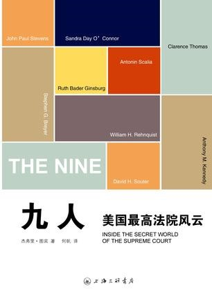

# ＜七星说法＞第五期：均衡的魅力——读《九人》

**在读《九人》之前，我们对美国联邦最高法院的印象或许还停留在“米兰达案”、“罗伊诉韦德案”这样媒体选择性传播造就的自由主义民权运动胜利的片面中，杰弗里·图宾的《九人》向我们展示了自由与保守、党派与大法官立场、民意、司法与政治等矛盾对立的现实的联邦最高法院。本文作者以读后感的形式向我们描述了充满均衡魅力的联邦最高法院，面对我国最高院乃至整个司法体制这个庞然大物，我们不禁要问：何时能过河、怎么过河？这种均衡的魅力能不能指引我们摸到合适石头？**  

#  均衡的魅力——读《九人》

##  文/后玉婷

 

在政治体制上，中国最高法院不可能成为美国联邦最高法院。在法官个人魅力上，那位没有读过法学的天朝第一大法官也不可能成为法律界的英雄。作为政治一部分的中国司法，出路不可能是司法体制本身，中国司法的薄弱以及党的绝对领导不会动摇。正如大家所感觉到的，政改无期，司法改革就不可能有本质上的进展。那么美国最高法院的风云变幻于我们又有何启示？

读罢全书，第一感觉是均衡司法的魅力。

司法克制主义要求严格遵循先例，奉行立法、行政、司法三权分立原则，法院不是制定政策的机构，公共问题应由民选官决定，只有发生明显违宪的情况下，法院才能宣告行政部门的行为无效。而司法能动主义，则认为法院应起到实质性政策导向作用，只要认为确有必要，即可推翻先例，宣告某项立法或政府行为无效（此处司法能动主义绝不同于天朝如今如火如荼的司法行政化的“能动主义”）。由于大法官们要么属于保守派，如伦奎斯特、托马斯、斯卡利亚；要么属于自由派，如斯蒂文斯、布雷耶、苏特、金斯伯格，最终起到决定性作用的恰恰是那些犹疑不定的中间温和派，这样奥康纳、肯尼迪的摇摆票在所有重大案件中都成为决定性的选择，从而使判决达致均衡。如最高法院允许了堕胎权，但是增加了诸多限制；容许了大学的种族平权政策，但必须限定于特殊情形；法院容许了公共场所的宗教言论，但是必须属于言论自由的范围。奥康纳法官似乎可以听到了美国大众的心声，并将判决结果控制在大多数人的期待之中，实现了司法适度主义和中间立场。恰如黄宗智所言，美国法律现代性的精髓并不在于这些多种传统之中的任何一种理论，既非完全的保守主义或自由主义，也非纯正的经验主义或形式主义，而在于其在一个相对宽容的政治社会制度中，各家各派通过各种不同利益群体的代表而多元并存，相互影响、相互渗透，拉锯和争斗。

杰出的法学家从本质上来讲应当首先是法理学家。他们讲求的是法理而非法律，他们看中的是说服而非镇压。美国最高法院的法官，尤其是中间温和派的大法官可是说是这种均衡法理人的代表。他们是法理话语的生产者、修补者，拥有知识制造、道德裁判的权能。但是，在当年轰动一时的布什诉戈尔一案中，“无论大法官们内心是何初衷，意识形态、党派偏见还是战胜了法律与理智，他们蛮横地阻止了佛罗里达州重新计票的工作”，尤其由于奥康纳迫切需要一位共和党人指定她的接替者，而亲自将布什送入白宫。

选出什么样的总统，将会选出怎样的法官。法官在离任之前必定会考虑是共和党还是民主党将成为下一任总统，《九人》毫无顾忌地展示了党派之于大法官的重大影响。译者何帆解释道：“美国最高法院之所以具有浓重的政治色彩，与它在宪政架构中的地位，及其自身功能息息相关，它处理的案件，多数涉及宪法问题，联邦最高法院可以通过解释、适用宪法，审查乃至推翻国会及各州法律。而宪法问题，从来就是政治领域的核心议题。”

有人认为从这一点来看，美国司法不过也是政治的附庸，恰恰相反，我觉得这是美国政体均衡的体现。美国宪政制度即一种利益平衡的常规机制，所有的宪政理论在一定程度上都可以归纳为一种平衡哲学。宪法作为最高权威，是立法权、行政权和司法权的最高权威。若政体结构没有以宪政为核心和法治的价值关切，司法权的结构位置永远不能在行政权无限扩张的今天得以牢固确立。司法场域不能体制性确定，司法权的运行就永远只能是零散的、应景的、而不可能达到系统、均衡的境界。

民权问题一直是最高法院的重要议题，美国宪政史的实质是司法夺权的过程，司法权本作为第二性权力，凭什么对人民制定的法律说“不”？对法律的合宪性审查的根据在哪？奥康纳在印度旁听一个案件时意外发现，双方律师均引用了美国最高法院的先例。回国后，她在一次演讲中感慨：“每当生命和自由面临危险，人们都会对美国最高法院的里程碑式判决进行认真研究，无论这些人身处于新德里还是华盛顿。”

从功能论的视角来看，即司法的本质,最有影响力的应是“裁判说”(判断说)，司法的功能被简单划分为附属于立法的机械的操守法律规范的手段，而法官的职责是根据三段论将事实与相应的规范相衔接，作出是非判断。Judge，原初就是判断的意思。但是，justice既是大法官，同时又有正义之内蕴，因此人们也将司法的过程视为正义实现的过程。正义,毋庸置疑是从价值论的角度概括司法的本质。相对于当前国内对司法的狭义认识，我觉得司法应该“能动”，但这种能动应该是在维护法律基础上，以“均衡”权力，而非运动式和法律之外的政策性司法。

当今中国的困境在于政治过于强盛，政客的权谋和政策主宰，以至于学术精英趋奉于政治畸形发展，群众只能通过激烈的抗争或非正常渠道表达诉求，这就是非均衡的状态。法官或是一个受过专业法学训练的人几乎都有保守的倾向，因为他们对规则正义有着天然的崇拜，这种冷静的思考可以有力阻止行政权的好大喜功以及民主的爆发式激情，从而使社会处于真正的谐和状态。司法权作为制衡之权的角色要求它必须扩张自己的权能，捍卫法的权威。

政治家是人民之一的代表，法官同样是人民之代表。倘若政治家立法意志与人民意志相违反，法官所行使的司法权力显然不能屈从于政治家操控的统治权力，否则，法官就因违逆第一性司法权而丧失司法主体资格。

因此行政权、立法权和司法权都应均衡于宪法，而司法权应作为制衡政制之权，防止可能发生的多数人的暴政和行政的官僚化。政体均衡之内涵，在于立法、行政、司法等主体力量的博弈，最后的结果即均衡点便构成了政体的路径依赖和制度模型，继而启动了政制意义的司法权。

民意与司法，政治与司法，本不是非此即彼，绝然对立的关系，关键是法官在关涉基本权利的判决中，能否均衡意识形态。在一种均衡政体的情况下，司法本该是缓慢而又顽固的力量，但是我们这片土地，能否号召法律人勇敢地挑战这个并不均衡的政体？当前大部分法官可能对法律怀有信念，但他没有能力抵抗来自行政的干预，因为他的一切身份乃至待遇福利都是这个行政系统和政权结构中的一环，他是这个官僚体系中的一颗螺丝钉，其次才是一个法律工作者。然而，不可忽略的是由于法律规定的模糊以及社会关系日趋复杂，使得最高院不断以司法解释的方式实质上在“造法”，有关法律的公共事件越来越多地得到关注和讨论。借用本书的最后一句话：“对我们的最高法院，我们无需寄予太多的期望，也不能完全不抱有希望。”

 非常欢迎建议和投稿。请[@瓢虫君](http://www.renren.com/profile.do?id=362359989&from=opensearch)。

（本期编辑：张蒙）

 
