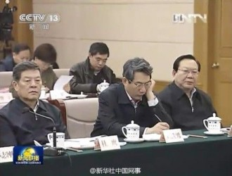
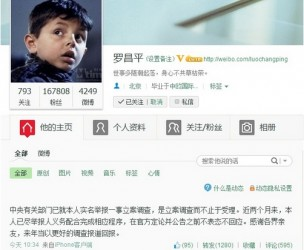

# ＜七星说法＞第八十一期：腐蚀的铁

国家发改委副主任、党组成员刘铁男被《财经》杂志副主编罗昌平实名举报。举报时间长达五个多月，举报的内容包括：官商勾结，假造学历，包养情妇，巨额骗款等。媒体消息几经波折，角力方几经较量，中组部终于在5月14日公布刘铁男涉嫌严重违纪，中央决定免去其领导职务。如今一觉方未醒，多少兵马入梦来，关于民告官，关于反腐二三事，关于刘铁男之案的后续，皆是不得不说的隐事。

一、告法

现在所谓民告官，当然不是影视作品里民女喊冤拦了青天大老爷的驾。依据所举报内容的不同，共可分为四种。

第一：司法机关举报，检察院立案侦查

此类案件一般是被举报人涉嫌贪污贿赂等重罪，是以滥用公权力和职权为代表。国家工作人员的渎职犯罪，国家机关工作人员利用职权的非法拘禁、刑讯逼供，报复陷害，非法搜查，侵犯民主权利等犯罪，都可以由举报人向当地司法机关举报，之后将由具有管辖权限的人民检察院立案后侦查。

第二：信访

此类案件大多与举报人自身有关。表现为举报人不服行政机关或组织的不公正对待，不服政府部门或村委会居委会的职务行为。这时举报人可以选择向被举报人所在单位同一级别的行政机关，或者上一级的行政机关，进行信访。

至于表达方式上，书信、电子邮件等书面形式即可。但是在其他细节上会略作要求，需要按照政府部门所公布的信访方式，有时候在时间上有限定，比如特定的接待日。当然，举报人也可以用口头的方式提出投诉申请，但是采取信访需要注意的是，举报必须实名，且住址、请求、事实、理由都需清楚陈述。

这无形中就为信访者带来了危险。[（《七星说法：信访有多难？》）](/archives/24973)

在日常的媒体报道中，我们常常看到“上访”这样一种说法。实际上上访就是信访的一个变种，它是指举报人通过走访特定机关和特定部门所进行的一种信访。一般来说这种信访方式最为直观也最为有效，但其背后隐藏的隐患也是颇大的。仅观每年上访截访如楚河汉界两军对阵，就知其中形势之严峻。

第三：向中纪委举报

如果说举报的内容是针对党组织、党员和监察对象违反党纪政纪问题的，或者是对党风廉政建设或相关工作批评建议的，就可以直接向中纪委举报。

关于刘铁男一案，罗昌平就是实名向中纪委进行举报。中纪委设立了网上举报平台，只要提交自己的举报信息，就可以完成举报。在提交信息时候，可以选择实名举报或者匿名举报。实名举报会被优先处理，但是与此同时带来的举报人人身安全问题却依然是无法得到保证的。

第四：特定机关举报和申请复议

前者的特定机关举报一般是因为所要处理的事项具有专业性，所以需要特定管理机构进行。比如土地资源可向国土局反映，劳动纠纷可向人社部门反映。

后者的申请复议，则是指公民、法人或者其他组织认为行政主体的具体行政行为违法或不当侵犯其合法权益，依法向主管行政机关提出复查该具体行政行为的申请，行政复议机关依照法定程序对被申请的具体行政行为进行合法性、适当性审查，并作出行政复议决定。但是此类已经与举报类性质偏移，在此不再赘述。

 

二：做法

罗昌平实名举报了刘铁男，除去中纪委方向的工作，他还在微博上进行了曝光，这就是人们通常所说的网络反腐。利用新兴社交工具，对于被举报人的腐败信息进行揭露，引起媒体和人们的关注，通过舆论升温最终达到反腐的目的。媒体将罗昌平成功之事大肆报道，一时间定会及其跟风者无数。然而在此，我却要泼些凉水，抛些冰块儿，套用一句成功学的话说：罗昌平的成功无法复制。

首先罗昌平的身份特殊，他历任《中国商报》首席记者，《新京报》深度报道部主编。现为《财经》杂志副主编。与升斗小民相比，他算的上是媒体界的知名人士，在学界也有较广人脉。而普通举报者与被举报人身份地位悬殊，虽握有罪证，但毫无影响力，举报之后也不会因此而遭人忌惮背景。比如南京“公开举报身份第一人”的兰贵，他举报后就不得不被迫“辞职”，之后就是不停的找工作和被解雇，还经常遭受不知名人士的殴打。没有一块金字招牌做后盾，被举报人做什么手脚还未可知。

其次罗昌平所举报者身份特殊。一个很有趣的规律是：越是举报高官，自己越是安全，越是举报小官，自己越是危险。这也与地方上的法制建设有关。身居高位，难免还要考虑手脚干净，也要掂量自己行为的妥当，不到万不得已不会做出什么自污手脚的行为。然而在地方上小官往往一手遮天，黑白颠倒生死一念都是易事。譬如徐州新沂一对夫妇实名举报村干部反遭灭口。犯罪嫌疑人刘某（村党支部书记）因与被害人石某平时存在矛盾，石某举报刘某违法行为，导致矛盾激化，刘某等人经过预谋，雇凶孙某于4月14日窜至被害人家中，将石某夫妇杀害。朝廷大员做事顾全大局，小小石壕吏可就穷凶极恶喽。

最后罗昌平的成功，是集体发酵的产物。罗昌平掌握的腐败资料证据确凿，且有相关人员的口述（情妇），有人戏称中纪委应该从此改为中情局（中央情妇反腐局），虽带有笑谈性质，却也道出反腐的无奈。上头不动真格的，只有靠着真正了解实情的人出手。媒体学者共同关注，罗昌平充分利用了自己的影响力，吸引了大批媒体跟随报道，一定程度上推动了反腐的进程。

因此，对于举报人而言，罗昌平的成功是不可复制的。我也不推荐举报人实名举报。我国目前没有具体且专门的举报人保护法律，因此在进行举报的时候尤其要注意方式。

秘密进行，保守秘密，不要扩大知情面。这才是目前严峻形势下的举报之道。

 

三、说法

几经波折磨难事，水落石出在何时？虽然刘铁男案已经进入了立案调查的阶段，但是关于刘铁男的争论尚未结束，我在此也就坊间传闻略作一二回应。

刘铁男案公布后，不少贴吧都有人发表意见称刘铁男为相关的经济建设做出了重要的贡献，因此不看僧面看佛面嘛，对于刘铁男同志应该宽大处理。这倒是让我觉得颇为好笑，如果说这批人不是别有用心捣乱反腐过程的幕后者，那么就应该称之为脑子里进了水的糊涂蛋。

贪腐一事与贡献多少有关？

杀人一千与活命一千可以相抵？

无论刘铁男自己曾经做了多大的贡献，只要他触犯了法律，就要承担法律的责任。

除此之外，刘铁男案也经历了不断辟谣的过程。罗昌平公开举报，接着能源局辟谣，罗昌平再举报，能源局说造谣要起诉，罗昌平坚持举报，能源局改口说可以调查，但是期间刘铁男同志还出现在了每晚七点的全人类鸿篇巨制《新闻联播》里。直到今年的五月份，终于能源局才松了口，说事情会给出一个结果。

一个反腐案，何以拖沓这么久？罗昌平提供的人证物证俱在，就算核实也不该核实这么久，何以如此？

我不禁想到了唐朝武则天时期的一段故事。武则天上台后，大力提拔酷吏，之后为了朝野上的势力制衡，她又暗中指使御史台与刑部之间互相攻讦。期间御史台的官员贪腐豪奢之事，她都有耳闻，朝野上下都有议论，她仍然按兵不动。直到她觉得时机成熟，又恰逢某老农痛诉御史台官员吞了他家的田地，武则天这才暗令刑部动手拿人。老农喜极而泣，大呼皇上圣明，终于解了自家的冤屈。

然而这事儿和老农的冤屈有关吗？

想拿人的是皇上。

总有人还以为现在是皇权时代，是不是某人权衡自身利弊，无视规则和法律，终于拖到了自认为合适的时机才动手？

这事儿和罗昌平举报有关吗？

想拿人的是……

口出如此狂言，我一定是醉了。

 

（编辑：戴正阳；责编：王卜玄、胡逸娴）

P.S.加入“七星说法读者群”，我们一起说法！群号：262980026。
