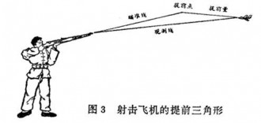

# ＜七星说法＞第八十七期：打飞机是“卖淫”吗？

**案件回顾：**

2011年7月，佛山南海警方在一家理发店查获多名男子涉嫌卖淫嫖娼。 该店雇请多名按摩女为客人提供按摩服务，约定按摩期间如客人需要，可以提供“打飞机”等色情按摩服务。 随后，警方以涉嫌组织卖淫对店老板李某及两名管理人员刑事拘留，案件侦结完毕移送检方后，检察院提起公诉，李某等三人被一审法院以组织卖淫罪判处有期徒刑5年不等。

但是，一审判决后李某提出上诉，**新的代理律师提出起诉书指控的行为不构成犯罪**。 检方经过两次补充侦查，2012年**以“不应当追究被告人刑事责任”为由撤诉**，三被告人无罪释放。 佛山中院组成合议庭审查认定，一审判决认定事实不清，适用法律不当，发回重审，并对争议焦点作出答复，**最终认定涉案场所提供“打飞机”“洗飞机”“推波飞机”三种手淫服务，不属于卖淫行为。**

司法争议： 

与这个案件的判例随之而来却截然相反的是来自北京警方的消息：北京警方依据公安部相关规定，表示“像打飞机、胸推等均属色情服务，**在北京警方多年的实际执法中，均认定为卖淫嫖娼。**

那么为什么会出现不同地区对于同一个行为是否构成犯罪有着不同的标准呢？ 其实是两部法律对于一个违法行为的规定不统一的原因。 **一个是《刑法》里面的介绍容留卖淫罪，一个是《治安管理处罚法》的卖淫嫖娼行为。**

刑法第三百五十九条的规定是，“引诱、容留、介绍卖淫罪是**指以金钱、物质或者其他利益为手段，诱使他人卖淫，或者为他人卖淫提供场所，或者为卖淫的人与嫖客牵线搭桥的行为。**” 对于具体什么样的行为才算卖淫，并没有给出准确具体的解释。

虽然对于卖淫没有明确的解释，但是却可以从对于同样是性行为认定标准的强奸罪中推演出刑法对于性行为标准的认定。 中国学界对强奸既遂有三种观点：插入说，接触说和暴露说，但是司法解释和司法实践中基本采取插入说，那么按照这样一个标准，**就是是说刑法对于性行为的认定就是插入说**，作为同一部刑法中的罪名，如果没有额外的新的司法解释，那么对于行为的认定应该是相同的。 也就是对于介绍容留卖淫案件中的性行为也应该采取插入说，那么显然“打飞机”“胸推”这样的非插入性行为自然就不被认为是法律意义上的性行为，也就不在刑法涉及范围内了。

而《治安管理处罚法》和刑法相比就不严谨，也宽泛得多，发生争议都是朝着有利于执法的方向去解释，警察的自由裁量权太大。 2001年公安部的批复“**卖淫嫖娼是指不特定的异性之间或者同性之间以金钱、财物为媒介发生性关系（不包括推油等按摩服务，包括口淫、手淫、鸡奸等）的行为。”** 可以看出，公安的处罚的范围比刑法处罚的范围要宽的多。

根据治安管理处罚条例，严厉禁止卖淫、嫖宿暗娼以及介绍或者容留卖淫、嫖宿暗娼，违者处十五日以下拘留、警告、责令具结悔过或者依照规定实行劳动教养，可以并处5000元以下罚款。

那么这两种解释的方式究竟哪一种更合理呢？ 事实上**笔者认为整体上都很合理，也就是在较为严厉的刑法层面上将解释的范围缩小一点，减少获罪的人；反之在较为宽松的行政法层面上则可以将解释的范围扩大一点。**

不过这是理想的看待，事实上并非如此，因为治安管理处罚法的运用非常随意，常常依靠执法机关人员的主观判断，也成为了一些黑警察创收的工具，缺乏足够的监督。 所以在这个层面上讲，应该尽可能把范围缩小或列举式而避免肆意的扩大解释。

刑法的处罚范围： 

同样的一种行为该不该被引入刑法不仅仅是一个解读法条的问题，也是一个立法价值观的问题，我们今天大多都可以理解一些刑法的常识，比如不能轻易进行扩大解释，这是由于刑法本身的审慎性导致的，而近年来全世界的刑罚趋势也是对于无被害人犯罪尽量免罪和轻罪，或者减少处罚。

在量刑定罪时用最有利于被告的狭义来解释刑法条文这是辩护律师常常用到的技巧，而法官认可这一技巧也是出于对法律严谨性的保护，即法无明文规定不为罪，法无明文规定不处罚，只要是法律没有明文规定禁止的即允许，并且为了防止罪名的范围扩大化尽量减少对于罪名界限的扩大解释。

而这样的好处是，将法律限定在解决社会问题的最低限度，法官不该是侠客，不该利用法律肆意扩大化来实现正义，相反法官最看重的应该是公平，将问题的解决局限于法律界限内。

佛山与司法独立： 

这种争议表现在了广东并不是一件让人吃惊的事情，作为在广东地区读过法学专业的作者来说，看到了广东地区的司法独立和法制建设进度一直是走在国家整体的前沿的，而同样引人注目的是，广东的色情业发展也是全国有名的。 而这两者结合起来的结果就是，司法过程中特别是涉及色情业的司法过程中法官会多多少少考虑到社会层面的影响，这一点在权力意识比较浓郁的北方是比较少见的。

换言之，**在司法不独立的情况下，法官就是官僚，只需要向上级负责就可以了，那么严格按照法律条文断案根本不需要考虑社会影响以及整个司法进步进程，这对法官来说是保险的。 而在司法进步的地区，法官不仅仅是官僚而是真正意义上的社会权衡者，必须考虑到司法对于社会的影响以及社会具体情况对司法的作用。 司法独立并不是让法官闭起门来自己说的算不需要听任何意见，而是让法官独立决策但需要多角度判断。**

虽然这一个案件还不会涉及整体色情业是不是非罪，或者也许这个判例不久之后就会被否定，但这至少开了一个好头。 至少我们可以看到**有法官考虑到了社会层面的整体压力，试图利用法律手段缓解社会压力，也看到了司法界也有人真的试图将人性化带入司法中，以独立的立场去权衡司法。**

结尾的思考： 

不得不说与性有关的法律问题往往比较吸引眼球，这背后可能涉及诸多问题，比如法律与道德的博弈，民众认为“淫秽”的行为是否必然用法律去约束，刑事案件与治安案件的界限等等，但我最后却想用一个比较不那么法律的角度去想一个问题，那就是我们普法普及了很多年，对民众来说究竟学到了什么？是让大家知道了一些法条，还是学到了法律的思维方式？是不是有很多人一看到自己觉得不好的事情就马上想到“太坏了，让警察抓起来坐牢”这样的事情呢......

（编辑：马特；责编：胡逸娴、王卜玄）

P.S.加入“七星说法读者群”，我们一起说法！群号：262980026。
