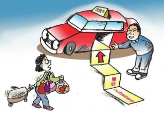
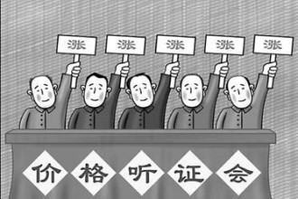

# ＜七星说法＞第八十三期：听证会怎么变成了“涨价会”？

市民甲：你听说了没，出租车价格又要涨了！

市民乙：毛线！今天才听证嘛。

市民甲：你看你笨的，听证就是要涨价嘛。

5月23日，北京市举行了出租汽车租价调整和完善燃油附加费动态调整机制听证会。听证会上，25位听证参加人中有23位同意调整出租车租价和燃油附加费动态机制，**至此，据我国政府工作的常态，北京市出租车涨价基本已成定局。**

听证会过后，所有人都在感叹听证会再次变成了“涨价会”，这似乎成了一种惯例。此前，北京发改委官员曾向媒体表示，“逢听必涨”是对听证会制度本身的不了解，事实上是“逢涨必听”而不是“逢听必涨”。官员这番话采用迂回战术，瞬间将政府面对的舆论苛责变成了宣扬政府依法行政，为民服务的绝好蓝本。但笔者不否认的是，我们确实不应该因为大多数听证会确实造成了涨价的事实，而认为价格听证的意义就等同于涨价。

### 听证只是程序，与涨价的结果并无关联

**我国目前设立的听证制度主要有行政程序中的听证制度，立法程序中的听证制度和本文中所讨论的价格听证制度。**价格听证是根据《价格法》23条制定的，其规定了“**制定关系群众切身利益的公用事业价格、公益性服务价格，自然垄断经营的商品价格等政府指导价、政府定价时，应当建立听证会制度，由政府价格主管部门主持，征求消费者、经营者和有关方面的意见，论证其必要性、可行性”。**根据以上的法律规定，我们可以大致描绘出我国价格听证的几个特点：

**（1）是征求意见的表达会，不是表决会**

有些政府官员过分的抬高了听证会的地位，但听证会实际上只是收集民意表达民意，对价格调控方案进行论证的一个座谈会，听**证会的结果并不会直接决定最后实行的价格。**最终的价格调控方案还需要政府相关部门的进一步研究和磋商。所以，政府官员和出租车企业都没有必要太过激动，听证会只是对民意的一个收集整理的过程，对价格调控方案进行论证审议的过程，参加听证的人并不会直接威胁到你们的利益，能威胁到你们利益的只有自己不能暴露在阳光下的秘密。

**（2）政府是主持人，应该居中主持**

在听证会中，政府作为主持人理应是居中主持和参与的。**面对企业经营者追求利益最大化的本性和消费者拒绝涨价的普遍心态，政府要做的工作就是充分听取各方的意见，衡平各方利益，不偏不倚，酝酿出双方都能接受的方案。**作为居中方，政府本身应该是没有多大压力的，毕竟不是制定为自己谋利的政策。但是我们却发现在以往的听证会中，政府都活蹦乱跳地让人诧异，紧张地让人诧异，这样的表现如果不是因为政府对听证会的误读，就只能让人想到政府听证主持人和申请人根本就是拴在一根绳上的蚂蚱。

**（3）要论证和审议，不只是投个票**

从法条上理解，听证会有两个目的，一是征求各方意见，二是对调价方案进行论证。但是现在大部分人包括政府官员在内都把关注的焦点只放在了最后有多少人同意价格方案上。其实对于政府决策来说，各方意见的结果固然重要，但在论证过程中代表们的建议也是很重要的一个部分。所以，关心代表们的结果不如去关心他们提出了什么很有建树的意见，对企业提出的方案进行了怎样的质疑。投票结果只能看出大多数代表同意涨价的观点，论证过程却可以看到这些代表的理性之思。运行良好的听证会制度应是锻炼公民有序理性参与政府公共决策的一个平台。

正如司法程序并不一定会带来最公平正义的结果，价格听证也无法保证经过听证的价格调控措施就一定最合理，**但程序的意义就在于让有权者和有钱者做涉及到公共利益的事情时不会那么随心所欲，在于让普罗大众都可以享有权利对企业的漫天涨价说出自己的观点和意见。这样的程序给了我们作为公民应得到的尊重，也让政府的决策闪耀着公民自治和决策的光泽。**

### “涨价会”的背后

听证会虽然对最后的价格调控方案并无直接的影响，但是如果听证会频频变成了“涨价会”，那我们就应该去反思这个制度和制度的执行过程中是否出现了问题。只有涨价没有降价的价格听证必然是不合理的。听证会变成“涨价会”的背后是什么？

**（1）为什么消费者不能申请价格听证？**

2008年《政府价格决策听证办法》颁布之前的旧暂行办法中，规定“消费者或者社会团体认为需要制定本办法第三条规定范围内价格的，可以委托消费者组织向政府价格主管部门提出申请”，即当时的立法是允许消费者或社会团体提出价格听证申请的，但是到了2008年12月新的听证办法出来之后，我们却在条文中再也找不到这个规定了。对于这样的立法改变，我们觉得不可理解，既然价格听证就是为了衡平各方利益，那么为什么提出价格听证的主体只有政府定价机关呢？如果是为了实现立法的原意，对关系群众切身利益的公用事业价格、公益性服务价格和自然垄断经营的商品价格要进行慎重决策，**那么都与消费者切身利益相关了，为何又不让这样的主体去申请价格听证维护他们的切身利益呢？**如果允许消费者去申请价格听证，消费者和有关社会团体也确实去申请了话，我估计我们就不会只看到听证会后就涨价的怪现象了。

**（2）听证会代表能否反映真实的群众意见？**

我们注意到，本次北京市出租车价格听证的代表由以下人员组成：消费者、人大代表、政协委员、驾驶员、社会组织、政府部门以及经营企业。这样的代表组成基本符合了《政府价格决策听证办法》对于参加人构成的要求。**但是，我们还需要深究的问题是：第一，听证代表是如何产生的，政府听证代表数据库中的人员组成是否合理？第二，这些听证代表是否与听证内容相关，能反映到真实的相关情况？**

我国大部分省区的听证代表都是由以下方式产生的：一消费者和经营者代表通过自愿报名和随机选取，或者政府推荐的方式成为听证代表，专家学者、社会团体、政府部门则由政府进行聘请；二从听证参加人员数据库中进行随机抽取或者有针对性的遴选。政府的听证代表数据库中有哪些人，分别来自哪个行业，是怎么进入数据库的，这些问题笔者都无法回答，只能留到政府信息更加公开之日由各位再去查看。

**我们现在的分析只能从本次听证会代表的情况开始， 我们对听证代表的构成可以做如下简单的统计：消费者十人，官方组织十人。**为何将政府部门、社会组织、人大政协的代表都归为一个利益团体呢？在人们的脑袋里，这些代表其实也是一类的，要不是公务员要不就是“参公人员”，他们不论分布在哪个组织内，但基于利益决定的规则，我们都是很难相信这些代表会真的秉公发表意见，起码是要配合一下，当然但愿我们的分析是恶意揣测。然后，二十五名代表中除去这十名消费者代表和十名官方代表，这剩下了五个可怜的代表席位留给了驾驶员和出租车公司。如果不明真相的群众看着这样的听证代表名单，极有可能搞不清楚状况，到底是在搞什么听证？**为什么关于出租车运营价格的听证会却成了消费者 **

代表和官方代表唱主角，这不应该主要涉及的是消费者和出租车运营方的利益吗？当然笔者也可以理解政府这样行为的原因，毕竟我国行政领域内管理色彩要比服务的色彩浓重，政府总是像个辛劳的父母一样，要亲自过问自己“孩子”所有的事情，他太不放心了。

面对十名官方代表，十名消费者代表是否能代表和维护我们的利益呢？我们没有办法对这十名代表每人的工作职位等进行调查，只能就官方公布的信息进行简单的统计。十名消费者代表行业分布是：餐饮、零售业4人，媒体广告业4人，社区居委会1人，通讯行业1人。我们不知道官方这样安排的原因是什么，我们有一个疑问，北京市居民百分之八十都集中在了餐饮零售、媒体广告业？如果事实不是这样的话，那么，一小撮行业的代表如何能充分代表北京市大多数居民的意见呢？

郭建华
女
北京肯德基有限公司（已退休）
消费者

贾军亚
男
北京金润汇商贸有限公司

陈鹏
男
石景山杨庄北区居委会

李桂林
男
北京田目仁和广告有限公司

吴婷
女
腾讯科技（北京）有限公司

牛志远
男
中国电信北京分公司

王家喜
男
北京丰田彩色扩印服务有限公司

黄文改
女
隆福大厦（已退休）

张瑾
女
购物导报报社

彭凤芹
女
华天餐饮公司

纪海英
女
北京国道通公路设计研究院
市政协委员

郑实
男
北京市建筑设计研究院有限公司

关平
男
北京大学石油与天然气研究中心

马莉莉
女
解放军66407部队二处
市人大代表

宋慰祖
男
民盟北京市委

杜立群
男
北京市规划设计研究院

王建生
男
北京北方出租汽车有限责任公司
驾驶员

李文岩
女
北京祥龙出租客运有限公司

刘韶山
男
北京北汽九龙出租汽车股份有限公司

王丽梅
女
中国道路运输协会
社会组织

张伟
男
市交通委运输局
政府部门

范忠伟
男
北京市财政局

柏澜
男
市人力社保局

王学强
男
北京新月联合汽车有限公司
经营企业

梁海晨
男
北京首汽(集团)股份有限公司

（上图为北京市出租汽车租价调整和完善燃油附加费动态调整机制听证会听证代表名单）

**（3）为什么不聘请专业的调查和审计机构？**

在媒体给出的听证会现场实录中，政府价格部门确实对于北京市出租车行业进行了一个简短的现状分析，但是这些数据和分析是从何而来，如果是出租车企业提供的，那么如何保证这里面不会加了太多企业的主观因素二导致数据并不真实，如果是政府提供的，那么如何保证这样的分析和调查是专业合理的？**既然政府可以聘请专家和学者充当听证代表，为什么就不能去聘请专业的审计机构进行独立的第三方审计？ **

****这样的成本我认为公民都是可以接受的，即使多花了钱我们也愿意得到一个更加科学公正的现状调查。

### 结语：

**价格听证是培养公民自治和公共参与的一个绝好训练场，政府既然已经迈出了价格听证的第一步，就应该将其不断完善，将社会的权利重归社会。这本是企业和消费者之间的利益博弈，政府只需做居间的组织工作便可，至于结果就应该让双方自己去掌舵。**

市民甲：又涨价咯，屌丝只能坐地铁喽。

市民乙：不是还没公布涨价吗？

市民甲：你又笨了，你看听证会都开完了。

（编辑：何盼盼；责编：陈澜鑫、伍永兴） P.S.加入“七星说法读者群”，我们一起说法！群号：262980026。
