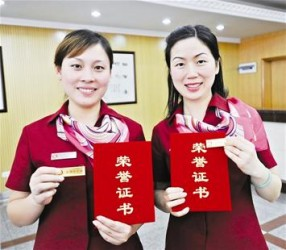
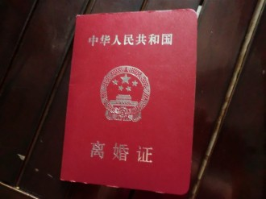

# ＜七星说法＞第八十二期：“拯救婚姻”的婚登员

一、离婚和办理离婚

离婚本身是一件很痛苦的事情，能够乐呵到《非诚勿扰2》里举办放鸽子仪式的情景毕竟还是少数。本应白头偕老的恩爱夫妻最终劳燕分飞，这其中多少辛酸不能与外人言说，所以办理离婚更应该是一个快速合理有效的过程。

这样的过程越迅速，对于离婚双方来说也就越幸福。

不是离婚幸福，而是离婚程序越便捷越幸福。

在此我先把离婚需要的条件和手续列举如下，列位看官就知道这事儿是有多么繁琐了。

离婚登记的条件：

(一)、要求离婚的夫妻双方共同到具有管辖权的婚姻登记处提出申请;

(二)、双方均具有完全民事行为能力;

(三)、当事人持有离婚协议书，协议书中载明双方自愿离婚的意思表示以及对子女抚养、财产及债务处理等事项协商一致的意见;

(四)、当事人持有内地婚姻登记机关或者中国驻外使(领)馆颁发的结婚证;

(五)、当事人各提交2张2寸单人近期半身免冠照片;

(六)、当事人持《婚姻登记工作暂行规范》第二十三条至第二十八条规定的身份证件。

离婚登记的程序：

离婚登记按照初审、受理、审查、登记(发证)的程序办理：

(一)、当事人提交证件和证明材料;

(二)、婚姻登记员查验相应证件和证明材料;

(三)、婚姻登记员向当事人讲明婚姻法关于登记离婚的条件;

(四)、婚姻登记员询问当事人的离婚意愿以及对离婚协议内容的意愿;

(五)、双方自愿离婚且对子女抚养、财产及债务处理等事项协商一致的，双方填写《申请离婚登记声明书》，并在监誓人面前签名;

(六)、夫妻双方亲自在离婚协议上签名;婚姻登记员作监誓人。协议书夫妻双方各一份，婚姻登记处存档一份;

(七)、婚姻登记员对当事人提交的证件、申请离婚登记声明书、离婚协议书进行审查，符合离婚条件的，填写《离婚登记审查处理表》和离婚证;

(八)、颁发离婚证。颁发离婚证应当在当事人双方均在场时按照下列步骤进行：1、向当事人双方核实姓名、出生日期、离婚意愿;2、告知当事人双方领取离婚证后的法律关系以及离婚后与子女的关系、应尽的义务;3、见证当事人本人亲自在《离婚登记审查处理表》“当事人领证签名或按指纹”一栏中签名;当事人不会书写姓名的，应当按指纹。4、在当事人的结婚证上加盖条型印章，其中注明“双方离婚，证件失效。××婚姻登记处”。注销后的结婚证退还当事人。5、将离婚证分别颁发给离婚当事人双方，向双方宣布：取得离婚证，解除夫妻关系。

这一长溜看下来，想必列位看官早就眼晕了。再想想本就心情不好的离婚双方好不容易整理好这么一大堆的材料，搞定了一系列的程序，终于来到了婚登员的面前，就等着代表神圣法律的小章一盖，两位各回各家各找各妈拜拜了您嘞。谁曾想，这婚登员脱口而出一句打印机坏了，这离婚的二位怕是连自杀的心都有了。至于原因嘛，无非是婚登员觉得这二位面相符合龙凤呈祥早生贵子的富贵样子，人家大妈于心不忍啊！

这婚登员有盖章离婚的权利，可是核查人家夫妻双方感情破裂没有，真破假破？这事儿到底谁说了算呢？

二、婚登员的义务和责任

说到婚登员的义务和责任，其实也没有多少，就以下简单的几条就可以概括了。

（一）、婚姻登记员应当熟练掌握婚姻登记有关的法律、法规，热情服务，方便群众；

（二）、依法办理婚姻登记、补发婚姻证，认真审查当事人是否具备结婚、离婚、补发婚姻证的条件；

（三）、根据当事人申请出具婚姻登记记录证明；

（四）、依法撤销受胁迫的婚姻；

（五）、负责对当事人有关婚姻状况声明的监誓；

（六）、签发婚姻证；

（七）、宣传婚姻法律法规，倡导文明婚俗；

（八）、严格执法，忠于职守，不徇私舞弊。

就这么八条，能够说道的也就是第二条和第五条。第二条里提到了要认真审查当事人是否具备离婚的条件。按照上文所述的离婚条件和程序来说，是不需要在感情破裂方面实质审查的。可能需要多嘴问一句婚姻破裂没有，也仅是基于第五条的“负责对当事人有关婚姻状况声明的监誓”。

如果婚登员问过之后，夫妻双方都说确实已经破裂了，婚登员就没有权利以自己的主观判断进行决定，这不是相关法律赋予她的义务，更不是她应该尽到的职责。办理离婚登记的当事人，不能受理的也只有三条情况。第一个是未达成离婚协议，第二个是属于无民事行为能力人或者限制民事行为能力人。第三个是婚姻登记不在中国内地办理的。

这里面也没有哪一点是说婚登员大妈认为你俩感情实际上没破裂，所以不给办理离婚登记的啊？

“大妈，我们俩感情已经破裂了。”

“我觉得你俩还能再凑合一段时间，要不你俩再想想？”

“大妈，我们俩这确实不合适！”

“哎呦，我看你俩真还挺配对的！离婚可不是小事儿啊！”

“大妈！求您！我这都第四次来了！”

“孩子，大妈这儿的打印机坏了！”

“我才看到你打印完的！”

“那就是网络坏了！”

“……”

三、婚姻习惯与离婚办理

中国传统的婚姻习惯都是劝和不劝离，能拆十座庙不拆一桩婚。所以对于婚登员来说，一般都不热衷于将离婚作为一个普通办理来对待。

实际上这对于办理离婚的两人来说是极其不负责任的，高效收尾了结痛苦是他们婚姻走到尽头的最佳方式。尽管我们仍然是寄予美好的希望，但是对于当事人来说，他们做出了决定，法律应该按照自己的程序进行审查办理。

新闻中那被“拯救”的五百对，按照婚登员的说法，大多是一眼瞧上去就知道做出“草率”决定的。我们当然不能否认这当中也许会有脑子一时发热的糊涂蛋，但是您婚登员大妈有什么能力主观判断人家夫妻俩决定“草率”呢？为了拯救您眼中的一对，而浪费了更多的时间和精力，造成了更为巨大的痛苦和灾难，这事儿算谁的？

这事儿说起来，可大可小。轻的就是渎职，重的就是玩忽职守。八年来五百对被挽救了，谁知道这其中多跑了三四趟的有几百对，几千对？咱们总是号称和谐社会，老想着少离婚少分家，有利于社会稳定家庭和睦，可是也别忘了咱这好歹也是法制社会啊。婚姻登记员号称拯救了五百对，却不知道给几千对夫妇带来了麻烦。我们必须明白规则不能保证最好的结果，但起码有可预知性，如果人为破坏则与设立制度的初衷背道而驰。

而那五百对夫妇也不一定是登记拖延而拯救，如果感情没有破裂，怎么着都会在一起的。所以婚姻登记员只须做好法律规定好的事情就好了，感情那么复杂，她可不是陆琪。

在现实生活中，因为婚登员的主观判断而导致离婚登记办理三次以上的大有人在，金钱时间感情的浪费，一次次的痛苦的回顾，岂不是更加不利于当事人走出婚姻阴影，迎向美好的明天么？所以还是诚恳的提醒婚登员大妈一声，切勿好心办坏事，把本就难受的离婚双方推向更难堪的境地。

大家还是好聚好散依法办事，小章一盖，拜拜了您嘞。

 

（编辑：戴正阳；责编：林骥、于轶婷、陈昱嘉）

P.S.加入“七星说法读者群”，我们一起说法！群号：262980026。
