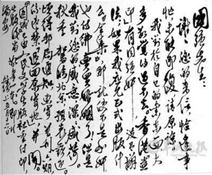
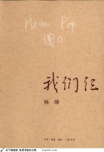

# ＜七星说法＞第八十六期：有些东西，不能想卖就卖

近些日来，关于钱锺书先生、杨绛先生书信、手稿的拍卖事件闹得沸沸扬扬，5月19日，北京中贸圣佳国际拍卖有限公司宣布**将举行《也是集》钱锺书书信手稿专场”拍卖会，随后招致了已102岁高龄的杨绛先生的强烈反对**，在杨绛先生强烈的反对声中，原本也计划拍卖涉及钱锺书先生的书信的北京保利公司和北京传是公司宣布撤拍。随后北京二中院颁布**诉前禁令**，**裁定“要求中贸圣佳国际拍卖有限公司不得实施侵害钱钟书、杨绛、钱瑗写给李国强的涉案书信手稿著作权的行为”**，中贸圣佳国际拍卖有限公司**继而宣布撤拍。**

这起名人书信拍卖事件也是一石激起千层浪，文化界、经济界、法律界都对该案给予了广泛的关注，其中涉及到的几个法律问题也是大家关心的话题，那么到底这些书信，拍卖公司有没有权利拍卖，对于名人书信，我们又该持什么样的态度呢，这期说法，我们就来一起探讨下这个话题。

一、该案涉及到哪几个权利？

纵观该案，笔者认为，该案主要涉及到了隐**私权、所有权以及著作权**这三项权利，至于有些新闻中所提到的名誉权，在本案中并不突出，因为无法确定这些书信里的内容有有损钱锺书先生、杨绛先生及他们的女儿钱媛名誉的地方，故而，名誉权并不是本案所重点关注的权利。其实本案所涉的法律问题关键就是在这三项权利的相互冲突上。按道理说，所有权人李国强先生（李国强先生辩称不是自己所为，此中纠葛在此不做讨论）委托拍卖公司拍卖自己持有的物品，在法律法理上完全没有问题，但是由于该项物品极为特殊，有可能损害他人的隐私权及著作权，故而产生如此复杂的局面，而我们所要确定就是在这三权的冲突中，所有权的效力究为几何，这场交易是否能够进行？

二、关于隐私权和著作权

本案涉及到隐私权和著作权这两个重要的权利，也正是由于对这两个权利的考量，才使得一桩普通的拍卖掀起如此轩然大波。那么接下来就让我们先来看看这两个权利。

隐私权，可能大家都很熟悉这个名词，说到隐私，大家都不陌生，作为个体，每个人都不希望别人来窥探自己的私生活。其实，隐私权作为一项权利，最早还是1890年由美国学者沃伦和布兰代斯提出的，其后逐渐被学界所重视。据王利明教授的主张，**隐私权属于一种具体人格权，有特定的内涵和适用对象，指自然人享有的私人生活安宁与私人信息秘密依法受到保护,不被他人非法侵扰、知悉、搜集、利用和公开的一种人格权**，包含着两方面，**一是生活安宁，二是生活秘密**，其中**生活秘密就包括通信秘密**。对于这种无关公共利益和他人利益的私人生活秘密，该个人完全由权利对这些信息进行保有和隐匿，其中隐匿包括自己的隐匿以及要求他人对此进行隐匿，要求这些信息不被公开。在这次拍卖会中，我们看到了大量涉及到钱锺书先生及杨绛先生的书信，即便是名人，他们的信件内容也是属于他们的隐私，他们完全有权利要求他人隐匿，不向公众公开，即使是该项物品及信息的持有人。

著作权，同样是大家比较熟悉的权利，作为保护个人精神产品的权利，著作权在整个权利体系中也占有极为重要的权利。根据《著作权法》第十条的规定，著作权法所保护的著作权达十七项之多，包括十六项具体权利和一个兜底性的概括权利，而在这十六项具体权利中就包括**发表权，即决定作品是否公之于众的权利**。此次拍卖的众多物品中，《也是集》、《干校六记》的手稿不用说，肯定是属于著作权法所保护的文字作品，而书信，学界通说属于文字作品（《中华人民共和国著作权法实施条例》第四条：（一）文字作品，是指小说、诗词、散文、论文等以文字形式表现的作品）。作为精神权利的著作权并不必然与作为思想载体的具体的物的所有权一起转移，两者是可以相分离的，所以，虽然书信的所有权在持有人李国强先生手中，但是著作权并没有发生移转，仍在杨绛先生手中。所以**作为著作权人及著作权的继承人杨绛先生有权利决定她以及她丈夫、女儿的书信和手稿是否对社会开放，公之于众**。而这次的拍卖，包括对拍卖品的影印宣传违背著作权人的意思将其部分甚至有可能是全部公之于众，损害了这些文稿书信的发表权。

从以上的一些介绍，应该也能看到，隐私权和著作权都包含了一定的人格利益，隐私权是纯粹的人格权，它保护的是一个人的人格利益，而著作权虽有财产权的一面，具有一定的经济价值，但也有保护个人人格利益的一方面，是对个人精神权益的保护，属于一种财产权和人格权兼具的权利。

三、当三权遇到冲突，我们如何取舍

所有权是一种十分重要的权利，定争止分，物的流转，对社会的安定和经济的发展起到了十分重要的作用，但是任何的权利和自由都是有边界的，所有权的行使也不能毫无限制，随意行使。当所有权的转移与隐私权和发表权产生了冲突，我们又应以哪个为重？

正如上文所言，隐私权属于具体人格权的一种，而发表权作为著作权有其人格权的一面，体现对人精神产品价值的尊重，而所有权是典型的纯粹财产权，所以这三权的冲突其实也可看作是当人格权和财产权发生冲突时，何者优先的问题。

人格权，是保护“人之所以为人”的最基本的人的伦理价值的权利，包括人的“生命、身体、健康、自由、尊严、名誉”等范畴，体现西方哲学和人文主义对人的价值的尊重。人是民法立法的基础，作为民法上最重要的主体，人格应当是民法首要保护的，否则“人之所以为人”的基础就会受到动摇，又何谈市民社会的培育和经济交易的发达，民法又有何存在的意义。财产权，包括所有权、债权，在康德的权利体系中被归为“获得的权利”，在中国民间历来也有一句话，“钱财乃身外之物”，由此可见，**财产权虽然在现代民法上占有极大的篇幅，但是与人格权比起来，仍是居于第二位**。人首先得成为人，其次才能占有财物，进行交易。如果一人的生命健康、隐私名誉都得不到保护，那么人又有何心思管理和增值自己的财产，人人已自危，纵有万贯家财又有何用。

当人格权和财产权发生冲突时，我们理当应以人格权为重，虽然目前我国还没有完善的人格权法及人格权保护制度，但是从法理上我们理当如此。所有权法第七条对所有权的行使也做了一个原则性的限制规定，**“所有权的取得和行使，应当遵守法律，尊重社会公德，不得损害公共利益和他人合法权益”**。这其中**他人的合法权益自然包括他人的人格权**，同时在《侵权责任法》上，第二条规定了“侵害民事权益，应当依照本法承担侵权责任。本法所称民事权益，包括生命权、健康权、姓名权、名誉权、荣誉权、肖像权、隐私权、婚姻自主权、监护权、所有权、用益所有权、担保所有权、著作权、专利权、商标专用权、发现权、股权、继承权等人身、财产权益。”可见，本次拍卖对杨绛先生的合法权益——隐私权、著作权——都将造成侵害，在冲突之中，所有权理应受到限制。

在现在整个社会中，我们大多对可见的财产权比较重视，但是当涉及到人格权时，我们就没有那么敏感了，比如我们的个人信息，比如网络上肆意泛滥的偷拍照，这个社会亟需形成对隐私权的尊重，克制我们的窥私欲，让我们的人格真正不受任何的损害。

有些东西，真的不是你想卖，想卖就能卖。

（编辑：林骥；责编：何盼盼、胡逸娴）

** P.S.****加入****“****七星说法读者群****”****，我们一起说法！群号：****262980026****。**
