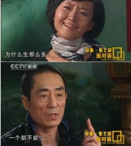
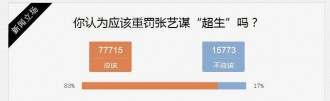

# ＜七星说法＞第八十四期：七个灯笼高高挂

就像事先约定好的一样，5月7日，新华网，人民网等官方媒体，一天之内发布了多篇关于张艺谋超生的新闻稿。稿件中称张艺谋至少是七个孩子的爹，而且至少面临着一亿六千万的罚款。面对着扑山倒海的舆论压力，老谋子依然没有露面也没有发表声明，直到近日微博上才传出张艺谋的回应：“七个？真奇怪这七个娃咋来的。”

面对超生，有人谈恶法，有人说制度，有人讲特权。如今事实不明，结果未出，我们当然不能妄断老谋子的超生问题，本文仅就以下几个问题略作阐述，以供列位看官笑谈。

### 钱

人们俗称的“超生罚款”，实际上就是指对违反计划生育政策的那拨人征收的特殊罚款。原来春晚上有一个小品，黄宏和宋丹丹饰演的“超生游击队”四处打游击，躲避“小脚老太太侦缉队”的超生罚款，就是说的这么回事儿。但是到了2000年，这个罚款的名头儿就变了，成了“社会抚养费”。之所以改成这个名字，还是为了咱们伟大祖国的声名着想，毕竟国际社会对咱们伟大祖国的人权问题多加指责嘛，所以至少要在形式上要做的到位，证明咱们是很尊重公民生育权的。

只不过具体收多少，按照国务院所颁布的《社会抚养费征收管理办法》，其实各地都是可以自由裁量的。也就是说“社会抚养费的具体征收标准由省、自治区、直辖市规定。”

就老谋子这事儿来说，发生在无锡，那么依据《江苏省人口与计划生育条例》：多生育二个以上孩子的，按照基本标准（本地城镇居民以孩子出生前一年设区的市或者县（市）城镇居民年人均可支配收入）的五倍至八倍缴纳社会抚养费；实际收入是当地年人均纯收入二倍以上的，还需要对其超出人均收入部分缴纳一倍至二倍的社会抚养费。

依据这样的规定，媒体推导出了张艺谋所应支付的罚款公式，也就是社会抚养费 = 当地人均年收入 x 8 +（张艺谋年收入-当地人均年收入） x 2。

大多数媒体都将老谋子的年收入算成八千万人民币（我也不知道具体是怎么的得出来的），但是依据这个公式，最终得出的数据是一亿六千万元。

这么多钱，就算是对老谋子来说，也是一个很重的负担吧。

### 法

然而这所谓的“社会抚养费”本身也是饱受诟病的。

比如社会抚养费，从它的字面意义来理解，就是说一个孩子的成长成本来由社会承担所需缴纳的费用。但是因为是超生行为，所以需要由家长来先行缴纳。但是这就涉及到了一个很明显的问题，提前对于收入阶层进行区分的征收，是否有明显的法律面前人人不平等？

既然是社会抚养一个人，那么这个成本的计算就应当是普遍化的，所以征收标准也应当是普遍化的，何以富人缴得多，穷人缴的少？

这么说起来，似乎对于富人是不利的，那么穷人自然可以乐乐呵呵，安心过自己的日子嘛，就算超生了，交个能够接受的罚款也可以。但是他们真的想过自己交的钱会去哪儿么？按照《社会抚养费征收管理办法》的规定：社会抚养费及滞纳金全部上缴国库，具体操作办法是全部上缴县级财政，由县财政上缴国库。至于在支出上，保留计划生育工作所必需的经费，由各级人民政府财政予以保障。

但是正如办法是死的，人是活的，为了“伟大的人民币”，大家总要“搞点儿小意思”。大多数的市县都会有自己的创收办法，开源节流省吃俭用多跑多拿多罚多占，总之只有大家都有钱花，才能有力量整治计划生育问题嘛！为搞罚款的同志们开提成，也不是什么大问题！

只不过这样一来，富人遭殃，穷人也落下什么好。

这便宜到底让谁占了，我太笨了，怎么就想不明白呢？

## 权

有人说老谋子如果超生，他也是英雄。

赞成这一观点的人认为，本身计划生育这事儿就是扯淡，纯粹是对公民生育权的限制，就是一部恶法，咱们完全可以不遵守！凭什么对咱们不好的法律，咱们也要服从？老谋子是在反抗暴政！

计划生育这样的政策，到底是恶还是善，我这才疏学浅也不好评判。但是至少我知道，就目前的中国人口的现状来看，不计划生育，应该也是挺操蛋的一件事儿。谁让咱祖上生的太多，按照官方的一贯说法只能“留给后代来解决”了。我更关注的是，假如张艺谋先生真的超生了，是不是表明他享有特权？面对所谓的特权，民众们的反应是怎样的？

特权这种东西，只要是一提出来，都是人人喊打。但是放在今日事例里，却又多了些微妙的变化。许多人痛斥张艺谋先生超生，强烈要求他要遵守计划生育，不少人在新闻下评论道：老子无官无钱，所以只能生一个，凭啥你能生那么多？这不公平，你也必须要和我们一样！

这样的心理，仔细琢磨一下，好像透着些绝不同甘只可共苦的意思。老谋子吃了甜葡萄，篱笆外的诸位瞅着自己的酸葡萄，也就心生厌倦，不仅开始痛恨老谋子，就连葡萄都一起痛恨起来了。与此类似好像还有异地高考，多少家长闹的沸沸扬扬，有人说这些人想要的是什么？无非也就是北京上海的考生优势罢了，所谓的消除特权，其实只是为自己得到特权。这话不是我说的，在此转述，也仅是表达出另一种观点。

这世界上的特权有两种。

第一种是众生平等，某些人高高在上。

这种特权是最邪恶的存在，应该被彻底废除。

还有一种特权，是大多数人的权利被限制，某部分人的权利因为其他原因有幸豁免。

这种特权，人人渴望，人人羡慕。我们求得不是消弭掉这种特权，而是希冀这样的特权能够覆盖到每个人的身上，把“特”字去掉，变成所有人应得的权利。

这很难，但是值得我们为此而斗争。

（编辑：戴正阳；责编：陈澜鑫） P.S.加入“七星说法读者群”，我们一起说法！群号：262980026。
