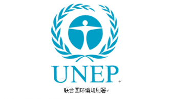
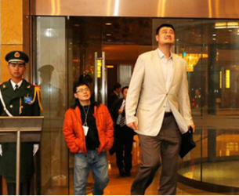

# ＜七星说法＞第六十七期：E先生的入宪梦

我坐在列车靠窗的座位上，不自觉地蹙着眉，此时的列车正停靠在一个乡间小站上。近来的工作很不顺利，我缺乏人手，缺乏资金，最为可怕的是我似乎早已不被关注了。我也该习惯了，不是吗，处处碰钉，情况并不是最近才开始不好的，然而这样一无所获地回去总是让人非常丧气的。

窗外的景色倒是很美，一片金黄的麦浪随风摇曳，几座小房子错落在田野中，天空也是一片湛蓝色。我往上抬起车窗，一股清新的空气霎时狂欢一样涌进来。我闭上眼深吸一口，多么迷人的甘甜！

“先生，能帮我下吗？”忽然有人拍了拍我的肩，我仓促地回头。一个面色红润的健壮年轻人站在过道上，左手提着满满一篮苹果，苹果的表面一层浅浅的绯红，个个饱满圆润，右手拿着一个有点破旧的公文包。他正尴尬地朝我傻笑着，扬了扬他带来的苹果篮子。

我帮助他安置完行李之后，他正好坐在了我的对面。这个年轻人面容憨厚，长着一双大眼睛，鼻头圆圆的，总是咧着嘴微微笑着。我拉下窗户，和田野中纯净的空气依依告别，窗户反射出我凹陷的两颊，唉，我看起来真糟糕。

“去哪里啊，年轻人？”旅途还有五个小时，索性和这位可爱的青年攀谈一番。

“我吗？我要到宪法去！”他的声音虽然低沉，但洋溢着止不住的兴奋，拖着微微的颤音。宪法？听到这里，我忽然对他产生了极大的兴趣。

“你到那里去干嘛？”

“那还用说，我要到宪法工作去啊！”

“到宪法工作？那里有什么好去的？”

年轻人听完怔了一下，有些害羞地吞吐起来：“谁......不想去宪法工作呢？进入了宪法系统，如果我能进入宪法系统......人人都会重视我的存在，甚至还会给我配备更多的法律，这样我有足够的人手，就能够更好地做事了。”一边说，他的拇指和食指一边不安地相来回摩擦。

“可是你有什么资格能够到宪法里去做事呢？他们不是要求挺高的吗？据说必须是‘基本权利’才行啊！”[1]

“哈哈，我就是基本权利！”

“你也是基本权利？你是......?”

年轻人迅速打开他的公文包，伸手进去胡乱翻着，终于，掏出一个绿色的小卡片盒子，打开来，抽出一张，随手递了给我。一张名片，显眼处印着他的照片，年轻人依然讨喜地咧嘴微笑。“你叫......环境权？”[2]

他点了点头，面孔流露出一丝骄傲。“Environmental right~叫我E就可以了！”

名片显得有些幼稚，连底色都是草绿色的，照片之下用黑体加粗字印了一段话：“**人类有权在一种能够过尊严和福利的生活环境中，享有自由、平等和充足的生活条件的基本权利，并且负有保护和改善这一代和将来的世世代代的环境的庄严责任！——1972《人类环境宣言》。**”E先生看我在默读着这一段话，又开始伸手在他的公文包里掏着些什么，终于，他又掏出了一个小红本，递给我。“人权证”，打开小本，他的标志性笑容之下又印着“第三代”，右下角写明了“欧洲人权会议颁发”。[3]

E先生微微扬起下巴，似乎期待着我说些什么。然而长久以来的阴郁促使我决定给他浇点冷水。“第三代人权是个什么东西？听起来很野鸡的样子。”

“啊？第三代人权你没有听说过吗？第一代人权是公民和政治权利，也叫消极权利；第二代则是社会、经济和文化权利，第三代呢，有和平权、发展权，还有我~第三代人权呢......”

“好吧，我也搞不清楚这东西我们这到底承不承认，可是我还是看不出来您凭什么能在宪法里工作啊！”

我的反应大大出乎E先生的预料，“为......什么不行？我是人权啊，所以就是基本权利咯！”

“这样吧，你先给我说说你到底怎么个‘基本’法！”

“当然基本了！每一个人难道没有在不被污染的环境之中生活的权利吗？在一个被污染、破坏的环境中，人怎么能够生存、发展？这还不够基本？！”

“那我问你，吃饭的权利也挺基本的吧，我怎么没看他在宪法工作啊？性权利不也是吗？”

“怎么没有！这些都是基本人权！宪法第三十三条规定了：‘国家尊重和保障人权。’”

“这么说，那你也不也没必要亲自去宪法工作了吗？再说了，现在宪法里的传统人权，本来就有要求良好的环境啊。”

“不一样的，传统的财产权制度和社会保障制度就可以保障吃饭的权利了。可是，这些对于环境保护来说是远远不够的。空气、水体、动物，这些不能被我们所支配、控制的环境因素不能够成为所有权的客体。而传统的人格权理论中，对生命健康权的保护又必须要求直接侵害，环境污染在大多情况下并不是这样。侵权理论的构成要件放到环境领域中，也是不能够适应环境保护的。你看，在现有的财产权制度下，谁要是侵犯我吃掉自己苹果的权利，要进行权利救济是比较容易的事情。而环境保护就不是这样了！不是你的，你的权利要求基于什么呢？那就需要我出马了！”

“可是发展后的现代财产权、人格权、侵权理论还不够用吗？比如，环境侵权的过错推定？”

“当然不够，环境保护最重要的是谁么？防患于未然！这就必须要求公民能够获取环境信息、使用环境、参与环境管理，这些权利传统的民法理论当然远远不够了。”E先生说话愈加快速，他皱起眉头，一副不可侵犯的神圣架势。

“所以说，你工作的内容主要是针对政府的公民知情权、参与权？不解决个人之间的问题吗？”

“不，我的工作内容不仅是公共性质比较强的环境公权，也有环境私权，比如日照权、眺望权。”他时不时地点点头，用手在空中比划着什么。[4]

抓住机会，我想给他出一个难题：“处理公民个人之间关系的权利需要入宪吗？私人行为不在宪法规范的范畴之内的吧。”

“你看看我们的宪法文本是怎么表述权利的，每个公民都有如何如何的权利，这就说明宪法是一个价值体系，不仅是公法的基础，也是私法的基础。我们的一切权利都来源于宪法或者是从宪法权利中引申而来。所以，我的加入自然是理所当然的。”

“是吗？我还一直以为宪法权利的义务主体只是指向国家的呢。如果宪法权利也处理个人间的关系，那么一般法律调整的社会关系不是和宪法有所重合了吗？我记得，宪法权利和其他权利的区别在于是否能够在立法过程中进行权衡、审议，是针对国家权力的防御权。宪法权利的纳入是为了让立法机关在政治过程中对这些权利保持克制。按照你的表述，就模糊了宪法权利和法律权利的区别了。”[5]

“这些都是陈旧的观念了，你应该去看看我的兄弟姐妹们已经在多少国家的宪法中占据了位置！”

“喔？有的国家环境权已经入宪了？”

“已经有学者的统计，已经有53个国家或地区的宪法加入了公民环境权！比如发达国家中的比利时、法国、芬兰、西班牙，在整个非洲都有16个国家或地区的宪法中加入了环境权。”[6]

“非洲？居住环境最为恶劣的非洲，那里反而有这么多国家的宪法加入了环境权？那么，你的兄弟姐妹在那里是如何工作的，那里怎么会有足够的资金、法律支撑他们工作呢？”

E先生的兴头一下被打断了，他停顿了下来，满是疑惑地看着我。“环境保护，当然主要还是依靠国家环境行政权力来实现啊......”

“如果国家财政实力不足以提升每个人生存的环境呢？那该怎么办？还是说，让你呆在宪法里只作为一种目标性的宣示？在经济发展那么落后的非洲，宪法中却把环境权变成了铁板一块，这样的权利到底怎么实现？这些都让我很疑惑，好吧，再问问你，你能在法院里为公民服务吗？”

“不......目前还是不行。因为我的职责主要还是督促国家的积极作为。”[7]

“那就对了！宪法所确定的基本权利在立法过程中是不容平衡的，是必须在国家的每个地区得以实现的。你的工作要求国家拨给你更多的款项和法律，要求国家更为积极的通过财政来保证你的工作开展，这些，都不是对于国家权力的防御，反而是在呼应国家扩大行政权力，这样的你怎么能够加入到宪法中去呢？再者，有一句话是这么说的：‘人权是那些现在就必须实现的权利，而不是那种十分可爱但将来才能提供的东西。’[8]而你的工作，绝对不是一蹴而就的，是需要长时间的立法权衡中逐步推进的，所以我认为，你也许根本就不是人权！”我提高声音，试图给这位年轻善良的E先生一记重击。

E先生涨红了脸，急着打断我：“不！我们在宪法的效力、宪法权利的资格上的观念都有太多的不同了。你应当好好看看当下的状况！在环保领域，比起国家行政权力的扩张，怠于行使环境行政职权才是最大的问题！”

他有些生气了，他怀抱着激动和憧憬在这样的一个好天气里，去实现他的“入宪梦”，怎么会不反感挑刺的我呢？我对着他点了点头，把语气放缓：“是的，的确是这样，可是要督促国家行使环境行政职权，环境行政法不是就够了吗？像环境影响评价这样的制度，像环境信息披露，通过法律形式把它们确定下来，不是就足够了吗？又何必要入宪呢？入宪其实没．．．．．．”

“这位先生，你必须认识到世界的环境恶化是多么的严重，你必须认识到社会权入宪已经超越了传统的宪法权利理论并且成为了现实。如果我不在宪法中工作，对环境的治理就只能由国家将环境作为一种资源通过财产性的保护来管理和干涉，可是一旦我进入宪法，如果普通公民拥有环境权，那在面对完全不影响我的财产状态，也就是不撼动传统权利关系的前提下，或许我便可以通过民事的手段来保护自己享受优美环境的权利了。”E先生如我一样，提高了他的嗓音，他激动地清了清痰，接着说：“国家权力的扩张需要防范，国家职权的虚置就不需要吗？我的入宪将使环保爱好者们受到鼓舞，将能够在全社会范围内进一步加深环保意识，这些您有考虑过吗？我去宪法工作并非只是为了自己，请您不要再怀疑我的动机了！这是一次从权力到权利的跨越。”长出一口气，英雄的演讲，终于结束了。

我静静地看着眼前这位因为争执而气喘吁吁的年轻人，竟然依旧有人这么执着于加入宪法，这使我的心中涌起一股异样的欣喜。“不不，你误会了，年轻人．．．．．．不管怎么说，祝你成功吧！”我伸出我的手，握了握他那温热有力的大手。

列车到站，我走出站台，拦下出租车。“到宪法去。”

E先生善良而又可爱，但他有一件事弄错了，在宪法中工作，很可能并没有足够的资金，甚至还缺乏人手。我怎么知道的？是的，我就在宪法中工作，我的名字，叫作——言论自由。祝E先生好运，也许我真的能够再次看到他，在宪法中。

注释：

[1]我国宪法使用“基本权利”一词囊括第二章中所列举的权利。对于宪法权利的称谓，各国都不太一样，例如德国使用的是“基本权”，日本称为“基本人权”。基本权利和人权的外延基本是一致的，但基本权利更偏重于宪法的确认。

[2]环境权理论一般被认为在１９７２年联合国第一次人类环境会议所发表的《人类环境宣言》中被国际立法所接受。该宣言的第一条阐述了环境权的含义。我国《宪法》只是在第二十六条确认了国家保护环境的职责，并未将环境权作为公民权利确定下来。

[3]欧洲人权会议经过长期讨论研究后，也逐渐接受了环境权观点。1973年的欧洲环境部长会议制定了《欧洲自然资源人权草案》，肯定了作为一项新的人权的环境权，并且将该草案作为《世界人权宣言》的补充。

[4]倡导环境权理论的学者们认为环境权“和其他人权一样，是一个由多项子权利组成的内容丰富的权力系统。吕忠梅教授在《再论公民环境权》中将环境权的内容描述为：环境使用权（日照权、眺望权、清洁空气权等）、知情权（国民获知环境信息的权利）、参与权（公民参与国家环境管理的预测和决策过程、参与开发利用及环境保护实施的过程的权利）以及请求权（公民的环境权益受侵害后向有关部门求情保护的权利）

[5]此处的争议来源于公法的宪法观和基本法的宪法观的分歧。公法的宪法观认为“宪法只是公法的的母法，而不是私法的母法”，而基本法的宪法观认为宪法是“为规范整个国家共同体的秩序提供价值基础的法律”，因而“不仅是公法的基础，还是私法的基础。（夏正林《从基本权利到宪法权利》，载《法学研究》2007年第6期）传统的宪法理论中，宪法处理的是公民和国家的关系，宪法权利是作为针对国家权力的“防御性”权利而存在的，意在限制国家权力的扩张，把基本人权从政治审议中解脱并确定下来。

[6]根据吴卫星的《环境权入宪之实证研究》一文（载法学评论，2008年第1期），目前已经有53个国家再宪法中确定了环境权，其中亚洲七个、非洲十六个、欧洲二十个、拉丁美洲十个。美国联邦立法没有采纳环境权观点，但一些州的宪法中通过修改确认了环境权。

[7]相较于环境权在立法上所得到的肯定，其司法实践并不尽人意。美国州宪法所确立的环境权并非可诉的，而是新的权利的初步确认，认为这些宪法条款“只承认在此项宪法性权利能够得到行使之前有必要以立法贯彻之”日本法院在“伊达火力发电站事件一案中，认为环境权“只在宪法中有纲领性的规定”，而驳回了以环境权为依据的请求。

[8]语出R.J.文森特《人权与国家关系》一书。

 深入阅读： 1.姜峰《权利宪法化的隐忧》，[http://www.aisixiang.com/data/56109.html](http://www.aisixiang.com/data/56109.html) 2.夏正林《从基本权利到宪法权利》，[http://www.chinalawedu.com/news/16900/171/2008/9/wy74126301898002560-0.htm](http://www.chinalawedu.com/news/16900/171/2008/9/wy74126301898002560-0.htm) 3.吴卫星《环境权入宪之实证研究》，[http://www.riel.whu.edu.cn/article.asp?id=29643](http://www.riel.whu.edu.cn/article.asp?id=29643) 4.吕忠梅《论公民环境权》，[http://www.law110.com/lawstudy/320177.htm](http://www.law110.com/lawstudy/320177.htm) 5.吕忠梅《再论公民环境权》，[http://www.doc88.com/p-701862364611.html](http://www.doc88.com/p-701862364611.html) 6.马岭《宪法权利与法律权利：区别何在》，[http://www.aisixiang.com/data/55714.html](http://www.aisixiang.com/data/55714.html) （编辑：陈澜鑫；责编：于轶婷、陈澜鑫） **P.S.****加入****“****七星说法读者群****”****，我们一起说法！群号：****262980026****。**

