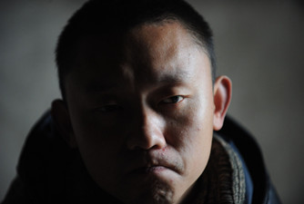
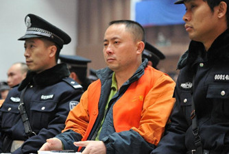
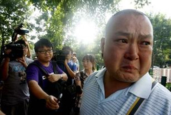
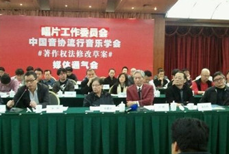
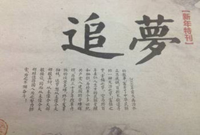
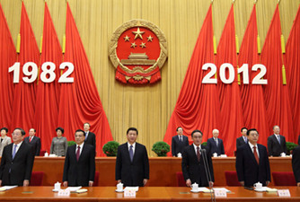

# ＜七星说法＞第六十二期：大时代——2012年终特稿

**2012，末日且未死，法治长待兴。**

2012的说法，有新人加入，有前辈离开，依旧是几个散落各地、素未谋面的人，在“苦苦支撑”着七星说法这一角天地。

**2012的说法，终于有了自己的读者群，我们在读者群中一起热诚地说法、真诚地相知，若你有意，快来加入我们！（群号：262980026）**

2012的说法，每周都会有一个编辑娇喘吁吁、香汗淋漓地敲出最后一个标点，如释重负；也会有一个编辑一字一句地审查着稿件，微微皱眉，留下“刻薄”的批注；而当责编拿到修改完毕的稿件后，他会打开他并不熟悉的主站后台，笨拙地排版、贴图，终于长出一口气——发布！

每周四一份稿件，最终还是由上着课的编辑、上着班的编辑、准备着司考或是考研的编辑、为了男朋友生闷气的编辑以及为没有女朋友而生闷气的编辑完成了，又是一年，不曾间断。是什么推动着我们去完成这一篇又一篇的稿件？我们中的多数人学着一个“臭名昭著”的专业，我们对于应然与实然之间的巨大鸿沟时而嘲讽时而叹息，我们自己也纠缠在自身的迷茫与困惑之中。我们很小，说法也很小，可是我们看到的，却是好大一个时代。

**这一期的说法，是2012年的年度特稿，我们想要通过回顾这一整年说法所关注过的话题、事件，来呈现这一年的中国法治进程。**在每一个话题之中我们给出了七星说法这一年中所写的相关文章以及相关北斗文的链接，**若您并不是太了解话题的背景，可以点开链接，阅读我们在这一年中所做出的努力。**

## 大事件

这一年发生了那些在法治进程中十分重要的大事件？面对这些大事件，我们对于法、法治又有了怎样的新认识？ 

### **任建宇案**

**七星说法第五十四期:“不自由，毋宁死” [/?p=26180](/?p=26180)** **七星说法第四十四期：劳教存废之间[/?p=24237](/?p=24237)**

**说法编辑 于轶婷：**任建宇案被南方周末评为2012年十大影响性诉讼之一。这个毫不起眼的“小人物”用自己的经历警示人们：所谓“自由”正处于岌岌可危的状态。当下劳教制度停止使用，无论最后的结果是改革或废除，对于人身自由的保障或多或少算是向前迈出了一小步。而更值得我们期待的，是言论自由的边界能够从模糊任意走向相对的清晰和确定。尽管笼罩在“中国特色”的迷雾之下，但是宪法的生命力和文明的正能量，仍然像地平线上透出的一线曙光，指引法律人在自由和正义之路上前行。 **说法编辑 戴正阳：**法律的车轮总是靠牺牲推动的。当沉疴不尽新痛又增时，无数人心里却只能剩下一声长叹。劳教制度似乎是数十年恶法的缩影，在接二连三的事件中，渐渐被撼动了根基。我们要做的是什么？不就是再加上一把力气，推倒它，推倒它背后所代表的陈旧。愿良法常在，愿正义常在我心！ **读者 傅宇：**“自由”一词，为资产阶级所初创，几百年来始终不断。其背后之力量实值深思。读密尔之《论自由》一书令人慨叹自由之于个人，于社会之不凡价值。“不自由，毋宁死!”数百年来，多少仁人志士抛头颅洒热血，为之奋斗终身，换得今日之自由与幸福。“人治”与“法治”之间的巨大差距让人们感受了法律所赋予的自由的美好。为延续此自由之梦，青年人定当深思自由之意义，牢记自由之代价，为我自由之精神，独立之人格而慨叹唏嘘是也！ **说法编辑 林骥：**我坚信个案改变法治，遥想几年前的孙志刚案，使得收容遣送制度成为历史，没有人有那么大的能量，让法治成为每个人都满意的那个模样，一项法律制度的形成和改变的过程是各方利益角力的结果，而面对一些亟待改正的制度，我们正是需要一个爆发点让我们来重新审视、做出改变，公安部长孟建柱已经宣布要改革劳教制度，我相信，任建宇案必然不会就那么湮没在历史的车轮中，个案改变法治，个案改变中国，期待这是新的孙志刚案，成为法治发展的标杆和拐点 **读者 玻璃心少女去死去死团：**可能我们的命运都反映在小人物的身上了吧。现在，他们遭受迫害的时候，我们不出声。等到我们自身权益受到侵害的时候，也没有人敢为我们说话！我觉得任建宇的案子真的很值得反思，不仅仅限于劳教，更应该展开到整个社会。 

### **陕西强制引产案**

**七星说法第三十三期：陕西孕妇强制引产案——指标下的生命[/?p=22065](/?p=22065)** **七星百科第二十七期：计划生育制度[/?p=22009](/?p=22009)** **七星百科第二十八期：生育权[/?p=22053](/?p=22053)**

**说法编辑 石味诗：**计划生育政策已经实行三十余年，到今天百弊丛生。面对着汹涌而来银发浪潮，天量的失独家庭，年龄结构失衡和性别比例失调，不断的引产悲剧，以及国内外不同领域的呼声，计生政策渐显疲态，却仍然无法动摇。而我们能做的正如文章中所说，“只有不断的奔走，不断的呐喊，不断的争取，不断的抗争，为了自己的孩子，不再成为指标下的生命。” **说法编辑 马特：**计划生育政策被废除是早晚的事情，或者说本身已经没有必要了，因为很多年轻人根本生不起也养不起孩子，自己就自我计划生育了。 **读者 D少年的无聊之旅：**一个恶法再加上作恶的人，几乎可以将数以百万的老百姓置于死地。历数计划生育的所有过程，几乎都遍布着血泪吧。我现在只是很感激上帝，我有幸存活，有幸长大，为了我的未来的娃，现在我必须抵制这样的罪行！ **说法编辑 王卜玄：**我觉得计划生育这个东西归根到底还是毛时期不计后果的人口政策的产物。计划生育有问题，但是人口膨胀带来的问题也是有目共睹的呀。问题的关键在于执行，计划生育原本属于政策，是宣示性的东西，不像法律具有强制性，但是执行的过程渐渐变成一场杀戮。想要废除计划生育，首先得先设计出更科学的人口政策才行。 

### **嫖宿幼女罪存废之争**

**七星说法第三十五期：幼女何以嫖宿？[/?p=22330](/?p=22330)**

**说法编辑 林骥：**如何审视嫖宿幼女罪，不仅要从理论的角度，更要从现实的实践考量，作为法律所要特殊保护的法益，对侵犯幼女性自主权的行为的惩罚不仅要符合法理的逻辑，更为重要的是要禁得起实际的考验，如何避免在实际处理中嫖宿幼女所付出的犯罪成本较强奸罪更低的尴尬情形，是蕴藏在该罪存废改之争中我们所要重点把握的关键所在。 **说法编辑 王卜玄：**嫖宿幼女罪绝对是刑法中的一个大bug，早就该废了，法治实践和立法目的根本是背道而驰的嘛，这个在制度设计本身上就存在逻辑矛盾。难道动机是好的就能否认它是恶法的事实吗？ 

### **黎庆洪案**

**七星说法第四十二期: 一条小河[/?p=23839](/?p=23839)**

**说法编辑 戴正阳：**有人说这是法学界最黑暗的一年，因为蒙受枉法裁判的受众竟然是因为政治上的因素才获得了公正。有人说这是法学界最混乱的一年，因为在面对共识和正义时，许多人走向了完全不同的道路。但是还有人说，这是法学界光明的一年，而且从此以后所有法律人都将走向光明。因为他们敢说话，敢抗争，敢战斗，敢坚持，敢为常人所不为，敢在太阳出来之前第一个呼唤黎明。所以，说法者不死！正义不死！ **说法编辑 石味诗：**为义受逼迫的人有福了，因为天国是他们的。 **说法编辑 林骥：**重庆的打黑留给我们所有人一个命题，我们该如何打黑，黑打比打黑更有害，而在离重庆不远的贵州，小河区法院又向我们抛出了这个命题。法律是高悬在黑恶势力犯罪头上的达摩克利斯之剑，却不是可以随意将之放下的，否则，伤害的将是法律本身。 **说法编辑 陈澜鑫：**作为一个贵阳人，补充一句，因为行政区划调整的缘故，贵阳市小河区人民法院已经不存在了。但这样的小河，会在路的转角继续流淌吗？ 

### **私刻公章救妻**

**七星说法第三十七期：刻章救妻的北京爱情故事[/?p=22544](/?p=22544)**

**说法编辑 马特：**站在分析实证主义的观点来看，这个案件并无出奇之处，显然犯罪是成立的，基本没有争议。有了现行法律条文就要去遵守，不遵守就要受到惩戒，这是最简单的道理。然而生活不总是有道理可言，当人们除了违法再无选择的时候，这便是一个“期待可能性”的问题，也就是，我们真的可以要求当事人一定不违法吗？ **读者 国安是冠军：**这特么才是北京爷们儿的牛逼之处！不过我觉得在法律与情理之间，应该没有那么大的隔阂。道德不应该成为法律冲突集中之处。在此，只能祝福这个北京爷们儿，挺过这个最艰难的时刻，去捍卫自己和家庭的尊严。 

### **著作权法修改争议**

** 七星说法第二十四期：制度的问题，还是国情的问题？[/?p=20692](/?p=20692)**

**说法编辑 戴正阳：**当法律之违背恶法之横行，全都归因于国情时，也许就是制度开始崩坏的标志。我们是有中国特色的，我们是有特殊国情的，所以我们应该走和其他人不一样的道路。但是不一样不代表着可以任意损害权益，特殊也不代表可以将恶法光明正大的说出。毕竟有这样一条真理：无论怎样的国情都可以找到解决这一国情问题的制度。国情的借口说多了，就无人再当真。 **说法编辑 石味诗：**有个放羊娃给村里放羊……第三天再也没有村民相信他喊的“狼来了”，于是放羊娃高兴的拿出了金针菇，茼蒿，虾滑，宽粉，海带…… **说法编辑 王卜玄：**一旦真正理解了立法意图和制度设计，这一条款的修正也就没什么好争议的了。我们的问题在于，真正内行的学者往往作风低调，而啥也不懂自以为有点墨水的“公知”反倒嗅点风头就一哄而上，瞎嚷嚷。 

### **南周事件**

** 七星说法第六十一期：南周事件：舆论G点后的法律反思[/?p=29347](/?p=29347)** ** 七星百科第二十三期：中国新闻法[/?p=21639](/?p=21639)**

**读者 满庭芳**：南周案的爆发，确实把我震惊到了，声势浩大的媒体突然被泼了冷水。回到原点，我们的法制需要完善，那是因为它能真正捍卫我们的权利，捍卫一些敢于说真话的媒体的权利！而不是让某些权力凌驾于法律之上，让一切岌岌可危。茕茕孑立，形影相吊。有太多的人目前无助，无奈，因为他们本身就很弱小。如果天赋人权无法保障，法制何在？法治国家怎样治国？我用积极的眼光放眼未来。 **说法编辑 马特**：我觉得与其关注南周本身，更关键的是开放报禁，允许私人资本办报出版，媒体之间形成不含有政治压力的公平竞争，才是对市场和读者最有利的。 **说法编辑 陈澜鑫**：吐槽一下，楼上就是传说中的民小吗... **（＜七星百科＞第五十二期：民主小清新 [/?p=29510](/?p=29510)）** **说法编辑 王卜玄**：宪政梦太遥远了。南周这事就可见一斑：闹的这么轰动，最后还不是像一块大石头扔进深潭里，连个响都听不见。以后真宪政了，估计也不会是什么里程碑事件。呵呵，这么说南周粉们会不会很失望？ 

### **环境群体性事件**

**七星说法第五十六期：“你们没有告诉我！”“不，你已经同意了。” [/?p=27692](/?p=27692)** **七星百科第三十六期：什邡钼铜事件[/?p=22756](/?p=22756)** ** 我所知道的，关于镇海，关于PX [/?p=25549](/?p=25549)** ** ＜天枢＞民粹主义与精英主义：就宁波PX项目浅谈民主的难题[/?p=25533](/?p=25533)** ** 一座城市的幸福不需要催泪弹开路 [/?p=25239](/?p=25239")**

**北斗栏目部 纳兰辰瀚：**环境影响评价，一个在国际范围内通行的制度，为何一到中国又变了味儿？最为根本的问题在于两点：一是政府部门并没有意识到此一制度的作用是真正的保护环境而非经济发展的政策装饰；第二则是做为普通民众的我们，只是治标不治本的关心环境事件，而非反思进而关心环保制度本身。其实，还是意识问题。要想有一个碧水蓝天的环境是一件很简单的事情，只要政府真正为民着想，不再将环评文件作为先上车后补的那张票，而民众也不只是考虑着怎么把污染企业赶出自家小区，然后便事不关己漠不关心，那环境影响评价的效果便指日可待了。 **说法编辑 马特：**工业发展就是这样，不是建在你家门口，就是建在他家门口，总之是必须要建的。而关键在于建设之前，当地居民是否有足够的知情权，是否得到了合理的补偿？这不是那个田园牧歌幻想的年代了，化肥饲料、冶炼化工这些技术让人类免于饥饿和贫穷，所以反对污染不要变成反对技术。 **说法编辑 林骥：**关于环境问题引起的群体性事件已经一次又一次刺痛我们的神经，单单PX二字就已经让大连、宁波、厦门陷入疯狂，诚然，可能有些项目如所谓的专业人士所言并没有传言的那么高危，但是这已不仅仅是环境本身的事，更多的是我们的知情权和投票权，我们不能生活在一个政府能随意决定将几根烟囱建在你房子周围而你却浑然不知的环境里，每一个烟囱的树立，我都必须知道，我都必须同意！ 

## 大思考

这一年的说法，在跟踪重大法律事件之外，我们同样进行着对于法本身、法与社会的理性思考。 

### **法律思维**

** 第五十五期：怎样进行法律思维？**[/?p=26402](/?p=26402)

**说法编辑 马特：**在我们生活当中，能够让一些人心平气和讲道理已经很不容易了，但必须说法律思维在生活中可以化解很多的矛盾。比如“谁主张谁举证”“无罪推定”“法律正义和事实正义的区别”等等，如果人们真的能够理解其中的意思，我想生活中会少很多麻烦。 **说法编辑 石味诗：**岂止是少很多麻烦，如果全世界都是死理性派……噢，但愿世界和平！ 

### **八二宪法三十年**

** 宪法是政治体制改革的共识 **[/?p=28632](/?p=28632) ** 七星说法第二十八期：如何“对付”违法的法律**[/?p=21399](/?p=21399) **七星说法第十八期：你和我，都是国家的主人**[/?p=19630](/?p=19630)

**说法编辑 陈澜鑫：**八二宪法三十年，是怎样一个三十年？是实施三十年抑或只是颁布了三十年？乍一看，这三十年的八二宪法确立了私营经济地位、市场经济制度，放开了土地使用权的转让，将“人权”写入宪法，三十一条修正案使得八二宪法看起来并非如此寂寥。然而，八二宪法究竟是政治发展的文本记录，还是一部有着最高效力的根本法？王人博说，“中国的自由空间不是宪法性的、法律性的，而是社会变迁必然伴随的附产品”，深以为然。 **说法编辑 王卜玄：**虽然我们的宪法写得好像党章和政治宣言近亲结婚的产物，但是三十年来，随着一步步、微小到个别词汇的修订，我们能从这部稳定的宪法中读出对其政策性努力洗脱的倾向。这一点无疑是让人欣慰并且值得期待的。 

### **荒岛求生问题**

** 七星说法第四十期：荒岛求生，死一个，还是死五个？**[/?p=23300](/?p=23300)

**说法编辑 马特：**法律从不仅仅是技术性的条文问题，而包含着人类的价值观。在法律面前，人的生命都是无价且平等的，但是现实中却并不总是这样，人们总会面临生命价值之间的取舍抉择，而此时法律就成为了一个标杆，衡量着人心中对生命价值的权衡。 **说法编辑 林骥：**这种问题的讨论永远都是一个悖论，一个人的生命价值并不比五个人的生命价值总和低贱，生命权益是无法量化的，法律只能按照它自己的标准进行量化，而解决这个悖论的钥匙只能存在于人的内心。 **说法编辑 王卜玄：**这是一个古老的命题了。随着社会价值观的逐渐演进，它又能重新变得新鲜——比如我们看到的《少年派》这样的电影。在不同的环境下人们思考着生命的价值和意义，然后用不同的方式表达他们的理解和诠释。法律就是这样一种诠释。并且这样的诠释，让我们获得法律之所谓存在的价值。 

### **“换票”争议**

** 七星说法第四十一期：愿意换票的人**[/?p=23527](/?p=23527) **拒绝换票的人 **[http://blog.renren.com/share/223613966/14000462816?from=0101010202&ref=hotnewsfeed&sfet=102&fin=3&ff_id=223613966](http://blog.renren.com/share/223613966/14000462816?from=0101010202&ref=hotnewsfeed&sfet=102&fin=3&ff_id=223613966)

**说法编辑 戴正阳：**我们很乐意看到当代的法学学子，能够就这样一个现实问题展开激烈的讨论。观点不同，理论不同才有争锋相对，每一次“呛声”都代表着关注和进步。但是刻在我们心中的原则应该是：不为了彰显自己的博学而故意卖弄法律知识，不因凸显自己的地位而使无辜者陷入难堪的境地。毕竟，阐释法律的人从不为了找茬儿而找茬儿。 **说法编辑 马特：**中国人向来崇尚“君子敏于行而讷于言”，不喜欢能言善辩的人，也没有辩论的传统，从这一点上讲多一些较真辩论的人倒真是有利于法律思维培养。不过民商法是一种权衡利弊的关系，成本是必须考量的，如果学了法律使本来简单解决的问题变得更加复杂而难以解决，那恐怕真要反思了。 **读者 卷福是爷大本命 ：**在人人网上看到了与此意见相左的文章。但是抛开背后的争议不谈，咱们大多数童鞋的素质可是有够低的。作者回复一个我擦，就说作者道德败坏。作者意见和自己不同，就拼命留言在下面骂。作者说了几句这不是法律而是技术问题，就有人说作者拿了铁道部的钱。哎呦喂，还能不能一起快乐的玩耍了？这是要闹哪样啊？和人家一样心平气和讨论会死啊会死啊会死啊？我擦泪…… **说法编辑 王卜玄：**说实话，我十分不喜欢网上铺天盖地的吐槽。要知道，不换票并且请求解释在中国是一种少见的对习以为常的灰色规则的实践和探索。虽然原作者的实践十分不聪明，但也比只会背后冷笑而什么也不做的人强出百倍。不过，如果原作者能在做出如本文一般的理性思考之后再行动，结果也许就会很不一样了。 

### **生死与民意**

** 七星说法第三十一期：斩立决，谁说了算**[/?p=21840](/?p=21840)

**说法编辑 林骥：**路易十六的铡刀铡出的不是民主自由的法国，而是铡出了一个恐怖时代，生命法益高于一切，任何问题不能简单通过杀一儆百来解决。“我骑脚踏车的时候，我最讨厌那些开车的人，如果我开车的话，最讨厌像你们这种骑脚踏车的人”，那些鼓吹大开杀戒的人，当你们有一天被置于那种境地，是否也祈祷法律能给你改过自新的机会 **说法编辑 石味诗：**在这个法律常常被民意绑架的年代，这样的反思尤为重要。 **读者 萌妹纸一库由 ：**法律本来就在不断变化了。我觉得从目前的刑事案件来看，中国已经走向了慎之又慎的道路，当然还有一个需要考虑的问题是：最高院往往拖着这些案件，死刑复核又没有具体期限限定。会不会让这些案件一拖再拖，连累当事人以及家属？这也是一个很值得思考的问题吧。 

### **法律与宗教**

** 七星说法第二十九期：法律变成信仰，还是信仰变成法律？[/?p=21476](/?p=21476)**

**说法编辑 马特：**宗教与法律的关系有时候是一个稍稍敏感的话题，然而在宗教之外单独看宗教下的法律，确有很多的问题值得研究，证据采纳规则、司法逻辑、立法思路以及法律渊源都是独特而具有历史深度的。 **说法编辑 林骥：**法律与宗教，可能不是那么容易厘清的关系，在一个宗教狂热的环境里，或许宗教比法律更值得信仰，无论法律与宗教，希望那种信仰都不会轻易的坍塌，每一个社会都有它运行的独特机制，法律与宗教，没有哪个有天然优势，只在于人们的信仰。 **说法编辑 王卜玄：**我们有时候需要对信仰采取更为包容的态度。只是作为一个缺乏信仰的国度，连敬畏法律看起来都那么难。 

## 小展望

我们很小，时代很大。展望未来，瞳孔中映出的既有大时代，也有小生活~ 

**说法编辑 石味诗：**如果说，要我选出某个年头作为所谓的人生转折点，那么就是2012无疑了。走出初恋的桎梏，努力考研的失败，毕业，工作，与死神的擦肩，各种新兴趣的尝试，以及，认识并加入了七星说法这样一个靠谱的组织。在说法的经历是非常愉快的，我认识了有趣的人，听到了不同的观点，这些都使我在成长。而对于未来——不管是自己 的还是国家的——我总是有着宏大的憧憬， 这些憧憬大约是能用鲁迅先生的一句话概括的：以无我的爱，自己牺牲于后起新人，背着因袭的重担，肩住黑暗的闸门，放他们到开阔光明的地方去，从此以后幸福的度日 ，合理的做人。 **说法编辑 王卜玄：**新的一年，希望世界和平，国内政治更加开放，立法更先进。还有就是希望北斗能招进来更多靠谱新人，刘一舟能选定接班人并且找到非常好的实习岗位。半学期研究生涯过去了，买了好多书还没看，争取多看书多码字。还有，要努力在正确的部位长点肉，力争不拖稿！ **说法编辑 于轶婷：**2012，是遇见北斗和加入说法给我打开了一片新的天地，把一群可爱的人带入我的生活。2013，当我走在奋战司考的路上，希望说法给我巨大的正能量，让我相信关于自由正义的理想并非虚言。我们做好能做到的每一件事，一起期待法治天下的愿景早日实现！ **说法编辑 马特：**对于法治进程，我觉得这不只是个制度的问题，而是还在于社会整体对法律的认同和尊重，人们有着对法律程序的信任以及对法律所营造的公平正义的期待。诚然这不是个一蹴而就的过程，但对于每个法律人乃至每个公民来说，从自身开始去遵守和维护规则就是该做的事情，法律归根结底是一种规则，和乘车不逃票，过马路不闯红灯一样，需要人们真的认同去遵守而不是试图钻空子。当然我们也不能把一切寄托给法律，法律应该是维护社会秩序的底线。 **读者 傅宇：**希望总是美好的。星爷也说过，没有理想地或者和咸鱼有什么区别？龙年的岁末，故在此许下新年的小小愿望，聊作寄托。 

于己，望更明确地了解自己，能更好地学习民法以及在语言能力上能够有所进步。

于国，则望国泰民安，食品安全，空气质量都能上一个台阶。

于世，望世界减少战争，饥饿和贫穷。（毕竟没有不可能。）

望新年，大家都能越来越多地体验平凡的生活中幸福的美好！

**说法编辑 戴正阳：**似乎又是昏头昏脑的度过了一年，在不断的考研复习和听说读写里度过了法学少年的平淡日子。女友依然没有，考研坐等二战，MONEY永远太少，基友永远太多。我只是一个小小的学生，所以并不敢在提出太多的梦想。只是希望自己在新的一年，继续努力，做一个真正的法律人，做一个有女友的法律人，做一个能挣钱的法律人，做一个挣了钱之后还能帮助其他人的法律人，做一个善良而又勇敢的说法者。仅此而已。 **说法编辑 林骥：**度过对法学院学生来说都要经历的黑暗下半年，只希望来年一切顺利。未来的路不知道在哪儿，能把握的只有现在，与大家共勉，祝新年快乐！ **说法编辑 陈澜鑫：**特稿貌似快要结束了，篇幅好长啊，不知道主编大人会不会打我...所谓“吃地沟油的命，操中南海的心”反映的就是小人物与大时代的相互关系，我希望未来的我真的能吃上好油，也不用“瞎”操那么多的心。这一年我也要迎来司考和考研了，为自己加油，完善自我，继续说法! 

七星说法NO.62（编辑：说法全体编辑；责编：陈澜鑫）
