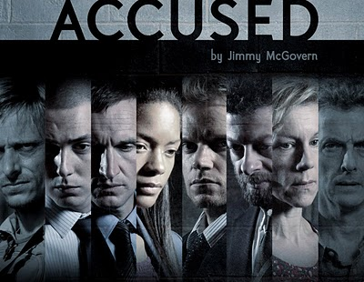
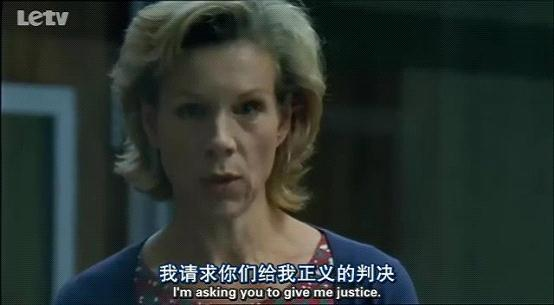
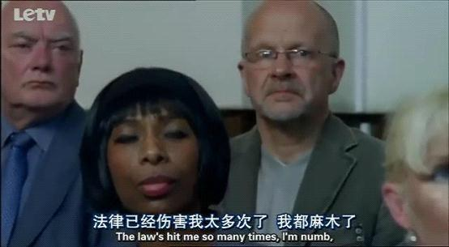
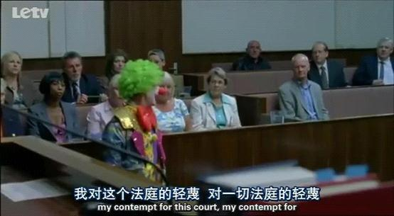

# ＜七星说法＞第六十五期：当法律站在正义的背面 ——评《殊途同归》之《海伦》

**本期说法是英剧《Accused》（直译为《被告》，又译《殊途同归》）第一季第3集《海伦》的影评。这一集故事独立，剧情精彩，时长约一小时。剧透在所难免，先看剧的孩子才是好孩子~~** 视频链接：[http://www.letv.com/ptv/pplay/81280/3.html](http://www.letv.com/ptv/pplay/81280/3.html)

这一系列故事的高妙之处，首先在于编剧锁定了很好的视角：被告。这是带有双重悬念的特殊身份。一个悬念关于过去：他们做了什么而站在被告席上；另一个悬念关乎未来：他们将得到怎样的审判结果？

其次，才是它们背后的深刻性问题。很多人喜欢能引起自己强烈共鸣的作品，其实他们无非是在某种程度上加深和巩固你原本的好恶和价值体系，甚至是对固有认知的一种迎合。我个人还是偏爱这样的作品：**它们撼动甚至于颠覆你之前的深信不疑，让你发现世间的人与事原来还有如此不同的面貌。**那些你崇敬和向往的，会在某些情境中显得苍白无力；而那些你排斥和抗拒的，却能在不经意间触动魂灵。海伦的故事对我而言就有一些类似的意味。

### **不要依据法律，而是依据正义**

海伦对陪审团陈述的最后一段话是这样的：**“当你们下庭去考虑我的行为时，我请你们不要依据法律来判决，而是依据我一直渴望的，小罗应得的，却一直没能得到的东西来判决。我怕这东西已经不复存在了。那就是正义（justice）。我请求你们给我正义的判决。”**说完之后，她便颓然坐下，对于她来说，人事已尽，命运将掌握在陪审团手中。

这段话给我的印象颇为深刻，除了坚定的眼神和语气之外，更重要的是，它直指这样一个事实：**法律和程序不是在任何时候都能成为公平正义的代名词，有时候它们甚至背道而驰。**

在我的概念里，法律长久以来是人们所倚赖和信任的一种裁判规则。在绝大多数情况下，人们相信法律的指向就是公平与正义，相信由法律来调节社会关系会比人情，财富或者权力当中的任何一个更能够让社会的最大多数成员信服。就连法学也因之被冠以“公平正义之学”的美誉。温总理说过，这四个字那是“比太阳还要有光辉”。于是乎，一切和法律扯得上边的名词似乎都顷刻间变得光芒万丈。

**然而，迷信法律也和迷信任何一样东西有同等的危险。**写在《freedom》封面的那句话说：自由带给我们的，原来是幸福之外的一切。在海伦眼里，法律带给我们的，莫非就是正义之外的一切？

私以为，这个故事的结局或者可以保留一个悬念：就在陪审团代表尚未说出审判结果之前戛然而止，让观众自己去给海伦做一次审判。至少我在听到“not guilty”之前是一直没有停止猜测着海伦的结局，并且是倾向于有罪判决。这种倾向估计也只能解释为在中国的特殊法治环境下生活了这么久，对于法律的严格适用几乎要产生某种近乎执念的感觉。

今日的中国，说社会生活的诸多方面尚未完全走上法治的轨道，应该不至大谬。那么在法庭，在适用法律解决争议的地方，“依法判决”难道不是我们最低限度的要求，最基本的期待吗？否则法律无异于名存实亡。“法官或者陪审团做出裁决的唯一依据应当是法律”，我们几乎从不去怀疑这句话。但是海伦的故事里，陪审团和所有庭审的旁观者却又忍不住选择“枉法”，而这一切又显得无可厚非。

### **法律的指向**

法律就算是个最标准的指南针，也有被干扰的可能，何况它并不是，那么法律对正义的指向就不可能有绝对的精确。当法律偏离了这个指向，那么它存在的价值如何体现？正义的标准由谁来确定？

有人会觉得陪审团是因为同情海伦才做出无罪判决，但是在海伦的整个陈述过程中，我没有看到丝毫博取同情的成分。她没有泪水或者忏悔，她坦然承认自己的纵火行为并且不认为这是一件让人羞愧的罪行，而只是需要解释清楚。她更没有因为被告的身份和法庭的环境而丧失了作为故事讲述者的尊严。对了，海伦就是一个娓娓道来的讲述者，她要让陪审团明白自己如何努力地追求正义而不可得。

事实是，海伦面临的是一项证据确凿的严重的犯罪指控，应该说给她定罪是严格适用法律的必然结果。细想想，其实“法不外乎人情”这句话也是值得好好推敲的。关键是人情究竟是何物？是人情关系，还是与理性相对的感性，又或者是习惯，是道德？

海伦的纵火行为是否其情可悯？损毁仓库的财物，甚至可能伤害无辜的人命，这些难道就能够和Rob的死相互抵消来惩罚Alan，来平衡正义吗？我不知道海伦的案件在英国是否有相似的原型，但是无论真实或虚构，能将背后的深层思考以这样的方式呈现出来，编剧和导演的功力可见一斑。

我说不准这个无罪判决是不是正义的，因为这答案难免要牵涉到什么是正义。这样的问题恐怕只适合思考讨论，而无法将答案标准化。当然，这正是一个好问题所能提供真正的价值。

### **敬畏还是轻蔑？**

在海伦的陈述里，我感受到某种要突破法律适用的“越轨”的力量，其实剧中她对法律的态度有很多更直接的体现。比如她说过法律是个笑话。她在向陪审团的陈述中说：让法律去死吧。(To hell with the law.)，然后不甘示弱一般，对着难以置信的法官补充了一句yes。海伦的丈夫装扮成一个荒诞的小丑冲进严肃的庭审现场，只是为了表达他对这个法庭，对一切法庭，对一切与法律有关的事物的轻蔑（contempt）。他唱的那首《desperado》，原唱是美国摇滚乐队老鹰乐队，译为《亡命之徒》，同名专辑讲述的是十九世纪末美国大西部一群真正的不法之徒的故事。种种“离经叛道”之举是不是与我们设想中的法治国家的公民心态大相径庭？

**我们所向往的法治好像是这样一种状态：不单单是立法和执法的规范化，更重要的是，每个公民都应该对法律存有敬畏之心，一种举头三尺有“法律”的敬畏。没有任何力量可以凌驾于法律之上。**

那么陪审团的决定是对于法治的一致背叛吗？还是我们从前对于法治的理解都太过片面和单一？

其实，回头来看看自己，这个问题离我们还有些遥远。虽然对法律的轻蔑在我们身边倒也不少见，司法工作中“枉法”也不是什么新鲜事，但是我们连法律和法治的关系都未必能理得清楚。

都说中国现存的一个极端恶劣的问题是“法治不彰”。于是我们一部接一部地立法，仿佛法律的存在就可以当做法治实现的证明。连某知名律师都在微博简介里写着一句“法律需要被信仰”。**殊不知前者只是有永远有缺陷并且永远滞后于现实的文本，也就是海伦所谓的the book；而真正值得信仰的是后者。法治的背后是一个个兼备理智与情感的人。他们会做出符合人性的价值判断。正因为如此，法治才会成为一代代法律人的终极梦想。**

司法程序曾经一次又一次地将海伦抛向绝望的深渊，让她挣扎甚至于麻木。但是最终她的无罪判决是在什么基础上诞生的呢？与其说是陪审团的同情心，还不如说是一群真正受到法治熏陶的公民做出的选择。

七星说法NO.65（编辑：于轶婷；责编：马特、王卜玄）

**P.S.加入“七星说法读者群”，我们一起说法！群号：262980026。**
