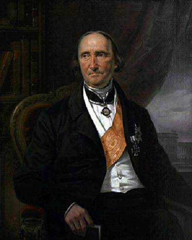
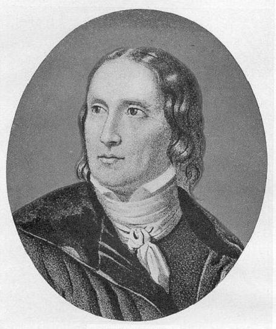
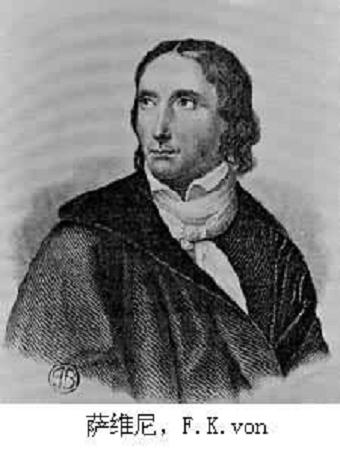
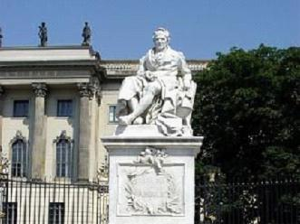

# ＜七星说法＞第六十八期：西陆先贤——“德国历史上最伟大的法学家”萨维尼

公元1779年，这一年是乾隆四十四年。大清依旧强大，皇上依旧圣明。只不过这位贤君的身边又多了一位有才干的年轻人，他的名字叫和珅。公元1779年，有一位船长抽出腰间的弯刀，离开了火堆。他的名字叫库克，今晚过后他的脑袋将挂在土著人的木桩上，只不过他的财宝和故事则变成了永久的传说。

公元1779年，这一年发生了不少事，出现了不少人，但是很可惜上文提到的两位并不是今天故事的主角。让我们把目光从京师从岛屿从海洋收回，投注到德国美茵河畔法兰克福市。

公元1779年，一个男婴被送入人间。

他的名字叫萨维尼。

这个名字来自于萨维尼城堡。和喜闻乐见的高帅富故事一样，他的老爸是法兰克福地区的行政枢秘，坐拥百万家产，生活富足安康。按照俗套剧情的发展，他应该是在爹妈的细致呵护下健康成长然后继承家业，娶一个漂亮的德国姑娘，然后在属于他们家族的领地里骑着高贵纯血统的骏马，踩着落叶，倾听自然的声音。

**可是上帝很显然不愿意这种毫无戏剧效果的高帅富养成计划继续发展下去。在萨维尼十三岁的时候，他的所有亲人都离开了人世，而他是则这个家族唯一存在于这个世界的证明。**

萨维尼困苦的站在人生的转折点上，似乎自己所拥有的一切都被世界所抛弃了。带着些墨绿色的眼眸里隐藏着少年人特有的懵懂与勇敢。此刻的他并不知道，在很久很久以后，人们会为他冠上一个头衔。这个头衔就像是一顶王冠，镶嵌在法学的峰峦之巅，一直闪耀。

**“德国历史上最伟大的法学家”。**

###  少年与成长

少年抬起头，摇曳的烛光将温暖的身影送入自己的眼中。

“可怜的小家伙，以后你就和我们一起住吧！你那不幸的母亲和坏脾气的老爹，他们会在天堂保佑你的，我的孩子。”

说话的人这个人，萨维尼并不陌生。康斯坦丁叔叔，皇家最高法院陪审推事，也是自己父亲的挚友。

“对了对了，差点儿忘记给你介绍了。”康斯坦丁叔叔耸了耸自己浓密的眉毛，一边大笑着一边从自己的背后拖出来一个瘦小的孩子。

“这是我的儿子，小康斯坦丁。来吧，萨维尼，你们两个握一下手，希望你们的友谊可以和我们这些老头子一样，一直坚守下去。”

萨维尼站起身，亚麻白的衬衫将他有些单薄的身材衬托出明显的贵族气质。只不过在昏暗的夜晚，他的眉宇间依稀已经多了许多少年人不曾有过的忧愁。他伸出手，轻轻握住了小康斯坦丁的手。萨维尼的手有些冰冷，而小康斯坦丁的手则带着温暖，掌心甚至还有些汗水。小康斯坦丁的眉毛怒气冲冲的向上挑着，脸上挤出了一个僵硬的笑容。很明显，被老康斯坦丁强行拖来的他，此刻的心情还有些微妙。

“收拾一下行李，我们即刻前往威茨拉尔。”老康斯坦丁踱步到书架前，挑出一本黑色封皮的书，翻看了几页之后满意的点点头。他将书递到了萨维尼的身前。

“拿去看看，旅途可是很漫长的。你可以借此机会了解一下……法律到底是个什么东西。”

老康斯坦丁一边说着一边把自己宽厚的胳膊重重的压在了两个少年的肩上。

“加油吧，小伙子们！等到家以后，我这个康斯坦丁老师就要开始给你们上课喽！”

小康斯坦丁不屑的挪开自己的肩膀，抱怨道：“不要说这么多废话，老头子！”他淡金色的头发在灯光里散发出熠熠的光芒，像是无数闪烁的星星。“只要一谈到法律，他就没完了，要想办法让他打住才行，否则咱们从此以后再也不会享受片刻宁静了。”小康斯坦丁朝萨维尼轻声说道。

老康斯坦丁大笑着，揉了揉自己儿子的头发。

“有什么看不懂的地方可以问问小康斯坦丁，我已经教会他一些了，虽然这还远远不够。”

马蹄声在夜色中响起，只是从此再未停止。萨维尼的脚步并未在威茨拉尔停留太久。

**1796年，年仅十六岁的萨维尼进入了马尔堡大学学习法律，在那里魏斯的学说对他有了很大的影响。仅仅一年之后，他就前往哥廷根大学师从著名的法学家胡果。1800年，他取得了博士学位。**

**那一年，他二十岁。**

从萨维尼与老康斯坦丁一家一起居住到现在为止已经过去七年了，或者说才刚刚过去七年。然而少年总是在不断成长的，随之而来的是上一代的老去。现在的老康斯坦丁真的老了，案牍上的卷宗已经成为大麻烦，尤其是在视力不佳的情况下。听到走廊里传来的脚步声，老康斯坦丁轻轻停下了笔。

“哦，我亲爱的小康斯坦丁，看来你又提前撤退了。”老人笑着说道。

“是的，爸爸。萨维尼还在学校里，他要留下来……留下来完成他的论文。”小康斯坦丁把手杖轻轻放在门口的杖筒里，然后缓缓解开了大衣的扣子。

老康斯坦丁指了指桌子对面的椅子，示意让自己的儿子坐下。

“你们两个的关系现在可不怎么好。我必须说实话，我的儿子，我还记得那时候萨维尼刚搬到我们家的时候，你还给予了他很多无私的帮助……”

“我知道，爸爸。但是……事实证明，这只是暂时的。”小康斯坦丁苦笑着。“他是……他是……”小康斯坦丁踌躇了一下，还是说出了那个词。

**“Studiermaschine。”**

**“他是学习机器！不仅仅是我们，就连老师都是这么说！他似乎天生就是为了法律而生！您见过有哪个人在十六岁就可以背诵所有法条，在二十岁就拿到了博士学位。他是天才，而我们只是凡人！”**

老康斯坦丁静静听着自己儿子的话，然后轻轻叹了一口气。

“我的儿子，即使是天才，也是需要朋友的。而你，就是他的朋友。”

已然英俊的少年站起身，无奈的笑着说道：“我当然明白，我的父亲。另外，我不得不先回我自己的房间里。萨维尼最近爱上了一个姑娘，我还要帮他完成一封情书和三首情诗的任务。至少，在这个方面，我永远比他更有天分。”

###  爱情与法律

“布伦塔诺小姐！没想到这么巧啊！”

萨维尼本来略显苍白的脸上此刻却带着些难得的红晕，疏且长的睫毛遮挡住他的目光。黄昏的日光透过斑驳的树叶，照在他的身上，好像为他莫名增添了一层光晕。黑色的上衣将他的线条拉的修长，深褐色的靴子踩在枯败的落叶上，带着沙沙的声响。

“萨维尼，如果每天你能不再重复这同一句话，我们就不会那么巧了。”布伦诺塔皱了皱自己的鼻子，湛蓝的眼眸看着对面的青年。毫无疑问，他是英俊而又充满致命魅力的。女人都喜欢聪明而又神秘的男人，尤其是他还带着些羞涩的时候。

萨维尼快走几步和布伦诺塔站在一起。

“你知道吗？我最近一直在研究一些法律问题，还真是很有意思。一个德国人到了法国，应该由何种法律约束他呢？两个外国人签订了货物买卖合同，这个合同应该适用什么合同？真是值得思考的啊！”萨维尼低着头着说道。

“噢！你又开始你这些深奥的法律思考了。”布伦诺塔带着些小小的抱怨说道。

“不不！亲爱的布伦诺塔，你听我说完。我觉得世界上所有的法律关系，都是有其根本的。花有须树有根，只要究其源头，就能找到所对应的法律。我把这种源头称作本座。最能代表这种事物特征之处就是其本座！比如货物的履行地，比如加工所在地……”

萨维尼停下脚步，抬起头，看着布伦诺塔，沉声说道：“就和一个人的心所在一样……”

布伦诺塔巧笑着，她伸出手整了整萨维尼有些歪扭的领口。

“好吧，萨维尼先生，请问你的法律关系本座在哪儿呢？”

“哦，这个……或许，我想，大概，如果你允许的话，是在你的心里吧。”

萨维尼一下子变得有些结巴起来。

布伦诺塔脸上的羞涩突然涌了上来，她有些害羞的退后两步，两只手背在身后。贝齿轻轻咬着嘴唇，嗔怪的说道：“你这个家伙在说些什么啊！这算是某种表白吗？”

萨维尼耸了耸肩，不置可否。

布伦诺塔的嘴角挂着略带羞意的微笑，轻声对萨维尼说道：“我还是喜欢更直接一些的话哦，你这种法律学术派可不符合我的要求。你有试过像英国人一样说一句I LOVE YOU吗？”

萨维尼摇了摇头，故作严肃的说道：“一个自我要求的法学人怎么会允许自己这么说呢？”

布伦诺塔轻轻踮起脚尖，像是晨星的眼睛紧盯着萨维尼挺直的鼻梁。

“那你会怎么说呢？萨维尼先生。”

萨维尼抬起手，放在布伦诺塔的头顶上，柔顺的头发沿着他的掌心向下蔓延。

“从此你便享有了我的所有权，请行使占有、使用、收益、处分的权利吧。”

###  格林和童话

沉重的敲门声突然响起，就像是窗外阴云中猛然炸响的雷。

一顶黑色的毡帽率先挤进了门缝，紧接着是一张瘦长的脸，雨水顺着来者的鼻梁一滴滴垂下。他用手撑着门，一边躬身向着萨维尼夫人打着招呼。只不过身子却别扭的厉害，好像在他的身后还有一头健壮的小牛不停的顶撞着。

“我亲爱的哥哥！求求你快些进门吧，我和你一样都湿透了！”

几乎一样瘦长的脸也涌进了房间里，只不过这张脸上多了两撇漂亮的小胡子，看上去增加了点儿滑稽的色彩。

萨维尼发下了手中厚重的书籍，他有些无奈的看着门口湿漉漉的两人。

“好吧，你们兄弟两个又为你们的童话故事集想到了新的点子吗？”萨维尼平淡的问道。

“噢！老师，请不要这么波澜不惊！您可知道我们兄弟两个为了这些故事耗费了多少心血吗？不过不要紧，今天我们带来了绝佳的素材，您听了之后一定会被吸引的！”

“早已不再年轻的小伙子们，你们这些借口我已经听了很多年了。”萨维尼夫人轻笑道。

“是啊是啊，那个时候您还不是萨维尼夫人，亲爱的布伦诺塔小姐！”小胡子开心的说道。

“亲爱的，麻烦你让厨娘倒些热茶来，加点儿糖，温暖一下这两个可怜虫。”萨维尼用手支撑着额头，语气里颇有些散漫。“反正今天的天气也很糟糕，听听你们搜集的故事也好。不过不要寄希望我也参与到你们的创作中去，这是不可能的！我最多只是听众！” 在萨维尼夫人的帮助下，兄弟两个已经脱下了身上的湿衣服，它们被架到了壁炉旁，袅袅的水雾升起。

“啊哈，一个绝佳的故事！年轻美丽的公主遭受了诅咒，她必须遭受巨大的磨难，于是她许愿谁能拯救她，她就嫁给谁。谁曾想池塘里的青蛙成了英雄。于是她必须嫁给一只青蛙！这只青蛙到了晚上就会变成美少年，但是一到白天就只得披上青蛙皮恢复成动物的模样。终于有一天，公主藏住了青蛙皮，美少年再也变不回去。两个人过上了幸福快乐的生活！怎么样？老师！”

萨维尼想了想，回答道：“青蛙皮可不是夫妻共同财产，公主是无权占有。但是故事还不错，我想孩子们会喜欢的。一个…….青蛙变王子的故事，还不错。”

“哥哥，你这个故事简直太俗套了！不如听听我的！”小胡子兴高采烈的说道。“在很久很久以前，有一个风流的国王，他在一次出巡中无意和一名农妇结下了男女事实。谁曾想，那农妇竟然就此怀孕，并且生下了一名男婴。只可惜那男婴长得又矮又挫家里又很穷苦，大家都称他为小矮人。”

“回到王宫里的国王几乎把农妇忘掉了，也许正是他的风流使然，从此他与他的女人们再未生过一个男孩。直到小矮人长大到十八岁，找到了皇宫来，他才想起有这么个儿子。本来应该父子相认，但是皇后此时出现了，她有一面魔镜，世界上什么问题都可以回答。皇后她已经怀有了身孕，并且通过魔镜得知怀的是一名男婴。只可惜，当她问道这个国家的最终继承者会是谁时，答案却是那个小矮人。”

“为了她自己，以及她的孩子。她不得不使出毒计害死小矮人。小矮人虽然样貌一般，但是智慧超群，他识破了计谋，逃进了一片森林。”

“在那片森林里，住着七位肤白如雪华贵如公主的少女……”

萨维尼有些头疼的摊开手，他不得不打断小胡子的发言。

“我的学生，你跟随我学习法律也有很长时间了，何至于思维如此之混乱，逻辑如此之不堪？”

“一个小矮人和七个白雪公主？那不是童话故事，那是恐怖故事！”

萨维尼夫人轻轻拍了一下萨维尼的肩膀，笑着说道：“不要老是打击他们，说不定什么时候，他们兄弟两个编写的童话会比你写的所有书都出名！对于世人来说，晦涩的法律书籍可不像童话那么有意思。”

“如果真的有这一天，我们一定让所有出版的童话集扉页上都写上献给伟大的萨维尼夫人！”小胡子放下手中的茶杯，激动的说道。“过两天，我们还要出发去莱茵河左岸瞧瞧，收集更多有趣的素材！”

萨维尼听到这番话，悄悄垂下了眼睑。

他嘶哑的说道：“波拿巴的军队早就占领那里了。他们已经狠狠的割下来一块肉，紧接着就是法国人向我们心脏刺来的尖刀了！”

###  矮子与伟人

窗外的雨一直没有停过。

不知道从什么时候开始，谈话的气氛变得有些压抑起来。

萨维尼站起身，走到了窗前。一片片阴暗的云低矮的侵袭着屋顶，闪电不停的划破宁静，伴随着一阵阵巨大的轰鸣。就像是不断进逼的法国军队，欧洲最强大的陆军！他们已经不远了！波拿巴的野心把德意志摧残的风雨飘摇，而自己能做的却只是站在这里看着。 看着暴雨演变成洪水，再看着洪水变成席卷国家的滔天巨浪，最终灭亡。

“听说拿破仑要编一本法典。”兄弟二人中一向冷静的哥哥轻声说道。“他已经召集了很多法国的学者进行讨论，昨天好像已经有初稿面世了。”

萨维尼用双手轻轻握住窗户的把手，低沉的回答道：“是的。这个矮子妄图编写一部前所未有的法典！他甚至希望每一个坐在农舍里的农夫也能读懂这些法律条款。”

“多么愚蠢……而又……”

“而又多么伟大啊！”

“但是！”

他转过身，看着自己的夫人和学生。

**“但是德国一定不能出现拿破仑法典！甚至我们自己做法典化也是浪费时间的。因为个体差异和殊化仍然存在，普通法依然是普遍的基础。它可以让所有德国人记住……记住我们是怎样的流着共同的血液。”**

**“法律就像是一个活着的人。”**

**“他延续自上一代的血肉与精神，并且将这些东西传承至下一代。它代表的是一个民族的精神！就算是我们死了，千千万万的人死了！死在该死的法国佬的枪下，死在该死的拿破仑的军刀下，我们的民族不会灭亡！我们的精神……我们的法律，还会代替我们活着。”**

**“拿破仑是旧时代的掘墓人，而他的法典也是埋葬旧时代的铁锹！但是我们，我们……我们并不能甘于做时代的牺牲品。我们应该想想！想想怎么样才能超过，才能延续，才能创造，属于我们自己的法律。创造出自己的无形的力量！”**

萨维尼的双手紧紧的交错握着，就好像自己在和自己比拼力气。他的眉头紧紧的皱起来，脸色也变的苍白。略带弯曲的头发遮住了他的眉梢，但是却无法遮挡他熠熠闪光的双眼。

“为了民族而战！”

刺痛双眼的闪电在他背后响起，滚滚的雷鸣彻底湮没了他振聋发聩的呼喊。

### 尾声

**这个男人二十岁成为博士，二十二岁成为格林兄弟的老师，二十三岁发表著名的《财产法》。他是国际私法的创始人，**

**他是历史法学派的重要代表，他是国务委员会主席，他是立法委员会首脑，他是黑鹰勋章的获得者。**

他先后在莱比锡大学、耶拿大学、哥廷根大学就读。一八一四年为一篇著名的论文进行答辩，该论文就是 Über die Notwendigkeit eines allgemeinen bürgerlichen Rechts für Deutschland （关于一个一般的德意志民法的必要性）。

一八一五年他创立历史法学派杂志社，作为历史法学派的机构。一八三五年开始撰写《现代罗马法体系》一书，同时兼任柏林大学校长和普鲁士王子的法学教师。一八四二年到一八四八年他任普鲁士政府的修订法律大臣。

他创建了法律关系本座的学说。他推动了欧洲冲突法的法典化和冲突法的趋同化。他使国际私法从荷兰学派开创的特殊主义重新回到普遍主义的轨道上。

**萨维尼，赋予这个名字之上的光环太多了，多到我们不愿也不想再提及，唯恐这么多的称号掩盖了他本来的面目。掩盖了这个英俊潇洒才华横溢的人。**

当然，现在停留在我们脑海里的萨维尼，可能更多的是国际私法或者法律史上的他。寥寥数行简单勾勒出几乎与白描的人物，终究难以铭记一生。

**故事的终结是在一八六一年的十月二十五日。**

**威廉一世亲自为他致悼词，全部王子出席葬礼并致哀。**

**那一天，柏林下着大雨。**

（编辑：戴正阳；责编：石味诗、伍永兴） **P.S.加入“七星说法读者群”，我们一起说法！群号：262980026。**
