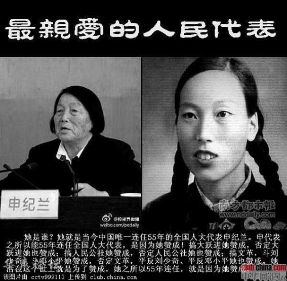
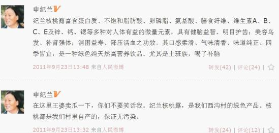
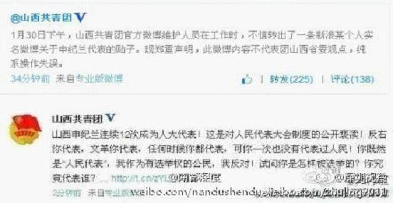
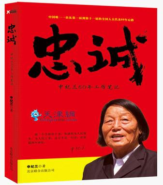

# ＜七星说法＞第六十六期：从申纪兰女神说开来去

有一天，我被问到一个问题：“喂，你这个学法的说说看，人大代表和政协委员有没有连任的限制？”我朴素的法律情感告诉我，一定是有的！但我搜索了一圈大脑里的宪法学知识后就不再那么坚定了，觉得，应该……会有吧？这时，提问者邪魅一笑，“啧啧，你还嫩得很~去看看申纪兰的故事吧！”

于是我才第一次走进了这位女神的世界。

窃以为申老太太的女神称号是当之无愧的：这位老太太生于1929年，是山西平顺西沟人。现任山西省长治市人大常委会副主任，平顺县西沟乡西沟村党总支副书记、西沟“金星经济合作社”社长。1952年第一次被评为全国农业劳动模范。1953年，去哥本哈根出席了世界妇女大会。1979年、1989年两次获全国劳动模范称号。1983年获全国三八红旗手称号。2007年获首届全国道德模范称号。被几代党和国家领导人多次接见。最重要的是**她自1954年当选第一届全国人大代表后，一直连任至今，是中国唯一一位连任一至十二届的全国人大代表。**

申老太太的生活一直朴素，她有着**朴素的金钱观，朴素的信仰观，朴素的是非观。**

**她做厅级干部三十多年但一直没要过工资，在2008年5月将“一生的积蓄”一万元捐赠汶川地震灾区。**但后来媒体又爆出其实她是一家注册资金五千万元的贸易公司的董事长，还有一家房地产公司，拥有“申纪兰房地产开发公司”“山西申纪兰贸易公司”，对此，申老太太的回应则是：曾办过公司，钱是由村集体出的，后来转让了，她未从中赚取钱。

**她一生对党忠诚**，2010年的时候曾表示：“我非常拥护共产党。当代表就是要听党的话，我从来没有投过反对票。”这一言论引发了广泛的社会争论。而申老太太则在次年回应称，作为人民代表大会制度的见证人，内心拥护的事，她就赞成，不拥护的，她就不投票。去年她还为自己不和选民交流作出的解释：“我们这是靠民主选举的，你交流就不合适，不选你，你就不要去麻烦人。”

她说自己不上网，但是对网络有些意见。她说有些人在网上看了不正当的东西，就毒害青年了。“我有个想法，网也应该有人管，不是谁想弄就能弄，就跟人民日报一样，外国那些人那是瞎弄的，咱不能这样，咱要按照原则去弄，不要好的弄成坏的了，想说什么就说什么，咱是共产党领导下的社会主义国家。”“这个网，你谁想上就能上？还是要组织批准呢？”申纪兰设问之后，表示对这个问题没有想出答案。令我不解的是申老太太明明在《人民网》开有认证微博啊，还一直倾力推销“纪兰核桃露”。

以上内容槽点太多，不知从何吐起。也就是这样一个84岁高龄的老人，从第一届人大开始，代表了人民60年。

克林顿曾这样议论卡斯特罗：“上幼儿园的时候，他是总统； 我上小学的时候，他是总统； 我上中学的时候，他是总统；我上大学的时候，他是总统； 我工作之后，他还是总统； 我结婚之后，他还是总统； 我当总统了，他仍然是总统；我下台了，他仍然是总统……”

同样，克林顿也可以这样说：“上幼儿园的时候，她是代表，我上小学的时候，她是代表； 我上中学的时候，她是代表；我上大学的时候，她是代表； 我工作之后，她是代表； 我结婚之后，她是代表； 我当总统了，她是代表；我下台了，她是代表，后来我老婆当国务卿了，她是代表，我老婆又卸任国务卿，她还是代表……”

还有网友戏称“申纪兰**叕叕叕**当选全国人大代表”——正好拼成12个“又”，极富创意。

更劲爆的是，申老太太连任第12届的消息公布的那天下午，山西共青团官方微博怒斥申纪兰12次当选人大代表，是对人大代表制度的公开亵渎。原文：“山西申纪兰连续12次成为人大代表！这是对人民代表大会的公开亵渎！反右你代表，文革你代表，任何时候你都代表，可你一次也没有代表过人民！你既然是“人民代表”，我作为有选举权的公民，我反对！试问你怎样被选举？你究竟代表谁？”之后自然马上就是“颤抖式解释”，说此言论绝不代表团组织，完全是个人行为等等。不知这位发博者随后的命运如何，但他一定顿悟了申纪兰的选择——**在中国投反对票实在不是那么容易的事。 **

申老太太这种女神级的“人大制度活化石”的出现引发了我对人大代表连任的探究，请跟我一步步走来看看。

虽然资料和事实都表明，**我国对于人大代表和政协委员的连任是没有限制的**，我也不认识全国代表和委员那么高端的人，但是在我生活的城市，问了几个认识的市级人大代表和政协委员后，发现他们对于连任这种事情的发生并没有一个确切的认识，只是说：“诶？大部分人都是两届的，按规定一般能连任两届吧~”而又完全说不出是哪条哪框的规定。

这个现象就很奇怪了，“一般能连任两届”总是隐隐约约指向了某些政治因素。为了找出这个所谓的“规定”，我去政府法制办寻查一番，最后被告知我们这儿的各种地方性法规完全没有对人大代表和政协委员连任次数的规定。

那么这个像是约定俗成的“连任两届”是从何而来？政治因素在背后又占到了几成分量？

还得从人大代表任期的沿革说起。

1993年修改过的宪法规定“全国、省、直辖市、县、市、市辖区的人民代表大会每届任期五年。乡、民族乡、镇的人民代表大会**每届任期三年**。”**到了2004年的宪法修正案延长了乡镇人大任期，统一规定全国和地方各级人大每届任期都是五年**。对于这样一种变化，全国人大常委会副委员长王兆国在宪法修正案草案的说明中做了如下解释：“**宪法修正案草案把乡、镇人大的任期由三年改为五年。这样，各级人大任期一致，有利于协调各级经济社会发展规划、计划和人事安排。**”细细品味，乡镇人大和乡镇长任期变化，在修宪者看来，**主要还不是“延长”，而是“一致。”即各级人大任期一致。也就是说，任期延长只是手段，任期一致才是目的。**

**那为什么是5年？5年正是中国共产党中央委员会的任期。1978年11届3中全会以后，中共中央全会的任期稳定下来，党的“几几大”总是比全国人大提前一年开始，也提前一年结束，正好为全国人大“经济社会发展规划、计划和人事安排”提前做出准备。**

这样，全国各级人大的任期与党和国家领导人的任期就像被按下了“同步”键，人大任期向上看齐的过程，实际上是国家宪政周期迁就政党政治周期的过程。领导人十年一次大换血，一般连任两届，各级人大和政协同样的“一般连任两届”也就不奇怪了。

这种制度产生的后果有：

一、如果上下级任期不一致，则下级必然人事变动频繁。人大任期向上看齐，的确**“有利于协调各级经济社会发展规划、计划和人事安排。”**

二、乡镇人大也改为5年一届后，选举的次数减少，这固然有节省选举费用、稳定干部任期的好处，但也造成**公民政治参与度的下降**。比如一个选民从18岁到78岁，如果是三年一届的任期，他选择代表的机会是20次，如果是五年一届的任期，他的选择机会就变为12次。（关于人大代表选举制度请戳这里：[/2012/03/19630](/2012/03/19630) ＜七星说法＞第十八期：你和我，都是国家的主人）

三、任期一致使得从中央到地方同时十年一次大变样，这是否意味着，中央政府能够像清代一样，一直管到县级官员的任免呢？“人走政息”的现象会不会加剧？

扯得有点远了，再回来看申老太太。

先不说连任可能存在的“潜规则”，就算连任没有任何限制，我们也不得不承认当了十二届代表的申老太太绝对是一个逆天的存在。她当代表的这些年“大鸣大放举手鼓掌，斗私批修举手鼓掌，大跃进举手鼓掌，文革举手鼓掌，打倒四人帮举手鼓掌，分产到户举手鼓掌，改革开放举手鼓掌……一直举手鼓掌”，连任十二届才不是个轻松的活儿。

人民代表大会上反对票的无力早已不是什么新鲜事。第一张反对票在全国人代会上出现是1988年3月28日，来自台湾代表团的代表黄顺兴走到话筒前，大声说：“我反对！”在黄顺兴投反对票之后的全国“两会”投票中，反对、弃权者愈来愈多，1989年全国人大会议表决国务院提出授予深圳特区立法权时，反对票加弃权票多达1079票。可是那又如何呢？三年后深圳依旧得到了立法权。（深圳立法权的详情请戳这里： [http://gd.nfdaily.cn/content/2010-09/06/content_15594636.htm](http://gd.nfdaily.cn/content/2010-09/06/content_15594636.htm)副省级城市拥有立法权 深圳成全国第一个）

还是想想八戒临死前三天……不，是对公安系统造成了巨大冲击的《律师法》通过前三天公安部腹诽的话吧：“我都说了！什么通不通过怎么通过什么的，这种法律怎么会被提上议案更别说通过什么的别老开这种黑色玩笑了！呃……不是玩笑？”指望着人代会阻止某些事情，果然还是too young，too simple，sometimes naive。

而对于这样一个耄耋之年的老人家，我从情感上并不想对她刻薄，也不指望申老太太能顺应时代潮流、接受新鲜事物、理解民主的意义、深度挖掘解决“三农”问题、身体力行体察民情、甚至投出一张反对票。可这恰恰是问题的症结所在：**我们需要更年轻的代表，能够跟着时代不断的前进，能够提出建设性的意见，既享“权为民所授”之名，就该行“权为民所用”之实。因为每个人大代表都是这个国家权力机构的灵魂，他们运转，这架机器就能发出美妙的响声；他们静默，这架机器就难免卡壳。**

今年的两会马上就要开了，下一代的领导人即将敲定，申老太太也依旧会穿着黑布鞋走入会场。如果人民大会堂会说话它一定惊问：“how are you？怎么是你？how old are you？怎么老是你？？”**当女神也很辛苦的，希望老人家能早点卸下重担，回家颐养天年。**

  【深度阅读】 申纪兰个人微博 [http://t.people.com.cn/336016](http://t.people.com.cn/336016) 李承鹏：长江后掌推前掌 [http://www.21ccom.net/articles/dlpl/shpl/2013/0204/76500.html](http://www.21ccom.net/articles/dlpl/shpl/2013/0204/76500.html) 申纪兰叕叕叕 代表人民60年 [http://star.news.sohu.com/s2013/wbzj5/](http://star.news.sohu.com/s2013/wbzj5/) 维基百科——申纪兰 [http://zh.wikipedia.org/wiki/%E7%94%B3%E7%BA%AA%E5%85%B0](http://zh.wikipedia.org/wiki/%E7%94%B3%E7%BA%AA%E5%85%B0) 乡镇人大任期为何延长 [http://article.chinalawinfo.com/article_print.asp?articleid=27245](http://article.chinalawinfo.com/article_print.asp?articleid=27245) 【“两会”的民主细节】表决器上的民主——全国人大代表们投票的逻辑与说“不”的进程 [http://www.infzm.com/content/42732](http://www.infzm.com/content/42732) 【南方周末】我们期待怎样的人大代表 [http://www.infzm.com/content/71802](http://www.infzm.com/content/71802) 

七星说法NO.66（编辑：石味诗；责编：戴正阳、陈澜鑫）

**P.S.加入“七星说法读者群”，我们一起说法！群号：262980026。**
