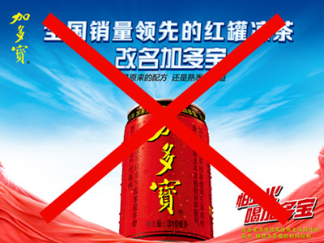
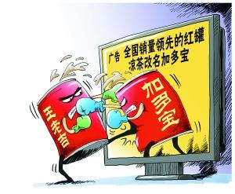
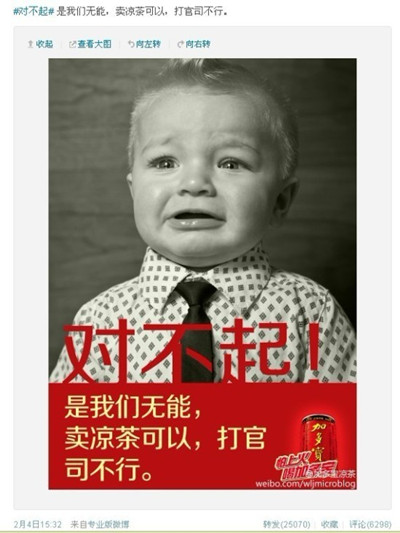

# ＜七星说法＞第六十四期：透视行为保全制度

日前，广药王老吉向广州中院申请禁令，广州中院做出了对广药王老吉有利的**裁定，要求广东加多宝饮料食品有限公司等被申请人立即停止使用特定的宣传用语**（**“王老吉改名为加多宝”、“全国销量领先的红罐凉茶改名为加多宝”或与之意思相同、相近似的广告语**），这一禁令的签发也引起了一阵激烈的讨论，其中牵涉的**行为保全制度**也是新民诉法（即2012年所通过的民诉法修正案修正后的民诉法）生效后，该项制度的首次运用，那么本期我们就顺着该案来透视一下这个全新的制度。

行为保全制度是新民诉法对旧民诉法所做改动的亮点之一，它将以前仅针对财产的保全制度扩展到了行为领域，具体表现在以下两个法条的变动：

旧《民诉法》第九十二条第一款：人民法院对于可能因当事人一方的行为或者其他原因，使判决不能执行或者难以执行的案件，可以根据对方当事人的申请，作出**财产保全**的裁定；当事人没有提出申请的，人民法院在必要时也可以裁定**采取财产保全措施**。

而新《民诉法》第一百条第一款：人民法院对于可能因当事人一方的行为或者其他原因，使判决难以执行或者造成当事人其他损害的案件，根据对方当事人的申请，可以裁定**对其财产进行保全、责令其作出一定行为或者禁止其作出一定行为**；当事人没有提出申请的，人民法院在必要时也可以裁定**采取保全措施**。

对比以上两个条文，我们可以清楚的看到，在保全制度上，新民诉法做了较大的修正，**保全的对象由财产扩大到了行为**，根据新民诉法第一百条的规定，今后法院在审理民事案件时，不仅仅可以对财产执行保全措施，也**可以对当事人的行为作出保全裁定**。

### 一．什么是行为保全

**行为保全，顾名思义，就是对行为进行保全程序，保全制度是保证民事诉讼活动顺利进行的一项制度，在被申请人的活动足以影响到申请人的权益或者正在进行的民事诉讼程序难以顺利进行的情况下，申请人可以向法院提出申请，由法院作出裁定，限制被申请人的相关财产，或者要求被申请为一定的行为或不为一定的行为。**

****在旧民诉时代，由于法条明确规定，只能对财产执行保全程序，故而申请人只能针对被申请人的财产提出保全申请，法院根据相关申请，裁定对相关财产进行限制，比如查封、扣押、冻结，而在民诉法修订以后，增加了行为保全，申请人可以针对被申请人的行为进行申请，一旦申请成功，法院就可以裁定对被申请人的行为进行限制。可以说，行为保全制度的搭建，是新民诉法对保全制度的完善，从而建立了一个更为完满和合理的保全制度。

说到行为保全，肯定让很多人先想到了知识产权领域的**临时禁令制度**，其实两者还是存在着很密切的关系，知识产权领域里的**临时禁令制度可以被看作是行为保全在该领域的具体化**，根据TRIPs协议，临时禁令制度是知识产权领域的一项重要制度，而我国在加入WTO之后，也根据TRIPs的相关规定，建立了临时禁令制度。而现在新民诉法的相关规定更是将原本局限于特殊领域的行为保全制度推向了更为广阔和一般的范围。

### 二．为什么要建立行为保全制度

行为保全制度从它的制度构造就可以看出，这是一个程序性的、保障性的事项。它的建立既有历史渊源因素的影响，亦有外在必要性和内在特性的支撑。

首先，从**历史渊源**来讲，行为保全制度**可以上溯至罗马法时代**，古罗马的执政官可以在受害人的请求下，发布禁止从事某项行为的命令，这种禁止令状已具有保证诉讼顺利进行，保证执行以及维护当事人权益的作用，发展到后来，经历了教会法、王室法，类似的制度在普通法、衡平法体制下得到发展，到如今，英美法中的禁令制度也在发挥着重要作用，英国法中存在着中间禁令，而在美国，则表现为临时禁令和预备性禁令，另一方面，大陆法系中，也存在着相类似的制度，德国和台湾地区现有临时扣押和临时处分制度作为行为保全的体现。

其次，从这个制度存在的**必要性**来看，行为保全也是民事诉讼中所必不可少的，结合上文中提到的行为保全制度的作用，我们也可以窥探这项制度在民事诉讼中的巨大影响。当我们把眼光放到TRIPs上，更是可以发现，这项制度也是当今全世界的共识，至少在知识产权领域，已是国际社会都认可的一项制度。而反观我国，由于加入世贸组织的原因，我国早已在知识产权领域开始了这项制度的探索和运用，而在海事诉讼领域，海事请求保全和强制令也体现了这项制度的影子，但是在其他领域，法律一直在这个问题上没有交代，所以作为民事诉讼所应遵循的最一般法律，新民诉法推出行为保全制度，在最为一般和广泛的范围内架构了这项具有重大意义的制度，发挥它的作用。

最后，从这个制度的**内在特性**，我们也可以看出这项制度的优越性。在学者看来，行为保全制度具有以下这些优点：简易性、临时性、无审性、辅助性。这些特性也保证了行为保全制度在实现保障执行、保障当事人利益这些目的的优质选择。相比于行为保全制度，我国一直存在的财产保全制度和先予执行制度有着自己的缺点。**财产保全制度**，显然在它的范围上显得过于狭窄，只局限于财产，**对于除了财产之外更为广泛的行为领域，对可能损害执行程序和当事人权益的行为，我们无法在财产保全制度中找到法律依据**，而与行为保全制度有几分相似的**先予执行制度**，也不能完全用来替代行为保全制度。先予执行制度**有着明确的范围**，根据法律规定，先予执行的范围局限在：1．追索赡养费、扶养费、抚育费、抚恤金、医疗费用的；2．追索劳动报酬的；3．因情况紧急需要先予执行的。先予执行应当限于当事人诉讼请求的范围，并以当事人的生活、生产经营的急需为限。而且在**启动程序的要件**上，先予执行也必须要求是当事人之间的权利义务关系明确的案件，同时，在制度所要实现的**目的**而言，先予执行也与行为保全制度不尽相同，**先予执行制度的目的在于在本案判决之前部分或全部实现申请人之诉求**，意即，先予执行所执行的是将来所要执行的诉求的部分或全部，在裁定先予执行的同时，法院已对案件本身进行了一个预审，至少在法院看来，被申请人在未来有较大可能要承担执行诉求的义务，而**行为保全制度相比之下则是一个更为中性的制度，只是针对被申请人可能侵害执行和申请人权益的行为进行限制，从而保证诉讼的顺利进行和执行的展开**，并不认为被申请人在涉诉案件中必然会成为败诉的一方。所以我们也可以看出来，虽然先予执行制度在某种程度上给我们带来的限制或禁止行为的观感，但不能认为它可以代替行为保全制度，行为保全制度仍有存在的必要性。

### 三．如何看待行为保全制度

在讨论这个问题前，我们先重新把眼光放回到这个案子上，**广药王老吉为何要突然向法院申请禁令**？我想有一篇报道可以来给我们一些提示，根据《时代周报》的一篇报道，据不完全统计，加多宝和广药王老吉在2012年下半年为2013年春节期间的广告营销分别投资了接近8亿元的巨资，而在春节临近这个节骨眼上广药王老吉提出行为保全申请并获得法院支持，则很有可能使得加多宝在春节期间的广告营销全面落于下风，造成严重损失。从这点上，我们也可以看出，**行为保全制度一个很明显的特点是，一旦申请方提出的申请得到支持，那么被申请方很有可能因为其某种行为的被禁止而遭受严重的损失**。而如上文所述，行为保全制度是一个中性的制度，并不对涉诉案件做出事先的判断，万一申请方在涉诉案件上的诉求不能得到支持，那么被申请方的损失又将如何得到弥补？

以上的问题也是各位学者在讨论行为保全制度所都要涉及的问题。根据新《民诉法》的第一百条第二款：人民法院采取保全措施，可以责令申请人提供担保，申请人不提供担保的，裁定驳回申请。可以明显看到，**在担保问题上，目前民诉法采取的态度是“可以”而不是“必须”**，那么在这里，法官的自由裁量权便有了很大的发挥空间，什么时候可以？什么时候不可以？结合到我国现在的法治现状，这样的安排是否适当，仍值得思考，仍需进一步观察。

除此以外，台湾学者的一些观点也值得我们思考。行为保全应该受到以下限制：1．**应受当事人在本案可要求的范围限制**。当事人在本案中可以提出的利益请求是保全措施所能及的利益范围的最大值。且当事人在本案中也仅可以向法院就“本案请求的执行名义效力所及之债权人及第三人”行为申请保全。2．**因行为保全的暂时性所受到的限制**，保全是一种暂缓制度，功能仅在于保障和暂时满足，其效力与结果不应与最终判决相同，因此在保全方式上应区别于判决的执行且要慎重考虑被保全的行为是否有回复原状的可能。

对行为保全制度的探讨到此基本结束了，但是笔者仍想宕开一笔，广药和加多宝对于“王老吉”这个金字招牌的争夺从商标授予合同到包装再到宣传标语，这一系列案子已经成了《商标法》、《反不正当竞争法》的经典案例，这对法学院的学生来说是好事，但是对于这个曾经的吸金利器是否是个好事，看来还真不一定。**从2011年4月广药提出仲裁申请开始，在将近两年时间的肥皂剧中，谁输了里子，谁输了面子，或者谁既输了里子又输了面子，每个人都有自己的想法，法律只能解决法律可以解决的问题，但是对于一个品牌的营销和维护则更在法律之外。**

图片出自加多宝凉茶官方微博

【深入阅读】： 《王老吉诉加多宝虚假宣传 诉中禁令暗藏杀机》 [http://www.ce.cn/cysc/sp/info/201301/24/t20130124_21325000.shtml](http://www.ce.cn/cysc/sp/info/201301/24/t20130124_21325000.shtml")<a 《广药诉加多宝虚假宣传 加多宝改名广告词叫停》 [http://food.southcn.com/c/2013-02/01/content_63270751.htm](http://food.southcn.com/c/2013-02/01/content_63270751.htm) 《浅析民事诉讼中行为保全的若干问题》，赵沛沛，《山西省政法管理干部学院学报》2007年3月，第2o卷第1期 观 《<民事诉讼法>修正案草案中行为保全制度的回归》，金健，《广州广播电视大学学报》，2012年第1期(总第50期) 《关于民事诉讼行为保全若干问题的法律思考》，陈娴灵，《东岳论丛》，2005年9月第26卷第5期 

七星说法NO.64（编辑：林骥；责编：陈澜鑫）

**P.S.加入“七星说法读者群”，我们一起说法！群号：262980026。**
