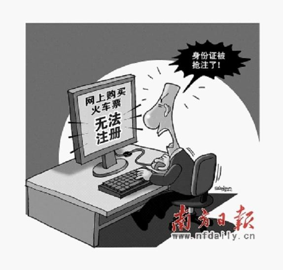
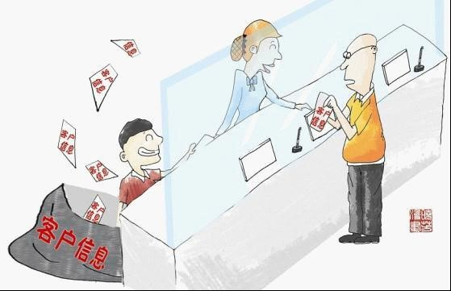
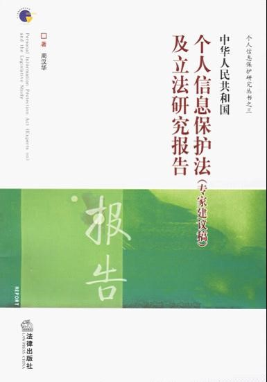

# ＜七星说法＞第十一期：您好，我是X经理

**本期导读：** **“亲，没接到过保险公司推销电话的请举手！没收到过‘本公司出售无抵押小额贷款，有需求请速联系王经理’短信的请举手！没收到过垃圾邮件的请举手！好，请举过手的朋友移步，你们是信息时代的幸运儿。没有举过手的朋友，你们应该清楚地知道，你们每个人的信息都被泄露或不当使用过。那么，你知道你的个人信息是如何被泄露的？信息被泄露了，你可以去找哪些部门机构？信息被泄露造成你的经济损失，你又该找谁赔偿？有什么法律能够保护你的信息安全吗？”** **本期七星说法将从个人信息泄露的事件谈起，揭示信息泄露的源头和个人信息滥用的几种途径，进而展开我国目前个人信息保护的相关法律法规，并希望与读者共同探讨这样一个问题：如果你是立法者，你希望《个人信息保护法》应该是怎样的法律，规定哪些内容，才能够确保你不被骚扰，或者在你的合法权利被侵犯后，有途径去维护自己的权益？**  

# **第十一期：您好，我是X经理**

## 

 

### 信息安全跨年大戏

2012年跨年大戏未等春晚开播，早在2011年就拉开序幕。

首先出场的是CSDN网站表演“黑客帝国”无声话剧——“中国互联网史上最大信息泄露事件”。2011年12月21日上午，有黑客在网上公开中国最大的开发者技术社区CSDN网站的用户数据库，导致600余万个注册邮箱账号和与之对应的明文密码泄露。26日天涯、新浪微博、腾讯QQ、人人、开心网等知名网站的用户称密码遭网上公开泄露。据报道，网上公开暴露的网络账户密码超过1亿个。

其次是肖艳琴表演“大变活人”魔术——“原配被小三逼死后复活”。原配肖艳琴的丈夫在新婚后第五个月就与小三到千岛湖三日游并开房，肖艳琴因有警察朋友查到丈夫的“开房记录”（肖艳琴“遗书”中言及“当我在公司收到朋友发来的公安系统上登记的他和俞佳国庆期间出去酒店开房的详细记录时”），因不堪精神上的折磨选择自杀，留下万字遗书。随即数万网友开始谴责“劈腿男”和“小三”的出轨行为。然而，2012年第二天，肖艳琴“复活”现身电视台讲述自己的“前世今生”。

最后是铁道部表演“亡羊补牢”单口相声——身份证信息被抢注可补救。今年春运，铁道部首次全面推行互联网售票等新服务。但随之而来问题不断，其中有旅客反映，在登录中国铁路客户服务中心网站（www.12306.cn）注册时，发现自己身份证信息已被他人抢先注册。铁道部提出了解决方案，旅客可在网上提交“铁路客户服务中心用户身份信息核对申请表”有关内容，附本人近照、身份证正面和背面照片。网站接收后，将进行处理和校对。

细心者如仔细研读上述三个事件，应该会看见事件背后的六个字“个人信息安全”。

互联网用户数据如果泄露，随之而来的将会是黑客将获得的游戏厂商玩家用户的资料数据打包出售，或利用用户信息进行互联网诈骗，或将用户信息倒卖给商业公司，商业公司给用户发送垃圾邮件、广告信息或违法信息（如“代开增值税发票”）牟利，这个恶性循环并不是理论推理，类似的事件早已层出不穷。那些拥有大量用户信息的网络公司如果没有做好足够的技术防范工作保护个人信息安全，没有充分的自律精神和职业道德，而又没有健全的法律法规对互联网窃取信息予以监管，甚至没有行业监管，则个人信息安全岌岌可危并非危言耸听；

“小三门”事件从侧面警示众人，只要有警察朋友，就可以从公安系统中可以查到每个人的开房记录。推而广之，只要有医院朋友、教育部朋友、电信朋友，那么想要获得什么信息都易如反掌。公安机关对其合法、有权收集的公民信息是否建立了完善的保管机制？是否确实用于打击违法犯罪？没有人知道，让人不能排除现实生活中大量个人信息被挪作他用的怀疑。那些掌握庞大个人信息数据库的公共机构一旦无法妥善保存个人信息，或不当使用个人信息，被不法分子利用甚至主动勾结不法分子，非法买卖个人信息牟利，将后患无穷；

身份证信息被抢注无法购买火车票事件，背景是现实生活中有偿出售居民身份证信息的违法行为大行其道。在百度上输入“身份证信息查询”关键词，就可以跳出一系列身份证查询网站，输入一个身份证号码，个人的出生日期、性别、身份证号码、发证地等信息被一并列出。有的网站，支付五元钱服务费还可看到证件照片。许多人用非法获取的身份证信息注册游戏和网站用户、办理会员卡、手机卡上网、注册网络公司、认证淘宝等业务，还有一些私企为了逃税，用身份证复印件制作领取工资的支出凭证。而大部分人往往并不知道自己的身份信息早已被广泛使用。

除了大量身份证信息被泄露外，还有各种房主信息、股民信息、商务人士信息、车主信息、电信用户信息、患者信息，这些甚至已经形成了一个新兴的“产业”。相信很多人都有这样的经历，接到推荐保险产品、理财咨询、投资顾问、是否申请小额贷款的短信或电话，买房之后，装修公司、家具商场的电话接踵而至，买车后，五花八门的营销短信、电话和信函纷至沓来，产后出院，婴儿护理、推销保险的电话如约而至，参加司法考试并且失败之后不计其数的司考培训机构对你嘘寒问暖……

### 谁偷了我的信息？

那么，我们的个人信息是如何被泄露的呢? 根据中国社科院法学研究所07-08年的调研发现，最有可能泄露个人信息的机构是电信部门，然后是需要注册个人信息的网站。其他还包括银行、保险公司、房屋中介、掌握公民个人信息的政府部门、教育部门、市场调查公司、房地产公司等。 对泄露个人信息的主要源头，可以作如下划分：公共机构，非公共机构。公共机构包括国家机关或者金融、电信、交通、教育、医疗等单位，银行、保险、证券等金融机构，非公共机构包括需要注册个人信息的网站，房屋中介房地产公司，市场调查公司，猎头公司以及一些不法商人等。

公共机构泄露个人信息的案例有以下三个典型案例。

2011年8月，北京破获最大的一起非法获取公民个人信息案，三大电信公司员工将在本单位履行职责或提供服务过程中获得的公民个人信息，如机主信息和通话清单信息出售或者非法提供给他人，或将客户的手机定位信息非法提供给他人牟利。

2011年8月，上海司法机关查获一起关于买卖银行客户信息案件，工行、农行的员工出售银行客户信息资料，主要包括客户征信记录以及银行卡卡号。征信记录十分详细，包括个人大部分基本信息，姓名、证件类型及号码、通讯地址、联系方式、婚姻状况、居住信息、职业信息等；同时，还包括信用交易信息，如信用卡信息、贷款信息。金融机构员工出售客户信息给不法分子，再转卖给私人侦探、高利贷从业者、房地产企业、中介机构，或直接将银行卡号复制成相同卡片盗取钱款；

2011年11月，深圳警方逮捕一名出售来自深圳各大医院的５万多条最新母婴个人信息的嫌犯。据调查，该嫌犯兜售的母婴信息来自深圳市医学信息中心数据库，但院方表示绝非医院泄出，而至于这条贩卖信息的通道如何形成、发展，最终不得而知。

掌握大量个人信息的公共机构或非公共机构除了泄露个人信息外，还可能滥用或非法使用、非法向第三方提供个人信息。例如：

有关机构超出所办理业务的需要，收集大量非必要或完全无关的个人信息，或未获法律授权、未经本人许可或者超出必要限度地披露他人个人信息。 还有一种情况，有关机构在未经法律授权或者本人同意的情况下，将所掌握的个人信息提供给其他机构。比如，银行、保险公司、航空公司等机构之间未经客户授权或者超出授权范围共享客户信息。

### 亡羊补牢，犹未为晚

非公共机构中例如大型的互联网公司，一般都采取了一些行业内的自律规范或监管技术来保护个人信息，如中国互联网协会早已于2002年3月6日发布了《中国互联网行业自律公约》，而公共部门在这方面无论是自律意识还是保护技术、内控制度方面都有待加强。

信息泄露，对个人来说不仅可能面临着骚扰缠身，垃圾短信、推销电话、垃圾邮件不断，更给诈骗分子留下可乘之机，造成财产损失。面对泄露个人信息行为日渐猖獗，即使有各种技术防范，即使内控制度健全完备，但没有专门的个人信息保护法来规管，个人信息保护仍是空谈。终于，2009年出台了刑法修正案(七)，对公共机构泄露或非法使用个人信息的行为规定了相关法律责任：“国家机关或者金融、电信、交通、教育、医疗等单位的工作人员，违反国家规定，将本单位在履行职责或者提供服务过程中获得的公民个人信息，出售或者非法提供给他人，情节严重的，处三年以下有期徒刑或者拘役，并处或者单处罚金。”

除了刑法规定以外，我国目前对个人信息进行保护的法律，主要是在与个人信息保护有关的法律法规（如《中华人民共和国身份证法》）中设置个人信息保护条款，仅仅是规定“禁止泄露个人信息”，没有对违反这一义务的后果有任何规定。而且这些零零星星的法律规定对房地产、网络以及各种调查公司等非公共机构和一些不法商人的个人行为并无具体规定。

其实早在03年，国务院信息办就委托社科院法学开始研究进行个人信息保护法的研究。05年，近8万字的《中华人民共和国个人信息保护法（专家建议稿）及立法研究报告》完成。（同名书籍已由法律出版社于2006年出版，作者为社科院法学所研究员周汉华） 但时至今日，这部法律仍未出台。当2011年吴邦国委员长站在演讲台上提出“中国特色社会主义法律体系已经形成！”时，《个人信息保护法》还没有出台。

面对个人信息安全没有专门法律规范但又亟需进行监管的现状，地方政府出台了或正在计划出台相应的条例。江苏省于去年通过了《江苏省信息化条例》，并于今年1月1日起正式实施，是国内率先对个人信息保护进行专门立法。条例中明确提出了对非法买卖个人信息行为的经济处罚；目前，市民若接到垃圾短信、骚扰电话，可以拨打江苏省互联网协会举报电话，但具体应向哪个部门举报，条例没有规定，还要等到条例细则颁布才能明确；近日，深圳市第五届人大常委会会议同意委托市律师协会调研起草《个人信息保护条例》。根据报道，《个人信息保护条例》草案将会明确个人信息的定义、个人信息权利的权能，明确个人信息收集和处理的原则和方式等。

#### 我们丢出的一块砖

最后，我们根据搜集到的个人信息保护方面的资料，包括《中华人民共和国个人信息保护法（专家建议稿）》，对在“不远的将来”肯定会出台的《个人信息保护法》的体系架构（粗简版）进行整理如下，希望借此机会，与对个人信息保护的法律感兴趣的同仁探讨切磋。

**一、个人信息保护法的立法目的**

为规范政府机关等公共机构或其他非公共机构的个人信息处理者对个人信息的处理，保护个人信息权利，促进个人信息的有序流动，根据宪法制定本法。

**二、个人信息保护原则**

个人信息保护须遵循以下原则：

合法原则、权利保护原则、利益平衡原则、信息质量原则、信息安全原则、职业保密义务原则、救济原则。

**三、个人信息收集处理须遵循的原则**

个人信息收集处理须遵循以下原则：

收集限制原则、目的特定原则、使用限制原则、安全保障原则、公开原则、个人参与原则及责任原则。

**四、个人信息保护范围**

需保护的个人信息为：

个人身份证号、电话号码、家庭住址、职业信息、婚姻状况、医疗记录。

**五、信息控制人的义务**

1.保密义务；

2.应采取健全完善的信息保管机制保护个人信息，并定期进行监测改进；

3.应采取健全完善的内控措施保护个人信息，并定期进行监测改进；

**六、信息主体的权利**

1.拒绝过度收集个人信息的权利；

2.在信息收集、处理、利用中享有知情权、同意权、请求更正错误信息和删除不必要信息的权利；

3.非法泄露个人信息的获得救济途径和程序；

**七、个人信息收集、处理、利用及传递的规则**

1.收集处理个人信息：明确使用目的、登记程序并制作个人信息文件登记簿，明确规定使用限制（合法向第三者提供个人信息的条件）

2.特定身份信息使用的规范（对身份证件的查验、暂扣及复印件的使用做出明确规范）

**八、个人信息保护的执行机制及监督机制**

1.因个人信息泄露而受到短信、电话骚扰，遭受经济损失应承担责任的机构

2.对滥用、泄露个人信息的信息处理者进行制裁的程序

3.明确负责监督个人信息保护的执法机构

 

### 【深入阅读】

http://www.chinacourt.org/html/article/200803/07/290708.shtml中国法院网 《我国个人信息保护之现状》 http://www.airitilaw.com.tw/falvm/file/elibrary/20080612185002406796468/20080612185002406796468_S.pdf 《中华人民共和国个人信息保护法（专家建议稿）》  

### 【本文案例信息数据来源】

http://news.sohu.com/20111227/n330336034.shtml 搜狐网 www.chinalawedu.com/new/23341a0a2011/20111230caoxin102634.shtml法律教育网 http://news.xinhuanet.com/local/2011-12/29/c_122502365.htm新华网 http://tech.sina.com.cn/i/2011-12-29/04016577726.shtml 中国青年报  

（编辑：陈蓉，纳兰辰瀚）

 
