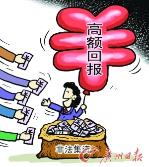
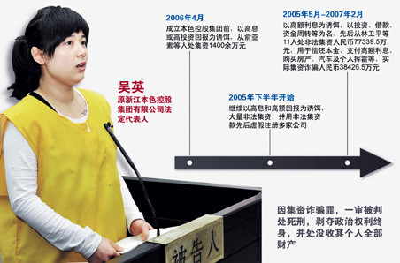
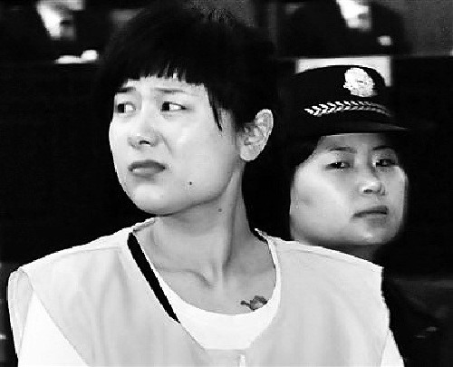

# ＜七星说法＞第十三期：吴英案，“民间金融”的法律之殇

**本期导读：** **滕彪律师在他的文章《吴英的生命与你我有关》里，写到了这么一句话：“什么是法治精神？几个世纪以来，法理学的一个核心争论就是‘恶法亦法还是恶法非法’？这不是一句两句能说清的。在一个政治经济体制迅速变迁的社会里，这个命题就更加复杂。”** **事实诚如滕彪律师所言，我们之所以关心吴英案，是因为她今天的所作所为和悲惨下场，或许将会变成一个象征，而这个象征与你我、与中国的法治建设都有着莫大的关系。吴英案显然不是她单独一个人的罪与罚，在江浙一带盛行的民间金融，甚至是当下中国农村普遍存在的传统金融模式，在吴英案之后都将受到严重的挑战。正是基于此，我们于今天提前发布本期说法。**  

# <七星说法>第十三期：

## 吴英案，“民间金融”的法律之殇

 

### **波澜起伏的法律拉锯战**

自从2007年初，吴英因涉嫌非法吸收公众存款罪被公安机关拘留之后，关于吴英案的争议随着长久的法律拉锯战而日益受到关注：

2007年11月4日，金华市检察院以以涉及集资诈骗罪对本色控股集团有限公司法定代表人吴英提起公诉。

2009年4月16日，浙江省金华市中级人民法院首次开庭审理吴英案，吴英代理人当庭为其做无罪辩护。

2009年12月8日，浙江省金华市中级人民法院做出吴英案的一审判决，判处吴英死刑，剥夺政治权利终身。

2009年12月28日下午4时左右，也就是10天上诉期的最后一刻，吴英终于决定就本案不服提出上诉。并提出了五点理由，简要如下：

主观上没有诈骗的故意。

没有实施欺诈行为。

债权人不属于社会公众。

借款行为是单位行为，不是吴英的个人行为；

本案的林卫平等所谓被害人，已被法院判决犯有非法吸收公众存款罪。所以，原判决明显是在保护非法吸收公众存款的犯罪行为。

2011年4月7日，吴英案二审由浙江省高级人民法院在金华市中级人民法院进行公开审理，宣布由于案情复杂，吴英案将择日宣判。二审中，吴英主动承认非法吸收公众存款罪，但继续否认集资诈骗罪，吴英的代理人继续为其做无罪辩护。 

2012年1月28日下午，在金华市中级人民法院，浙江省高级人民法院对被告人吴英集资诈骗一案进行二审宣判，裁定驳回被告人吴英的上诉，维持对被告人的死刑判决，依法报请最高人民法院复核。至此，旷日持久的吴英案似乎被下了最后的定论。二审维持死刑原判之后，关于吴英死活的争论似乎也只寄托在最高院的死刑复核上。最高院到底是否能对吴英手下留情？我们唯有拭目以待。

吴英的终局，是否真的难逃一死？

### **法情法理的实体之殇**

#### **问题一：集资诈骗罪的是是非非**

《中华人民共和国刑法》第一百九十二条规定：以非法占有为目的，使用诈骗方法非法集资，数额较大的，处五年以下有期徒刑或者拘役，并处二万元以上二十万元以下罚金；数额巨大或者有其他严重情节的，处五年以上十年以下有期徒刑，并处五万元以上五十万元以下罚金；数额特别巨大或者有其他特别严重情节的，处十年以上有期徒刑或者无期徒刑，并处五万元以上五十万元以下罚金或者没收财产。

根据国家实体法以及相关司法解释，我们可以看到如下一些问题：

**什么是“以非法占有为目的”？**

根据最高人民法院1996年12月16日《关于审理诈骗案件具体应用法律的若干问题的解释》与司法实践，对于行为人通过诈骗的方法非法获取资金，造成数额较大资金不能归还，并具有下列情形之一的，可以认定为具有非法占有的目的：

（1）明知没有归还能力而大量骗取资金的；（2）非法获取资金后逃跑的；（3）肆意挥霍骗取资金的；（4）使用骗取的资金进行违法犯罪活动的；（5）抽逃、转移资金、隐匿财产，以逃避返还资金的；（6）隐匿、销毁账目，或者搞假破产、假倒闭，以逃避返还资金的；（7）其他非法占有资金、拒不返还的行为。但是，在处理具体案件的时候，对于有证据证明行为人不具有非法占有目的的，不能单纯以财产不能归还就按金融诈骗罪处罚。

另外，最高人民法院2002年《关于审理金融犯罪案件工作的座谈会纪要》指出：“在处理具体案件时要注意以下两点：一是不能仅凭较大数额的非法集资款不能返还的结果，推定行为人具有非法占有的目的；二是行为人将大部分资金用于投资或生产经营活动，而将少量资金用于个人消费或挥霍的，不应仅据后一事实认定具有非法占有的目的。”

**什么是“非法集资”？**

根据国家相关司法解释：“非法集资，是指单位或者个人，未经有权机关批准，向社会公众募集资金的行为。”因此，我们可以看到集资诈骗罪既可是单位犯罪也可以是个人犯罪。此处，我们还应该注意一点就是，和非法吸收公众存款罪一样，集资诈骗罪的条文中所说的非法集资必须是“向社会公众募集资金”的行为，否则则无法构成“非法集资”。对于吴英案，此处我们的问题是吴英的借款人仅仅是她得亲戚好友共十一人，能否构成面向“社会公众”的条件？有一部分人，包括中国政法大学洪道德教授持此观点：吴英所面对的十一位贷款人，他们本身的财产来源具有向社会集资的性质，而吴英向他们借款无疑也具有社会性质。我们以为这种观点无法立足。别的不说，单纯就法律方面而言，这违反了罪刑法定原则，法律既然没有对此进行规定则不可认为这种情况受到了刑法的调节，即便是对于法律条文的解释亦不可如此宽泛，否则非法集资这一集资诈骗罪的构成要件形同虚设。

   **什么是“诈骗”？**

在有关“诈骗”的认定上，根据我国的司法实践以及主流的学术观点，一般认为应该采取“主客观相统一”的原则。根据这一原则，“既要避免单纯根据损失结果客观归罪，也不能仅凭被告人自己的供述，而应当根据案件具体情况具体分析。”因此，对于保护当事人的权益方面出发，值得我们警惕的应该是权力的滥用导致的客观归罪。此处的问题是，对于诈骗而言，本案中吴英“诈骗”的十一个对象中在案发之前乃至于案发之后却并不认为吴英的借贷行为是对他们的诈骗，既然如此，检察院又是根据什么推定吴英的行为是诈骗？如果被害人都不认为自己被诈骗，检察院又如何回应对于吴英案中客观归罪的质疑？

#### **问题二：此罪与彼罪。**

在经济类犯罪中，集资诈骗罪和其他诸如非法吸收公众存款罪、合同诈骗等罪名有相当的牵连，因此对于它们之间的区分，并非那么不重要。

“非法集资”：网上多有流传所谓“非法集资罪”之类的说法。但是，所谓“非法集资”并不是一个单列的刑法罪名，而是非法集资罪和非法吸收公众存款罪的构成要件之一，而中国刑法中涉及到“非法集资”这一概念也就是这两个罪名。故而，所谓的非法集资罪说法并不正确。

“非法吸收公众存款”：“非法吸收公众存款罪”和“集资诈骗罪”两罪区别是：后者具有非法占有的目的，前者虽然在客观上具有集资的性质(把不特定人手中的资金集中到一处)，但只是通过合理经营牟取息差，主观上打算归还、客观上也有能力归还吸收的存款，在合理的金融风险范围内，即使不能归还部分资金，仍然属于非法吸收公众存款的性质。如果吸收存款后“投资”后，根本没有合理经营活动，而是肆意挥霍、滥用资金，主观上不想归还客观上也根本不可能归还吸收的资金，则说明行为人具有非法占有的目的，具有集资诈骗的性质。显然，集资诈骗罪相对于非法吸收公众存款罪而言是重罪。

#### **问题三：为何公诉方改变起诉罪名和主体？**

在2009年4月16日吴英案开庭前，东阳市人民检察院和金华市人民检察院先后于2008年2月和10月各起草了一份起诉书。在第一份起诉书中，吴英的罪名是合同诈骗和非法吸收公众存款两项，且两个罪名的主体都是本色集团，吴英作为本色集团的法定代表人被列为被告。而在第二份起诉书中，罪名和主体都发生了变化，起诉罪名为集资诈骗，吴英作为个人被列为被告。显然，在刑法上，非法吸收公众存款罪和集资诈骗罪在量刑上有极大的差别，前者的最高刑仅仅是十年而后者的最高刑则是死刑；而个人犯罪和单位犯罪也有极大不同。东阳市检察院和金华市检察院的此番变化，对于吴英而言十分不利。

### **实体之外的问题**

#### **问题一：为什么18日开庭而17日方才通知被告人律师？**

根据《最高人民法院、最高人民检察院关于死刑第二审案件开庭审理程序若干问题的规定（试行）》规定：“将传唤当事人和通知辩护人、证人、鉴定人和翻译人员的传票和通知书，在开庭三日以前送达。”而根据当事人辩护律师声称：直到开庭前一天，也就是2012年1月17日，他才接到浙江省高院的电话通知。这不得不说是时下对于吴英案的审理中，最为令人疑窦丛生的问题之一。当地法院对此的解释是，担心如果过早通知会招致太多的媒体采访，但这似乎并不具备太强的说服力。

#### **问题二：检方控诉犯罪嫌疑人吴英造成三点八亿的资金亏空，是如何得来的？**

根据金华市中级人民法院的判决书显示，金华市中院认为被告人吴英共骗取集资款项7.73395亿，实际集资诈骗3.84265亿元。这三点八亿元的诈骗资金亦是受到了公众的广泛质疑：它是如何得出来的？根据相关新闻显示，在吴英处于处于强制措施之下而尚未接受审判之时，当地政府即将吴英的财产悉数拍卖，而拍卖价格相比之下很低。以本色概念酒店为例，当初吴英在此投入数千万元而当地政府却仅仅以400多万的极低价将其拍卖给当地另一房地产商。而检察院认定的三点八亿元则是将吴英所欠欠款减去现在吴英所有本色集团的财产，在如上的操作之下被减数严重缩水，三点八亿有夸大之嫌。 

#### **问题三： “非法”之资现在在哪？程序如何？**

在吴英案的审理过程当中，法院的判决后果尚未出来，东阳公安局便已经把本色集团的汽车、家具家纺和本色概念酒店以低价拍卖出去。而根据《刑事诉讼法》第198条规定：“公安机关、人民检察院和人民法院对于扣押、冻结犯罪嫌疑人、被告人的财物及其孳息，应当妥善保管，以供核查。”根据刑事诉讼法的精神和该条文的规定，对于犯罪嫌疑人应当秉持无罪推定的原则而对于公权力则是法无明文规定则禁止的原则，因此对于犯罪嫌疑人的财产在法院判决未出来之前则不应该将其拍卖。并且，公安部《公安机关办理刑事案件程序规定》第220条、最高人民检察院《刑事诉讼规则》、最高人民法院《关于执行〈中华人民共和国刑事诉讼法〉若干问题的解释》等有此类规定。

并且，即便是在法院判决出来之后，对于犯罪嫌疑人财产的处置是否应该由东阳市市政府和东阳市公安局来主持也是又问题的，在我国的法律中对此并没有明文的规定，这不可谓不是我国法律一大缺憾。

### **法外疑问：**

 **吴英案与庞氏骗局？** **民间借贷的性质？** **为何舆论嚣嚣，吴英最终却难逃死刑？**  由于篇幅有限，这三个问题仅供各位思考。 （需要指出的是，吴英案牵涉极广，案情十分复杂，并且社会上种种说法可谓纷纭而争，而我们并不比一般网友知道得更多，此文也只是根据网上现有的信息整理而成。） 

### **深度阅读：**

 **【导言】严格来说，吴英案在很大程度上涉及经济学方面的知识，例如被广泛争议的吴英案到底是否属于庞氏骗局问题。因而，这其深度阅读有相当内容是相对比较专业的，望各位看官细读之。**  吴英案始末： [http://baike.baidu.com/view/606422.htm?subLemmaId=5544760&fromenter=%CE%E2%D3%A2%B0%B8&redirected=alading](http://rrurl.cn/fDhWqR)  尖刀上的舞者吴英：[http://www.21cbh.com/HTML/2009-4-24/HTML_48FN64XVEXBJ.html](http://rrurl.cn/dPhO9D)  薛兆丰：合理集资与庞氏骗局 [http://www.eeo.com.cn/observer/special/2011/05/05/200580.shtml](http://rrurl.cn/h1kQtw)  夏楠：吴英案是一场庞氏骗局吗？ [http://news.ifeng.com/opinion/society/detail_2012_01/20/12094909_0.shtml](http://rrurl.cn/23oOsk)  吴英案再起变数，司法仍陷两难： [http://www.chinaelections.org/NewsInfo.asp?NewsID=217779](http://rrurl.cn/pC1MkN)  凤凰网专题：[http://finance.ifeng.com/news/special/zhengyiwuying/](http://rrurl.cn/rhoPgN)  吴英在等：民间借贷的“绑架”与“救赎”： [http://www.iceo.com.cn/renwu/35/2011/0809/226594.shtml](http://rrurl.cn/rxMOfk)  一虎一席谈：[http://www.tudou.com/programs/view/97fLtA0fyHM/](http://rrurl.cn/pmAQtA)   （编辑：余学文，纳兰辰瀚）  
