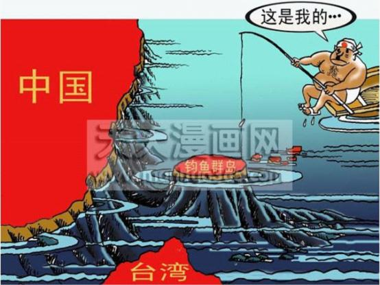
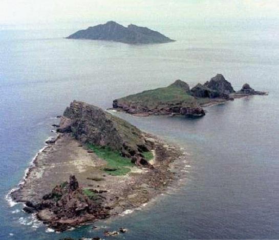
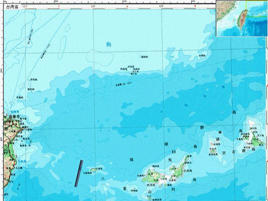

# ＜七星说法＞第十二期：尖阁列岛？钓鱼岛！

**本期导读：** **如果有人问你，钓鱼台在哪里？你的第一反应是北京，还是在遥远的大海里？几十年来，这个和中国国宾馆同名的岛屿，一直时不时的牵动着我们的心。对于大众来说，钓鱼岛的归属是民族感情的寄托，而对于政府和国家，这个岛屿所代表的还有他所蕴涵的经济利益。也许有些人会纳闷，对于这样一个远隔千百里的岛屿，为什么日本要费尽心机的和中国争夺？如果你也有这样的疑问，那么看完本期的说法，或许你会对此在法律上有新的了解。**  

# 第十二期：尖阁列岛？钓鱼岛！

 

## 

2012年1月16日，日本内阁官房长官藤村修宣布，正在对划定日本“专属经济区”基点的39个无名离岛命名，今年3月完成命名工作。日本本土西南方的钓鱼岛，是日本在西南地区划定“专属经济区”的基点，因此这39个无人岛中包括了钓鱼岛附近的7座岛屿。由于中日两国对于钓鱼岛的领土争端，当日中国外交部发言人便就此表态，钓鱼岛及其附属岛屿自古以来就是中国的固有领土，中国对此拥有无可争辩的主权，我们捍卫钓鱼岛领土主权的决心是坚定不移的。

钓鱼岛的争论由来已久了，其背后所隐藏的远远不止是中日的领土的争议问题，钓鱼岛已经变成了一个符号，在我们热忱的相信今天的中国已经是经济发达、实力强大的背景下，当我们都集体的臆想我们凭着自己的实力夺回了几个世纪以来所丢失的尊严的时候，钓鱼岛问题还是能够轻易的把我们打回原形，还是轻易的撕碎我们的美梦。

#### **地理学上的钓鱼岛**

钓鱼岛并不只是一个岛屿，而是一个群岛。群岛的背后还涉及根据国际公约规定的由岛屿地位所带来的海域和海底底土，而这些往往都意味这巨大的经济价值。

钓鱼岛列岛（Fishing Islands）又称钓鱼台、钓鱼台群岛、钓鱼台列岛（日本称其为“尖阁列岛”）由钓鱼岛、黄尾屿、赤尾屿、南小岛、北小岛和3块小岛礁，即大北小岛、大南小岛、飞濑岛等8个无人岛礁组成，分散于北纬25°40′～26°、东经123°～124°34′之间，总面积约6.344平方公里，而钓鱼列岛周围海域面积约为17万平方公里，相当于5个台湾本岛面积。目前该岛实际由日本控制，被划为冲绳县石垣市。

钓鱼岛是中国历史相承的国土，是由中国人最早发现，最先命名，最先经营、统辖、控御，最早载入国家正史和官方图籍，并且是最先被西洋诸国出版的中国地图、亚洲地图、世界地图所采用和承认的。

但是自日本明治维新以后开始进行的海上扩张，于1879年占领琉球群岛时，并于1895年1月在甲午战争取胜前夕由内阁会议作出“决议”，将钓鱼岛先行窃占，“编入”日本版图，至1895年4月，日本强迫清政府签订《马关条约》，规定日本割占“台湾全岛及所有附属各岛屿”至此，钓鱼岛落入日本手中。二战以后，钓鱼岛置于美国控制之下，1971年6月17日，日、美签署归还冲绳协议，在归还冲绳的同时也将钓鱼岛的所谓“施政权”交入日本手中，自此，钓鱼岛再次陷入困境之中。

#### **国际法上的钓鱼岛**

其实国际上以及国际法上关于争议领土的解决，主要遵循以下几个原则，包括传统国际法中的先占、时效、添附、割让和征服等领土取得和变更方式，以及现代国际法发展出来的民族自决、公民投票、恢复权利和收复失地等形式。对于钓鱼岛问题而言，所可能可能涉及的包括“条约必须遵守”原则、“禁止反言”原则、“有效控制”原则等。

“有效控制”原则是指，国际法院在权衡诉讼双方提出的进行了有效统治的证据之后，将有争议的领土判给相对来说进行统治更为有效的一方，在国际上，国际司法实践表明，有效控制的构成要件首先是受到国际法上另一个原则，即“时际法原则”规制的。

根据时际法原则，法律不溯及既往，即一种行为的效力，只能按照与之同时的法律观点来判断，并将这一概念作为国际法原则适用于该案。自1928年帕尔马斯岛仲裁案以来，时际法原则已成为一项公认的国际规则，因而也是我们用以判断钓鱼岛主权归属的有效法律依据。按照时际法原则(亦称休伯尔公式)“权利的创造必须根据创造权利时的法律予以判断”，则判断钓鱼岛主权归属应适用的法律应该是15世纪的国际法。那时的国际法承认“发现”或“象征性占有”是领土原始取得的有效方式。

所谓“发现”，通常是指“自然界的发现或单纯的视力所及”(Physical Discovery or Simple Visual Apprehension)而言。正如前面所说的一样，从中国方面所举的历史文献来看，中国至晚于1403年的《顺风相送》一书中已有关于钓鱼岛等岛屿的记载，中国渔民长期以来在钓鱼岛附近从事生产生活活动，中国早已通过“发现”取得对钓鱼岛的主权，并于明代由中国政府正式将钓鱼岛列入军事防守的范围。显然，钓鱼岛自古以来一直是中国的固有领土。

所谓“禁止反言”原则，就是‘不能出尔反尔’。也就是某项情形被通告或广为人知后，一方保持沉默可能意味着同意。日本政府的侵犯钓鱼岛的行为还违反了国际法中的“禁止反言原则”，日本政府在如下两个时间段内是承认中国对钓鱼岛的主权的：一是1895年以前；二是从1945年战败到1969年5月。不仅如此，中日两国在1972年和1978年两次签署和平友好条约，均同意搁置钓鱼岛主权争议，待条件成熟时解决。此后中国政府和民间根据此约定严格约束自己的行为，日本却出尔反尔，不仅违背了上述承诺，还强行占有钓鱼岛。根据“禁止反言原则”，日本的行为是被国际法明文禁止的。

而上面说到的“条约必须遵守”原则，则是指缔约国对于一项合法有效的条约有义务善意地履行和遵守。根据二战后签订的国际条约，日本必须归还钓鱼岛。1945年8月14日，日本政府决定接受《波茨坦宣言》的无条件投降条款，翌日，日本天皇通过广播向日本国民宣布接受无条件投降。1945年9月2日日本签署了投降书。该投降书承诺，同盟国签订的国际条约和中日之间签订的条约对日本都有拘束力。1943年，中、美、英三国的《开罗宣言》中对日本不法所占的领土作了明确的规定：“同盟国，不寻求各自国家的利益，也不持领土扩张之念，同盟国的目的是剥夺日本国自1914年第一次世界大战开始后，日本国夺取或占领的位于太平洋的所有岛屿，并把像满州、台湾及澎湖岛那样的日本国从清国人手中盗取的所有地域返还给中华民国。把日本驱逐出由于暴力及强欲而掠取的其它的所有地域。”

1945年7月26日发表了以中、美、英三国署名的《波茨坦宣言》。《波茨坦宣言》不仅是要履行《开罗宣言》，而且进一步就“本州、北海道、九州、四国以外的诸小岛”是否归属于日本国规定了由“吾等决定”，也就是由宣言国决定，日本国自身没有决定权。1972年中国政府和日本政府发表的《中日联合声明》，其中第三条规定“中华人民共和国政府重申：台湾是中华人民共和国领土不可分割的一部份。日本国政府充分理解和尊重中国政府的这一立场，并恪持遵循波茨坦公告第8条的立场。”根据以上国际条约和中日双边条约，钓鱼岛作为我国台湾省的附属岛屿，日本在二战结束后就应当归还钓鱼岛，而一切企图继续非法占有钓鱼岛的行为都是违反国际法原则的。

不管根据上述国际法通行准则的哪一条，在关于钓鱼岛的问题上，日本都是没有法律优势的。

#### **谁的钓鱼岛？**

其实日本之所以要顾国际法于不顾，违反“禁止反言”的原则，是因为随着钓鱼岛主权而来的领海和专属经济区的归属。钓鱼岛的主权归属，会对经济利益有巨大影响，而在领海和专属经济区的认定上，因为这一经济利益，中日两国有着不同的看法。

所谓的专属经济区，是指沿海国在其领海以外邻接其领海的海域所设立的一种专属管辖区。在此区域内沿海国为勘探、开发、养护和管理海床和底土及其上覆水域的自然资源的目的，拥有主权权利。专属经济区从测算领海宽度的基线量起，不应超过200海里。正是这小小的200海里，造就了中日两国对于钓鱼岛主权的不休争斗。关于专属经济区的认定，中日两国也有不同的划分观点。

由于《联合国海洋法公约》对海岸相邻或相向国家间海洋划界原则过于笼统，且缺乏可操作性。《联合国海洋法公约》规定，对于其经济区和其他相邻国家经济区相重叠时，专属经济区的边界由有关国家协商决定。使得中日两国分别提出了有利于己方的划界原则和主张。目前在确定专属经济区的划分方面，国际上存在两种对立的观点，中日恰好就是这两种观点的代表。

日本主张“等距离中间线”原则，强调共架邻国应平分东海专属经济区。从日本1996年颁布的《专属经济区和大陆架法》的规定来看，日本主张中日东海划界应该从两国领海基线量起，超过200海里的重叠部份按照等距离标准以“中间线”确定界线。

中国则主张“大陆架自然延伸”原则，强调东海大陆架是中国领土的自然延伸。根据中国1998年颁布的《专属经济区和大陆架法》的规定来看，“中华人民共和国的专属经济区，为中华人民共和国以外并邻接领海的区域，从测算领海宽度的基线量起延至200海里。并且依据《联合国海洋法公约》第76条的规定：对于超出200海里的大陆架外部限，一国的大陆架可延伸至其领海的350海里处。也就是说，由于东海大陆架是中国大陆的自然延伸，中国对于专属经济区的主张可以延伸到350海里处。

其实从地理上看，钓鱼岛具有明显的大陆架特征，是中国大陆架的自然延伸。钓鱼岛周边的海域朝着中国或台湾方向的水深约为130米，离中国大陆越近越浅，从大陆、台湾方面来看，200海里的等深线从台湾基隆海边小岛通过钓鱼岛、南小岛、赤尾屿向东北延伸，形成了发端于中国大陆的大陆架，钓鱼岛恰好坐落在这一大陆架的边缘，形成大陆架的自然延伸。而钓鱼岛与日本相隔冲绳海槽，构成中日大陆架的自然分界。冲绳海槽南北走向，北浅南深，分别构成西部(中国东海大陆架)与东部(日本琉球岛架)的陆坡。也由于冲绳海槽两侧的地质构造性质截然不同，因而冲绳海槽成为中国大陆架与日本大陆架之间的自然分界线，这在地理上说明了钓鱼岛群岛不是日本大陆架的自然延伸。

但是以上地质学上的认定，却由于国际法上存在着以上两种不同的划分学说，而使日本对钓鱼岛提出要求有了它“正当”的一面。所以日本才会抛下国际法原则不顾，对钓鱼岛提出“主权要求”。中国和日本也由于国际法上对领土主权划分方式的不确定，展开了一场围绕着主权、领海和专属经济区问题的法律和政治较量。

其实无论从通行的国际法律，还是地理学，历史证据的角度，都可以证明钓鱼岛列岛自古以来就是我国领土不可分割的一部分。但是钓鱼岛问题，并不是一个简单的法律问题，更是政治问题和经济利益问题，在国际法理论制度还未确定的情况下，我们所需要的并不仅仅是法律和地理证据的支持，更需要有审慎的态度和坚决的作为。当我们的新闻每天都充斥着来自钓鱼台宾馆的消息时，希望我们也不会忘记，作为其命名依据的钓鱼岛处在如何的境地。钓鱼岛问题的解决必然是一条漫长又崎岖的路，但是希望这条路的终点，能有一个光明的结果等待着殷殷期盼的国人。

 

### **【深度阅读】**

 http://zh.wikipedia.org/zh-hk/%E9%87%A3%E9%AD%9A%E5%B3%B6%E5%95%8F%E9%A1%8C 钓鱼岛及其主权问题 http://www.online-qdtvu.com/yth/fl/anli/paersimaan.php 帕尔马斯岛仲裁案 http://news.ifeng.com/world/detail_2012_01/16/12007054_0.shtml 日政府拟为39座离岛命名 

#### 钓鱼岛争夺史：

http://news.sohu.com/20041206/n223347200.shtml 关于琉球群岛及钓鱼岛的历史考证 http://www.yadaily.com/news_view.asp?newsid=8489 钓鱼岛的历史沿革 http://news.qq.com/a/20090318/001017.htm 香港媒体称日本30余年步步为营侵占钓鱼岛 http://world.huanqiu.com/roll/2010-09/1086476.html 钓鱼岛争端的来龙去脉 

#### 相关论文：

http://d.g.wanfangdata.com.cn/Thesis_Y1071275.aspx 从国际法视角看中日钓鱼岛之争 王德水 http://d.g.wanfangdata.com.cn/Periodical_xbdemzxyxb-zxshkxb200304014.aspx 从国际公法角度论钓鱼岛主权归属，谭晓虎，汪开明 http://d.g.wanfangdata.com.cn/Periodical_heiljsz200902081.aspx 国际法在解决领土争端中的作用及困境评析，聂宏毅 

#### 法律条约：

http://wenku.baidu.com/view/23d1dee881c758f5f61f6702.html 联合国海洋法公约 http://baike.baidu.com/view/44777.htm 开罗宣言 http://baike.baidu.com/view/110251.htm 波茨坦宣言  

（编辑：苏扬，纳兰辰瀚）

 
