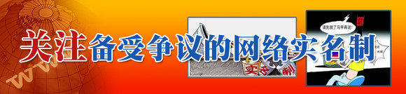
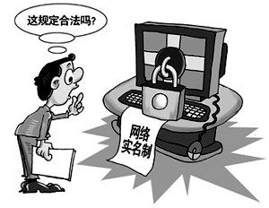
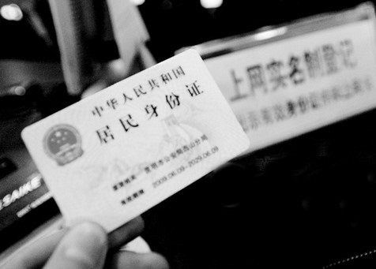

# ＜七星说法＞第十五期：“拿你衣服”的那点事儿

**本期导读：** ** 各位亲爱的读者，此时此刻，不知道你是在以什么样的身份阅读本期说法？真名、假名，亦或是笔名、化名？不过这一切即将变得不那么重要了。因为在本期说法后不久，中国的网络上便将借助行政的强制力，掀起一股微博实名制的风潮。这股风潮将把中国现在热火朝天的微博圈子吹向何方，亟待我们的关注。网络的实名制，在普通网民们看来，关系到个人信息的安全；在行政当局看来，关系到网络社会的稳定和谐。而当我们把这一切放到法律的放大镜下来看时，我们关心的，是实名制这件事，政府到底该不该管。** 

# 第十五期：“拿你衣服”的那点事儿

## 

2003年，中国各地的网吧管理部门开始对所有在网吧上网的客户实行实名制，直至2012年元旦，根据铁道部的规定，全国所有旅客列车开始实行车票实名制。于是乎，在这片广袤的大地上，在这个寒冷的年末年初，实名制这一把早就点燃的火焰以各种或严肃或闹剧的形式，开始愈烧愈烈起来。

实名制这个事儿由来已久（不然户口本和身份证是干什么的），我们也渐渐接受并适应在社会生活中各型各色各行各业的实名制，但是，实名制在浸染了我们身上穿的大大小小里衣外裤之后，开始连花边、内裤和马甲也不放过了。 

如果说是因为并不是每一个公众都成天揣着身份证天南海北的搭火车，让我们对火车票实名制不甚了了。那北京市推行微博实名制这样切实影响我们每天生活的行政行为的发生，则开始让我们真正关注起我们自己的“马甲”问题。

北京市推行微博实名制的原因很简单。即“在微博客发展过程中，出现了传播谣言和虚假信息、买卖‘粉丝’、利用网络进行欺诈等突出问题，损害了公共利益和公众利益，”而其出台《北京市微博客发展管理若干规定》的主要法律依据是《中华人民共和国电信条例》第五十九条第(四)项。

我们不妨先看看微博这个事儿，北京能不能管？

早在2005年深圳市出台规定要求腾讯公司QQ群管理员实名制时，就有人产生了担忧。深圳公安局认为它能够取得如此大的管辖权，依据是QQ的总部在深圳，于是它也就顺带将全国的QQ网民管住了。这样的理由仿佛很有道理，可是一想又不大妥当。如果北京市政府也学习深圳的“先进经验”，总部在我管辖权就在我，那全国岂不是乱套了？现在看来，北京市政府果然不负众望，后来居上。

新浪，网易，搜狐，人人等公司的总部都设在北京，对于这些法人参与的法律行为，北京市可以根据行政区域的划分取得司法管辖权，这是毫无疑问的。但是我们要清楚，司法管辖权，或称为审判权，是指法院或司法机构对诉讼进行聆讯和审判的权力，这与地方政府发布行政规章，做出抽象行政行为的行政管辖权是不一样的。新浪等公司，作为独立注册的法人，其成立的根据是中华人民共和国的法律，它们在全国范围内拥有数以亿计的用户，一举一动都影响巨大，很有牵一发而动全身的意味。那么，对于这些大公司的运营方式，对于它们经营的网络实名制与否，对于全国几亿的用户选择要不要实名的权利，北京市政府的一纸文件一个地方政府规章，有没有权力进行管理与限制呢？

所以，能不能管，这个事儿很是值得商榷。 

再让我们看看《北京市微博客发展管理若干规定》的法律依据是不是靠得住？

《中华人民共和国电信条例》第二条第二款规定：“本条例所称电信，是指利用有线、无线的电磁系统或者光电系统，传送、发射或者接收语音、文字、数据、图像以及其他任何形式信息的活动。”第五十九条则规定：“任何组织或者个人不得有下列扰乱电信市场秩序的行为：(一)采取租用电信国际专线、私设转接设备或者其他方法，擅自经营国际或者香港特别行政区、澳门特别行政区和台湾地区电信业务；(二)盗接他人电信线路，复制他人电信码号，使用明知是盗接、复制的电信设施或者码号；(三)伪造、变造电话卡及其他各种电信服务有价凭证；(四)以虚假、冒用的身份证件办理入网手续并使用移动电话。”

《北京市微博客发展管理若干规定》引以作为依据的是第五十九条第(四)项，其中的“并”字本应引起我们的注意，但在北京市政府对其出台的规定作出解释时，其所引用的依据中丝毫不见“并使用移动电话”的内容。笔者愚钝，在连起原文通读一遍之后，完全没能理解《中华人民共和国电信条例》与微博必须实名制的内在逻辑关系。

这个规定的出台，或者完全是北京市的凭空创设。

在这里，我们没有必要讨论在国家没有相关立法的情况下北京的地方行政规章本身是否合法的问题，也没有必要讨论这种做法技术上是否可能的问题。让我们把目光姑且聚焦在微博实名制的内在价值上。

要知道，微博实名制并不仅仅关系到一个行政规章的效力问题，它更多的涉及了公民的私权与政府公权之间的博弈。在这种情况下我们就要问，创设这一制度的主体、依据、程序合法吗？这一制度的目的为何？为了达成该目的，实名制是必须且合理的吗？对私权利进行限制时，是不是真的做到了比例原则？若实名制达成，那公民让渡隐私权取得了什么效果，实现的价值如何？

首先引起的争论是，微博实名制，到底有没有侵害到公民权利？

中国政法大学的何兵教授在《南方周末》发表《不能在微博上打地道战》，他认为“由于微博后台实名而前台不实名，不禁止人民用笔名发表言论，所以规定这一条，并不涉及言论自由。言论自由，从来就不是任意言说，而让你无法查找的自由。不是躲在地道中，随意打黑枪的自由。更不是任意批评，不负责的自由。没有责任的自由，结果不是自由而是暴虐。”一文即出，便遭到了贺卫方、王建勋、萧瀚等人的质疑。

古今中外，因言获罪的例子难以计数，作家用笔名发表作品的传统一直存在。中国宪法虽然明文规定公民享有言论和出版自由，但由于违宪审查制度的缺位，现实中充斥着限制和剥夺表达自由的法律、规章和行政行为。一个人以自己的实名说话，往往有许多顾虑，在一个言论还不自由，法制还不健全的国家尤其如此。而后台实名的做法，如同对网民的“案底在握”，是权力对网络潜在的警告：你要行使言论自由？没问题，别以为我不知道你是谁。这个时候，大家说话之前往往就要斟酌再三了，有些话，还是不要说的好。所以，这一制度对言论自由的影响是显而易见的。更重要的是，实名制的规定根本就是强行的，没有人会过问你想不想实名，要不要实名。可能你不在乎实名与否，但，这份选择的自由，是应该留在我们自己手中还是让渡给公权力，却是问题的核心所在。 

然后，我们来看看微博实名制推行的目的。

北京市互联网信息内容主管部门新闻发言人表示，“以微博客服务为代表的互联网新业务发展迅速……但是，在微博客发展过程中，也出现了传播谣言和虚假信息、买卖‘粉丝’、利用网络进行欺诈等突出问题，损害了公共利益和公众利益，引起网站、用户和公众的不满。”

我们不妨看看韩国的例子。2011年12月29日，负责管理电信业的韩国广播通信委员会提出计划，表示将从2012年起逐步废除已经实施了4年多的互联网实名制。这也表示世界上第一个也是唯一一个实行互联网实名制的国家间接承认，网络实名制失败了。韩国网络实名制从无到有，再至濒于破产边缘，其经历可谓曲折。

在韩国，这个制度的初衷是为了减少网上语言暴力、诽谤以及虚假信息的传播。但是实名制实施近3年后，首尔大学一位教授发表了《对互联网实名制的实证研究》，其中的数据显示，在实施网络实名制之后，网络上的诽谤跟帖数量从原先的13.9%减少到12.2%，仅减少1.7个百分点，可见，实名制并未管住网民的“恶意”。对网络实名制的致命一击发生在2011年7月，当时韩国一家著名门户网站和一家社交网站被黑客攻击，约有3500万名网民（韩国2010年的总人口为4800余万）的个人信息外泄，包括名字、身份证号码、生日甚至地址。此次事件让民众和政府都意识到网络实名制的巨大危害。另一方面，所谓上有政策下有对策，自从韩国实施实名制之后，被称为“身份证伪造器”的作弊软件也应运而生。这类软件可以伪造出通过身份验证机制的韩国身份证号，从而可以用伪造的身份注册。此类软件的出现，也就意味着“网络实名制”近乎名存实亡。

于是我们看到，实名制也许并不是解决“传播谣言和虚假信息、买卖‘粉丝’、利用网络进行欺诈等”问题的最有效手段，反而带来了个人隐私泄露的巨大风险。

正如《纽约时报》上发表的一篇评论说：韩国的经验表明，实名政策是个糟糕的主意，“互联网是混乱、肮脏和匿名的，但它最好能保持这个状态”。的确，在匿名制的网络环境中，经常能听到夹杂着各种低级肮脏的杂音，也有谣言和欺诈。可谓泥沙俱下，良莠不分。但是，不得不说，这是言论自由必须要付出的代价。相比于通过强制性监督而导致的鸦雀无声来，这个代价要相对小些。而一片清明和不敢讲话，这个结果比起众声喧哗和泥沙俱下还要糟糕得多。 

罗伯特•博尔特在其著名剧作《不朽之人》中说道，我们只有在法律之林所拱卫的环境中才能安全地生活，哪怕这个森林有时会给恶魔提供藏身之所，因为，如果你为了消灭恶魔而砍倒了这片树林，这时恶魔转身扑向你，你朝哪儿躲？ 中国的网络和微博也正像一片初长成的树林，滋育了言论的自由，民主的启蒙，关注的力量，同时也难免要随之产生大量的流言，难辨的善恶。使护林人员穿梭其中，清除毒草，是为善法；为求曝露弊病而剪去所有荫庇的枝叶，即为恶法。还请执事者慎思之。 

深度阅读：

http://www.aisixiang.com/data/49135.html 何兵：不能在微博上打地道战

http://www.aisixiang.com/data/15059.html 陶东风：我们是要众声喧哗还是要鸦雀无声：我为什么反对网络实名制？

http://www.aisixiang.com/data/37182.html 郑戈：透明的个人与幽暗的政府

http://www.williamlong.info/archives/2927.html 北京实行“微博实名制”

http://baike.baidu.com/view/7099303.htm 微博实名制

http://baike.baidu.com/view/9517.htm 中华人民共和国电信条例

http://www.21ccom.net/plus/view.php?aid=52356 邵建：微博管理，“胡适”无以要求“鲁迅”

http://int.nfdaily.cn/content/2012-01/19/content_36711818.htm 网络实名制的全球先行者，韩国为什么失败了？ 

（编辑：石味诗，纳兰辰瀚） 

