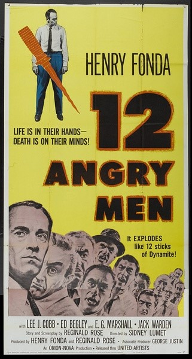
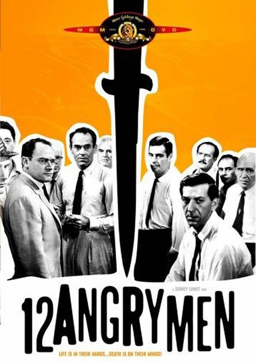
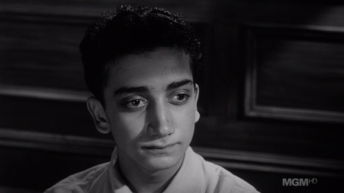

# ＜七星说法＞第十六期：生命在你手，信念在我心 ——评《十二怒汉》

**本期导读：任何人的生命和自由都是是宝贵的，我们不能随意剥夺一个人的生命，当法律对要对一个公民进行刑法裁量的时候更是如此，所谓公器为重，不可轻动。而如何对待一个相对国家机器显得甚为渺小的犯罪嫌疑人，足可以显现这个国家司法制度的发展程度和对待公民权利的态度。本期说法将为大家带来一部令人震撼的法律题材电影，在这部电影里精彩的不仅仅是故事，更有夺目的人性光辉和令人感叹的司法制度。 **  

# ** ＜七星说法＞第十六期：**

## **生命在你手，信念在我心 ——评《十二怒汉》 **

 

1957年，狮门公司出品了电影《十二怒汉》，这部电影不仅获得了柏林电影节金熊奖，而且被奉为法律题材中的经典之作。虽然限于技术原因，这是一部黑白电影。但在短短的九十分钟的时间内，它不仅向我们展示了美国法律制度的精髓，同时也让观众了解到何谓合理怀疑，何谓民主制度，何谓无罪推定，而这些思想是不会随着时代而有丝毫变化的，所以即使放在今天，这部电影仍然震聋发聩，不可不说是一部绝佳的“公民”电影。

#### **1比11到11比1**（轻微剧透）

十二个不同背景、不同职业、不同脾性的人聚在纽约地方法院的陪审团室里，摆在他们面前的是一宗逆子谋杀案。这个案件在美国属于一级谋杀案（First-Degree Murder ）,因为嫌疑人被控杀死了自己的父亲，情节恶劣，所以检察官展开了猛烈的攻势。

这里需要说明的是美国刑事司法制度中存在两种陪审团，一种是23人的“大陪审团”，负责决定由检察官侦办的案件是否会被提交到法庭。另一种则是12人的“小陪审团”，也就是电影中所展现的，它负责判定案件的事实问题，具体来说就是要决定嫌疑人有罪还是无罪，至于何种罪名刑罚轻重等法律问题，则属于法官依法裁量的权限范围。

电影正式开场，镜头切换到了嫌疑人那只有18岁的稚嫩面庞上，他目送着刚刚经历完繁复漫长庭审的十二个“累汉”去投票，，将要决定他命运，去判定他是有罪（Guilty）还是无罪(Not-Guilty)。

故事的开始是平淡的，时值一个夏日午后，十二个人关在一间房内，设备破旧，失灵的风扇让本就不大的会议室里更显燥热，他们最主要的道具是那一张方形桌子，至最后，全部人离开，桌子的全貌缓缓展现，几个小时的争论后只剩余几张纸与碎屑，曾有过的愤怒吼叫与平静论述都不再重放。 即便所有观影者都从一开始便了解他们辩论后的结局，影片也能够不失去任何一秒钟的魅力，简单的布局下，十二个人在表达各自思想进而流露出人生百态。

寒暄过后，主持人也就是1号陪审员提出所有人投票来确定嫌疑人是否有罪。几乎所有人都是认为这个贫民窟男孩有罪，只有一个人反对，就是8号陪审员。这个建筑师势单力孤，但他深邃的眼神中似乎在告诉在场每一个人，我有理由相信说服你们。

因为小陪审团的做出的有罪或无罪的意见必须十二个人一致同意。所以偏见与冲动瞬间主宰了气氛，立刻就有人跳出来说这是在浪费时间，检察官已经把事情弄得够清楚了，那个杀手肯定是有罪的，他杀死了他的父亲，我们应该把他送上电椅，这个人死不足惜。

8号冷静的面对着其它几个人的数落，脸上并没有任何退缩。“我不知道他是不是个凶手”，也许他是，也许他不是，我现在没法确定。“要知道他只有18岁，当十一个人都举手的时候，我很难在不经过讨论的情况下也认为他有罪，这决定着一个人的命运，假设我们都错了呢”？

这是一道尖锐的问题，假设我们都错了？面对着一个孩子18岁的生命，任何人都有责任停下自己飞驰的思绪，回来问一问自己，假设我们错了。这本身就是一种对生命高度负责的态度。

当然，其中笃定男孩有罪的3号、4号陪审员拿出了法庭上那些看似早已被证明而确信无疑的证据。一、住在男孩家楼下的老人听到了男孩说“我要杀了你”，然后是一个人倒地的声音，他跑出去开门，看见男孩跑出楼。二、住在对面的女士刚巧起床，透过开会失去昏暗的电车目睹了男孩把刀捅入他父亲的胸口。三、男孩那天晚上说自己出去看电影了，却丝毫不记得电影跟演员的名字。并且杂货店的老板指认他买了一把样式特殊的弹簧刀。

正当有人提出凶器是很特别时。建筑师却拿出了一把一模一样的弹簧刀，所有人的都大吃一惊。8号镇定的说哪怕是百万分之一的可能我们也得考虑到，否则我们不能认定证人证物没有出错的可能。

在之后的剧情中，通过8号陪审员和其它人的的努力，他们找到了可能推翻所有证据的可能性，比如老人在听到被害者倒地后很难瘸着双腿走向正门去看是谁跑下了楼；又比如在女证人看见电车时老人应该听不到我要杀你的喊叫，因为电车的声音通常能盖过一切。最后，连最自信自己记忆力的4号陪审员——一名交易员，也没能回想起上星期刚看过电影的名字，甚至连演员是谁都忘了。

所有这一切都指向了一个结论，那就是这个男孩很可能是被冤枉的，而杀死他父亲的人可能另有其人。当然，在这个由少数到多数的过程中，有争吵，有妥协，有认同，有反思，甚至还有动手。整个电影充满了戏剧的张力，甚至可以说这就是一台独幕剧。所有的人物情节不用镜头，单凭互相的诘问就已经栩栩如生。

#### **不怀疑毋宁死**

这部电影不仅给我们介绍了美国的陪审团制度大体轮廓，还向我们娓娓娓道来了什么是合理怀疑。在美国，法庭想判定一个人有罪只有依靠排除所有合理怀疑（Reasonable-Doubt）的证据，十分确定他的罪行之后，才能加以裁判。而这正是William Blackstone所说的“与其让一个无罪的受到惩罚，不如让十个有罪的人逃避惩罚”的题中之义，尽最大可能保护每一个无辜的人，哪怕付出巨大的代价。

而当存在“合理怀疑”的时候，就要遵循刑事司法中“无罪推定”这一最高准则。在很多案件中，由于存在着对证据、证言、程序疏漏中可能存在谬误的合理怀疑，不能排除犯罪嫌疑人无辜而犯罪者另有其人的可能。所以即使其它所有证据都指向嫌疑人，只要存在着一丝一毫“合理怀疑”，也不能判定嫌疑人就是凶手。因为哪怕是证据链或证据图谱的一环、一角的缺失都可能造成对嫌疑人的不公正判决。

这是一个成熟的司法制度所应该具备的证据规则，因为人的认知能力是有限的，过去发生的事情不可能被三百六十度无死角的记录下来，我们得以了解过去的途径只有人们能够收集到的散落一地的时间碎片，这些碎片可能是一盒记载对话的磁带，可能是一段偶然拍下的影像，也可能是留在目击者脑海中的记忆。

无论时间碎片如何翔实、如何完善。都不可能重现已经发生的“过去”，于是就有可能让表象偏离真相的可能。在美国的刑事司法审判中，为了尽量减小这种“可能”带来误判的几率，要求陪审团对证据的认定必须达到“确信”，才能宣告一个人有罪，否则，任何合理的怀疑都会导致无罪判决的产生。“合理怀疑”可以说是一条区分罪与非罪的分界线。所以，纵使这种判定证据的方式可能耗时耗力，有时甚至有点“得不偿失”，但不可否认，正是因为这种严谨，我们才有可能更接近那相对的正义。

“排除合理怀疑”(Beyond reasonable doubt)这条证据规则所追求的并不是绝对的无错而是相对的正义。虽然放走了那些手段精明证据不足的凶手会带来正义上的疏失，但因为同样的规则，正义的益得将在所得到保护的无辜者身上成倍返还，并让人们相信酷刑与冤案会与他们绝缘。百年之前，诸多法律先贤就无数次对这个问题加以讨论和阐释，并一致认定，与失去的公平相比，公民所得到的免于误判的保护重要的多。而这，也是一个公民社会中单个人面对强大的国家机器得以安身立命的根本保证。

正如在In re Winship案中Harlan法官说：“在审判过程中，存在关于曾经发生事件的事实的争议，事实发现者（Fact finder）无法获得对于已经发生事实的不容质疑的确信。相反，所有的事实发现者能获得的只是可能发生了什么的信念。......因此，证据标准表示指示事实发现者的一种企图，让他们明白在我们的社会，在特定判决中，作出正确事实结论应当有多大程度的自信。”

#### **中国式悲剧**

最近，凤凰卫视社会能见度栏目报道了一期深度调查，其曲折的过程恰好与这部1957年拍的电影形成了鲜明的对比。

1998年，贵州六盘水发生的“凉都弑母案”引起了颇多震动，杨宗发83岁的老母亲张华秀被人杀害后丢到化粪池。后来九年，在经过了其妻子李明英和女儿女婿的不断上访取证之后，再次开庭审理，终于平冤昭雪、无罪开释。而这桩惊天冤案中，当初的犯罪嫌疑人也就是受害人儿子杨宗发的认罪笔录也被证明是刑讯逼供所书。而这起案件在侦查阶段就有诸多疑点可供研判。

案件本身并不复杂，被害人的社会关系较为简单，与儿子一家分住，平时独居在家，尤喜好与她其它老太一起练习被定为邪教的法轮功。事件发生后，侦办机关本可以根据诸多的疑点继续追查真凶，但却徇私枉法采取了刑讯逼供这种既简单粗暴又有违法治精神的方式来迫使杨宗发伏法认罪，由此产生的恶劣后果自然是可想而知。

这种如影片中那些“顽固”的陪审员一样带有偏见、先入为主的定案过程，如果不在将来加以扭转，那么可以预见，让清白者无故被羁押9年，让杨家家两代人受尽凌辱，让国家公器的威信不在的事件就一定会再次发生。

#### **合格的公民**

其实从某种程度上来说。令人血脉喷张欲探究竟的观影过程本身就是绝佳的“公民教育”。影片中8号陪审员虽然身为一名建筑师，却有着作为一名公民所应具有的所有必备条件。他懂得那个18岁男孩的生命掌握在所有12名陪审员手中，这不是儿戏，而是对这个社会其它公民生命和民主法治基础所必尽的责任。虽然他孤军奋战，面临着11个需要说服的对象，但建筑师却从没有退缩，而是抓住每一个疑点据理力争。

与之相对应的其它11个陪审员，有的盲从，有的带着无法纠正的偏见，有的不知道公民的题中之义 。这一切都跟8号陪审员如火热情冷静头脑的条理分析形成了鲜明的对比。

这从一开始就不是精英主义的说教，而是告诉每个公民，我们需要容许不同的声音，同时，面对这些不同的声音，不妨放下偏见冷静思考其观点的正确与否。当对异见者的声音不是一味挞伐，而是选择包容的时候，我想这个社会才真正到了成熟的一天。

而真正合格的公民也绝不是妄图通过多数去战胜少数的“布尔什维克”，那将演变成“暴民”的政治，可怕甚于专制。相反，公民政治、民主社会中更多的是持不同意见者不断地磋商，哪怕不能说服对手，也需要经过不断探讨，找出一条最接近真理的道路，因为哪怕一尺的接近都是对民主满足社会最大利益的回归。

### 深度阅读：

**[凤凰卫视社会能见度“凉都弑母案](http://rrurl.cn/9MQDeC)**** **[”](http://rrurl.cn/9MQDeC) [http://vip.v.ifeng.com/society/shehuinengjiandu/201202/646d1cb5-f12a-4779-bafa-cb907e2a0d2adetail.shtml](http://rrurl.cn/9MQDeC)  

### 电影下载地址：

[http://www.tlfminisd.com/archives/2152](http://rrurl.cn/pTNP80)  

（编辑：王晓曈，纳兰辰瀚）

 
