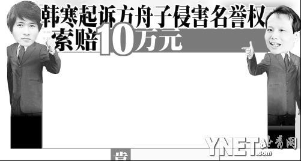
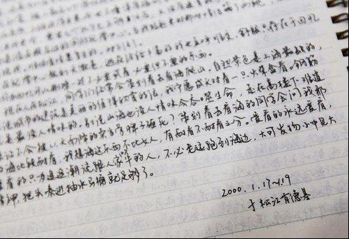
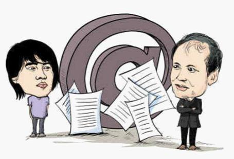
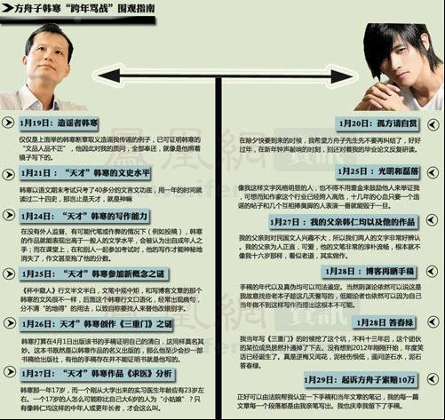

# ＜七星说法＞第十四期：方韩诉讼的法庭路演

本期导读：如果要说过去的这个春节假期，中国的网络上什么最火，那恐怕没有什么事情能够比得过韩寒与方舟子的口舌之争了。新年伊始，方舟子便在网上指摘韩寒多年里写下的文章有被人代笔的嫌疑，并誓要打破“韩寒神话”。而韩寒在通过博客一一反击之后前往法院起诉方舟子的行为，终把这一事件带入了法律的领域。韩寒虽已起诉，可庭审尚未开始，结果还无从得知。可是若各位读者想提前洞悉，这一件闹哄哄的事件将会有什么样可能的结果，那不如和我们一道，进入本期七星说法的话题。  

# <七星说法>第十四期：方韩诉讼的法庭路演

## 文/许斌 （复旦大学）

 

之前撰写了[《小破文章一篇，如果韩寒诉方舟子诽谤》](http://blog.renren.com/blog/229881544/801589071?from=fanyeOld)，没想到2天后韩寒真的提交诉状起诉，但该文主观倾向严重，很不客观，而且该文是以刑事自诉角度出发的，而韩寒为民事侵权角度出发。此次希望写一篇基于事实和法律、相对客观的文章来阐述观点。

方韩大战已经成为全社会的一个讨论焦点，其关注程度也远远超过了吴英案和贵州黎庆洪案，此案成为了言论自由权和名誉权界限划分的标志性事件，因为无论结果如何，全社会对言论自由和名誉权保护的反思过程意义更大。

以下结合自己对整个方韩事件的了解，以及自己的一点法律知识，为大家路演一场法庭实战，笔者虽然还只是个在校学生，但在法院实习过程中参与旁听庭审案件53个，对庭审还算比较了解。笔者的结论是：无论韩寒此诉胜诉还是败诉，韩寒都赢了，方舟子都输了。为何会这样？请耐心看完此文。

庭审之中最重要的环节，莫过于法庭事实调查和法庭辩论环节。法庭事实调查是通过双方举证质证来固定案件事实；法庭辩论是在法庭事实调查的基础上，对案件争议焦点及法律适用进行现场辩论。

#### 一、模拟举证质证

根据网上流传的信息以及笔者自己的判断，模拟举证质证图如下：

韩寒提供证据
证明内容
方舟子质证

800页《三重门》等相关文章手稿（已公证）。
证明《三重门》等文章系韩寒于13年前所创作。
对真实性不予认可，手稿过于干净，可能是抄写的。

笔迹和纸张司法鉴定结论。
对真实性不予认可，韩寒笔迹和韩仁均很像。

韩寒与韩仁均往来沟通信件数封，购书单数份。
证明韩寒于当时确实有能力且阅读大量书籍。
对真实性不予认可，可能系伪造的信件。关联性不予认可，有书不代表读过读懂且可以灵活运用。

韩寒同学数人证人证言
文章系韩寒当时所创作，在宿舍经常阅读其手稿。
证人并未看着韩寒写作每一张纸，不能证明文章都是其创作。

萌芽杂志社李其刚等数名评委和编辑。
当初比赛公允公开，并无任何作弊情况。
真实性不予认可，他们是绑定的利益集团，证言不可信。

方舟子微博中所列文章十数篇
方舟子对近190万粉丝传播不实言论，对韩寒造成严重名誉损害。
真实性予以认可。但这些都是学术分析和文学评论，是言论自由的范畴。

方舟子接受土豆网、第一财经、网易微访谈等采访记录。
方舟子在公开媒体公布其结论：文章不可能是韩寒所写，而是个中年猥琐男写的。
真实性予以认可。

#### 二、案件争议焦点

总结上述举证质证的争议焦点有两个：

**1、出版物《三重门》以及《求医》、《书店》等文章是否是韩寒所创作？**

**2、方舟子公开发表“不可能是韩寒所作”的言论能否构成名誉侵权？**

这两个问题也正是时下讨论最热烈的，从证据认定的角度来回答：

**1、韩寒所提供的手稿、鉴定结论、证人证言等已足以确认文章系韩寒所创作。**

（1）若被告方舟子认为有问题，必须提供相反的证据予以证明。而被告现有证据仅仅停留在文本分析上，所阐述的疑点本身多属文学创造范畴，并不能用科学的逻辑应用于可以允许想象和创作的文学领域。

（2）被告所列举的部分父子言论矛盾等，由于时隔十几年，对细节的描述有偏差属于正常现象，并不能以此来认定文章存在代笔，被告证据的证明效力明显不足，无法形成法律上所认可的证据。不足以推翻原告手稿及证人证言所证明的案件事实。

（3）被告对外称，想通过不断质疑提出疑点来完善证据链条，以此来证明代笔。在证据认定中，若有数个间接证据通过形成证据链可以证明待定事实。但是被告的证据现在连间接证据都称不上。具体为何大家可以自己去了解下何为间接证据。

   **2、针对名誉侵权，民法通则有明确规定，最高院有明确的解释。**

（1）《中华人民共和国民法通则》第 101 条规定：“公民、法人享有名誉权，公民的人格尊严受法律保护，禁止用侮辱、诽谤等方式损害公民、法人的名誉。”韩寒作为作家和公众人物，其作品的著作权是其立身根本，无确凿证据质疑其为代笔，所造成名誉权严重损害应当获得法律的救济。

（2）《最高人民法院关于审理名誉权案件若干问题的解答》第七条，“问：侵害名誉权责任应如何认定？”， “答：是否构成侵害名誉权的责任，应当根据受害人确有名誉被损害的事实、行为人行为违法、违法行为与损害后果之间有因果关系、行为人主观上有过错来认定。”结合本案：韩寒名誉权被损害为事实/被告方舟子散布了不实言论/两者具有因果关系/方舟子主观上存在过错。前三者都没问题，关于主观过错：民事侵权中过错包括故意、重大过失和一般过失。方舟子作为职业打假人，对打假行为具有高度的注意义务，所散布信息与事实严重不符，应属于重大过失。

（3）在争议焦点（1）中已经认定文章系韩寒所创作，由此可得出结论，被告所散布的为不实信息。被告撰文十几篇，微博数十篇广为散布不实言论，对原告造成严重的名誉损失，两者之间存在明显的因果关系。因此，可以认定被告名誉权侵权行为成立，应当停止侵权、消除影响、赔礼道歉、赔偿损失。

#### 三、案例支持

2007年《肖传国诉中国协和医科大学出版社、方是民言论失实侵犯其名誉权案》审结，原告肖传国胜诉。武汉市中级人民法院的判决书中有几个非常重要的意见可以供参考：

1、“法律赋予公民言论自由的权利，公民在行使言论自由权利时不能违反法律规定。同时，法律保护公民、法人享有名誉权不受他人侵犯的权利。”

2、“被告方是民的失实言论已使原告名誉受损，构成对原告名誉权的侵害，被告方是民应当对其行为承担法律责任。”

3、“被告方是民称其言论系学术批评，不可否认学术争论是正常现象，但学术批评、争论应建立在对事实的客观、真实的基础上和中肯的评论上。被告方是民的言论失实，其言论已超过了法律允许的范围，构成对原告名誉权的侵害。”

  

#### 四、案件结果预测

笔者开头得出结论说无论结果如何韩寒都已赢、方舟子都已输，为何呢？案件最终发展会有以下三种情况：

1、法庭认定韩寒作品非其所创作，方舟子名誉侵权不成立。

2、法庭认定韩寒作品是其所创作，方舟子名誉侵权不成立。

3、法庭认定韩寒作品是其所创作，方舟子名誉侵权成立。

分析：

1、第一种情况在如此多的铁证之下，不可能出现。

2、第二第三种情况非常有意思。也就是说无论“名誉侵权案”是否胜诉，法庭都已经通过确权确认了韩寒的著作权人地位。如果名誉侵权胜诉，对韩寒来说是个好消息。但哪怕法庭出于保护言论自由而判韩寒败诉，韩寒也已经经过法庭确认其著作权人的地位，保护了其作为作家的基本声誉。以此也可以回应所有称韩寒文章非本人所创作的质疑。

综上所述，笔者认为韩寒起诉是一个妙招，进退自如、攻防兼备。也许这就是路金波在爆料诉讼时所称“韩寒不愧是天才”的原因吧。

#### 五、关于网上几个争议问题的法律分析。

1、韩寒2000万的悬赏和方舟子的质疑，是否构成合同？

答：之前看到一篇说韩寒违反契约精神的文章，看得笔者笑掉大牙。悬赏公告确实属于“要约”，但需要合同成立必须应要约者的“承诺”。而此悬赏公告中承诺的要求必须是拿出确凿的证据来证明。方舟子确实拿出了证据，但都是主观判断的证据，绝对无可能成为“要约”中要求的条件。所以两人肯定没有订立任何合同，更不可能存在什么韩寒违反契约精神的事实存在。

2、方舟子的言论是否属于言论自由范畴？

答：笔者之前的文章中已经详细分析了言论分“意见表达”和“事实指控”。而言论自由属于意见表达的范畴，没有确凿证据不能对他人进行不实的事实指控。若方舟子仅仅表达“可能存在代笔”、“文章可疑”等模糊字眼，属于意见表达范畴。但方舟子近日的言论已经从模糊表达上升至肯定结论，在文章和媒体见面中公开作出“不可能是韩寒所创作”等肯定性结论，已经形成事实指控，不属于言论自由的范畴。笔者正在研究言论自由相关问题，将会发表第三篇文章《超常文章一篇：方韩大战中言论自由的界限》，对一些问题集中阐述。

3、方利用真实材料加上科学的逻辑所分析的结论能否作为证据？

答：明显不能。方舟子此次质疑的领域是文学创作领域，本身就具有很强的随意性和想象性，而非之前他所擅长的学术造假的科学领域。用科学的逻辑来判断文学创作本身就是很荒谬的。另外方舟子的推理过程中存在很大的漏洞，存在有罪推定的逻辑陷阱。举个其他例子来说明：（1）夫妻二人已经三个月没有性生活；（2）妻子每周都去夜店喝酒；（3）妻子会自己看毛片泄欲。这三个事实在你面前你会如何推理？是否会得出如下结论：丈夫有外遇或丈夫性无能或妻子性欲太强？这就是典型的有罪推定。因为结论还可能是：丈夫三个月出差未回家或丈夫已过世或丈夫严重卧病三个月等等。有罪推定的逻辑陷阱很可怕。

4、韩寒起诉方舟子名誉侵权败诉的话，方舟子能不能拿那4000万奖金？

答：显然是不能的。4000万奖金给出的基础就是韩寒存在代笔，而名誉侵权败诉，并不代表著作权存在问题。之前已经说了，韩寒可以通过法院确认其著作权。哪怕法院出于言论自由考虑判决韩寒败诉，方舟子也拿不到那4000万。

综上所述，笔者认为此案的讨论意义大于其结果意义，大家可以充分对案件进行讨论，这是难得的言论自由问题大辩论，也许这也正是韩寒所希望看到的。只是需要提醒一点，任何的讨论必须基于事实的基础上，在信息不对称或者事实了解不完整的情况下随意发表言论误导他人，这就不好了。如果大家有问题可以随时和笔者交流，笔者只是小小在校学生一枚，也并非大V权威，探讨探讨还是没问题的。

  

感兴趣的童鞋可以去微博下载相关的案件判决书和法条查看（[点击](http://vdisk.weibo.com/s/2eEgQ/1328012500)）。

 （本文原标题为《正常文章一篇：方韩诉讼的法庭路演》，以模仿韩寒关于此次事件的三篇博客命题。原文链接在此：[http://blog.renren.com/blog/229881544/802404493](http://blog.renren.com/blog/229881544/802404493) ） 

### 【深度阅读】

[http://blog.renren.com/blog/229881544/801589071?from=fanyeOld](http://blog.renren.com/blog/229881544/801589071?from=fanyeOld) 小破文章一篇[http://news.ifeng.com/mainland/special/zhiyihanhan/](http://news.ifeng.com/mainland/special/zhiyihanhan/) 方舟子大战韩寒-凤凰网 [http://www.dapenti.com/blog/more.asp?name=xilei&id=57239](http://www.dapenti.com/blog/more.asp?name=xilei&id=57239) 关于韩方案的法律背景介绍 [http://weibo.com/fangzhouzi](http://weibo.com/fangzhouzi) 方舟子微博  

（编辑：陈蓉，纳兰辰瀚）

 
