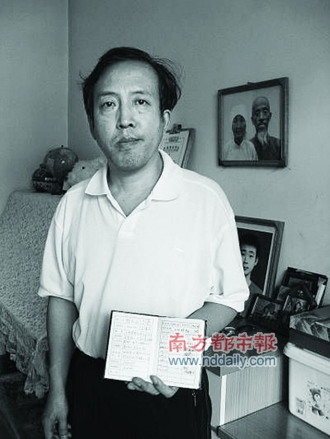
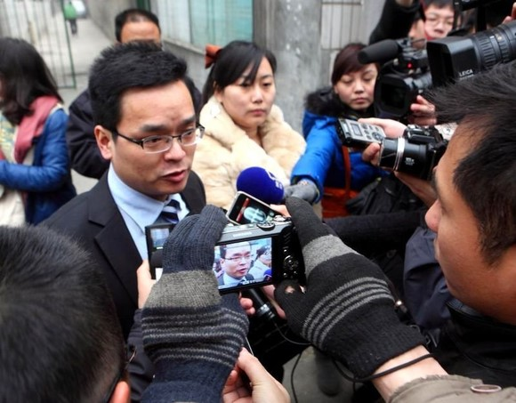
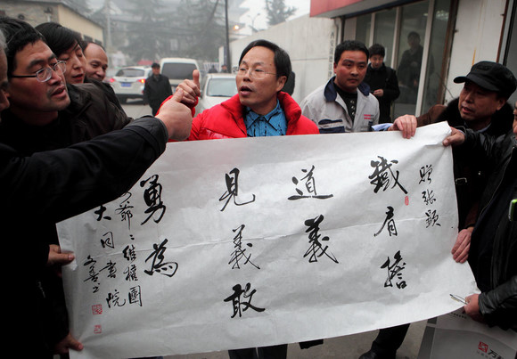

# ＜七星说法＞第十期：一个父亲的双城记

**本期导读：** **如果大家曾记得2011年有那么一个叫做药家鑫的男孩曾经撼动过大多数国人的神经，那么你肯定会对今天的这桩新事感兴趣。可其实，西方古谚语早就说过，阳光底下再无新事。本期说法所要讨论的案件，是一个经久的话题。那就是公众人物和公共事件中的当事人，该以一种什么样的方式，面对不分青红皂白扑面而来的批评和谩骂。所不同的是，这一次的人物，是前面所提到的杀人案主角药家鑫的父亲——药庆卫。或许读者对于彼时彼刻药庆卫处在舆论风口浪尖的情状还记忆犹新。那大家不妨带着这些记忆，进入我们今天关注的话题。**  

# 第十期：一个父亲的双城记

## 

药家鑫走后六个月，药家鑫案重回舆论中心，这次舆论的发起者是他的父亲药庆卫，他决定起诉药家鑫案原告代理人张显。 

2011年11月29日，“药家鑫父亲诉张显侵犯名誉权案”一审在西安雁塔区人民法院开庭。原告代理人律师兰和与公民代理人——网名“嘶哑老汉”的马延明代表原告参加了诉讼；被告张显及其公民代理人雷捣出庭应诉。张妙的父亲张平选、丈夫王辉作为证人出庭作证。而就在国内数百家媒体的长枪短炮中，我们并没能看到药庆卫。 

#### 三人成虎，万人何如？

12月28日，深冬，大寒。西安市东郊的华山厂家属院，门口卖糕的小商贩总是时不时地看向小区的门口，天已经有些微微地黑了，难得有人来照顾他的生意，他一直在不停地叹气。华灯初上，一位老人颤巍巍地低着头走出小区，小商贩的眼睛瞬间明亮起来，但随即又黯淡下来，他认得“他”，他就是药家鑫的父亲药庆卫。 

这是药庆卫在儿子“出事”后惯常的活动时间，每天下午，只有当天黑了他才会出来买菜。曾经在买菜的路上，他被人围着，有人指着他的鼻子骂：“你就是那个杀人狂魔的父亲！”他不知道要说些什么，所以低着头穿过人海。 

儿子“出事”了，当药家鑫被执行死刑后，他却还固执地以为，当初送儿子去公安局自首，是为了救孩子一命。但是，他始终相信法律是公正的，他说：“不论是过去，现在还是未来，我都相信法律。” 

这些天来，他想通了很多事，不再纠结于儿子的生死。却始终放不下：“为什么杀人者的父亲也是杀人犯？”他不知道自己做错了什么，但是，他知道在哪里失去了他最后的一点做人的尊严。 

自8月4日起，药庆卫自己的战争打响了。 

他要起诉的是当初那个一手将自己的儿子送入刑场的律师，那个在网络上挥舞着大旗骂说他是“贪官”、“富商”、“军队蛀虫”的张显。看似理所当然，却又不同寻常，一切都是因为这个案子牵扯到了一个杀人犯——药家鑫。 

药庆卫起诉的内容很简单，张显发表在微博上的言论侵犯了他的名誉权，这是一个在人格权中的显得不那么起眼的权利。而关于名誉权最近一起比较出名的案件还要追述到“宋祖德侵犯谢晋名誉权案”，在那场宋大嘴一手导演的闹剧中，宋输掉了官司，还赔了几十万。 

而这次药庆卫要求张显要连续三十天在20家家知名报纸上刊登3000千字的道歉信。不知道是不是因为儿子的案件已经让药庆卫不想再谈“钱”，他在起诉书中只要求了1元钱的赔偿，显然药父更看重的是那个“名”，他想为自己正名，这是一次事关尊严的诉讼，无关儿子的罪行。 

#### 法律之辩

下午两点，法庭上原告的代理律师兰和一上来就抛出了一份洋洋洒洒激情洋溢的代理词。这是张显在兰和高调辞任药家鑫辩护工作后第一次见到他，而在这之前，双方在微博上的骂仗一直在持续。 

在骂仗中一直跟张显对峙的“嘶哑老汉”马延明上来就针锋相对：“被告张显一再宣称，其对原告方面的情况无从查实，他的所有‘惊人内幕’都建立在合理怀疑和被网友误导的基础上，但现有足够的证据显示，被告张显在制造谣言前，早已充分知晓原告本人及其家庭情况。” 

兰和律师进一步拿出了张显其实早已知晓药家情况的证据。就在11年4月2日和6日。西安市中级中民法院刑庭的法官曾分别约见了药家鑫案被害人张妙的家属告知了药庆卫的真实身份和家庭情况。这时，张显已经是张家刑事附带民事诉讼的公民代理人了，而张显在微博上发表的药庆卫是“军代表”“负责军品采购”的言论大部分是在此之后。按照一个代理人应尽的职责，有理由相信张显应该知道了药家真实的家境。 

而张显的代理人雷捣对此表示：“张显的言论是正义的，其主观上是为了正义，其转载的微博同样是为了社会正义。”并反驳说“张显转载的微博或自己所写的内容基本属实，并不含有明显侵权的内容”。 

那么张显在微博上发表的不实言论到底有没有侵犯名誉权呢? 

我国宪法规定公民的人格尊严不受侵犯。《中华人民共和国民法通则》第一百零一条也规定：“公民、法人享有名誉权，公民的人格尊严受法律保护，禁止使用侮辱、诽谤等方式损害等方式损害公民、法人的名誉。” 

在公民社会中，名誉权是基本人权不可或缺的一部分，它关系到公民在社会活动中的方方面面，特别是在当今这个高度尊重信用的社会，可以想象在一个信息化社会中这样一个声誉败坏的人将会是寸步难行的。正因为如此，不仅仅是镁光灯下的名人会为清白而大动肝火，每个普通公民都应该把自己的名誉当成是最珍贵的财产。 

法律规定虽然如此，但要真正认定名誉侵权在现实的司法实践中却是充满了诸多的困难，因为侵犯名誉权造成的损害不像一般民事案件中对现实利益的损害那样可以定量的加以确定。所以，这必然与其它侵犯人格权的案件一样面临着取证困难等诸多问题。 

《最高人民法院关于审理名誉权案件若干问题的解答》第七条关于侵害名誉权责任应如何认定中明确指出：“是否构成侵害名誉权的责任，应当根据受害人确有名誉被损害的事实、行为人行为违法、违法行为与损害后果之间有因果关系、行为人主观上有过错来认定。” 

也就是说，要达到法律规定的侵权标准，必须满足四个条件：1.被害人名誉受到实在的损害。2.侵权行为违反法律规定3.侵权人主观有过错。4.行为结果存在因果关系。 

“药庆卫诉张显”一案中，而且张显确实是主动而且有意将未经证实的信息发表，也正是从张显发表微博开始，这些“善意”的谎言开始了一发不可收拾的光速传播，知道认同这些信息的人开始了几何式的增长。张显的发表行为与造成社会影响之间的因果关系应该是毋庸置疑的。 

药庆卫方认为自己确实受到了名誉的侵害，承受了巨大的心理压力，这并非不是空中楼阁，而是实实在在的伤害。其中一个佐证就是药庆卫在事件过后已经患上了面瘫。而张显的代理人则认为“事实上，药庆卫的社会评价并未降低，名誉并未受到损害”。雷捣给出了一个理由“随着时间的推移，事情逐渐明了，人们逐渐对药庆卫报以理解、同情，对药庆卫的社会评价仍然是客观的、是正面的。”我们无法知道这种评价现在是否已经成为人们对药父的主流看法，唯一可以得知的是，面对当时汹涌的“必杀”民意，药家不但无法发声，更不敢发声。 

第二个需要认定的点即是张显发表的那些微博是不是侵权行为。民法及司法解释规定了三种样态：侮辱、诽谤和宣扬隐私。侮辱是“有事生非”，诽谤则是“无事生非”，宣扬隐私比较特殊，指的是对隐私中某些一旦外泄则可能降低声誉的信息故意或过失泄露。例如医院工作人员无意泄露患者的艾滋病人身份，则可能构成侵权。而本案中，双方争议的焦点必然是诽谤。对此，被告代理人雷捣在法庭中宣称张显微博中的很多内容都是引用，并非原创，且只是本着合理怀疑探索真相的态度使用的。不管当时张显的想法如何，我们可以确信的是张显的言论是违背客观实际的，而且发表的微博造成了恶劣的影响。 

在《最高人民法院关于审理名誉权案件若干问题的解释（1998）》第三，最高法院做出了如下说明：“新闻媒介和出版机构转载作品，当事人以转载者侵害其名誉权向人民法院提起诉讼的，人民法院应当受理”。单个微博用户虽然不是新闻媒体，但是在这个信息碎片化的时代，在这个每个人都是报纸，每个人也都是读者的时代，其传播的速度光度丝毫不亚于传统媒体。在微博进一步普及化的未来，许多知名博主的影响力将远超想象。是继续坚持法不责众的罗马法传统还是跟上时代制定相应的规范，将会是摆在立法者面前的一道难题。 

#### 以恶制恶是正义的反面

张显律师无论在微博还是在法庭上说的最多话就是为了正义为了和谐。在他心中，甚至认为自己在网上发表的那些言论不仅没有违法而且可以说是帮助法律维护了公正，自己甚至是一个值得称道的英雄。 

但是，为了法律有一个自己理想中“公正”的裁判不能成为诽谤的理由，更不能成为煽动民意影响司法独立的借口。这样以恶制恶的“维护正义”不仅与新闻自由的原则格格不入，更是对一个刚刚起步的市民社会民主基础的蚕食。特别是当全民都被这种谎言所蛊惑时，我们不得不担忧这是否将会是暴民政治复兴的号角。 

新闻自由、舆论监督必须有一个可以看得见摸得着的界线。它与言论自由原则甚至是一体两面的关系。在美国民主体制成熟前，言论自由虽已被写到了宪法上，受到了严厉的保护，但是随之出现了大量对这种自由的滥用，报纸上充斥着各种针对政治对手，竞争公司乃至名人的肆意抹黑。这种现象，美国非其始也非其终。可在此之后通过不懈的立法与案例积累，美国逐渐确立了新闻监督的界线。对于任何从事新闻媒体来说，这无异于一句警示：自由无妨，但请戴着放大镜和职业精神舞蹈。 

但更为可怕的是这种干涉司法独立的社会倾向，尚且毋论官方向来的对很多大案充满政治导向的报道，单近年来社会矛盾激化而产生的仇富、仇官心理就每每在那些典型性案例的背后爆发。对中国来说，这汹汹的民意可绝不是为21世纪中国司法所准备的好礼物。而名誉权一案更是从深层次上把这种乱象折射出来，在谎言横行炒作成风的今天，连司法这民主的基石也不能幸免，不得不说是一种悲哀。 

庭审结束后张显显得很轻松，而我们却无从得知药庆卫的感受。在媒体的采访中，张显说他曾给药庆卫打了五次电话，每次都在一个小时以上。并表示为了缓解药家鑫父亲的痛苦，他可以给药庆卫下跪，言语里露着坦诚，可张显也许从来不会去想。当药家鑫一家深陷“富二代”漩涡的时候，当互联网上充斥歇斯底里怒吼的时候，当人们顺从着本能叫嚷着杀死药家鑫的时候，药庆卫夫妇或许比以后任何时候更需要他的这份坦诚。 

最后，兰和律师代理词中的一段话，或许能够表明这个时代这个中国那些或多或少的无奈：“这是最好的时代，也是最坏的时代······我们一方面在呼吁民主，另一方面却又在处心积虑地获取垄断的机会；一方面在渴求法治，另一方面却又在挥舞人治大旗，体味生杀予夺的快感；一方面在寻求公平正义，另一方面又在掠夺话语霸权制造不对称的博弈机会；一方面在倡导善意和良知，另一方面又在无所不用其极地蹂躏尊严与弱小……”  

### 【深度阅读】

#### 案中当事人的微博：

药庆卫：[http://weibo.com/u/2155458467?&topnav=1&topsug=1](http://weibo.com/u/2155458467?&topnav=1&topsug=1) 兰和：[http://weibo.com/lanhelawyer?topnav=1&topsug=1](http://weibo.com/lanhelawyer?topnav=1&topsug=1) 马延明：[http://weibo.com/51rui](http://weibo.com/51rui) 张显：[http://weibo.com/u/1050645044?&topnav=1&topsug=1](http://weibo.com/u/1050645044?&topnav=1&topsug=1) 

#### 媒体报道链接：

大众网刊，转自《中国青年报》 [http://www.dzwww.com/xinwen/shehuixinwen/201112/t20111230_6845686.htm](http://www.dzwww.com/xinwen/shehuixinwen/201112/t20111230_6845686.htm) 《药庆卫诉张显：一位杀人者父亲的尊严之战》 [http://news.sohu.com/20111229/n330655228.shtml](http://news.sohu.com/20111229/n330655228.shtml) 兰和《药庆卫诉张显名誉侵权案一审代理词（终级版）》 [http://blog.sina.com.cn/s/blog_6599c9500100z67z.html](http://blog.sina.com.cn/s/blog_6599c9500100z67z.html) 新华网：[http://news.xinhuanet.com/legal/2011-12/31/c_122517317.htm](http://news.xinhuanet.com/legal/2011-12/31/c_122517317.htm) 搜狐新闻：[http://news.sohu.com/20111230/n330726537.shtml](http://news.sohu.com/20111230/n330726537.shtml) 大秦网：[http://xian.qq.com/a/20110914/000286.htm](http://xian.qq.com/a/20110914/000286.htm) 中华网：[http://news.china.com/domestic/945/20111229/16959091_2.html](http://news.china.com/domestic/945/20111229/16959091_2.html) 网易新闻 ：[http://news.163.com/11/1231/08/7MJDES5S00014JB5.html](http://news.163.com/11/1231/08/7MJDES5S00014JB5.html) 天涯评论：[http://club.kdnet.net/dispbbs.asp?id=7679272&boardid=1&page=1&1=1#7679272](http://club.kdnet.net/dispbbs.asp?id=7679272&boardid=1&page=1&1=1#7679272)  

（编辑：王晓瞳，纳兰辰瀚）

 
